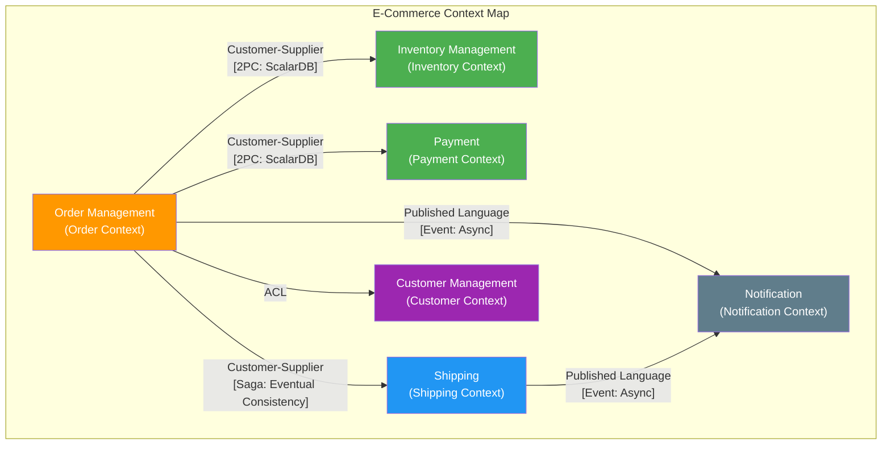
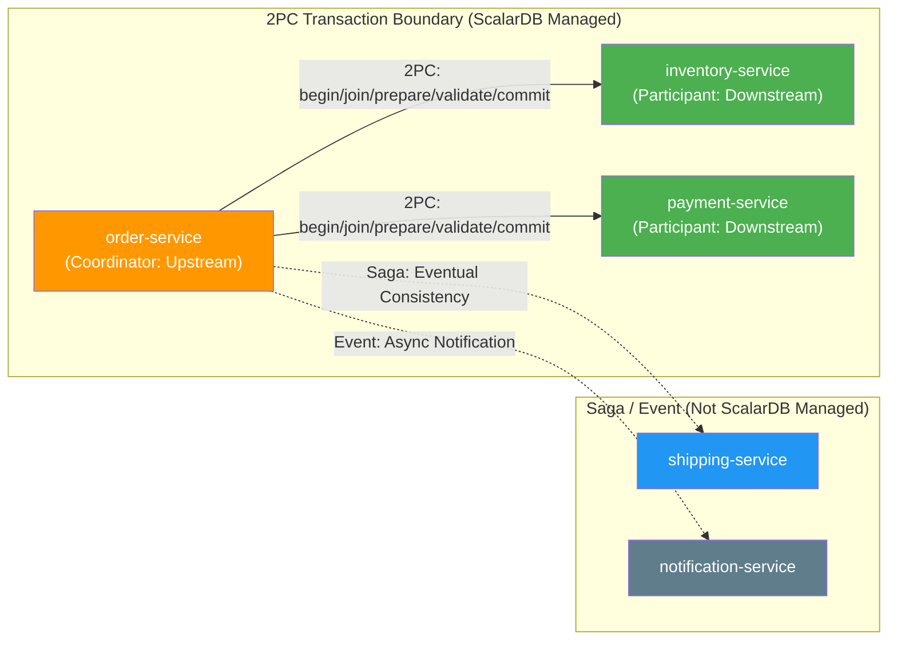

# Phase 1-2: Domain Modeling

## Purpose

Analyze the domain based on DDD (Domain-Driven Design) and determine microservice boundaries. Perform service decomposition that accurately reflects the structure of the business domain, and identify boundaries where inter-service transaction management with ScalarDB is needed.

---

## Inputs

| Input | Description | Source |
|-------|-------------|--------|
| Requirements Analysis Document | Deliverable from Phase 1-1 (`01_requirements_analysis.md`) | Previous step |
| ScalarDB Applicability Assessment Result | Decision on ScalarDB adoption made in Phase 1-1 | Previous step |
| Transaction Requirements Matrix | Consistency requirements between services | Previous step |

---

## Reference Materials

| Document | Section | Purpose |
|----------|---------|---------|
| [`../research/01_microservice_architecture.md`](../research/01_microservice_architecture.md) | Context mapping, service decomposition patterns | Guidelines for microservice design |
| [`../research/03_logical_data_model.md`](../research/03_logical_data_model.md) | Full logical data model | Reference for entity and table design |

---

## Steps

### Step 2.1: Defining the Ubiquitous Language

Define terms (ubiquitous language) to be used consistently within the project through dialogue with domain experts.

#### Ubiquitous Language Dictionary Template

| Term (Japanese) | Term (English) | Definition | Usage Context | Notes |
|----------------|----------------|------------|---------------|-------|
| (e.g., Order) | Order | A customer's intent to purchase a product | Order Context | Do not use "purchase order" or other synonyms |
| (e.g., Inventory) | Inventory | Quantity of sellable products in a warehouse | Inventory Context | Do not use "stock" as an alternative |
| | | | | |

**Checkpoints:**
- [ ] Have all terms been agreed upon with domain experts?
- [ ] Are there no cases where multiple terms are used for the same concept?
- [ ] Have terms with different meanings across contexts been identified? (e.g., "product" having different meanings in Order vs. Inventory)

---

### Step 2.2: Identifying Bounded Contexts

Divide the business domain into bounded contexts. Each context has its own independent model and ubiquitous language.

#### Bounded Context Identification Template

| Context Name | Responsibilities | Key Concepts | Key Use Cases | Team |
|-------------|-----------------|--------------|---------------|------|
| (e.g., Order Management) | Order lifecycle management | Order, OrderItem, OrderStatus | Create order, Confirm order, Cancel order | |
| (e.g., Inventory Management) | Product inventory management | Inventory, StockItem, Warehouse | Check inventory, Reserve inventory, Receive goods | |
| (e.g., Payment) | Payment processing | Payment, PaymentMethod, Transaction | Execute payment, Refund | |
| | | | | |

**Identification Hints:**
- Use areas where different ubiquitous languages are needed as boundaries
- Consider organizational structure (Conway's Law)
- Identify units where data ownership is clearly separated

---

### Step 2.3: Creating the Context Map

Define relationships between bounded contexts. Clarify inter-service dependencies and integration patterns.

#### Context Relationship Patterns

| Pattern | Description | Applicable Situations |
|---------|-------------|----------------------|
| Shared Kernel | Shared model between contexts | Between contexts where tight coupling is acceptable |
| Customer-Supplier | Upstream (Supplier) provides services to downstream (Customer) | When there is a clear dependency relationship |
| Conformist | Downstream conforms to the upstream model as-is | When the upstream cannot be changed |
| Anti-Corruption Layer (ACL) | Downstream converts the upstream model to its own model via a translation layer | When model independence needs to be maintained |
| Open Host Service / Published Language | Upstream provides a standardized API | When multiple downstream consumers exist |

#### Sample Context Map (E-Commerce Example)

#### Context Map Definition Template

| Upstream Context | Downstream Context | Relationship Pattern | Integration Method | Consistency Requirement |
|-----------------|--------------------|---------------------|-------------------|------------------------|
| (e.g., Order Management) | (e.g., Inventory Management) | Customer-Supplier | 2PC (ScalarDB) | Strong Consistency |
| (e.g., Order Management) | (e.g., Shipping) | Customer-Supplier | Saga | Eventual Consistency |
| (e.g., Order Management) | (e.g., Notification) | Published Language | Event (Async) | Eventual Consistency |
| | | | | |

---

### Step 2.4: Aggregate Design

Design entities, value objects, and aggregate roots within each bounded context.

#### Aggregate Design Template

| Bounded Context | Aggregate Name | Aggregate Root | Entities | Value Objects | Invariants (Business Rules) |
|----------------|---------------|----------------|----------|---------------|----------------------------|
| Order Management | Order Aggregate | Order | OrderItem | Money, Address, OrderStatus | Order total must be >= 0 |
| Inventory Management | Inventory Aggregate | StockItem | — | Quantity, SKU | Inventory count must be >= 0 |
| Payment | Payment Aggregate | Payment | — | Money, PaymentMethod | Payment amount must match order total |
| | | | | | |

**Design Principles:**
- An aggregate is a boundary of transactional consistency
- References between aggregates use IDs only (no direct references)
- Keep aggregates as small as possible
- Ideally, update only one aggregate per transaction

---

### Step 2.5: Identifying Domain Events

Identify domain events that propagate between services.

#### Domain Event List Template

| Event Name | Source Context | Subscriber Contexts | Trigger | Payload (Key Attributes) | Delivery Guarantee |
|------------|---------------|--------------------|---------|--------------------------|--------------------|
| OrderCreated | Order Management | Inventory Management, Payment | When order is created | orderId, items[], totalAmount | At-least-once |
| PaymentCompleted | Payment | Order Management, Shipping | When payment is completed | paymentId, orderId, amount | At-least-once |
| InventoryReserved | Inventory Management | Order Management | When inventory reservation is completed | orderId, reservedItems[] | At-least-once |
| | | | | | |

**Note:** When processing via 2PC (ScalarDB), the communication between the relevant services becomes a synchronous transaction rather than event-driven, so it is managed as a 2PC Interface rather than an event.

---

### Step 2.6: Determining Service Decomposition

Determine the microservice decomposition based on bounded contexts.

#### Microservice List Template

| Service Name | Bounded Context | Responsibilities | Owned Data | API (Key Endpoints) | Dependent Services |
|-------------|----------------|-----------------|------------|---------------------|-------------------|
| order-service | Order Management | Order lifecycle management | orders, order_items | POST /orders, GET /orders/{id} | inventory-service, payment-service |
| inventory-service | Inventory Management | Inventory quantity management | stock_items, warehouses | GET /inventory/{sku}, PUT /inventory/reserve | — |
| payment-service | Payment | Payment processing | payments, payment_methods | POST /payments, GET /payments/{id} | — |
| | | | | | |

---

## ScalarDB Considerations

### Identifying Inter-Service Transaction Boundaries (2PC Interface Candidates)

Identify candidates for managing inter-service transactions using ScalarDB's 2PC Interface.

> **ScalarDB 2PC Interface Phases:**
> - **Coordinator (Upstream):** `begin` -> [CRUD operations] -> `prepare` -> `validate` -> `commit`
> - **Participant (Downstream):** `join` -> [CRUD operations] -> `prepare` -> `validate` -> `commit`
>
> The `validate` phase is mandatory between `prepare` and `commit` and performs transaction consistency verification. Omitting it will prevent the transaction from completing correctly.

#### 2PC Interface Candidate List

| Transaction Name | Coordinator (Upstream) | Participant (Downstream) | Business Process | Justification |
|-----------------|----------------------|-------------------------|-----------------|---------------|
| (e.g., Order Confirmation Tx) | order-service | inventory-service, payment-service | Simultaneously execute inventory reservation and payment at order confirmation | Inconsistency between inventory and payment is unacceptable |
| | | | | |

> **Reference:** In the context mapping from `01_microservice_architecture.md`, roles are defined as Coordinator = upstream service and Participant = downstream service.

### Principle of Minimizing ScalarDB Managed Scope

Tables managed by ScalarDB should be limited to only those participating in inter-service transactions.

| Principle | Description |
|-----------|-------------|
| **Minimum Management Principle** | Only place tables participating in inter-service 2PC under ScalarDB management |
| **Local Tx First** | Use native DB features for transactions completed within a single service |
| **Gradual Adoption** | Start with the most critical inter-service Tx and expand gradually |

**Assessment Criteria:**
- Participates in inter-service 2PC -> ScalarDB managed
- Local Tx within a service only -> Use native DB features
- Handled by eventual consistency (Saga) -> Not ScalarDB managed

---

## Deliverables

| Deliverable | Description |
|-------------|-------------|
| Bounded Context Diagram | All identified bounded contexts and their responsibilities |
| Context Map | Relationship patterns and integration methods between contexts |
| Service List | List of microservices and responsibility definitions for each service |
| Aggregate Design Document | Aggregates, entities, and value objects within each context |
| Domain Event List | Definition of events propagated between services |
| 2PC Interface Candidate List | Inter-service transaction boundaries requiring ScalarDB 2PC |

---

## Completion Criteria Checklist

- [ ] Ubiquitous language dictionary has been created and approved by domain experts
- [ ] All bounded contexts have been identified with clearly defined responsibilities
- [ ] Context map has been created with all inter-context relationships defined
- [ ] Aggregates within each context have been designed with invariants defined
- [ ] Domain events have been identified with source and subscriber clearly specified
- [ ] Microservice list has been created with responsibilities, owned data, and APIs defined for each service
- [ ] ScalarDB 2PC Interface candidates have been identified with Coordinator/Participant roles determined
- [ ] Candidate ScalarDB managed tables have been selected based on the minimum management principle
- [ ] Design results have been agreed upon by stakeholders (architects, tech leads, domain experts)

---

## Handoff Items for the Next Step

### Handoff to Phase 1-3: ScalarDB Scope Decision (`03_scalardb_scope_decision.md`)

| Handoff Item | Content |
|--------------|---------|
| Context Map | Relationship patterns and integration methods between services |
| 2PC Interface Candidate List | Transaction boundaries requiring ScalarDB management |
| Service List and Owned Data | Table list for each service |
| Aggregate Design | Transactional consistency boundaries |
| Domain Event List | Information on areas handled by Saga/event-driven approaches |
