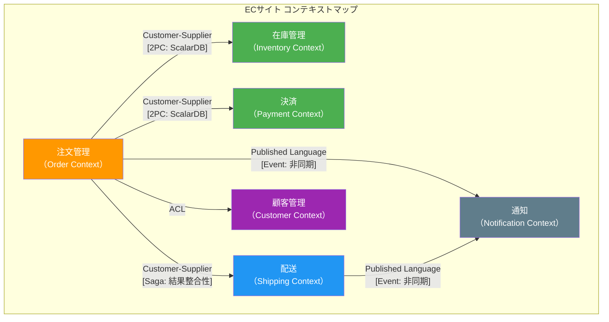
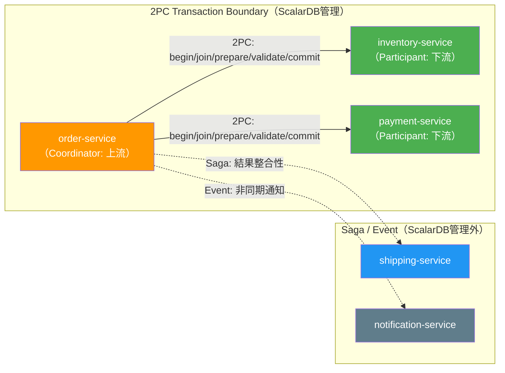

# Phase 1-2: ドメインモデリング

## 目的

DDD（Domain-Driven Design）に基づきドメインを分析し、マイクロサービスの境界を決定する。ビジネスドメインの構造を正確に反映したサービス分割を行い、ScalarDBによるサービス間トランザクション管理が必要となる境界を特定する。

---

## 入力

| 入力物 | 説明 | 提供元 |
|--------|------|--------|
| 要件分析書 | Phase 1-1（`01_requirements_analysis.md`）の成果物 | 前ステップ |
| ScalarDB適用判定結果 | Phase 1-1で決定したScalarDB導入の是非 | 前ステップ |
| トランザクション要件マトリクス | サービス間の整合性要件 | 前ステップ |

---

## 参照資料

| 資料 | 参照箇所 | 用途 |
|------|----------|------|
| [`../research/01_microservice_architecture.md`](../research/01_microservice_architecture.md) | コンテキストマッピング、サービス分割パターン | マイクロサービス設計の指針 |
| [`../research/03_logical_data_model.md`](../research/03_logical_data_model.md) | 論理データモデル全体 | エンティティ設計、テーブル設計の参考 |

---

## ステップ

### Step 2.1: ユビキタス言語の定義

ドメインエキスパートとの対話を通じて、プロジェクト内で統一的に使用する用語（ユビキタス言語）を定義する。

#### ユビキタス言語辞書テンプレート

| 用語（日本語） | 用語（英語） | 定義 | 使用コンテキスト | 備考 |
|---------------|-------------|------|-----------------|------|
| （例: 注文） | Order | 顧客が商品を購入する意思表示 | 注文コンテキスト | 「発注」「オーダー」は使用しない |
| （例: 在庫） | Inventory | 倉庫内の販売可能な商品数量 | 在庫コンテキスト | 「ストック」は使用しない |
| | | | | |

**確認ポイント:**
- [ ] ドメインエキスパートと全用語について合意しているか
- [ ] 同じ概念に対して複数の用語が使われていないか
- [ ] コンテキストによって意味が異なる用語が識別されているか（例: 「商品」が注文と在庫で異なる意味を持つ場合）

---

### Step 2.2: 境界コンテキスト（Bounded Context）の識別

ビジネスドメインを境界コンテキストに分割する。各コンテキストは独立したモデルとユビキタス言語を持つ。

#### 境界コンテキスト識別テンプレート

| コンテキスト名 | 責務 | 主要概念 | 主要ユースケース | チーム |
|---------------|------|---------|-----------------|--------|
| （例: 注文管理） | 注文のライフサイクル管理 | Order, OrderItem, OrderStatus | 注文作成、注文確定、注文取消 | |
| （例: 在庫管理） | 商品在庫の管理 | Inventory, StockItem, Warehouse | 在庫確認、在庫引当、入庫 | |
| （例: 決済） | 支払い処理 | Payment, PaymentMethod, Transaction | 決済実行、返金 | |
| | | | | |

**識別のヒント:**
- 異なるユビキタス言語が必要になる領域を境界とする
- 組織構造（コンウェイの法則）を考慮する
- データの所有権が明確に分かれる単位を識別する

---

### Step 2.3: コンテキストマップの作成

境界コンテキスト間の関係を定義する。サービス間の依存関係と統合パターンを明確にする。

#### コンテキスト間関係パターン

| パターン | 説明 | 適用場面 |
|---------|------|---------|
| Shared Kernel | 共有モデルを持つ | 密結合を許容できるコンテキスト間 |
| Customer-Supplier | 上流（Supplier）が下流（Customer）にサービス提供 | 明確な依存関係がある場合 |
| Conformist | 下流が上流のモデルにそのまま従う | 上流を変更できない場合 |
| Anti-Corruption Layer (ACL) | 下流が変換層で上流モデルを自モデルに変換 | モデルの独立性を保ちたい場合 |
| Open Host Service / Published Language | 上流が標準的なAPIを提供 | 複数の下流が存在する場合 |

#### サンプルコンテキストマップ（ECサイトの例）

#### コンテキストマップ定義テンプレート

| 上流コンテキスト | 下流コンテキスト | 関係パターン | 統合方式 | 整合性要求 |
|----------------|----------------|-------------|---------|-----------|
| （例: 注文管理） | （例: 在庫管理） | Customer-Supplier | 2PC（ScalarDB） | 強整合性 |
| （例: 注文管理） | （例: 配送） | Customer-Supplier | Saga | 結果整合性 |
| （例: 注文管理） | （例: 通知） | Published Language | Event（非同期） | 結果整合性 |
| | | | | |

---

### Step 2.4: 集約（Aggregate）の設計

各境界コンテキスト内のエンティティ、値オブジェクト、集約ルートを設計する。

#### 集約設計テンプレート

| 境界コンテキスト | 集約名 | 集約ルート | エンティティ | 値オブジェクト | 不変条件（ビジネスルール） |
|----------------|--------|-----------|-------------|--------------|------------------------|
| 注文管理 | Order集約 | Order | OrderItem | Money, Address, OrderStatus | 注文合計は0以上 |
| 在庫管理 | Inventory集約 | StockItem | — | Quantity, SKU | 在庫数は0以上 |
| 決済 | Payment集約 | Payment | — | Money, PaymentMethod | 決済額は注文合計と一致 |
| | | | | | |

**設計原則:**
- 集約はトランザクション整合性の境界である
- 集約間の参照はIDのみで行う（直接参照しない）
- 集約は可能な限り小さく保つ
- 1つのトランザクションで更新する集約は1つが理想

---

### Step 2.5: ドメインイベントの特定

サービス間で伝播するドメインイベントを特定する。

#### ドメインイベント一覧テンプレート

| イベント名 | 発行元コンテキスト | 購読先コンテキスト | トリガー | ペイロード（主要属性） | 配信保証 |
|-----------|-------------------|-------------------|---------|---------------------|---------|
| OrderCreated | 注文管理 | 在庫管理, 決済 | 注文作成時 | orderId, items[], totalAmount | At-least-once |
| PaymentCompleted | 決済 | 注文管理, 配送 | 決済完了時 | paymentId, orderId, amount | At-least-once |
| InventoryReserved | 在庫管理 | 注文管理 | 在庫引当完了時 | orderId, reservedItems[] | At-least-once |
| | | | | | |

**注意:** 2PC（ScalarDB）で処理する場合、イベント駆動ではなく同期的なトランザクションとなるため、該当するサービス間通信はイベントではなく2PC Interfaceとして管理する。

---

### Step 2.6: サービス分割の決定

境界コンテキストに基づき、マイクロサービスの分割を決定する。

#### マイクロサービス一覧テンプレート

| サービス名 | 境界コンテキスト | 責務 | 所有データ | API（主要エンドポイント） | 依存サービス |
|-----------|----------------|------|-----------|------------------------|-------------|
| order-service | 注文管理 | 注文ライフサイクル管理 | orders, order_items | POST /orders, GET /orders/{id} | inventory-service, payment-service |
| inventory-service | 在庫管理 | 在庫数量管理 | stock_items, warehouses | GET /inventory/{sku}, PUT /inventory/reserve | — |
| payment-service | 決済 | 決済処理 | payments, payment_methods | POST /payments, GET /payments/{id} | — |
| | | | | | |

---

## ScalarDB考慮事項

### サービス間トランザクション境界の特定（2PC Interface候補）

ScalarDBの2PC Interfaceを使用してサービス間トランザクションを管理する候補を特定する。

> **ScalarDB 2PC Interfaceのフェーズ:**
> - **Coordinator（上流）:** `begin` → [CRUD操作] → `prepare` → `validate` → `commit`
> - **Participant（下流）:** `join` → [CRUD操作] → `prepare` → `validate` → `commit`
>
> `validate` フェーズは `prepare` と `commit` の間で必須であり、トランザクションの整合性検証を行う。省略するとトランザクションが正しく完了しない。

#### 2PC Interface候補一覧

| トランザクション名 | Coordinator（上流） | Participant（下流） | ビジネスプロセス | 必要性の根拠 |
|-------------------|--------------------|--------------------|-----------------|-------------|
| （例: 注文確定Tx） | order-service | inventory-service, payment-service | 注文確定時に在庫引当と決済を同時実行 | 在庫と決済の不整合は許容不可 |
| | | | | |

> **参照:** `01_microservice_architecture.md` のコンテキストマッピングでは、Coordinator=上流サービス、Participant=下流サービスとして役割を定義する。

### ScalarDB管理対象の最小化原則

ScalarDBで管理するテーブルは、サービス間トランザクションに参加するテーブルのみに限定する。

| 原則 | 説明 |
|------|------|
| **最小管理原則** | サービス間2PCに参加するテーブルのみをScalarDB管理下に置く |
| **ローカルTx優先** | サービス内で完結するトランザクションはネイティブDB機能を使用 |
| **段階的導入** | まず最も重要なサービス間Txから導入し、段階的に拡大 |

**判定基準:**
- サービス間2PCに参加する -> ScalarDB管理対象
- サービス内ローカルTxのみ -> ネイティブDB機能を使用
- 結果整合性（Saga）で対応 -> ScalarDB管理対象外

---

## 成果物

| 成果物 | 説明 |
|--------|------|
| 境界コンテキスト図 | 識別した全境界コンテキストとその責務 |
| コンテキストマップ | コンテキスト間の関係パターンと統合方式 |
| サービス一覧 | マイクロサービスの一覧と各サービスの責務定義 |
| 集約設計書 | 各コンテキスト内の集約、エンティティ、値オブジェクト |
| ドメインイベント一覧 | サービス間で伝播するイベントの定義 |
| 2PC Interface候補一覧 | ScalarDB 2PCが必要なサービス間トランザクション境界 |

---

## 完了基準チェックリスト

- [ ] ユビキタス言語辞書が作成され、ドメインエキスパートの承認を得ている
- [ ] 全ての境界コンテキストが識別され、責務が明確に定義されている
- [ ] コンテキストマップが作成され、全てのコンテキスト間関係が定義されている
- [ ] 各コンテキスト内の集約が設計され、不変条件が定義されている
- [ ] ドメインイベントが特定され、発行元・購読先が明確になっている
- [ ] マイクロサービス一覧が作成され、各サービスの責務・所有データ・APIが定義されている
- [ ] ScalarDB 2PC Interface候補が特定され、Coordinator/Participantの役割が決定されている
- [ ] ScalarDB管理対象テーブルの候補が最小化原則に基づいて選定されている
- [ ] 設計結果について関係者（アーキテクト、テックリード、ドメインエキスパート）の合意が得られている

---

## 次のステップへの引き継ぎ事項

### Phase 1-3: ScalarDB適用範囲の決定（`03_scalardb_scope_decision.md`）への引き継ぎ

| 引き継ぎ項目 | 内容 |
|-------------|------|
| コンテキストマップ | サービス間の関係パターンと統合方式 |
| 2PC Interface候補一覧 | ScalarDB管理が必要なトランザクション境界 |
| サービス一覧と所有データ | 各サービスのテーブル一覧 |
| 集約設計 | トランザクション整合性の境界 |
| ドメインイベント一覧 | Saga/イベント駆動で対応する箇所の情報 |
