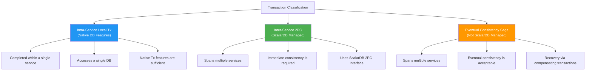
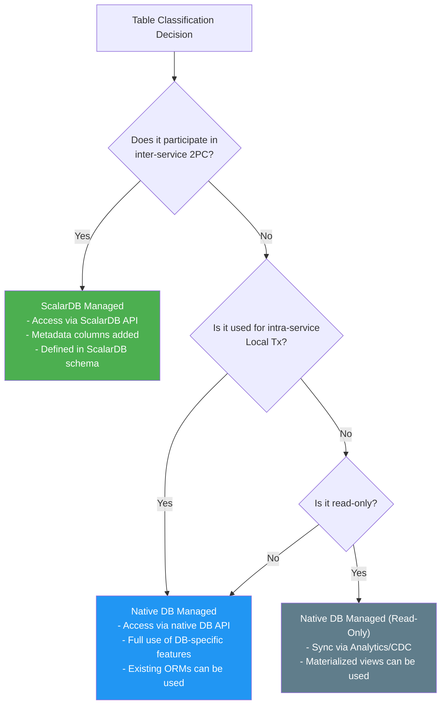
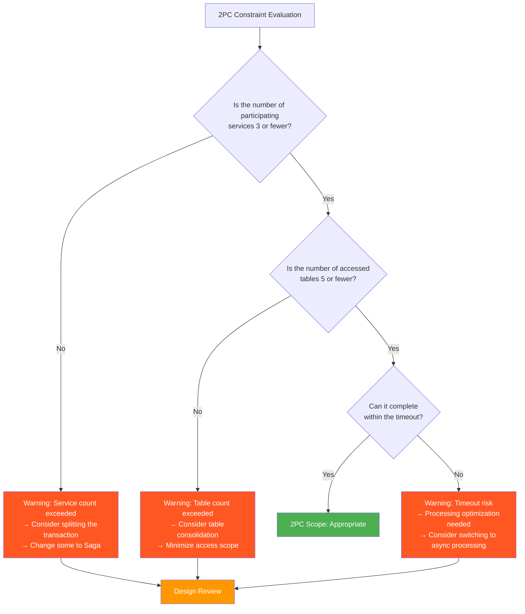

# Phase 1-3: ScalarDB Scope Decision

## Purpose

Clearly define the tables and transaction boundaries managed by ScalarDB. Based on the minimization principle, only tables participating in inter-service transactions are placed under ScalarDB management, while all others leverage native DB features.

---

## Inputs

| Input | Description | Source |
|-------|-------------|--------|
| Domain Model | Bounded context diagram, context map, aggregate design | Deliverables from Phase 1-2 (`02_domain_modeling.md`) |
| ScalarDB Applicability Assessment Result | Decision on ScalarDB adoption and its rationale | Deliverables from Phase 1-1 (`01_requirements_analysis.md`) |
| 2PC Interface Candidate List | Transaction boundaries requiring inter-service 2PC | Deliverables from Phase 1-2 (`02_domain_modeling.md`) |

---

## Reference Materials

| Document | Section | Purpose |
|----------|---------|---------|
| [`../research/02_scalardb_usecases.md`](../research/02_scalardb_usecases.md) | Full use case patterns | Transaction pattern applicability assessment |
| [`../research/07_transaction_model.md`](../research/07_transaction_model.md) | Section 9.4 (Limitation Guidelines) | 2PC applicability constraint evaluation |
| [`../research/15_xa_heterogeneous_investigation.md`](../research/15_xa_heterogeneous_investigation.md) | Full document | Comparison with XA, constraints for heterogeneous DBs |
| [`../research/05_database_investigation.md`](../research/05_database_investigation.md) | Tier ranking | Backend DB selection |

---

## Steps

### Step 3.1: Transaction Boundary Classification

Classify all transactions into the following three categories.

#### Transaction Classification Template

| Business Process | Related Services | Related Tables | Classification | Classification Rationale |
|-----------------|-----------------|----------------|---------------|--------------------------|
| (e.g., Order Confirmation) | order, inventory, payment | orders, order_items, stock_items, payments | Inter-Service 2PC | Atomicity of inventory reservation and payment is required |
| (e.g., User Registration) | customer | customers, addresses | Local Tx | Completed within a single service |
| (e.g., Shipping Arrangement) | order, shipping | orders, shipments | Saga | Shipping delay is acceptable, handled by compensating Tx |
| (e.g., Points Allocation) | order, loyalty | orders, points | Saga | Delay is acceptable, handled by retries |
| | | | | |

---

### Step 3.2: Selecting ScalarDB Managed Tables

**Minimization Principle:** Only place tables participating in inter-service 2PC under ScalarDB management. All other tables leverage native DB features.

#### ScalarDB Managed Table Selection Template

| Service | Table Name | ScalarDB Managed | Reason | Participating 2PC Transaction |
|---------|-----------|-----------------|--------|-------------------------------|
| order-service | orders | Yes | Coordinator-side table for Order Confirmation 2PC | Order Confirmation Tx |
| order-service | order_items | Yes | Participates in Order Confirmation 2PC | Order Confirmation Tx |
| order-service | order_history | No | Read-only history, does not participate in Tx | — |
| inventory-service | stock_items | Yes | Participant-side table for Order Confirmation 2PC | Order Confirmation Tx |
| inventory-service | warehouses | No | Master data, does not participate in Tx | — |
| payment-service | payments | Yes | Participant-side table for Order Confirmation 2PC | Order Confirmation Tx |
| payment-service | payment_methods | No | Master data, does not participate in Tx | — |
| shipping-service | shipments | No | Handled by Saga, does not participate in 2PC | — |
| | | | | |

---

### Step 3.3: 2PC Applicability Constraint Evaluation

Evaluate whether the 2PC scope is within recommended limits based on the limitation guidelines from `07_transaction_model.md` (Section 9.4).

#### Limitation Guidelines

> **Important:** Apply 2PC only when **all** of the following conditions are met simultaneously (`07_transaction_model.md` Section 9.4). If any condition is not met, consider alternative approaches such as the Saga pattern.

| # | Constraint | Recommended Value | Your System's Value | Evaluation | Source |
|---|-----------|-------------------|---------------------|------------|--------|
| 1 | Business necessity | **Temporary inconsistency directly leads to regulatory violations or financial loss** | | OK / NG | Official guidelines |
| 2 | Number of services participating in a single 2PC transaction | **3 services or fewer** | | OK / NG | Official guidelines |
| 3 | Management structure of participating services | **Managed within the same team** | | OK / NG | Official guidelines |
| 4 | 2PC transaction timeout | **Execution time under 100ms (completes within a few seconds)** | | OK / NG | Official guidelines |
| 5 | Number of tables accessed per 2PC transaction | **5 tables or fewer** | | OK / NG | Project-specific criteria |
| 6 | 2PC transaction frequency | **Minority of all transactions** | | OK / NG | Project-specific criteria |

> **Note:** #1-#4 are based on the official guidelines "Application Conditions (all must be met)" from `07_transaction_model.md`. #5 and #6 are additional project-specific criteria and are not part of the official guidelines.

#### 2PC Transaction Detailed Evaluation Template

| 2PC Tx Name | # Participating Services | # Accessed Tables | Estimated Duration | Frequency (/sec) | Evaluation |
|------------|------------------------|-------------------|--------------------|-------------------|------------|
| (e.g., Order Confirmation Tx) | 3 (order, inventory, payment) | 4 (orders, order_items, stock_items, payments) | 200ms | 100 | OK |
| | | | | | |

**Countermeasures When Limits Are Exceeded:**
1. Transaction splitting: Split a single 2PC into multiple smaller 2PCs
2. Switch to Saga: Change some services to use eventual consistency
3. Table consolidation: Merge related tables through denormalization
4. Processing optimization: Minimize processing within the 2PC transaction

---

### Step 3.4: Determining Integration Patterns for Non-ScalarDB Managed Tables

Determine integration methods for tables not managed by ScalarDB.

#### Integration Pattern List

| Pattern | Description | Applicable Situations | Reference |
|---------|-------------|----------------------|-----------|
| **ScalarDB Analytics** | Read ScalarDB-managed data for analytics purposes | Reporting, BI | Related materials in `../research/` |
| **CDC (Change Data Capture)** | Propagate changes from ScalarDB-managed tables to non-managed tables | Data synchronization, event-driven | |
| **API Composition** | Combine APIs from multiple services to retrieve data | Queries, screen display data retrieval | |
| **CQRS** | Separate command side (ScalarDB managed) from query side (native DB) | When read/write characteristics differ significantly | |

#### Integration Pattern Application Template

| Source | Destination | Integration Pattern | Data Flow | Latency Tolerance | Notes |
|--------|-------------|--------------------|-----------|--------------------|-------|
| orders (ScalarDB managed) | order_history (native) | CDC | orders -> CDC -> order_history | A few seconds | |
| stock_items (ScalarDB managed) | inventory_dashboard (native) | API Composition | Aggregated via API | Real-time | |
| payments (ScalarDB managed) | payment_report (native) | ScalarDB Analytics | Batch aggregation | A few hours | |
| | | | | | |

---

### Step 3.5: DB Selection

Determine the backend DB for each table. Refer to the tier ranking in `05_database_investigation.md`.

#### DB Selection Criteria

| Criterion | Description |
|-----------|-------------|
| ScalarDB Support Level | Tier 1 (Dedicated adapter / Official full support) / Tier 2 (JDBC official support) / Tier 3 (Private Preview) / Tier 4 (Unsupported) |
| Data Model Fit | Is the DB type suitable for the table's data characteristics? |
| Operational Track Record | Operational experience within the team |
| Cost | License, infrastructure, and operational costs |
| Availability and Scalability | Does it meet non-functional requirements? |

#### DB Selection Template

| Service | Table | ScalarDB Managed | Selected DB | Tier | Selection Rationale |
|---------|-------|-----------------|-------------|------|---------------------|
| order-service | orders | Yes | PostgreSQL | Tier 1 | RDBMS fit, Tier 1 support |
| order-service | order_items | Yes | PostgreSQL | Tier 1 | Same DB as orders |
| order-service | order_history | No | PostgreSQL | — | Leverage native partitioning features |
| inventory-service | stock_items | Yes | MySQL | Tier 1 | Suitable for high-frequency updates |
| payment-service | payments | Yes | PostgreSQL | Tier 1 | Transaction reliability |
| shipping-service | shipments | No | DynamoDB | — | Not ScalarDB managed, leverage NoSQL scalability |
| | | | | | |

> **Note:** Backend DBs for ScalarDB-managed tables must be selected from ScalarDB-supported DBs (Tier 1 recommended). Non-managed tables can freely use any DB.

---

## Decision Matrix

Compile a comprehensive list of ScalarDB management requirements, transaction patterns, and backend DBs for all tables.

### Decision Matrix Template

| # | Service | Table Name | ScalarDB Managed | Tx Pattern | Backend DB | DB Tier | Participating 2PC Tx | Integration Pattern | Notes |
|---|---------|-----------|-----------------|-----------|------------|---------|---------------------|--------------------|----|
| 1 | order-service | orders | Yes | 2PC (Coordinator) | PostgreSQL | Tier 1 | Order Confirmation Tx | — | |
| 2 | order-service | order_items | Yes | 2PC (Coordinator) | PostgreSQL | Tier 1 | Order Confirmation Tx | — | |
| 3 | order-service | order_history | No | Local Tx | PostgreSQL | — | — | CDC (orders -> order_history) | |
| 4 | inventory-service | stock_items | Yes | 2PC (Participant) | MySQL | Tier 1 | Order Confirmation Tx | — | |
| 5 | inventory-service | warehouses | No | Local Tx | MySQL | — | — | — | Master data |
| 6 | payment-service | payments | Yes | 2PC (Participant) | PostgreSQL | Tier 1 | Order Confirmation Tx | — | |
| 7 | payment-service | payment_methods | No | Local Tx | PostgreSQL | — | — | — | Master data |
| 8 | shipping-service | shipments | No | Saga | DynamoDB | — | — | — | Eventual consistency |
| 9 | notification-service | notifications | No | Event | DynamoDB | — | — | — | Async notification |

> **Instructions:** The above is a sample. For actual projects, fill in entries for all tables.

---

## Prerequisites and Constraints Confirmation

The following prerequisites and constraints must be understood and agreed upon by all stakeholders before adopting ScalarDB.

### Constraints for ScalarDB Managed Tables

| # | Constraint | Impact | Countermeasure |
|---|-----------|--------|----------------|
| 1 | **All data access must go through ScalarDB API** | Direct SQL execution on ScalarDB-managed tables is not allowed (causes data inconsistency) | Ensure the entire application uses ScalarDB API |
| 2 | **DB-specific feature restrictions** | Stored procedures, triggers, DB-specific data types, etc. cannot be used | Implement required processing at the application layer |
| 3 | **Metadata overhead** | ScalarDB adds metadata columns for transaction management to each row (version, state, etc.) | Include in storage capacity estimates |
| 4 | **Schema management** | ScalarDB-specific schema definitions are required | Establish migration tools |
| 5 | **Query restrictions** | Complex JOINs, subqueries, etc. may have restrictions | Prepare separate read-only views using the CQRS pattern |

### Confirmation Checklist

- [ ] All teams understand that direct SQL access to ScalarDB-managed tables is prohibited
- [ ] DB-specific feature usage restrictions have been identified and alternatives considered
- [ ] Metadata overhead has been included in storage estimates
- [ ] Integration patterns between ScalarDB-managed and non-managed tables have been determined
- [ ] Development teams understand how to use ScalarDB API (or have a learning plan)

---

## Deliverables

| Deliverable | Description |
|-------------|-------------|
| ScalarDB Managed Table List | List of tables under ScalarDB management with rationale |
| Transaction Boundary Definition | Classification results of Local Tx / 2PC / Saga |
| Decision Matrix | ScalarDB management requirements, Tx patterns, and backend DB for each table |
| DB Selection Results | Backend DB selection and rationale for each table |
| Integration Pattern Definition | Integration methods with non-ScalarDB managed tables |
| Prerequisites and Constraints Agreement | Stakeholder agreement on ScalarDB adoption constraints |

---

## Completion Criteria Checklist

- [ ] All transactions have been classified into "Local Tx," "Inter-Service 2PC," or "Saga"
- [ ] ScalarDB-managed tables have been selected based on the minimization principle
- [ ] 2PC scope is within the limitation guidelines (3 services or fewer, 5 tables or fewer) (countermeasures applied if exceeded)
- [ ] Integration patterns for all non-ScalarDB managed tables have been determined
- [ ] Backend DB has been selected for each table and tier ranking has been confirmed
- [ ] Decision matrix has been filled in for all tables
- [ ] Prerequisites and constraints have been agreed upon by stakeholders
- [ ] Architect review of design results has been completed

---

## Handoff Items for the Next Step

### Handoff to Phase 2: Design Phase

| Handoff Item | Destination | Content |
|--------------|-------------|---------|
| Decision Matrix | 04 Data Model Design (Phase 2) | ScalarDB management requirements and backend DB per table |
| Transaction Boundary Definition | 05 Transaction Design (Phase 2) | Classification results of 2PC / Saga / Local Tx |
| Integration Pattern Definition | 06 API and Interface Design (Phase 2) | Integration methods including CDC, API Composition, etc. |
| Prerequisites and Constraints Agreement | All design phases | ScalarDB adoption constraint items |
| DB Selection Results | 07 Infrastructure Design (Phase 3) | Backend DB provisioning plan |
