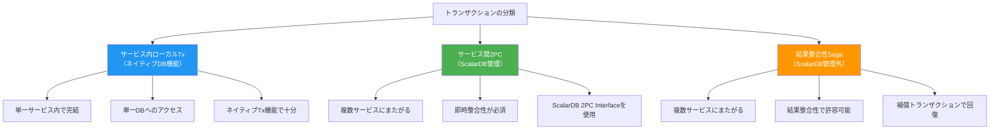
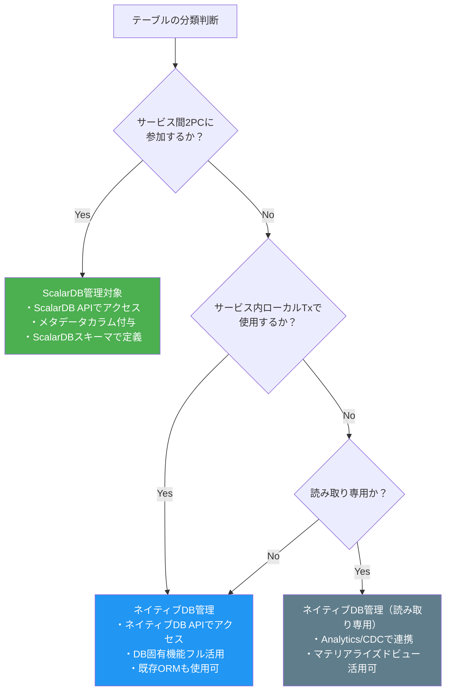
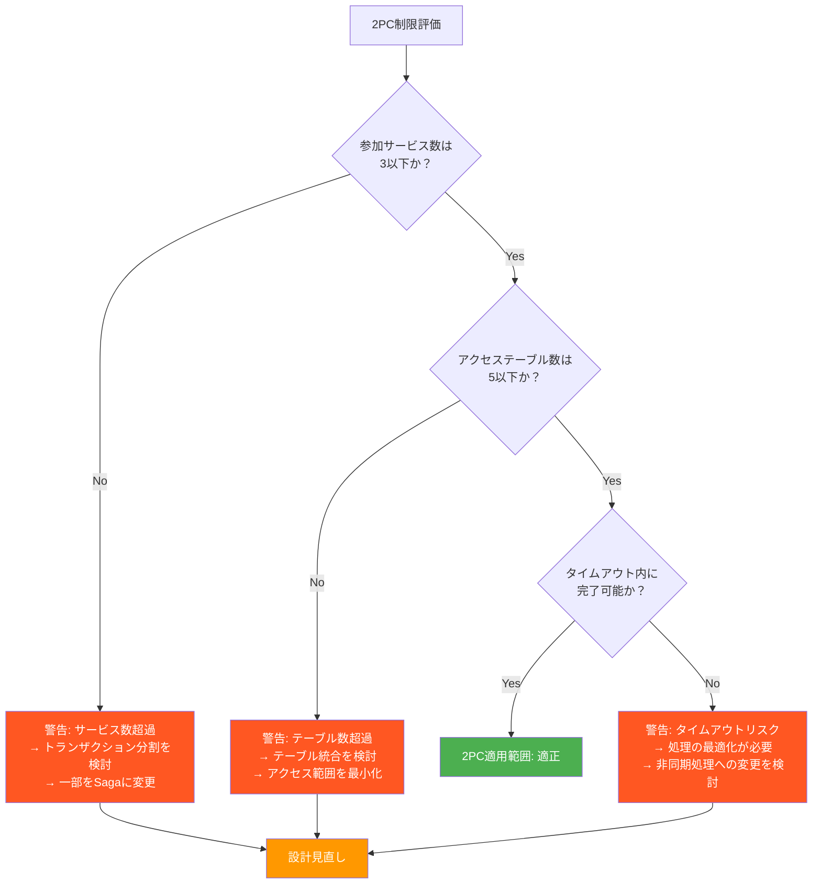

# Phase 1-3: ScalarDB適用範囲の決定

## 目的

ScalarDBで管理するテーブルおよびトランザクション境界を明確に定義する。最小化原則に基づき、サービス間トランザクションに参加するテーブルのみをScalarDB管理対象とし、それ以外はネイティブDB機能を活用する方針を確定させる。

---

## 入力

| 入力物 | 説明 | 提供元 |
|--------|------|--------|
| ドメインモデル | 境界コンテキスト図、コンテキストマップ、集約設計 | Phase 1-2（`02_domain_modeling.md`）の成果物 |
| ScalarDB適用判定結果 | ScalarDB導入の是非判断とその根拠 | Phase 1-1（`01_requirements_analysis.md`）の成果物 |
| 2PC Interface候補一覧 | サービス間2PCが必要なトランザクション境界 | Phase 1-2（`02_domain_modeling.md`）の成果物 |

---

## 参照資料

| 資料 | 参照箇所 | 用途 |
|------|----------|------|
| [`../research/02_scalardb_usecases.md`](../research/02_scalardb_usecases.md) | ユースケースパターン全体 | トランザクションパターンの適用判断 |
| [`../research/07_transaction_model.md`](../research/07_transaction_model.md) | Section 9.4（制限ガイドライン） | 2PC適用の制限評価 |
| [`../research/15_xa_heterogeneous_investigation.md`](../research/15_xa_heterogeneous_investigation.md) | 全体 | XAとの比較、異種DB間の制約 |
| [`../research/05_database_investigation.md`](../research/05_database_investigation.md) | ティアランキング | バックエンドDB選定 |

---

## ステップ

### Step 3.1: トランザクション境界の分類

全てのトランザクションを以下の3つのカテゴリに分類する。

#### トランザクション分類テンプレート

| ビジネスプロセス | 関連サービス | 関連テーブル | 分類 | 分類理由 |
|-----------------|-------------|-------------|------|---------|
| （例: 注文確定） | order, inventory, payment | orders, order_items, stock_items, payments | サービス間2PC | 在庫引当と決済の原子性が必須 |
| （例: ユーザー登録） | customer | customers, addresses | ローカルTx | 単一サービス内で完結 |
| （例: 配送手配） | order, shipping | orders, shipments | Saga | 配送遅延は許容可能、補償Txで対応 |
| （例: ポイント付与） | order, loyalty | orders, points | Saga | 遅延許容可能、リトライで対応 |
| | | | | |

---

### Step 3.2: ScalarDB管理対象テーブルの選定

**最小化原則:** サービス間2PCに参加するテーブルのみをScalarDB管理下に置く。それ以外のテーブルはネイティブDB機能を活用する。

#### ScalarDB管理対象テーブル選定テンプレート

| サービス | テーブル名 | ScalarDB管理 | 理由 | 参加する2PCトランザクション |
|---------|-----------|-------------|------|--------------------------|
| order-service | orders | Yes | 注文確定2PCのCoordinator側テーブル | 注文確定Tx |
| order-service | order_items | Yes | 注文確定2PCに参加 | 注文確定Tx |
| order-service | order_history | No | 履歴参照のみ、Tx不参加 | — |
| inventory-service | stock_items | Yes | 注文確定2PCのParticipant側テーブル | 注文確定Tx |
| inventory-service | warehouses | No | マスタデータ、Tx不参加 | — |
| payment-service | payments | Yes | 注文確定2PCのParticipant側テーブル | 注文確定Tx |
| payment-service | payment_methods | No | マスタデータ、Tx不参加 | — |
| shipping-service | shipments | No | Sagaで対応、2PC不参加 | — |
| | | | | |

---

### Step 3.3: 2PC適用の制限評価

`07_transaction_model.md`（Section 9.4）の制限ガイドラインに基づき、2PC適用範囲が推奨範囲内かを評価する。

#### 制限ガイドライン

> **重要:** 以下の適用許可条件を**すべて同時に**満たす場合のみ2PCを適用すること（`07_transaction_model.md` Section 9.4）。1つでも満たさない場合はSagaパターン等の代替手段を検討する。

| # | 制限項目 | 推奨値 | 自システムの値 | 評価 | 出典 |
|---|---------|--------|--------------|------|------|
| 1 | ビジネス上の必要性 | **一時的な不整合が法規制・金銭的損失に直結する** | | OK / NG | 公式ガイドライン |
| 2 | 1つの2PCトランザクションに参加するサービス数 | **3サービス以下** | | OK / NG | 公式ガイドライン |
| 3 | 参加サービスの管理体制 | **同一チーム内で管理されている** | | OK / NG | 公式ガイドライン |
| 4 | 2PCトランザクションのタイムアウト | **実行時間100ms以下（数秒以内に完了）** | | OK / NG | 公式ガイドライン |
| 5 | 1つの2PCトランザクションでアクセスするテーブル数 | **5テーブル以下** | | OK / NG | プロジェクト固有基準 |
| 6 | 2PCトランザクションの頻度 | **全Txの少数派** | | OK / NG | プロジェクト固有基準 |

> **注:** #1〜#4は `07_transaction_model.md` の公式ガイドライン「適用許可条件（全て満たすこと）」に基づく。#5、#6はプロジェクト固有の追加基準であり、公式ガイドラインには含まれない。

#### 2PCトランザクション詳細評価テンプレート

| 2PC Tx名 | 参加サービス数 | アクセステーブル数 | 想定所要時間 | 頻度（/秒） | 評価 |
|---------|-------------|-----------------|------------|-----------|------|
| （例: 注文確定Tx） | 3（order, inventory, payment） | 4（orders, order_items, stock_items, payments） | 200ms | 100 | OK |
| | | | | | |

**制限超過時の対策:**
1. トランザクション分割: 1つの2PCを複数の小さい2PCに分割
2. Sagaへの変更: 一部のサービスを結果整合性で対応するよう変更
3. テーブル統合: 関連テーブルの非正規化による統合
4. 処理最適化: 2PCトランザクション内の処理を最小化

---

### Step 3.4: 非ScalarDB管理テーブルとの統合パターン決定

ScalarDB管理対象外のテーブルとの連携方法を決定する。

#### 統合パターン一覧

| パターン | 説明 | 適用場面 | 参照資料 |
|---------|------|---------|---------|
| **ScalarDB Analytics** | ScalarDBが管理するデータを分析用に読み取り | レポーティング、BI | `../research/` 関連資料 |
| **CDC（Change Data Capture）** | ScalarDB管理テーブルの変更を非管理テーブルに伝播 | データ同期、イベント駆動 | |
| **API Composition** | 複数サービスのAPIを組み合わせてデータ取得 | クエリ、画面表示用データ取得 | |
| **CQRS** | コマンド側（ScalarDB管理）とクエリ側（ネイティブDB）を分離 | 読み書きの特性が大きく異なる場合 | |

#### 統合パターン適用テンプレート

| 連携元 | 連携先 | 統合パターン | データフロー | 遅延許容 | 備考 |
|--------|--------|-------------|------------|---------|------|
| orders（ScalarDB管理） | order_history（ネイティブ） | CDC | orders -> CDC -> order_history | 数秒 | |
| stock_items（ScalarDB管理） | inventory_dashboard（ネイティブ） | API Composition | API経由で集約 | リアルタイム | |
| payments（ScalarDB管理） | payment_report（ネイティブ） | ScalarDB Analytics | バッチ集計 | 数時間 | |
| | | | | | |

---

### Step 3.5: DB選定

テーブルごとのバックエンドDBを決定する。`05_database_investigation.md` のティアランキングを参照する。

#### DB選定基準

| 基準 | 説明 |
|------|------|
| ScalarDBサポートレベル | Tier 1（専用アダプタ/公式フルサポート）/ Tier 2（JDBC経由公式サポート）/ Tier 3（Private Preview）/ Tier 4（未サポート） |
| データモデル適合性 | テーブルのデータ特性に合ったDB種類か |
| 運用実績 | チーム内での運用経験 |
| コスト | ライセンス、インフラ、運用コスト |
| 可用性・スケーラビリティ | 非機能要件を満たすか |

#### DB選定テンプレート

| サービス | テーブル | ScalarDB管理 | 選定DB | Tier | 選定理由 |
|---------|---------|-------------|--------|------|---------|
| order-service | orders | Yes | PostgreSQL | Tier 1 | RDBMS適合、Tier 1サポート |
| order-service | order_items | Yes | PostgreSQL | Tier 1 | ordersと同一DB |
| order-service | order_history | No | PostgreSQL | — | ネイティブ機能でパーティショニング活用 |
| inventory-service | stock_items | Yes | MySQL | Tier 1 | 高頻度更新に適合 |
| payment-service | payments | Yes | PostgreSQL | Tier 1 | トランザクション信頼性 |
| shipping-service | shipments | No | DynamoDB | — | ScalarDB管理外、NoSQLのスケーラビリティ活用 |
| | | | | | |

> **注意:** ScalarDB管理対象テーブルのバックエンドDBは、ScalarDBがサポートするDB（Tier 1推奨）から選定すること。非管理テーブルは自由にDB選定可能。

---

## デシジョンマトリクス

全テーブルについて、ScalarDB管理要否、トランザクションパターン、バックエンドDBを一覧化する。

### デシジョンマトリクステンプレート

| # | サービス | テーブル名 | ScalarDB管理 | Txパターン | バックエンドDB | DB Tier | 参加2PC Tx | 統合パターン | 備考 |
|---|---------|-----------|-------------|-----------|--------------|---------|-----------|-------------|------|
| 1 | order-service | orders | Yes | 2PC (Coordinator) | PostgreSQL | Tier 1 | 注文確定Tx | — | |
| 2 | order-service | order_items | Yes | 2PC (Coordinator) | PostgreSQL | Tier 1 | 注文確定Tx | — | |
| 3 | order-service | order_history | No | ローカルTx | PostgreSQL | — | — | CDC (orders -> order_history) | |
| 4 | inventory-service | stock_items | Yes | 2PC (Participant) | MySQL | Tier 1 | 注文確定Tx | — | |
| 5 | inventory-service | warehouses | No | ローカルTx | MySQL | — | — | — | マスタデータ |
| 6 | payment-service | payments | Yes | 2PC (Participant) | PostgreSQL | Tier 1 | 注文確定Tx | — | |
| 7 | payment-service | payment_methods | No | ローカルTx | PostgreSQL | — | — | — | マスタデータ |
| 8 | shipping-service | shipments | No | Saga | DynamoDB | — | — | — | 結果整合性 |
| 9 | notification-service | notifications | No | Event | DynamoDB | — | — | — | 非同期通知 |

> **記入方法:** 上記は記入例。実際のプロジェクトでは全テーブルについて記入する。

---

## 前提条件・制約の確認

ScalarDB導入にあたり、以下の前提条件と制約を関係者全員が理解し合意する必要がある。

### ScalarDB管理対象テーブルの制約

| # | 制約事項 | 影響 | 対策 |
|---|---------|------|------|
| 1 | **全データアクセスがScalarDB API経由** | ScalarDB管理テーブルへの直接SQL実行は不可（データ不整合の原因） | アプリケーション全体でScalarDB APIを使用するよう徹底 |
| 2 | **DB固有機能の制限** | ストアドプロシージャ、トリガー、DB固有のデータ型等は使用不可 | 必要な処理はアプリケーション層で実装 |
| 3 | **メタデータオーバーヘッド** | ScalarDBがトランザクション管理用のメタデータカラムを追加（各行にバージョン、状態等） | ストレージ容量の見積もりに含める |
| 4 | **スキーマ管理** | ScalarDB独自のスキーマ定義が必要 | マイグレーションツールの整備 |
| 5 | **クエリ制限** | 複雑なJOIN、サブクエリ等に制限がある場合あり | CQRSパターンで読み取り専用ビューを別途用意 |

### 確認チェックリスト

- [ ] ScalarDB管理対象テーブルへの直接SQLアクセスが禁止されることを全チームが理解している
- [ ] DB固有機能の利用制限を把握し、代替手段を検討済み
- [ ] メタデータオーバーヘッドをストレージ見積もりに含めている
- [ ] ScalarDB管理対象テーブルと非管理テーブルの統合パターンが決定している
- [ ] 開発チームがScalarDB APIの使用方法を理解している（または学習計画がある）

---

## 成果物

| 成果物 | 説明 |
|--------|------|
| ScalarDB管理対象テーブル一覧 | ScalarDB管理下に置くテーブルの一覧と根拠 |
| トランザクション境界定義 | ローカルTx / 2PC / Saga の分類結果 |
| デシジョンマトリクス | テーブルごとのScalarDB管理要否・Txパターン・バックエンドDB |
| DB選定結果 | テーブルごとのバックエンドDB選定と根拠 |
| 統合パターン定義 | ScalarDB管理外テーブルとの連携方式 |
| 前提条件・制約合意書 | ScalarDB導入の制約に対する関係者合意 |

---

## 完了基準チェックリスト

- [ ] 全てのトランザクションが「ローカルTx」「サービス間2PC」「Saga」に分類されている
- [ ] ScalarDB管理対象テーブルが最小化原則に基づき選定されている
- [ ] 2PC適用範囲が制限ガイドライン（3サービス以下、5テーブル以下）内に収まっている（超過時は対策済み）
- [ ] 非ScalarDB管理テーブルとの統合パターンが全て決定している
- [ ] テーブルごとのバックエンドDBが選定され、Tierランキングが確認されている
- [ ] デシジョンマトリクスが全テーブルについて記入されている
- [ ] 前提条件・制約について関係者の合意が得られている
- [ ] 設計結果についてアーキテクトレビューが完了している

---

## 次のステップへの引き継ぎ事項

### Phase 2: 設計フェーズへの引き継ぎ

| 引き継ぎ項目 | 引き継ぎ先 | 内容 |
|-------------|-----------|------|
| デシジョンマトリクス | 04 データモデル設計（Phase 2） | テーブルごとのScalarDB管理要否とバックエンドDB |
| トランザクション境界定義 | 05 トランザクション設計（Phase 2） | 2PC/Saga/ローカルTxの分類結果 |
| 統合パターン定義 | 06 API・インターフェース設計（Phase 2） | CDC、API Composition等の連携方式 |
| 前提条件・制約合意書 | 全設計フェーズ | ScalarDB導入の制約事項 |
| DB選定結果 | 07 インフラストラクチャ設計（Phase 3） | バックエンドDBのプロビジョニング計画 |
