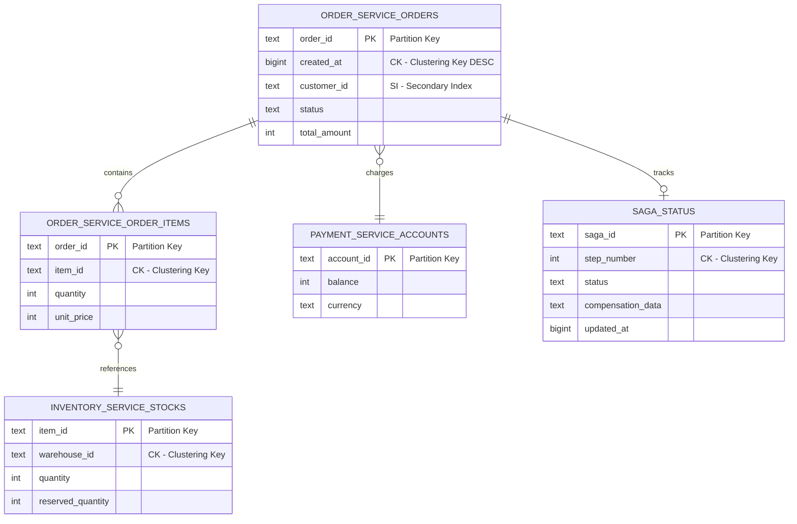
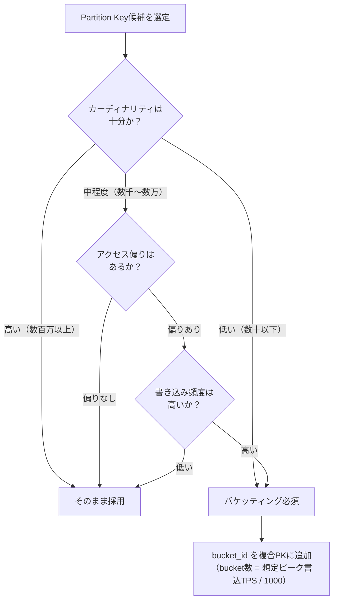

# Phase 2-1: データモデル設計

## 目的

各マイクロサービスのデータモデルを設計し、ScalarDBスキーマを定義する。Phase 1で決定したScalarDB管理対象テーブル一覧とDB選定結果を基に、論理・物理の両レベルでデータモデルを策定し、ScalarDBスキーマファイルとして具体化する。

---

## 入力

| 入力 | ソース | 説明 |
|------|--------|------|
| ScalarDB管理対象テーブル一覧 | Step 03 成果物 | ScalarDB Consensus Commitで管理するテーブルの一覧 |
| DB選定結果 | Step 03 成果物 | 各サービスが使用するデータベースの選定結果 |
| ドメインモデル | Step 02 成果物 | 境界コンテキスト図、集約設計 |

## 参照資料

| 資料 | パス | 主な参照セクション |
|------|------|-------------------|
| 論理データモデルパターン | `../research/03_logical_data_model.md` | ユースケース別パターン、Database per Service、CQRS、Sagaステータス管理 |
| 物理データモデル | `../research/04_physical_data_model.md` | Partition Key設計、Clustering Key設計、Secondary Index制約、メタデータオーバーヘッド |
| DB調査 | `../research/05_database_investigation.md` | Cassandra/DynamoDB/RDBMS固有の最適化 |
| ScalarDB 3.17 Deep Dive | `../research/13_scalardb_317_deep_dive.md` | Batch Operations、Transaction Metadata Decoupling |

---

## ステップ

### Step 4.1: 論理データモデル設計

#### 4.1.1 ユースケース別パターン適用

`03_logical_data_model.md` のユースケースパターンを参照し、対象システムに適したデータモデルパターンを選定する。

| ユースケース | 代表的パターン | ScalarDB活用ポイント |
|-------------|---------------|---------------------|
| **EC（電子商取引）** | 注文-在庫-決済の分散Tx | 2PCで注文確定と在庫引当を原子的に実行 |
| **金融（銀行・決済）** | 口座間送金、残高管理 | Consensus Commitによる厳密なACID保証 |
| **IoT** | 時系列データ、デバイス管理 | バケッティングによるホットスポット回避 |
| **SaaS（マルチテナント）** | テナント分離、使用量計測 | Namespace単位でのテナント分離 |
| **医療** | 患者記録、処方管理 | 監査ログの一貫性保証 |

#### 4.1.2 機能要件によるデータモデル決定

システムの機能要件に基づき、以下の補助テーブルの要否を判断する。

| 補助テーブル | 必要条件 | テーブル設計の概要 |
|-------------|---------|-------------------|
| **Sagaステータス管理テーブル** | Sagaパターン採用時 | saga_id(PK), step, status, compensation_data |
| **CQRSリードモデル** | CQRS採用時 | 非正規化された読み取り専用テーブル |
| **Outboxテーブル** | Outboxパターン採用時 | event_id(PK), aggregate_type, payload, published |
| **冪等性キーテーブル** | リトライ安全性が必要時 | idempotency_key(PK), result, created_at |
| **分散ロックテーブル** | 排他制御が必要時 | lock_key(PK), owner, expires_at |

#### 4.1.3 ScalarDB 3.17新機能の考慮

| 新機能 | データモデルへの影響 | 適用判断 |
|--------|---------------------|---------|
| **Batch Operations** | 複数テーブルへの一括操作が可能。関連テーブルの同時更新パターンを設計に反映 | バッチ更新が頻繁なテーブル群で採用 |
| **Transaction Metadata Decoupling** (Private Preview, JDBC限定) | メタデータカラムを別テーブルに分離可能。本体テーブルのスキーマが簡潔に | CDC連携時やストレージ効率が重要な場合に採用 |
| **Fix Secondary Index Behavior** | SI動作の正確性向上。SI設計の信頼性が向上 | 全SI設計に反映 |



---

### Step 4.2: 物理データモデル設計

#### 4.2.1 Partition Key設計

`04_physical_data_model.md` を参照し、以下の原則に基づきPartition Keyを設計する。

**設計チェックリスト:**

| チェック項目 | 基準 | 確認結果 |
|-------------|------|---------|
| カーディナリティ | パーティション数 >= ノード数 x 10 | [ ] |
| ホットスポット | 特定パーティションへの集中がないか | [ ] |
| クエリパターン適合 | 主要クエリが単一パーティション検索か | [ ] |
| 1パーティションサイズ | 数万件以下に収まるか | [ ] |

**ホットスポット回避のためのバケッティング判断:**



#### 4.2.2 Clustering Key設計

| パターン | Clustering Key設計 | ソート順 | 用途 |
|---------|-------------------|---------|------|
| **時系列データ** | `timestamp` / `created_at` | DESC | 最新データの高速取得 |
| **範囲検索** | `date` + `sequence` | ASC | 日付範囲スキャン |
| **階層データ** | `parent_id` + `child_id` | ASC | 親子関係のスキャン |
| **優先度付き** | `priority` + `created_at` | ASC, DESC | 高優先度の先行取得 |

#### 4.2.3 Secondary Index設計

ScalarDBのSecondary Index（SI）には以下の制約がある。設計時に必ず考慮すること。

| 制約 | 説明 | 対処法 |
|------|------|--------|
| 完全一致のみ | 範囲検索はSIでは不可 | CKで範囲検索をカバー |
| 低パフォーマンス | 全パーティションスキャンが発生しうる | 高頻度クエリにはSIを避ける |
| カーディナリティ考慮 | 低カーディナリティの列が適切 | statusやtype列に適用 |
| Scanとの組み合わせ制約 | SI列を指定したScanはPartition Key指定不可 | クエリパターンを事前に整理 |

#### 4.2.4 Cross-Partition Scan設計

ScalarDBではデフォルトでPartition Key指定なしのScan（Cross-Partition Scan）は無効化されている。利用する場合は明示的な有効化と設計上の考慮が必要である。

**有効化に必要な設定:**

| 設定項目 | 説明 | デフォルト |
|---------|------|-----------|
| `scalar.db.cross_partition_scan.enabled=true` | Cross-Partition Scanの有効化（必須） | `false` |
| `scalar.db.cross_partition_scan.filtering.enabled=true` | Cross-Partition Scanでのフィルタリング有効化 | `false` |
| `scalar.db.cross_partition_scan.ordering.enabled=true` | Cross-Partition Scanでのソート有効化 | `false` |

**設計原則:**

| 原則 | 説明 |
|------|------|
| **Partition Key指定アクセスを優先** | 主要クエリは必ずPartition Keyを指定する設計とする。Cross-Partition Scanは全パーティションを走査するためパフォーマンスが大幅に劣化する |
| **バッチ・管理用途に限定** | Cross-Partition Scanはバッチ処理、管理画面、データ移行等のオフライン・低頻度用途に限定する |
| **高頻度クエリでの使用禁止** | ユーザー向けAPIのリクエストパスでCross-Partition Scanを使用しない。必要な場合はCQRSリードモデルや非正規化テーブルで対応する |
| **filteringとorderingの追加有効化** | フィルタリングやソートが必要な場合は、それぞれの設定も追加で有効化する必要がある |

> **注意:** Cross-Partition Scanは実質的にフルテーブルスキャンとなるため、大規模テーブルでは著しいパフォーマンス劣化を引き起こす。データモデル設計段階でPartition Keyベースのアクセスパターンを十分に検討し、Cross-Partition Scanへの依存を最小化すること。

---

### Step 4.3: ScalarDBスキーマ定義

#### 4.3.1 Namespace設計

| 設計方針 | Namespace命名規則 | 適用場面 |
|---------|------------------|---------|
| **サービス単位** | `{service_name}` (例: `order_service`) | 標準的なマイクロサービス構成 |
| **機能単位** | `{service_name}_{function}` (例: `order_command`, `order_query`) | CQRS採用時 |
| **テナント単位** | `{tenant_id}_{service_name}` | マルチテナントSaaS |
| **環境単位** | Namespaceではなくクラスタで分離 | 本番/ステージング分離 |

> **注意**: ScalarDBのCoordinatorテーブル用Namespace（`coordinator`）はシステム予約済み。ユーザー定義Namespaceとの衝突に注意すること。

#### 4.3.2 テーブル定義

以下のフォーマットでテーブルを定義する。

**例: EC注文サービスのスキーマ定義**

```json
{
  "order_service.orders": {
    "transaction": true,
    "partition-key": ["order_id"],
    "clustering-key": ["created_at DESC"],
    "columns": {
      "order_id": "TEXT",
      "created_at": "BIGINT",
      "customer_id": "TEXT",
      "status": "TEXT",
      "total_amount": "INT",
      "currency": "TEXT",
      "updated_at": "BIGINT"
    },
    "secondary-index": ["customer_id", "status"]
  },
  "order_service.order_items": {
    "transaction": true,
    "partition-key": ["order_id"],
    "clustering-key": ["item_id ASC"],
    "columns": {
      "order_id": "TEXT",
      "item_id": "TEXT",
      "product_name": "TEXT",
      "quantity": "INT",
      "unit_price": "INT"
    }
  }
}
```

**ScalarDB SQL利用時のDDL形式:**

```sql
CREATE NAMESPACE order_service;

CREATE TABLE order_service.orders (
    order_id TEXT,
    created_at BIGINT,
    customer_id TEXT,
    status TEXT,
    total_amount INT,
    currency TEXT,
    updated_at BIGINT,
    PRIMARY KEY (order_id, created_at)
) WITH CLUSTERING ORDER BY (created_at DESC);

CREATE INDEX ON order_service.orders (customer_id);
CREATE INDEX ON order_service.orders (status);

CREATE TABLE order_service.order_items (
    order_id TEXT,
    item_id TEXT,
    product_name TEXT,
    quantity INT,
    unit_price INT,
    PRIMARY KEY (order_id, item_id)
);
```

#### 4.3.3 Consensus Commitメタデータオーバーヘッドの見積もり

`04_physical_data_model.md` に基づき、ScalarDBが各レコードに付加するメタデータの容量を見積もる。

| メタデータカラム | 型 | 概算サイズ | 説明 |
|-----------------|-----|-----------|------|
| `tx_id` | TEXT | 36 bytes | トランザクションID（UUID） |
| `tx_state` | INT | 4 bytes | トランザクション状態 |
| `tx_version` | INT | 4 bytes | レコードバージョン |
| `tx_prepared_at` | BIGINT | 8 bytes | Prepare時刻 |
| `tx_committed_at` | BIGINT | 8 bytes | Commit時刻 |
| `before_` 系列 | 各カラム型に依存 | 元カラムと同等 | 更新前の値（各カラム分） |
| **合計（固定部分）** | - | **約80-100 bytes** | before_列を除く |

**オーバーヘッド計算例:**

| ユーザーデータサイズ | メタデータ（固定） | before_列 | 合計 | オーバーヘッド倍率 |
|--------------------|--------------------|-----------|------|------------------|
| 100 bytes | 80-100 bytes | 100 bytes | 280-300 bytes | **約3倍** |
| 500 bytes | 80-100 bytes | 500 bytes | 1,080-1,100 bytes | **約2.2倍** |
| 1 KB | 80-100 bytes | 1 KB | 2,128-2,148 bytes | **約2.1倍** |
| 10 KB | 80-100 bytes | 10 KB | 20,560-20,580 bytes | **約2.0倍** |

> **参考**: `04_physical_data_model.md` では固定メタデータが約80-100 bytes、100バイトレコードで約3倍のオーバーヘッドと記載。before_列の内容やカラム数により変動するため、実際のテーブル設計に基づいて個別に見積もること。

**Transaction Metadata Decoupling適用時:**

```
メインテーブル: ユーザーデータのみ（メタデータカラムなし）
メタデータテーブル: tx_id, tx_state, tx_version, tx_prepared_at, tx_committed_at, before_列
```

適用により:
- メインテーブルのストレージ効率が大幅に改善
- CDC連携時にメタデータをフィルタリングする必要がなくなる
- ただし書き込み時に2テーブルへのアクセスが発生するためレイテンシが若干増加

---

### Step 4.4: DB固有の最適化

#### 4.4.1 Cassandra固有の最適化

| 最適化項目 | 設計指針 | 具体例 |
|-----------|---------|--------|
| **バケッティング** | 時系列データでPartition Keyにbucket_idを追加 | `sensor_id + bucket_id(0-9)` |
| **TTL設計** | ScalarDB管理外テーブルでTTLを活用 | イベントログ: 90日、セッション: 24時間 |
| **Compaction Strategy** | テーブルのアクセスパターンで選定 | STCS（書き込み重視）、LCS（読み取り重視） |
| **パーティションサイズ** | 100MB以下を目安 | CKの最大行数を制限 |

> **注意**: ScalarDB管理下テーブルではTTLを直接使用しない。ScalarDBのメタデータが破壊される可能性があるため、アプリケーションレベルでの論理削除またはバッチ削除を採用すること。

#### 4.4.2 DynamoDB固有の最適化

| 最適化項目 | 設計指針 | 具体例 |
|-----------|---------|--------|
| **GSI（Global Secondary Index）設計** | ScalarDB SIと別にDynamoDB GSIを活用（管理外テーブル） | 検索用のGSI追加 |
| **キャパシティモード** | On-Demand vs Provisioned の選定 | 予測可能なワークロード → Provisioned |
| **WCU/RCU見積もり** | ScalarDBメタデータオーバーヘッドを加味 | 1レコード更新 = 2-3 WCU（メタデータ含む） |
| **パーティションキー設計** | DynamoDBの10GB/パーティション制約を考慮 | 高カーディナリティキー必須 |

#### 4.4.3 RDBMS固有の最適化

| 最適化項目 | 設計指針 | 具体例 |
|-----------|---------|--------|
| **補助インデックス** | ScalarDB SI外の検索にDB固有インデックスを活用 | 複合インデックス、部分インデックス |
| **パーティショニング** | 大規模テーブルの水平分割 | 日付レンジパーティション |
| **接続プール** | ScalarDB経由の接続数を考慮 | HikariCP設定の調整 |
| **ストレージエンジン** | MySQL: InnoDB必須（ScalarDB要件） | InnoDB以外は非対応 |

---

## 成果物

| 成果物 | 形式 | 内容 |
|--------|------|------|
| **論理データモデル** | ER図（Mermaid） + テーブル定義書 | エンティティ関連、属性定義、制約 |
| **物理データモデル** | ScalarDBスキーマJSON / SQL DDL | PK/CK/SI指定、カラム型定義 |
| **メタデータオーバーヘッド見積もり** | 計算シート | テーブル別のストレージ見積もり |
| **DB固有最適化設計書** | 設計書 | Cassandra/DynamoDB/RDBMS固有の設定・最適化 |

---

## 完了基準チェックリスト

### 論理データモデル

- [ ] 全マイクロサービスのエンティティが定義されている
- [ ] エンティティ間の関連が明示されている（ER図）
- [ ] 各エンティティの全属性が定義されている
- [ ] Sagaステータス管理テーブルが必要な箇所で設計されている
- [ ] CQRSリードモデルが必要な箇所で設計されている
- [ ] Outboxテーブルが必要な箇所で設計されている

### 物理データモデル

- [ ] 全テーブルのPartition Keyが定義されている
- [ ] Partition Keyのカーディナリティが十分である（ノード数x10以上）
- [ ] ホットスポットの可能性が評価され、必要に応じてバケッティングが適用されている
- [ ] Clustering Keyが主要クエリパターンに適合している
- [ ] Secondary Indexの使用がScalarDBの制約内に収まっている
- [ ] 高頻度クエリがSIに依存していない

### ScalarDBスキーマ

- [ ] 全テーブルのスキーマJSON/DDLが定義されている
- [ ] Namespace命名規則が統一されている
- [ ] `transaction: true` がScalarDB管理対象テーブルに設定されている
- [ ] CoordinatorテーブルのNamespaceとの衝突がない
- [ ] カラム型がScalarDBサポート型（BOOLEAN, INT, BIGINT, FLOAT, DOUBLE, TEXT, BLOB, DATE, TIME, TIMESTAMP, TIMESTAMPTZ）に準拠している

### メタデータオーバーヘッド

- [ ] 各テーブルのメタデータオーバーヘッドが見積もられている
- [ ] ストレージコストが許容範囲内である
- [ ] Transaction Metadata Decoupling適用の要否が判断されている

### DB固有最適化

- [ ] 使用するDB種別ごとの最適化設計が完了している
- [ ] ScalarDB管理下テーブルでのDB固有機能使用制約が確認されている

---

## アンチパターン集

### AP-1: 巨大パーティション

| 項目 | 内容 |
|------|------|
| **パターン** | 1つのPartition Keyに大量のレコードが集中する設計 |
| **問題** | パフォーマンス劣化、Cassandraでのパーティション制限超過、OCC競合率の増大 |
| **例** | `partition-key: ["tenant_id"]` で大規模テナントに全データが集中 |
| **対策** | バケッティング、複合Partition Key、時間ベースの分割 |

### AP-2: Secondary Indexの過剰使用

| 項目 | 内容 |
|------|------|
| **パターン** | 高頻度クエリをSecondary Indexに依存する設計 |
| **問題** | 全パーティションスキャンによるレイテンシ増大、特にCassandraバックエンドで顕著 |
| **例** | 注文検索を `status` のSIで実行（数百万レコード対象） |
| **対策** | 非正規化テーブルの作成、CQRSリードモデルの導入、クエリ専用テーブルの設計 |

### AP-3: ScalarDB管理下テーブルでのDB固有機能直接使用

| 項目 | 内容 |
|------|------|
| **パターン** | ScalarDB管理下テーブルにDB固有のTTL、トリガー、マテリアライズドビュー等を適用 |
| **問題** | ScalarDBメタデータの破壊、トランザクション一貫性の喪失 |
| **例** | Cassandraの `USING TTL` をScalarDB管理テーブルに適用 |
| **対策** | アプリケーションレベルでの論理削除、バッチ処理による物理削除 |

### AP-4: 正規化への過度な依存

| 項目 | 内容 |
|------|------|
| **パターン** | RDBMSの正規化理論をそのままNoSQLバックエンドのScalarDB設計に適用 |
| **問題** | JOINが使えない（ScalarDB CRUD APIの場合）ため、多数のGet/Scanが必要になりパフォーマンス劣化 |
| **例** | 5テーブルに正規化し、1リクエストで5回のGet呼び出し |
| **対策** | クエリ駆動型設計、必要に応じた非正規化、Batch Operations APIの活用 |

### AP-5: Partition Key の不適切な選択

| 項目 | 内容 |
|------|------|
| **パターン** | カーディナリティの低い列（status、boolean、region等）をPartition Keyに使用 |
| **問題** | データの偏り、ホットスポット、スケーラビリティの喪失 |
| **例** | `partition-key: ["order_status"]` （値が5種類しかない） |
| **対策** | 高カーディナリティ列（UUID、ユーザーID等）の採用、複合キーの使用 |

### AP-6: メタデータオーバーヘッドの未考慮

| 項目 | 内容 |
|------|------|
| **パターン** | ScalarDBのメタデータカラムを考慮せずにストレージ容量やDynamoDB WCU/RCUを見積もる |
| **問題** | ストレージコストの過少見積もり、DynamoDBスロットリングの発生 |
| **例** | 100バイトレコード x 1億件 = 10GBと見積もるが、実際は約30GB（約3倍） |
| **対策** | 本ドキュメントのオーバーヘッド計算式を使用して正確に見積もる |

### AP-7: Namespace設計の不統一

| 項目 | 内容 |
|------|------|
| **パターン** | Namespaceの命名規則がサービス間で統一されていない |
| **問題** | 運用時の混乱、2PC設定時のミス、スキーマ管理の複雑化 |
| **例** | `orderService`, `order_svc`, `orders` が混在 |
| **対策** | 命名規則を事前に策定し、全チームで共有。snake_case統一を推奨 |
