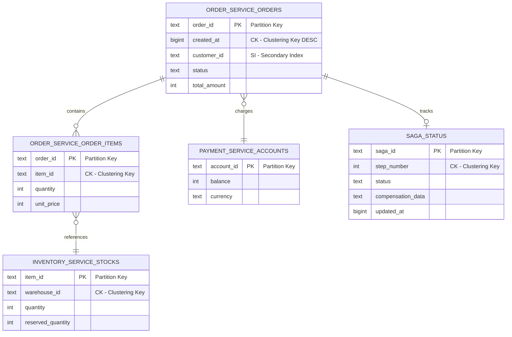
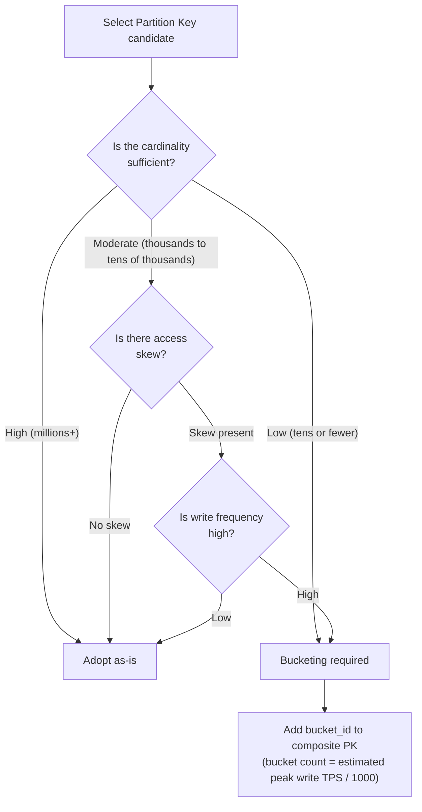

# Phase 2-1: Data Model Design

## Purpose

Design the data model for each microservice and define the ScalarDB schema. Based on the ScalarDB managed table list and DB selection results determined in Phase 1, formulate data models at both logical and physical levels, and materialize them as ScalarDB schema files.

---

## Inputs

| Input | Source | Description |
|-------|--------|-------------|
| ScalarDB Managed Table List | Step 03 deliverables | List of tables managed by ScalarDB Consensus Commit |
| DB Selection Results | Step 03 deliverables | Selected database for each service |
| Domain Model | Step 02 deliverables | Bounded context diagram, aggregate design |

## Reference Materials

| Document | Path | Key Reference Sections |
|----------|------|----------------------|
| Logical Data Model Patterns | `../research/03_logical_data_model.md` | Use case patterns, Database per Service, CQRS, Saga status management |
| Physical Data Model | `../research/04_physical_data_model.md` | Partition Key design, Clustering Key design, Secondary Index constraints, metadata overhead |
| DB Investigation | `../research/05_database_investigation.md` | Cassandra/DynamoDB/RDBMS-specific optimizations |
| ScalarDB 3.17 Deep Dive | `../research/13_scalardb_317_deep_dive.md` | Batch Operations, Transaction Metadata Decoupling |

---

## Steps

### Step 4.1: Logical Data Model Design

#### 4.1.1 Applying Use Case Patterns

Refer to the use case patterns in `03_logical_data_model.md` and select data model patterns suited to the target system.

| Use Case | Representative Pattern | ScalarDB Utilization Point |
|----------|----------------------|---------------------------|
| **E-Commerce** | Distributed Tx across order-inventory-payment | Atomically execute order confirmation and inventory reservation with 2PC |
| **Finance (Banking/Payments)** | Inter-account transfers, balance management | Strict ACID guarantees via Consensus Commit |
| **IoT** | Time-series data, device management | Hotspot avoidance via bucketing |
| **SaaS (Multi-tenant)** | Tenant isolation, usage metering | Tenant isolation at the Namespace level |
| **Healthcare** | Patient records, prescription management | Consistency guarantees for audit logs |

#### 4.1.2 Determining Data Model Based on Functional Requirements

Based on the system's functional requirements, determine whether the following auxiliary tables are needed.

| Auxiliary Table | Required Condition | Table Design Overview |
|----------------|-------------------|----------------------|
| **Saga Status Management Table** | When the Saga pattern is adopted | saga_id(PK), step, status, compensation_data |
| **CQRS Read Model** | When CQRS is adopted | Denormalized read-only tables |
| **Outbox Table** | When the Outbox pattern is adopted | event_id(PK), aggregate_type, payload, published |
| **Idempotency Key Table** | When retry safety is required | idempotency_key(PK), result, created_at |
| **Distributed Lock Table** | When exclusive control is required | lock_key(PK), owner, expires_at |

#### 4.1.3 Considering ScalarDB 3.17 New Features

| New Feature | Impact on Data Model | Adoption Decision |
|-------------|---------------------|-------------------|
| **Batch Operations** | Enables bulk operations across multiple tables. Reflect simultaneous update patterns for related tables in the design | Adopt for table groups with frequent batch updates |
| **Transaction Metadata Decoupling** (Private Preview, JDBC only) | Metadata columns can be separated into a different table. Main table schema becomes cleaner | Adopt when CDC integration or storage efficiency is important |
| **Fix Secondary Index Behavior** | Improved SI behavior accuracy. Increased reliability of SI design | Reflect in all SI designs |



---

### Step 4.2: Physical Data Model Design

#### 4.2.1 Partition Key Design

Refer to `04_physical_data_model.md` and design Partition Keys based on the following principles.

**Design Checklist:**

| Check Item | Criterion | Result |
|------------|----------|--------|
| Cardinality | Number of partitions >= number of nodes x 10 | [ ] |
| Hotspots | No concentration on specific partitions | [ ] |
| Query pattern fit | Primary queries use single-partition lookups | [ ] |
| Single partition size | Stays within tens of thousands of records | [ ] |

**Bucketing Decision for Hotspot Avoidance:**



#### 4.2.2 Clustering Key Design

| Pattern | Clustering Key Design | Sort Order | Use Case |
|---------|----------------------|------------|----------|
| **Time-series data** | `timestamp` / `created_at` | DESC | Fast retrieval of latest data |
| **Range queries** | `date` + `sequence` | ASC | Date range scan |
| **Hierarchical data** | `parent_id` + `child_id` | ASC | Parent-child relationship scan |
| **Priority-based** | `priority` + `created_at` | ASC, DESC | High-priority first retrieval |

#### 4.2.3 Secondary Index Design

ScalarDB's Secondary Index (SI) has the following constraints. These must be considered during design.

| Constraint | Description | Workaround |
|-----------|-------------|------------|
| Exact match only | Range queries are not possible with SI | Cover range queries with CK |
| Low performance | Full partition scan may occur | Avoid SI for high-frequency queries |
| Cardinality consideration | Low-cardinality columns are appropriate | Apply to status or type columns |
| Scan combination constraint | Scan with SI column specified cannot also specify Partition Key | Organize query patterns in advance |

#### 4.2.4 Cross-Partition Scan Design

In ScalarDB, Scan without Partition Key specification (Cross-Partition Scan) is disabled by default. Explicit enablement and design considerations are required for use.

**Required Configuration for Enablement:**

| Configuration Item | Description | Default |
|-------------------|-------------|---------|
| `scalar.db.cross_partition_scan.enabled=true` | Enable Cross-Partition Scan (required) | `false` |
| `scalar.db.cross_partition_scan.filtering.enabled=true` | Enable filtering for Cross-Partition Scan | `false` |
| `scalar.db.cross_partition_scan.ordering.enabled=true` | Enable ordering for Cross-Partition Scan | `false` |

**Design Principles:**

| Principle | Description |
|-----------|-------------|
| **Prioritize Partition Key-specified access** | Design primary queries to always specify a Partition Key. Cross-Partition Scan traverses all partitions and significantly degrades performance |
| **Limit to batch/admin use** | Restrict Cross-Partition Scan to offline, low-frequency use cases such as batch processing, admin screens, and data migration |
| **Prohibit use in high-frequency queries** | Do not use Cross-Partition Scan in user-facing API request paths. Use CQRS read models or denormalized tables when needed |
| **Additional enablement for filtering and ordering** | When filtering or ordering is required, each respective configuration must also be enabled |

> **Note:** Cross-Partition Scan is effectively a full table scan, so it causes significant performance degradation on large tables. Thoroughly consider Partition Key-based access patterns during data model design and minimize dependence on Cross-Partition Scan.

---

### Step 4.3: ScalarDB Schema Definition

#### 4.3.1 Namespace Design

| Design Policy | Namespace Naming Convention | Applicable Situations |
|--------------|---------------------------|----------------------|
| **Per service** | `{service_name}` (e.g., `order_service`) | Standard microservice architecture |
| **Per function** | `{service_name}_{function}` (e.g., `order_command`, `order_query`) | When CQRS is adopted |
| **Per tenant** | `{tenant_id}_{service_name}` | Multi-tenant SaaS |
| **Per environment** | Separate by cluster, not by Namespace | Production/staging separation |

> **Note**: The Namespace for ScalarDB's Coordinator table (`coordinator`) is system-reserved. Ensure no conflicts with user-defined Namespaces.

#### 4.3.2 Table Definition

Define tables using the following format.

**Example: Schema Definition for E-Commerce Order Service**

```json
{
  "order_service.orders": {
    "transaction": true,
    "partition-key": ["order_id"],
    "clustering-key": ["created_at DESC"],
    "columns": {
      "order_id": "TEXT",
      "created_at": "BIGINT",
      "customer_id": "TEXT",
      "status": "TEXT",
      "total_amount": "INT",
      "currency": "TEXT",
      "updated_at": "BIGINT"
    },
    "secondary-index": ["customer_id", "status"]
  },
  "order_service.order_items": {
    "transaction": true,
    "partition-key": ["order_id"],
    "clustering-key": ["item_id ASC"],
    "columns": {
      "order_id": "TEXT",
      "item_id": "TEXT",
      "product_name": "TEXT",
      "quantity": "INT",
      "unit_price": "INT"
    }
  }
}
```

**DDL Format When Using ScalarDB SQL:**

```sql
CREATE NAMESPACE order_service;

CREATE TABLE order_service.orders (
    order_id TEXT,
    created_at BIGINT,
    customer_id TEXT,
    status TEXT,
    total_amount INT,
    currency TEXT,
    updated_at BIGINT,
    PRIMARY KEY (order_id, created_at)
) WITH CLUSTERING ORDER BY (created_at DESC);

CREATE INDEX ON order_service.orders (customer_id);
CREATE INDEX ON order_service.orders (status);

CREATE TABLE order_service.order_items (
    order_id TEXT,
    item_id TEXT,
    product_name TEXT,
    quantity INT,
    unit_price INT,
    PRIMARY KEY (order_id, item_id)
);
```

#### 4.3.3 Estimating Consensus Commit Metadata Overhead

Estimate the capacity of metadata that ScalarDB appends to each record, based on `04_physical_data_model.md`.

| Metadata Column | Type | Approximate Size | Description |
|----------------|------|-----------------|-------------|
| `tx_id` | TEXT | 36 bytes | Transaction ID (UUID) |
| `tx_state` | INT | 4 bytes | Transaction state |
| `tx_version` | INT | 4 bytes | Record version |
| `tx_prepared_at` | BIGINT | 8 bytes | Prepare timestamp |
| `tx_committed_at` | BIGINT | 8 bytes | Commit timestamp |
| `before_` series | Depends on each column type | Equivalent to original columns | Pre-update values (for each column) |
| **Total (fixed portion)** | - | **Approx. 80-100 bytes** | Excluding before_ columns |

**Overhead Calculation Example:**

| User Data Size | Metadata (Fixed) | before_ Columns | Total | Overhead Multiplier |
|---------------|-------------------|-----------------|-------|---------------------|
| 100 bytes | 80-100 bytes | 100 bytes | 280-300 bytes | **Approx. 3x** |
| 500 bytes | 80-100 bytes | 500 bytes | 1,080-1,100 bytes | **Approx. 2.2x** |
| 1 KB | 80-100 bytes | 1 KB | 2,128-2,148 bytes | **Approx. 2.1x** |
| 10 KB | 80-100 bytes | 10 KB | 20,560-20,580 bytes | **Approx. 2.0x** |

> **Reference**: `04_physical_data_model.md` states that fixed metadata is approximately 80-100 bytes, with approximately 3x overhead for 100-byte records. This varies depending on the contents of before_ columns and the number of columns, so estimate individually based on actual table design.

**When Transaction Metadata Decoupling Is Applied:**

```
Main table: User data only (no metadata columns)
Metadata table: tx_id, tx_state, tx_version, tx_prepared_at, tx_committed_at, before_ columns
```

Benefits of applying:
- Significantly improved storage efficiency for the main table
- No need to filter out metadata during CDC integration
- However, writes require access to two tables, slightly increasing latency

---

### Step 4.4: DB-Specific Optimizations

#### 4.4.1 Cassandra-Specific Optimizations

| Optimization Item | Design Guideline | Example |
|-------------------|-----------------|---------|
| **Bucketing** | Add bucket_id to Partition Key for time-series data | `sensor_id + bucket_id(0-9)` |
| **TTL Design** | Leverage TTL for non-ScalarDB managed tables | Event logs: 90 days, Sessions: 24 hours |
| **Compaction Strategy** | Select based on table access patterns | STCS (write-heavy), LCS (read-heavy) |
| **Partition Size** | Target 100MB or less | Limit maximum rows per CK |

> **Note**: Do not directly use TTL on ScalarDB-managed tables. As it may corrupt ScalarDB metadata, adopt application-level soft deletion or batch deletion instead.

#### 4.4.2 DynamoDB-Specific Optimizations

| Optimization Item | Design Guideline | Example |
|-------------------|-----------------|---------|
| **GSI (Global Secondary Index) Design** | Use DynamoDB GSI separately from ScalarDB SI (for non-managed tables) | Add GSI for search |
| **Capacity Mode** | Choose between On-Demand vs Provisioned | Predictable workload -> Provisioned |
| **WCU/RCU Estimation** | Factor in ScalarDB metadata overhead | 1 record update = 2-3 WCU (including metadata) |
| **Partition Key Design** | Consider DynamoDB's 10GB/partition constraint | High-cardinality keys required |

#### 4.4.3 RDBMS-Specific Optimizations

| Optimization Item | Design Guideline | Example |
|-------------------|-----------------|---------|
| **Auxiliary Indexes** | Leverage DB-specific indexes for searches outside ScalarDB SI | Composite indexes, partial indexes |
| **Partitioning** | Horizontal partitioning for large tables | Date range partitioning |
| **Connection Pooling** | Account for connection count through ScalarDB | Adjust HikariCP settings |
| **Storage Engine** | MySQL: InnoDB required (ScalarDB requirement) | Non-InnoDB is unsupported |

---

## Deliverables

| Deliverable | Format | Content |
|-------------|--------|---------|
| **Logical Data Model** | ER diagram (Mermaid) + Table definition document | Entity relationships, attribute definitions, constraints |
| **Physical Data Model** | ScalarDB schema JSON / SQL DDL | PK/CK/SI specification, column type definitions |
| **Metadata Overhead Estimate** | Calculation sheet | Per-table storage estimates |
| **DB-Specific Optimization Design Document** | Design document | Cassandra/DynamoDB/RDBMS-specific settings and optimizations |

---

## Completion Criteria Checklist

### Logical Data Model

- [ ] Entities for all microservices have been defined
- [ ] Relationships between entities are explicit (ER diagram)
- [ ] All attributes for each entity have been defined
- [ ] Saga status management tables have been designed where needed
- [ ] CQRS read models have been designed where needed
- [ ] Outbox tables have been designed where needed

### Physical Data Model

- [ ] Partition Keys have been defined for all tables
- [ ] Partition Key cardinality is sufficient (>= number of nodes x 10)
- [ ] Hotspot potential has been evaluated and bucketing applied where necessary
- [ ] Clustering Keys are aligned with primary query patterns
- [ ] Secondary Index usage is within ScalarDB constraints
- [ ] High-frequency queries do not depend on SI

### ScalarDB Schema

- [ ] Schema JSON/DDL has been defined for all tables
- [ ] Namespace naming convention is unified
- [ ] `transaction: true` is set on ScalarDB-managed tables
- [ ] No conflicts with the Coordinator table Namespace
- [ ] Column types conform to ScalarDB-supported types (BOOLEAN, INT, BIGINT, FLOAT, DOUBLE, TEXT, BLOB, DATE, TIME, TIMESTAMP, TIMESTAMPTZ)

### Metadata Overhead

- [ ] Metadata overhead has been estimated for each table
- [ ] Storage cost is within acceptable range
- [ ] Decision on whether to apply Transaction Metadata Decoupling has been made

### DB-Specific Optimizations

- [ ] Optimization design has been completed for each DB type in use
- [ ] Restrictions on DB-specific feature usage for ScalarDB-managed tables have been confirmed

---

## Anti-Pattern Collection

### AP-1: Oversized Partitions

| Item | Content |
|------|---------|
| **Pattern** | A design where a large number of records concentrate on a single Partition Key |
| **Problem** | Performance degradation, Cassandra partition limit exceeded, increased OCC conflict rate |
| **Example** | `partition-key: ["tenant_id"]` where all data concentrates on large tenants |
| **Countermeasure** | Bucketing, composite Partition Key, time-based partitioning |

### AP-2: Overuse of Secondary Indexes

| Item | Content |
|------|---------|
| **Pattern** | A design where high-frequency queries depend on Secondary Indexes |
| **Problem** | Increased latency due to full partition scan, especially prominent with Cassandra backend |
| **Example** | Running order searches using `status` SI (across millions of records) |
| **Countermeasure** | Create denormalized tables, introduce CQRS read models, design query-specific tables |

### AP-3: Direct Use of DB-Specific Features on ScalarDB Managed Tables

| Item | Content |
|------|---------|
| **Pattern** | Applying DB-specific TTL, triggers, materialized views, etc. to ScalarDB-managed tables |
| **Problem** | Corruption of ScalarDB metadata, loss of transaction consistency |
| **Example** | Applying Cassandra's `USING TTL` to a ScalarDB-managed table |
| **Countermeasure** | Application-level soft deletion, physical deletion via batch processing |

### AP-4: Over-reliance on Normalization

| Item | Content |
|------|---------|
| **Pattern** | Applying RDBMS normalization theory directly to ScalarDB designs with NoSQL backends |
| **Problem** | JOINs are unavailable (with ScalarDB CRUD API), requiring many Get/Scan calls and causing performance degradation |
| **Example** | Normalizing into 5 tables, requiring 5 Get calls per request |
| **Countermeasure** | Query-driven design, denormalization as needed, use of Batch Operations API |

### AP-5: Inappropriate Partition Key Selection

| Item | Content |
|------|---------|
| **Pattern** | Using low-cardinality columns (status, boolean, region, etc.) as Partition Key |
| **Problem** | Data skew, hotspots, loss of scalability |
| **Example** | `partition-key: ["order_status"]` (only 5 possible values) |
| **Countermeasure** | Adopt high-cardinality columns (UUID, user ID, etc.), use composite keys |

### AP-6: Failure to Account for Metadata Overhead

| Item | Content |
|------|---------|
| **Pattern** | Estimating storage capacity or DynamoDB WCU/RCU without considering ScalarDB metadata columns |
| **Problem** | Underestimated storage costs, DynamoDB throttling |
| **Example** | Estimating 100-byte records x 100 million = 10GB, but actual is approx. 30GB (approx. 3x) |
| **Countermeasure** | Use the overhead calculation formula in this document for accurate estimates |

### AP-7: Inconsistent Namespace Design

| Item | Content |
|------|---------|
| **Pattern** | Namespace naming conventions are not unified across services |
| **Problem** | Operational confusion, errors in 2PC configuration, increased schema management complexity |
| **Example** | Mixed use of `orderService`, `order_svc`, `orders` |
| **Countermeasure** | Establish naming conventions in advance and share with all teams. snake_case unification is recommended |
