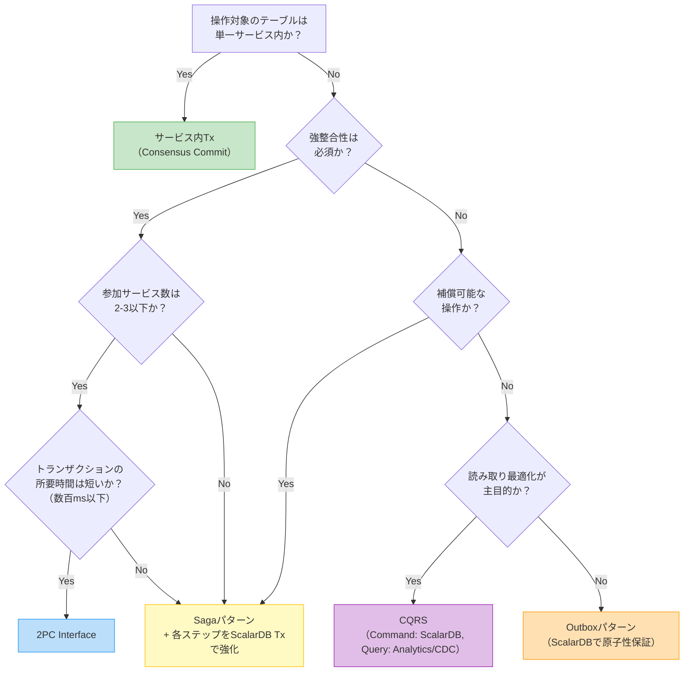
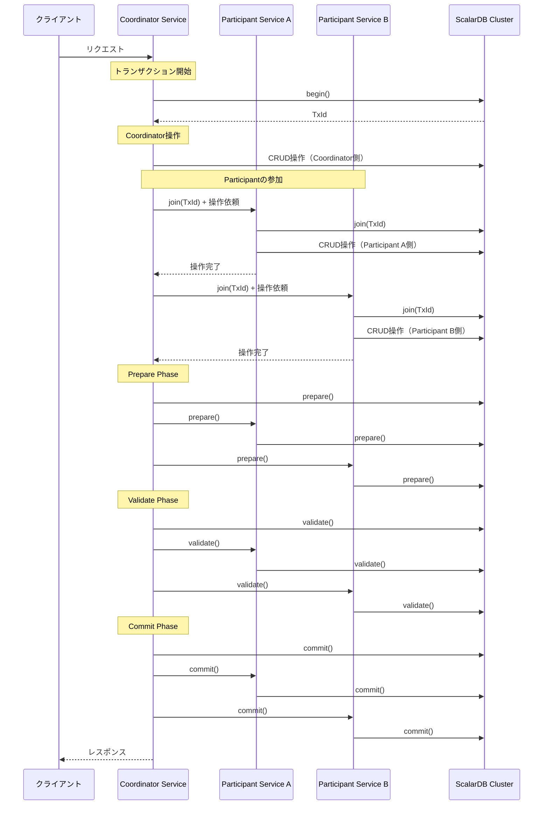
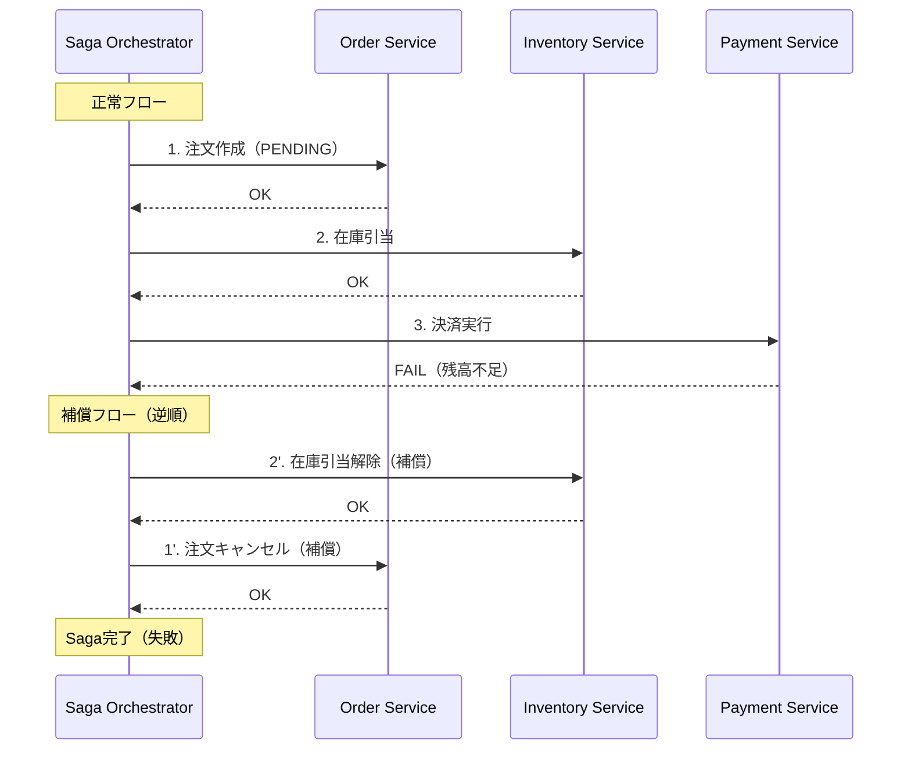
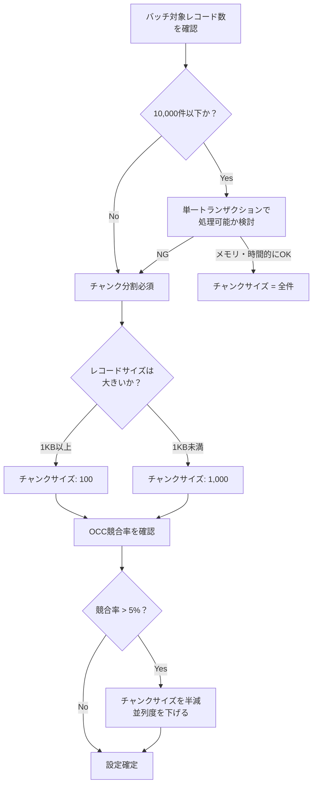
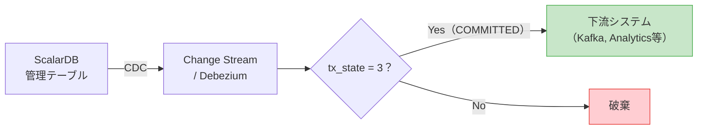

# Phase 2-2: トランザクション設計

## 目的

各サービス/機能のトランザクションパターンを決定し、トランザクション境界を詳細設計する。Step 04で策定したデータモデルとStep 03で定義したトランザクション境界をもとに、Consensus Commit、2PC、Saga、CQRS、Outbox等のパターンを適材適所で適用し、パフォーマンスとスケーラビリティを考慮した実装可能なトランザクション設計を策定する。

---

## 入力

| 入力 | ソース | 説明 |
|------|--------|------|
| データモデル（論理/物理） | Step 04 成果物 | ScalarDBスキーマ定義、テーブル一覧 |
| トランザクション境界定義 | Step 03 成果物 | ScalarDB管理対象テーブル、サービス間Tx対象 |
| ドメインモデル | Step 02 成果物 | 境界コンテキスト図、集約設計 |

## 参照資料

| 資料 | パス | 主な参照セクション |
|------|------|-------------------|
| トランザクションモデル | `../research/07_transaction_model.md` | Consensus Commit、2PC Interface、Saga、CQRS、デシジョンツリー |
| バッチ処理パターン | `../research/09_batch_processing.md` | チャンクサイズ、Spring Batch/Airflow統合 |
| ScalarDB 3.17 Deep Dive | `../research/13_scalardb_317_deep_dive.md` | Batch Operations API、Piggyback Begin、Write Buffering、Group Commit |
| 物理データモデル | `../research/04_physical_data_model.md` | OCC競合率モデリング |

---

## ステップ

### Step 5.1: トランザクションパターンの選定

#### 5.1.1 パターン一覧と特性

| パターン | API | 整合性レベル | レイテンシ | 適用場面 |
|---------|-----|------------|-----------|---------|
| **サービス内Tx** | `DistributedTransaction` API | 強整合性（ACID） | 低 | 単一サービス内の複数テーブル操作 |
| **サービス間Tx（2PC）** | `TwoPhaseCommitTransaction` API | 強整合性（ACID） | 中〜高 | 2-3サービス間の原子的操作 |
| **Saga** | アプリケーション実装 | 結果整合性 | 低（非同期） | 3サービス以上、長時間Tx |
| **CQRS** | Command: ScalarDB / Query: Analytics or CDC | 結果整合性（Query側） | 読み取り: 低 | 読み書き比率が偏るドメイン |
| **Outbox** | ScalarDB + メッセージブローカー | 結果整合性 | 低〜中 | イベント駆動アーキテクチャ |

#### 5.1.2 分離レベルの選定

ScalarDBは **SNAPSHOT**（デフォルト）、**SERIALIZABLE**、**READ_COMMITTED** の3つの分離レベルをサポートする。トランザクションパターン選定と合わせて、適切な分離レベルを選定する。

| 分離レベル | 特徴 | 推奨場面 | 設定値 |
|-----------|------|---------|--------|
| **SNAPSHOT**（デフォルト） | Write Skew Anomalyが発生しうるが、パフォーマンスが高い | 大半のユースケースで十分。読み取り中心のワークロードや、Write Skewが問題にならない操作 | `scalar.db.consensus_commit.isolation_level=SNAPSHOT` |
| **SERIALIZABLE** | 厳密な直列化可能性を保証。EXTRA_READ戦略により追加の読み取りチェックを実施 | 金融・決済など、厳密な整合性が求められるトランザクション。残高計算や在庫の正確性が必須の操作 | `scalar.db.consensus_commit.isolation_level=SERIALIZABLE` |
| **READ_COMMITTED** | Read Committed分離レベルを提供。軽量な分離で十分な場面に適合 | 厳密なSnapshot Isolationが不要で、パフォーマンスを優先する読み取り中心のワークロード | `scalar.db.consensus_commit.isolation_level=READ_COMMITTED` |

> **選定ガイドライン:**
> - SNAPSHOTがデフォルトであり、多くのユースケースでは十分な整合性を提供する。
> - SERIALIZABLEは追加のオーバーヘッド（EXTRA_READ戦略による追加読み取り）があるため、厳密な直列化可能性が必要な場合にのみ選択する。
> - READ_COMMITTEDは軽量な分離レベルであり、Snapshot Isolationほどの整合性が不要な場面で選択する。
> - 分離レベルはScalarDB Cluster全体の設定であり、トランザクション単位での切り替えはできない。システム内で最も厳しい要件に合わせて選定する。

#### 5.1.3 パターン選定デシジョンツリー

`07_transaction_model.md` のデシジョンツリーを基に、以下のフローで各操作のパターンを選定する。



#### 5.1.4 各操作のパターン割当表

以下のテンプレートに従い、各操作にパターンを割り当てる。

| # | 操作名 | 対象サービス | 対象テーブル | パターン | 根拠 |
|---|--------|------------|------------|---------|------|
| 1 | （例）注文確定 | Order, Inventory, Payment | orders, stocks, accounts | 2PC | 3サービス間で即時整合性必須 |
| 2 | （例）注文履歴参照 | Order (Query) | orders_read_model | CQRS | 読み取り90%以上、非正規化で高速化 |
| 3 | - | - | - | - | - |

---

### Step 5.2: 2PC設計の詳細

#### 5.2.1 Coordinator/Participantサービスの決定



**Coordinator選定基準:**

| 基準 | 説明 |
|------|------|
| **ビジネスプロセスの起点** | トランザクションを開始するユースケースのオーナーサービス |
| **障害影響の最小化** | Coordinatorの障害は全Participantに波及するため、最も安定したサービスを選定 |
| **ネットワークトポロジ** | Participantとのレイテンシが低い位置に配置 |

#### 5.2.2 トランザクションスコープの定義

各2PCトランザクションについて以下を定義する。

| 定義項目 | 説明 | 制約・推奨値 |
|---------|------|-------------|
| **参加サービス数** | Coordinator + Participant数 | **2-3サービスを推奨**。4以上はSagaを検討 |
| **操作テーブル数** | トランザクション内で操作するテーブルの総数 | 最小限に抑える |
| **最大レコード数** | トランザクション内で読み書きするレコードの総数 | 数十レコード以下を推奨 |
| **タイムアウト** | トランザクション全体の最大所要時間 | 後述のタイムアウト設計参照 |

#### 5.2.3 タイムアウト設計

| パラメータ | 設定項目 | 推奨値 | 説明 |
|-----------|---------|--------|------|
| `scalar.db.consensus_commit.coordinator.timeout_millis` | CoordinatorのCommitタイムアウト | 60000 (60s) | Coordinatorテーブルへの書き込みタイムアウト |
| gRPCクライアントタイムアウト | Participant呼び出しのタイムアウト | 5000-10000 (5-10s) | 各ParticipantへのgRPC呼び出し |
| 全体タイムアウト | トランザクション全体 | 90000 (90s) | クライアント側のタイムアウト（Coordinatorタイムアウトより大きく設定） |

**タイムアウト階層の原則:**
```
クライアント全体タイムアウト > Coordinatorタイムアウト > 個別RPC タイムアウトの合計
```

#### 5.2.4 障害時の振る舞い

| 障害シナリオ | 発生フェーズ | 振る舞い | リカバリ |
|-------------|------------|---------|---------|
| Participant障害 | CRUD操作中 | Coordinatorがabort | クライアントがリトライ |
| Participant障害 | Prepare後 | Lazy Recoveryが処理 | ScalarDBが自動リカバリ |
| Coordinator障害 | Prepare前 | 各Participantのレコードがpending状態 | Lazy Recoveryでabort |
| Coordinator障害 | Commit後 | Participantが未commitでも次回アクセス時にリカバリ | Lazy Recovery |
| ネットワーク分断 | 任意 | タイムアウト後にabort | クライアントがリトライ |

> **Lazy Recovery**: ScalarDBは、pendingまたはprepared状態のレコードに次回アクセスがあった時点で、Coordinatorテーブルの状態を確認し、自動的にcommitまたはabortを行う。明示的なリカバリプロセスは不要。

---

### Step 5.3: Sagaパターンの詳細設計（必要な場合）

#### 5.3.1 補償トランザクションの設計

各Sagaステップに対し、正常時の操作と補償操作を対で定義する。

| Step | サービス | 正常操作 | 補償操作 | 補償の冪等性 |
|------|---------|---------|---------|------------|
| 1 | Order | 注文作成（PENDING） | 注文キャンセル（CANCELLED） | order_idで重複チェック |
| 2 | Inventory | 在庫引当 | 在庫引当解除 | reservation_idで重複チェック |
| 3 | Payment | 決済実行 | 返金処理 | payment_idで重複チェック |
| 4 | Order | 注文確定（CONFIRMED） | （Step 1の補償に統合） | - |



#### 5.3.2 Choreography vs Orchestration の選定

| 比較項目 | Choreography | Orchestration |
|---------|-------------|---------------|
| **制御方式** | イベント駆動、各サービスが次のステップを判断 | 中央オーケストレーターが制御 |
| **結合度** | 低い（イベント経由のみ） | オーケストレーターへの依存 |
| **可視性** | 低い（フロー全体の把握が困難） | 高い（オーケストレーターにフロー定義） |
| **エラーハンドリング** | 各サービスで個別実装 | オーケストレーターで集中管理 |
| **推奨ステップ数** | 2-3ステップ | 4ステップ以上 |
| **推奨場面** | シンプルなフロー、チーム独立性重視 | 複雑なフロー、補償ロジックが多い |

**ScalarDBによる各ステップの強化:**

各Sagaステップ内で、ScalarDB Consensus Commitによるローカルトランザクションを使用し、ステップ内の操作はACIDを保証する。

```java
// Sagaの各ステップ内ではScalarDB Txで原子性を保証
DistributedTransaction tx = transactionManager.start();
try {
    // ステータステーブル更新とビジネスデータ更新を原子的に実行
    tx.put(/* saga_status更新: step=2, status=COMPLETED */);
    tx.put(/* inventory.stocks更新: reserved_quantity増加 */);
    tx.commit();
} catch (Exception e) {
    tx.abort();
    // Saga補償トリガー
}
```

---

### Step 5.4: バッチ処理のトランザクション設計

#### 5.4.1 チャンクサイズ決定

`09_batch_processing.md` を参照し、バッチ処理のチャンクサイズを決定する。

| パラメータ | 推奨値 | 根拠 |
|-----------|--------|------|
| **チャンクサイズ** | 100-1,000レコード/チャンク | メモリ管理とトランザクションスコープのバランス |
| **並列度** | 2-4スレッド | ScalarDB Cluster側の負荷とOCC競合のトレードオフ |
| **リトライ回数** | 3-5回 | OCC競合時の指数バックオフリトライ |
| **バックオフ間隔** | 初期100ms、最大5s | 競合が多い場合に段階的に待機 |

**チャンクサイズ決定フロー:**



#### 5.4.2 Spring Batch / Airflow統合パターン

| フレームワーク | 統合方式 | トランザクション制御 |
|--------------|---------|-------------------|
| **Spring Batch** | ChunkOrientedTaskletでScalarDB Txを使用 | ItemWriter内でcommit/abort |
| **Airflow** | PythonOperatorからScalarDB gRPC APIを呼び出し | タスク単位でチャンク処理 |
| **カスタム** | 独自ループでチャンク処理 | try-catch-retryパターン |

#### 5.4.3 Batch Operations API活用（ScalarDB 3.17）

`13_scalardb_317_deep_dive.md` のBatch Operations APIを活用し、チャンク内の複数操作を1回のRPCで実行する。

```java
// Batch Operations APIによる効率的なチャンク処理
DistributedTransaction tx = transactionManager.start();
try {
    List<Operation> operations = new ArrayList<>();
    for (Record record : chunk) {
        operations.add(Upsert.newBuilder()
            .namespace("billing_service")
            .table("invoices")
            .partitionKey(Key.ofText("invoice_id", record.getInvoiceId()))
            .intValue("amount", record.getAmount())
            .textValue("status", "GENERATED")
            .build());
    }
    // 1回のRPCで全操作を送信
    tx.batch(operations);
    tx.commit();
} catch (Exception e) {
    tx.abort();
    // リトライロジック
}
```

---

### Step 5.5: パフォーマンス最適化設計

#### 5.5.1 Piggyback Begin / Write Bufferingの適用判断

`13_scalardb_317_deep_dive.md` の最適化機能を評価し、適用可否を判断する。

| 最適化 | 効果 | 適用条件 | 設定 |
|--------|------|---------|------|
| **Piggyback Begin** | トランザクション開始のRPC 1往復を削減 | ScalarDB Cluster利用時（デフォルトOFF（明示的に `scalar.db.cluster.client.piggyback_begin.enabled=true` の設定が必要）） | `scalar.db.cluster.client.piggyback_begin.enabled=true` |
| **Write Buffering** | 非条件的な書き込み（insert, upsert, 無条件put/update/delete）をクライアントにバッファリングし、Read時やCommit時に一括送信。条件付きミューテーション（updateIf, deleteIf等）はバッファ対象外 | 書き込みが多いワークロード | `scalar.db.cluster.client.write_buffering.enabled=true` |
| **Batch Operations** | 複数操作を1 RPCに集約 | 独立した複数操作を同一Tx内で実行 | API利用（設定不要） |

**Write Buffering使用時の注意:**

| 注意事項 | 説明 |
|---------|------|
| 対象は非条件的な書込みのみ | insert, upsert, 無条件のput/update/deleteのみバッファされる。条件付きミューテーション（updateIf, deleteIf等）は即座にサーバーに送信される |
| Write後のReadが古い値を返す | バッファがフラッシュされるまでDBに書き込まれない |
| エラーがPrepare時に集約される | 個別Write時にはエラーが検出されない |
| メモリ使用量 | バッファサイズに応じてクライアントメモリが必要 |

#### 5.5.2 Group Commit設定

| パラメータ | 設定項目 | 推奨値 | 説明 |
|-----------|---------|--------|------|
| `scalar.db.consensus_commit.coordinator.group_commit.enabled` | Group Commit有効化 | `true` | 複数Txのコミットをグループ化してバッチ書き込み |
| `scalar.db.consensus_commit.coordinator.group_commit.slot_capacity` | スロット容量 | 20-40 | 同時に待機するTx数 |
| `scalar.db.consensus_commit.coordinator.group_commit.group_size_fix_timeout_millis` | グループ確定タイムアウト | 40 | グループサイズを確定するまでの待機時間 |
| `scalar.db.consensus_commit.coordinator.group_commit.delayed_slot_move_timeout_millis` | 遅延スロット移動タイムアウト | 800 | 遅延スロットの移動タイムアウト |

> **制約**: Group Commitは2PC Interfaceとの併用不可。2PCトランザクションを使用するサービスではGroup Commitを有効化しないこと（公式ドキュメント明記）。

#### 5.5.3 OCC競合率のモデリング

`04_physical_data_model.md` の競合率計算式を用いて、想定されるワークロードでのOCC競合率を見積もる。

**競合率計算の近似式:**

```
P(競合) ≈ 1 - (1 - 1/N)^(T * R)

  N = 同時にアクセスされうるレコード数（≈ パーティション数 × パーティション内レコード数）
  T = 同時実行トランザクション数
  R = 1トランザクションあたりの読み書きレコード数
```

> ※ 本ワークフローの近似式は概算用です。`../research/04_physical_data_model.md` Section 6 の式 `P(conflict) ≈ 1 - (1 - k/N)^(C-1)` も参照してください。

**見積もりテンプレート:**

| 操作 | N（対象レコード数） | T（同時Tx数） | R（操作レコード数） | 推定競合率 | 評価 |
|------|-------------------|--------------|-------------------|-----------|------|
| 注文確定 | 100,000 | 100 | 5 | 約0.5% | OK |
| 在庫引当（人気商品） | 10 | 50 | 1 | 約99.5% | NG: バケッティング必要 |
| 残高更新 | 1,000,000 | 200 | 2 | 約0.04% | OK |

> **目安**: 競合率5%以上の場合は、Partition Key設計の見直し（バケッティング）、トランザクションスコープの縮小、またはSagaパターンへの変更を検討する。

---

### Step 5.6: CDCメタデータの取り扱い設計

#### 5.6.1 tx_stateフィルタリング設計

ScalarDBのConsensus Commitでは、各レコードに`tx_state`メタデータカラムが付加される。CDCで下流にデータを伝搬する際、コミット済みデータのみを流す必要がある。

| tx_state値 | 意味 | CDCでの取り扱い |
|-----------|------|----------------|
| 1 | PREPARED | **フィルタリング（除外）** |
| 2 | DELETED | **フィルタリング（除外）** |
| 3 | COMMITTED | **下流に伝搬** |
| 4 | ABORTED | **フィルタリング（除外）** |

**CDCパイプライン設計:**



#### 5.6.2 Transaction Metadata Decoupling使用時のCDC設定

> **注意**: Transaction Metadata Decouplingは**Private Preview**段階の機能であり、JDBC接続のみサポートされている。利用にはScalar Labsへの事前連絡が必要。

ScalarDB 3.17のTransaction Metadata Decouplingを使用する場合、メタデータが別テーブルに分離されるため、CDC設定が異なる。

| 設定項目 | 従来方式 | Metadata Decoupling方式 |
|---------|---------|------------------------|
| **CDCソーステーブル** | メインテーブル（メタデータ含む） | メインテーブル（メタデータなし） |
| **tx_stateフィルタ** | 必要（tx_state=3のみ伝搬） | 不要（メインテーブルにtx_stateなし） |
| **コミット確認方法** | tx_stateカラムで判定 | メタデータテーブルを参照して判定 |
| **CDCの複雑性** | 中（フィルタリングロジック必要） | 高（2テーブル結合が必要）or 低（フィルタ不要で直接利用） |
| **推奨** | tx_stateフィルタを確実に設定 | Debezium等でメタデータテーブルのCOMMITTEDイベントをトリガーにする |

> **注意**: Transaction Metadata Decoupling使用時は、メインテーブルにコミット前のデータが一時的に見える可能性がある。CDCパイプラインの設計時に、メタデータテーブルとの整合性を確認するロジックを組み込むこと。

---

## 成果物

| 成果物 | 形式 | 内容 |
|--------|------|------|
| **トランザクション設計書** | 設計書 | パターン割当表、2PC設計、Saga設計、タイムアウト設計 |
| **パフォーマンス見積もり** | 計算シート | OCC競合率モデリング、レイテンシ見積もり |
| **バッチ処理設計書** | 設計書 | チャンクサイズ、並列度、リトライ設計 |
| **CDC設計書** | 設計書 | tx_stateフィルタリング設定、下流システム連携設計 |
| **最適化設定一覧** | 設定ファイル | Group Commit、Piggyback Begin、Write Buffering等の設定値 |

---

## 完了基準チェックリスト

### トランザクションパターン選定

- [ ] 全操作（ユースケース）にトランザクションパターンが割り当てられている
- [ ] パターン選定の根拠がデシジョンツリーに基づいて記録されている
- [ ] 強整合性が必要な操作が明確に識別されている
- [ ] 結果整合性で許容される操作と整合性ウィンドウが定義されている

### 2PC設計

- [ ] 全2PCトランザクションのCoordinator/Participantが決定されている
- [ ] 参加サービス数が2-3に収まっている（超過の場合はSagaへの変更を検討済み）
- [ ] トランザクションスコープ（操作テーブル、最大レコード数）が定義されている
- [ ] タイムアウト値が階層的に設定されている
- [ ] 障害シナリオごとのリカバリ方法が定義されている
- [ ] Lazy Recoveryへの依存可能性が評価されている

### Saga設計（該当する場合）

- [ ] 全Sagaステップの正常操作と補償操作が対で定義されている
- [ ] 補償操作の冪等性が保証されている
- [ ] Choreography/Orchestrationの選定根拠が記録されている
- [ ] 各ステップ内でScalarDB Txによる原子性が保証されている
- [ ] Sagaステータス管理テーブルが設計されている

### バッチ処理

- [ ] チャンクサイズが決定されている
- [ ] 並列度とリトライ戦略が定義されている
- [ ] Batch Operations API活用の要否が判断されている
- [ ] Spring Batch/Airflow等の統合方式が定義されている

### パフォーマンス

- [ ] OCC競合率が全主要操作で5%以下に収まっている
- [ ] Piggyback Begin/Write Bufferingの適用可否が判断されている
- [ ] Group Commitの設定値が決定されている
- [ ] レイテンシ要件が全操作で満たされる見込みである

### CDC

- [ ] tx_stateフィルタリングが全CDCパイプラインに設計されている
- [ ] Transaction Metadata Decoupling使用時のCDC設定が定義されている
- [ ] コミット済みデータのみが下流に伝搬されることが保証されている
