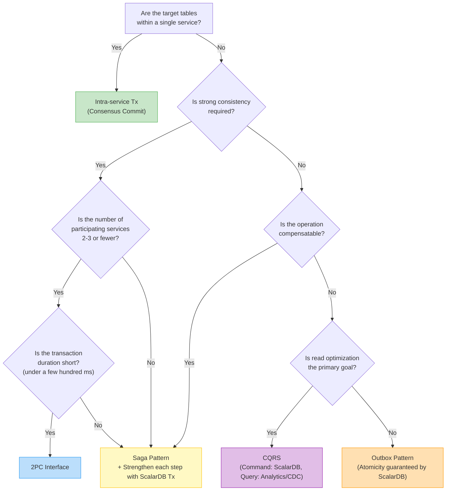
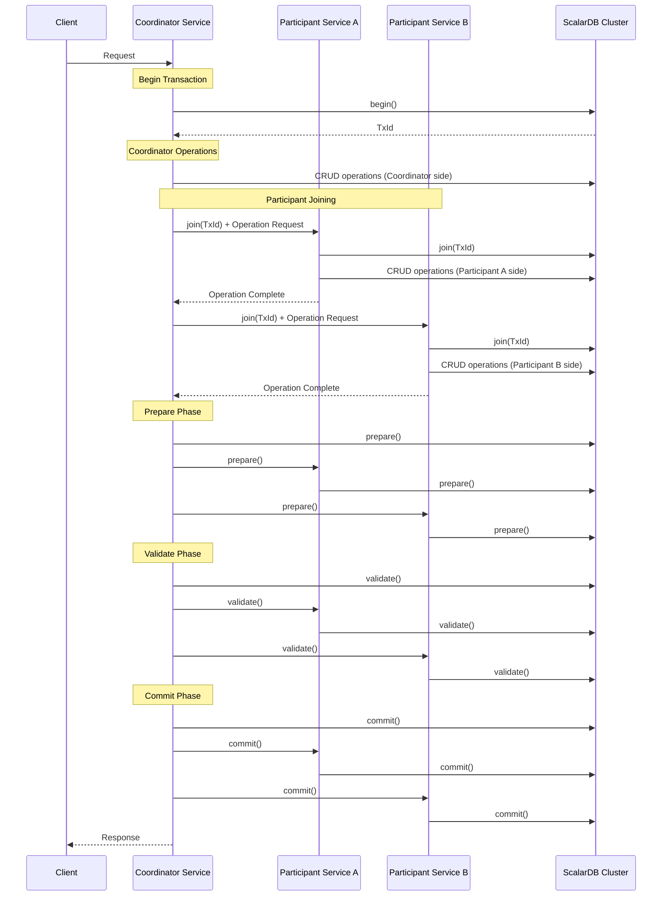
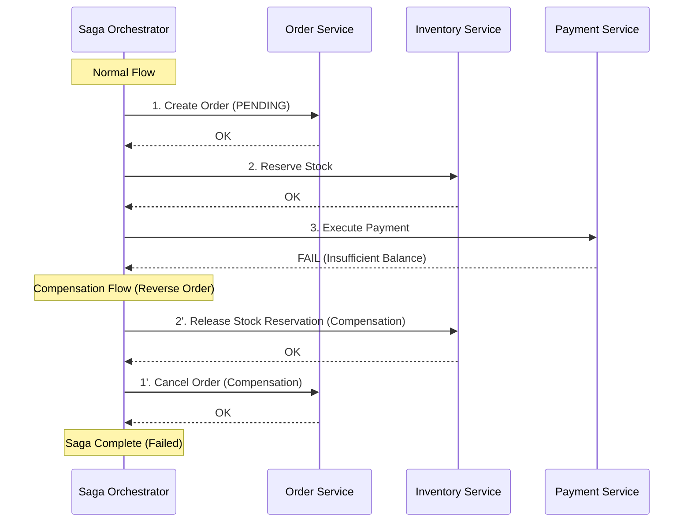
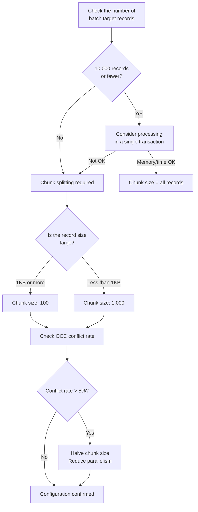
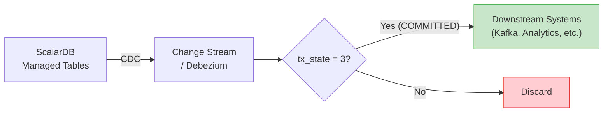

# Phase 2-2: Transaction Design

## Purpose

Determine transaction patterns for each service/function and design transaction boundaries in detail. Based on the data model developed in Step 04 and the transaction boundaries defined in Step 03, apply patterns such as Consensus Commit, 2PC, Saga, CQRS, and Outbox as appropriate, and develop an implementable transaction design that considers performance and scalability.

---

## Inputs

| Input | Source | Description |
|-------|--------|-------------|
| Data Model (Logical/Physical) | Step 04 Deliverables | ScalarDB schema definitions, table list |
| Transaction Boundary Definitions | Step 03 Deliverables | ScalarDB-managed tables, inter-service Tx targets |
| Domain Model | Step 02 Deliverables | Bounded context diagram, aggregate design |

## Reference Materials

| Document | Path | Key Sections |
|----------|------|--------------|
| Transaction Model | `../research/07_transaction_model.md` | Consensus Commit, 2PC Interface, Saga, CQRS, Decision Tree |
| Batch Processing Patterns | `../research/09_batch_processing.md` | Chunk size, Spring Batch/Airflow integration |
| ScalarDB 3.17 Deep Dive | `../research/13_scalardb_317_deep_dive.md` | Batch Operations API, Piggyback Begin, Write Buffering, Group Commit |
| Physical Data Model | `../research/04_physical_data_model.md` | OCC conflict rate modeling |

---

## Steps

### Step 5.1: Transaction Pattern Selection

#### 5.1.1 Pattern List and Characteristics

| Pattern | API | Consistency Level | Latency | Use Case |
|---------|-----|-------------------|---------|----------|
| **Intra-service Tx** | `DistributedTransaction` API | Strong consistency (ACID) | Low | Multi-table operations within a single service |
| **Inter-service Tx (2PC)** | `TwoPhaseCommitTransaction` API | Strong consistency (ACID) | Medium to High | Atomic operations across 2-3 services |
| **Saga** | Application implementation | Eventual consistency | Low (async) | 3+ services, long-running Tx |
| **CQRS** | Command: ScalarDB / Query: Analytics or CDC | Eventual consistency (Query side) | Read: Low | Domains with skewed read/write ratios |
| **Outbox** | ScalarDB + Message Broker | Eventual consistency | Low to Medium | Event-driven architecture |

#### 5.1.2 Isolation Level Selection

ScalarDB supports three isolation levels: **SNAPSHOT** (default), **SERIALIZABLE**, and **READ_COMMITTED**. Select the appropriate isolation level in conjunction with transaction pattern selection.

| Isolation Level | Characteristics | Recommended Scenarios | Configuration Value |
|-----------------|----------------|----------------------|---------------------|
| **SNAPSHOT** (default) | Write Skew Anomaly can occur, but offers high performance | Sufficient for most use cases. Read-heavy workloads or operations where Write Skew is not a concern | `scalar.db.consensus_commit.isolation_level=SNAPSHOT` |
| **SERIALIZABLE** | Guarantees strict serializability. Performs additional read checks via the EXTRA_READ strategy | Transactions requiring strict consistency, such as finance and payments. Operations where balance calculations or inventory accuracy are essential | `scalar.db.consensus_commit.isolation_level=SERIALIZABLE` |
| **READ_COMMITTED** | Provides Read Committed isolation level. Suitable for scenarios where lightweight isolation is sufficient | Read-heavy workloads where strict Snapshot Isolation is unnecessary and performance is prioritized | `scalar.db.consensus_commit.isolation_level=READ_COMMITTED` |

> **Selection Guidelines:**
> - SNAPSHOT is the default and provides sufficient consistency for many use cases.
> - SERIALIZABLE has additional overhead (extra reads via the EXTRA_READ strategy), so choose it only when strict serializability is required.
> - READ_COMMITTED is a lightweight isolation level, suitable for scenarios where Snapshot Isolation-level consistency is unnecessary.
> - The isolation level is a cluster-wide setting for ScalarDB Cluster and cannot be switched on a per-transaction basis. Select based on the strictest requirement within the system.

#### 5.1.3 Pattern Selection Decision Tree

Based on the decision tree from `07_transaction_model.md`, select patterns for each operation using the following flow.



#### 5.1.4 Pattern Assignment Table for Each Operation

Assign patterns to each operation according to the following template.

| # | Operation Name | Target Services | Target Tables | Pattern | Rationale |
|---|----------------|-----------------|---------------|---------|-----------|
| 1 | (Example) Order Confirmation | Order, Inventory, Payment | orders, stocks, accounts | 2PC | Immediate consistency required across 3 services |
| 2 | (Example) Order History Lookup | Order (Query) | orders_read_model | CQRS | 90%+ reads, denormalized for high performance |
| 3 | - | - | - | - | - |

---

### Step 5.2: 2PC Design Details

#### 5.2.1 Determining Coordinator/Participant Services



**Coordinator Selection Criteria:**

| Criterion | Description |
|-----------|-------------|
| **Business process originator** | The service that owns the use case initiating the transaction |
| **Minimize failure impact** | Since Coordinator failure propagates to all Participants, select the most stable service |
| **Network topology** | Place in a position with low latency to Participants |

#### 5.2.2 Transaction Scope Definition

Define the following for each 2PC transaction.

| Definition Item | Description | Constraints / Recommended Values |
|-----------------|-------------|----------------------------------|
| **Number of participating services** | Coordinator + number of Participants | **2-3 services recommended**. Consider Saga for 4 or more |
| **Number of operated tables** | Total number of tables operated within the transaction | Keep to a minimum |
| **Maximum record count** | Total number of records read/written within the transaction | Recommended: tens of records or fewer |
| **Timeout** | Maximum duration for the entire transaction | See timeout design below |

#### 5.2.3 Timeout Design

| Parameter | Configuration Item | Recommended Value | Description |
|-----------|--------------------|-------------------|-------------|
| `scalar.db.consensus_commit.coordinator.timeout_millis` | Coordinator Commit timeout | 60000 (60s) | Timeout for writing to the Coordinator table |
| gRPC client timeout | Participant call timeout | 5000-10000 (5-10s) | gRPC call to each Participant |
| Overall timeout | Entire transaction | 90000 (90s) | Client-side timeout (set larger than Coordinator timeout) |

**Timeout Hierarchy Principle:**
```
Client overall timeout > Coordinator timeout > Sum of individual RPC timeouts
```

#### 5.2.4 Failure Behavior

| Failure Scenario | Phase | Behavior | Recovery |
|------------------|-------|----------|----------|
| Participant failure | During CRUD operations | Coordinator aborts | Client retries |
| Participant failure | After Prepare | Lazy Recovery handles it | ScalarDB auto-recovery |
| Coordinator failure | Before Prepare | Records on each Participant remain in pending state | Abort via Lazy Recovery |
| Coordinator failure | After Commit | Even if Participants are uncommitted, recovery occurs on next access | Lazy Recovery |
| Network partition | Any | Abort after timeout | Client retries |

> **Lazy Recovery**: When ScalarDB encounters records in pending or prepared state on next access, it checks the Coordinator table state and automatically commits or aborts. No explicit recovery process is required.

---

### Step 5.3: Saga Pattern Detailed Design (If Needed)

#### 5.3.1 Compensating Transaction Design

Define the normal operation and compensating operation as a pair for each Saga step.

| Step | Service | Normal Operation | Compensating Operation | Compensation Idempotency |
|------|---------|-----------------|----------------------|--------------------------|
| 1 | Order | Create order (PENDING) | Cancel order (CANCELLED) | Duplicate check by order_id |
| 2 | Inventory | Reserve stock | Release stock reservation | Duplicate check by reservation_id |
| 3 | Payment | Execute payment | Process refund | Duplicate check by payment_id |
| 4 | Order | Confirm order (CONFIRMED) | (Consolidated with Step 1 compensation) | - |



#### 5.3.2 Choreography vs Orchestration Selection

| Comparison Item | Choreography | Orchestration |
|-----------------|-------------|---------------|
| **Control method** | Event-driven, each service determines the next step | Central orchestrator controls |
| **Coupling** | Low (via events only) | Dependency on orchestrator |
| **Visibility** | Low (difficult to grasp the entire flow) | High (flow defined in orchestrator) |
| **Error handling** | Individually implemented in each service | Centrally managed in orchestrator |
| **Recommended step count** | 2-3 steps | 4+ steps |
| **Recommended scenarios** | Simple flows, emphasis on team independence | Complex flows, many compensation logic |

**Strengthening Each Step with ScalarDB:**

Use ScalarDB Consensus Commit local transactions within each Saga step to guarantee ACID for intra-step operations.

```java
// Guarantee atomicity within each Saga step using ScalarDB Tx
DistributedTransaction tx = transactionManager.start();
try {
    // Atomically execute status table update and business data update
    tx.put(/* saga_status update: step=2, status=COMPLETED */);
    tx.put(/* inventory.stocks update: increase reserved_quantity */);
    tx.commit();
} catch (Exception e) {
    tx.abort();
    // Trigger Saga compensation
}
```

---

### Step 5.4: Batch Processing Transaction Design

#### 5.4.1 Chunk Size Determination

Refer to `09_batch_processing.md` to determine batch processing chunk sizes.

| Parameter | Recommended Value | Rationale |
|-----------|-------------------|-----------|
| **Chunk size** | 100-1,000 records/chunk | Balance between memory management and transaction scope |
| **Parallelism** | 2-4 threads | Trade-off between ScalarDB Cluster load and OCC conflicts |
| **Retry count** | 3-5 times | Exponential backoff retry on OCC conflicts |
| **Backoff interval** | Initial 100ms, max 5s | Gradually increase wait time when conflicts are frequent |

**Chunk Size Determination Flow:**



#### 5.4.2 Spring Batch / Airflow Integration Patterns

| Framework | Integration Method | Transaction Control |
|-----------|-------------------|---------------------|
| **Spring Batch** | Use ScalarDB Tx in ChunkOrientedTasklet | commit/abort within ItemWriter |
| **Airflow** | Call ScalarDB gRPC API from PythonOperator | Chunk processing per task |
| **Custom** | Chunk processing in custom loop | try-catch-retry pattern |

#### 5.4.3 Batch Operations API Usage (ScalarDB 3.17)

Leverage the Batch Operations API from `13_scalardb_317_deep_dive.md` to execute multiple operations within a chunk in a single RPC.

```java
// Efficient chunk processing using Batch Operations API
DistributedTransaction tx = transactionManager.start();
try {
    List<Operation> operations = new ArrayList<>();
    for (Record record : chunk) {
        operations.add(Upsert.newBuilder()
            .namespace("billing_service")
            .table("invoices")
            .partitionKey(Key.ofText("invoice_id", record.getInvoiceId()))
            .intValue("amount", record.getAmount())
            .textValue("status", "GENERATED")
            .build());
    }
    // Send all operations in a single RPC
    tx.batch(operations);
    tx.commit();
} catch (Exception e) {
    tx.abort();
    // Retry logic
}
```

---

### Step 5.5: Performance Optimization Design

#### 5.5.1 Piggyback Begin / Write Buffering Application Decision

Evaluate the optimization features from `13_scalardb_317_deep_dive.md` and determine applicability.

| Optimization | Effect | Application Conditions | Configuration |
|-------------|--------|----------------------|---------------|
| **Piggyback Begin** | Eliminates one RPC round-trip for transaction start | When using ScalarDB Cluster (OFF by default; requires explicit setting `scalar.db.cluster.client.piggyback_begin.enabled=true`) | `scalar.db.cluster.client.piggyback_begin.enabled=true` |
| **Write Buffering** | Buffers unconditional writes (insert, upsert, unconditional put/update/delete) on the client and sends them in bulk at Read time or Commit time. Conditional mutations (updateIf, deleteIf, etc.) are not buffered | Write-heavy workloads | `scalar.db.cluster.client.write_buffering.enabled=true` |
| **Batch Operations** | Consolidates multiple operations into 1 RPC | Independent multiple operations executed within the same Tx | API usage (no configuration needed) |

**Write Buffering Usage Notes:**

| Note | Description |
|------|-------------|
| Only unconditional writes are targeted | Only insert, upsert, unconditional put/update/delete are buffered. Conditional mutations (updateIf, deleteIf, etc.) are sent to the server immediately |
| Read after Write returns stale values | Data is not written to the DB until the buffer is flushed |
| Errors are aggregated at Prepare time | Errors are not detected at individual Write time |
| Memory usage | Client memory is required depending on buffer size |

#### 5.5.2 Group Commit Configuration

| Parameter | Configuration Item | Recommended Value | Description |
|-----------|--------------------|-------------------|-------------|
| `scalar.db.consensus_commit.coordinator.group_commit.enabled` | Enable Group Commit | `true` | Groups commits of multiple Tx for batch writing |
| `scalar.db.consensus_commit.coordinator.group_commit.slot_capacity` | Slot capacity | 20-40 | Number of Tx waiting concurrently |
| `scalar.db.consensus_commit.coordinator.group_commit.group_size_fix_timeout_millis` | Group size fix timeout | 40 | Wait time until group size is fixed |
| `scalar.db.consensus_commit.coordinator.group_commit.delayed_slot_move_timeout_millis` | Delayed slot move timeout | 800 | Timeout for moving delayed slots |

> **Constraint**: Group Commit cannot be used together with 2PC Interface. Do not enable Group Commit for services that use 2PC transactions (explicitly stated in official documentation).

#### 5.5.3 OCC Conflict Rate Modeling

Use the conflict rate formula from `04_physical_data_model.md` to estimate OCC conflict rates under expected workloads.

**Conflict Rate Approximation Formula:**

```
P(conflict) ≈ 1 - (1 - 1/N)^(T * R)

  N = Number of records that can be accessed concurrently (≈ number of partitions x records per partition)
  T = Number of concurrent transactions
  R = Number of records read/written per transaction
```

> *Note: The approximation formula in this workflow is for rough estimation. Also refer to the formula `P(conflict) ≈ 1 - (1 - k/N)^(C-1)` in Section 6 of `../research/04_physical_data_model.md`.*

**Estimation Template:**

| Operation | N (Target Record Count) | T (Concurrent Tx Count) | R (Operated Record Count) | Estimated Conflict Rate | Evaluation |
|-----------|------------------------|------------------------|--------------------------|------------------------|------------|
| Order confirmation | 100,000 | 100 | 5 | Approx. 0.5% | OK |
| Stock reservation (popular item) | 10 | 50 | 1 | Approx. 99.5% | NG: Bucketing required |
| Balance update | 1,000,000 | 200 | 2 | Approx. 0.04% | OK |

> **Guideline**: If the conflict rate is 5% or higher, consider reviewing the Partition Key design (bucketing), reducing transaction scope, or switching to the Saga pattern.

---

### Step 5.6: CDC Metadata Handling Design

#### 5.6.1 tx_state Filtering Design

In ScalarDB's Consensus Commit, a `tx_state` metadata column is appended to each record. When propagating data downstream via CDC, only committed data should be forwarded.

| tx_state Value | Meaning | CDC Handling |
|---------------|---------|--------------|
| 1 | PREPARED | **Filter out (exclude)** |
| 2 | DELETED | **Filter out (exclude)** |
| 3 | COMMITTED | **Propagate downstream** |
| 4 | ABORTED | **Filter out (exclude)** |

**CDC Pipeline Design:**



#### 5.6.2 CDC Configuration When Using Transaction Metadata Decoupling

> **Note**: Transaction Metadata Decoupling is a **Private Preview** feature and only supports JDBC connections. Prior contact with Scalar Labs is required for use.

When using ScalarDB 3.17's Transaction Metadata Decoupling, metadata is separated into a different table, so CDC configuration differs.

| Configuration Item | Conventional Method | Metadata Decoupling Method |
|-------------------|--------------------|-----------------------------|
| **CDC source table** | Main table (including metadata) | Main table (no metadata) |
| **tx_state filter** | Required (propagate only tx_state=3) | Not required (no tx_state in main table) |
| **Commit confirmation method** | Determined by tx_state column | Determined by referencing metadata table |
| **CDC complexity** | Medium (filtering logic required) | High (2-table join required) or Low (direct use without filter) |
| **Recommendation** | Ensure tx_state filter is properly configured | Use Debezium etc. to trigger on COMMITTED events from the metadata table |

> **Note**: When using Transaction Metadata Decoupling, uncommitted data may be temporarily visible in the main table. Incorporate logic to verify consistency with the metadata table when designing the CDC pipeline.

---

## Deliverables

| Deliverable | Format | Content |
|-------------|--------|---------|
| **Transaction Design Document** | Design document | Pattern assignment table, 2PC design, Saga design, timeout design |
| **Performance Estimates** | Calculation sheet | OCC conflict rate modeling, latency estimates |
| **Batch Processing Design Document** | Design document | Chunk size, parallelism, retry design |
| **CDC Design Document** | Design document | tx_state filtering configuration, downstream system integration design |
| **Optimization Configuration List** | Configuration file | Configuration values for Group Commit, Piggyback Begin, Write Buffering, etc. |

---

## Completion Criteria Checklist

### Transaction Pattern Selection

- [ ] A transaction pattern has been assigned to all operations (use cases)
- [ ] Pattern selection rationale is recorded based on the decision tree
- [ ] Operations requiring strong consistency are clearly identified
- [ ] Operations where eventual consistency is acceptable and consistency windows are defined

### 2PC Design

- [ ] Coordinator/Participant roles are determined for all 2PC transactions
- [ ] Number of participating services is within 2-3 (change to Saga has been considered if exceeded)
- [ ] Transaction scope (operated tables, maximum record count) is defined
- [ ] Timeout values are set hierarchically
- [ ] Recovery methods are defined for each failure scenario
- [ ] Dependency on Lazy Recovery has been evaluated

### Saga Design (If Applicable)

- [ ] Normal operations and compensating operations are defined as pairs for all Saga steps
- [ ] Idempotency of compensating operations is guaranteed
- [ ] Rationale for Choreography/Orchestration selection is recorded
- [ ] Atomicity within each step is guaranteed by ScalarDB Tx
- [ ] Saga status management table is designed

### Batch Processing

- [ ] Chunk size is determined
- [ ] Parallelism and retry strategy are defined
- [ ] Need for Batch Operations API usage has been determined
- [ ] Integration method with Spring Batch/Airflow etc. is defined

### Performance

- [ ] OCC conflict rate is within 5% for all major operations
- [ ] Applicability of Piggyback Begin/Write Buffering has been determined
- [ ] Group Commit configuration values are determined
- [ ] Latency requirements are expected to be met for all operations

### CDC

- [ ] tx_state filtering is designed for all CDC pipelines
- [ ] CDC configuration when using Transaction Metadata Decoupling is defined
- [ ] It is guaranteed that only committed data is propagated downstream
