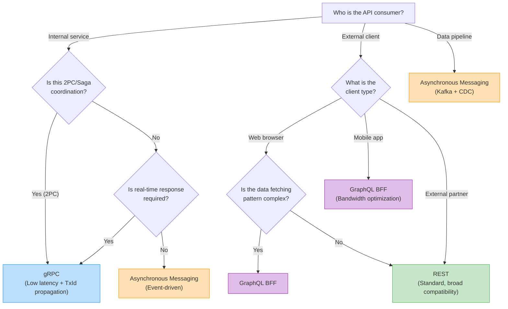
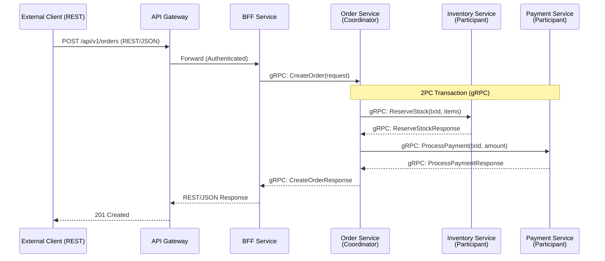
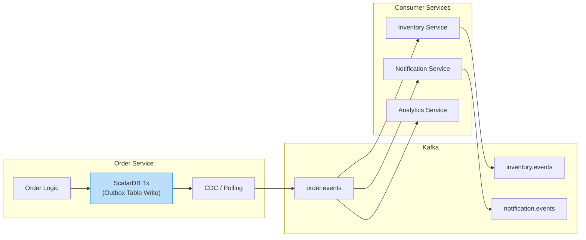
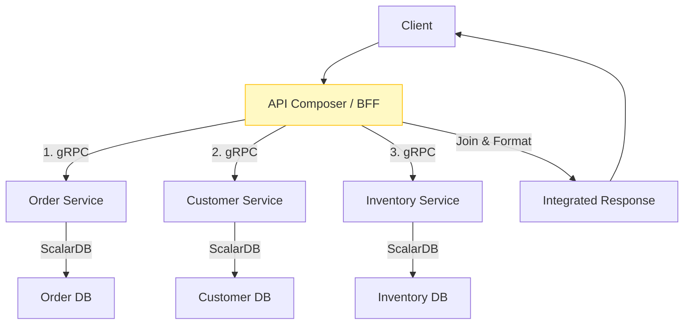
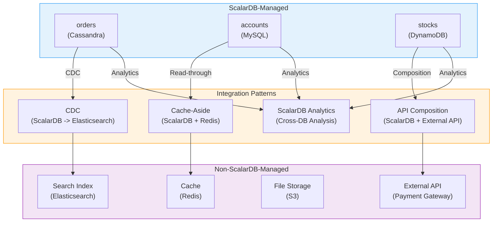
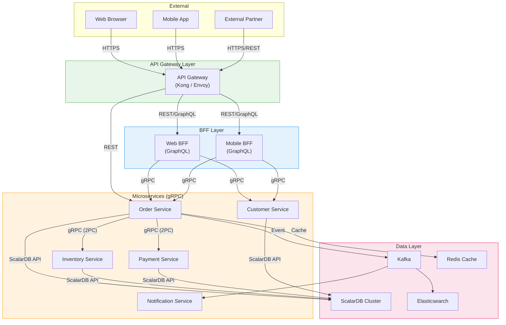

# Phase 2-3: API and Interface Design

## Purpose

Design API specifications and data access patterns for inter-microservice communication. Based on the transaction design developed in Step 05 and the domain model from Step 02, determine inter-service communication methods (gRPC, REST, asynchronous messaging, etc.) and concretize API specifications including access patterns for ScalarDB-managed data.

---

## Inputs

| Input | Source | Description |
|-------|--------|-------------|
| Transaction Design | Step 05 Deliverables | Pattern assignment table, 2PC/Saga design, CDC design |
| Domain Model | Step 02 Deliverables | Bounded context diagram, aggregate design |
| Data Model | Step 04 Deliverables | ScalarDB schema definitions, table list |

## Reference Materials

| Document | Path | Key Sections |
|----------|------|--------------|
| Transparent Data Access | `../research/08_transparent_data_access.md` | ScalarDB Analytics, CDC, Hybrid Patterns |
| Microservice Architecture | `../research/01_microservice_architecture.md` | Inter-service Communication, API Design Principles, BFF Pattern |
| Transaction Model | `../research/07_transaction_model.md` | 2PC Interface, Saga Pattern, Outbox Pattern (2PC coordination design, inter-service transaction patterns) |

---

## Steps

### Step 6.1: API Type Determination

#### 6.1.1 Communication Method Comparison

| Communication Method | Protocol | Latency | Type Safety | Use Case |
|---------------------|----------|---------|-------------|----------|
| **gRPC** | HTTP/2 + Protocol Buffers | Low | High (IDL definition) | Synchronous inter-service communication, 2PC coordination |
| **REST** | HTTP/1.1 or HTTP/2 + JSON | Medium | Medium (OpenAPI) | Externally exposed APIs, web client-facing |
| **GraphQL** | HTTP + JSON | Medium | High (Schema definition) | BFF, flexible data fetching for frontend |
| **Asynchronous Messaging** | Kafka / NATS / RabbitMQ | - (async) | Medium (Avro/Protobuf) | Event-driven, inter-step communication in Saga |
| **ScalarDB SQL API** | JDBC-compatible | Low | High | Data access in SQL format |
| **ScalarDB gRPC API** | gRPC | Low | High | Access from non-Java clients |

#### 6.1.2 API Type Selection Decision Tree



#### 6.1.3 ScalarDB API Usage Guide

| ScalarDB API | Purpose | Selection Criteria |
|-------------|---------|-------------------|
| **CRUD API (Java)** | Direct access from within a service | Java services requiring fine-grained control |
| **SQL API (JDBC)** | SQL-based access | Leveraging existing SQL skills, complex queries |
| **gRPC API** | Access from non-Java clients | Go, Python, and other non-Java services |
| **Via ScalarDB Cluster** | Recommended configuration for production | Cluster management, load balancing, routing |

---

### Step 6.2: Inter-Service Communication Pattern Design

#### 6.2.1 Synchronous Communication: gRPC Calls During 2PC Coordination

Design communication between Coordinator and Participants in 2PC transactions.



**gRPC Service Definition Example:**

```protobuf
// gRPC definition for 2PC coordination
service InventoryService {
    // Stock reservation as a 2PC Participant
    rpc ReserveStock(ReserveStockRequest) returns (ReserveStockResponse);
    // 2PC Prepare
    rpc PrepareTransaction(PrepareRequest) returns (PrepareResponse);
    // 2PC Validate
    rpc ValidateTransaction(ValidateRequest) returns (ValidateResponse);
    // 2PC Commit
    rpc CommitTransaction(CommitRequest) returns (CommitResponse);
    // 2PC Abort
    rpc AbortTransaction(AbortRequest) returns (AbortResponse);
}

message ReserveStockRequest {
    string transaction_id = 1;  // ScalarDB TxId
    repeated StockReservation reservations = 2;
}

message StockReservation {
    string item_id = 1;
    string warehouse_id = 2;
    int32 quantity = 3;
}
```

#### 6.2.2 Asynchronous Communication: Domain Event Propagation



**Event Schema Design:**

| Field | Type | Description |
|-------|------|-------------|
| `event_id` | string (UUID) | Unique identifier for the event |
| `event_type` | string | Event type (e.g., `OrderCreated`, `OrderConfirmed`) |
| `aggregate_id` | string | ID of the aggregate root |
| `aggregate_type` | string | Type name of the aggregate |
| `payload` | JSON/Protobuf | Event data body |
| `metadata.timestamp` | long | Event occurrence timestamp |
| `metadata.correlation_id` | string | Request tracking ID |
| `metadata.causation_id` | string | Causation event ID |

#### 6.2.3 API Composition Pattern

Design of the API Composition pattern that integrates and returns data from multiple services.



**API Composition Design Template:**

| Composition API | Target Services | Parallelizable | Timeout | Fallback |
|----------------|-----------------|----------------|---------|----------|
| GET /orders/{id}/detail | Order, Customer, Inventory | Order -> (Customer, Inventory in parallel) | 3s | Return basic info only when Customer is unavailable |
| GET /dashboard | Order, Payment, Analytics | All parallel | 5s | Independent fallback per service |

#### 6.2.4 BFF Pattern (Web/Mobile Variants)

| BFF | Target Client | Technology | Optimization Focus |
|-----|---------------|------------|-------------------|
| **Web BFF** | Web browser | GraphQL / REST | Page-level data aggregation, SSR support |
| **Mobile BFF** | iOS/Android | GraphQL / REST | Bandwidth optimization, offline support, push notification integration |
| **Admin BFF** | Admin panel | REST | Bulk operations, CSV export, dashboard aggregation |

---

### Step 6.3: Data Access Pattern Design

#### 6.3.1 Access to ScalarDB-Managed Data

| Access Pattern | Method | Purpose |
|---------------|--------|---------|
| **Intra-service CRUD** | ScalarDB CRUD API / SQL API | Own service data operations |
| **Inter-service reads** | Via gRPC API (query to data owner service) | Reference to other service data |
| **Inter-service writes** | Via 2PC Interface | Data updates across multiple services |
| **Analytical queries** | ScalarDB Analytics (Spark / PostgreSQL) | Cross-service analytics and reporting |

#### 6.3.2 Integration with Non-ScalarDB-Managed Data

Refer to `08_transparent_data_access.md` to design integration patterns with non-ScalarDB-managed data.



| Integration Pattern | Target | Data Flow | Consistency |
|--------------------|--------|-----------|-------------|
| **CDC** | Search index, analytics DB | ScalarDB -> Kafka -> Elasticsearch, etc. | Eventual consistency (seconds to minutes) |
| **Cache-Aside** | Cache | App -> Redis (read from ScalarDB on miss) | TTL-based eventual consistency |
| **API Composition** | External services | App -> ScalarDB + External API -> Join | Request-time consistency |
| **ScalarDB Analytics** | Analytics and reporting | Direct analytical queries on ScalarDB-managed data | Snapshot consistency |
| **Outbox + CDC** | Event-driven | Write to Outbox within ScalarDB Tx -> CDC -> Kafka | ACID within Outbox, eventual consistency downstream |

#### 6.3.3 Hybrid Patterns

Hybrid patterns combining ScalarDB-managed and non-managed data.

| Pattern | Description | Implementation Method |
|---------|-------------|----------------------|
| **Write: ScalarDB / Read: Elasticsearch** | ACID writes + full-text search | Sync to Elasticsearch via CDC |
| **Write: ScalarDB / Read: Redis Cache** | ACID writes + low-latency reads | Cache-Aside or Write-Through |
| **Write: ScalarDB / Analytics: Spark** | ACID writes + batch analytics | ScalarDB Analytics with Spark |
| **Command: ScalarDB / Query: PostgreSQL** | CQRS pattern | Sync to read model via CDC |

#### 6.3.4 Positioning in Data Mesh

| Data Mesh Principle | ScalarDB-Related Design Guideline |
|--------------------|------------------------------------|
| **Domain Ownership** | Each microservice owns and manages its own domain's ScalarDB tables |
| **Data as a Product** | Expose service APIs as data products (gRPC/REST) |
| **Self-Service Platform** | Provide ScalarDB Cluster as a self-service data platform |
| **Federated Governance** | Standardize namespace naming conventions and schema compatibility rules across all teams |

---

### Step 6.4: API Specification Definition

#### 6.4.1 Endpoint List Template

| # | Method | Path | Service | Description | Authentication | Rate Limit |
|---|--------|------|---------|-------------|----------------|------------|
| 1 | POST | /api/v1/orders | Order | Create order | Bearer Token | 100 req/s |
| 2 | GET | /api/v1/orders/{id} | Order | Get order details | Bearer Token | 500 req/s |
| 3 | POST | /api/v1/orders/{id}/confirm | Order | Confirm order (triggers 2PC) | Bearer Token | 50 req/s |
| 4 | GET | /api/v1/orders?customer_id={id} | Order (BFF) | List customer orders | Bearer Token | 200 req/s |

#### 6.4.2 Request/Response Definition Template

```json
// POST /api/v1/orders - Request
{
    "customer_id": "cust-001",
    "items": [
        {
            "item_id": "item-001",
            "quantity": 2
        }
    ],
    "payment_method": "credit_card",
    "idempotency_key": "req-uuid-001"
}

// POST /api/v1/orders - Response (201 Created)
{
    "order_id": "ord-001",
    "status": "PENDING",
    "total_amount": 5000,
    "created_at": "2026-02-17T10:00:00Z",
    "links": {
        "self": "/api/v1/orders/ord-001",
        "confirm": "/api/v1/orders/ord-001/confirm"
    }
}
```

#### 6.4.3 Error Handling (Mapping ScalarDB Transaction Exceptions)

Map ScalarDB internal exceptions to HTTP status codes and gRPC status codes.

| ScalarDB Exception | Cause | HTTP Status | gRPC Status | Client Action |
|-------------------|-------|-------------|-------------|---------------|
| `CrudConflictException` | OCC conflict | 409 Conflict | ABORTED | Retry (exponential backoff) |
| `CommitConflictException` | OCC conflict at Commit | 409 Conflict | ABORTED | Retry (exponential backoff) |
| `UncommittedRecordException` | Pending record from previous Tx | 503 Service Unavailable | UNAVAILABLE | Retry (after short wait) |
| `PreparationConflictException` | Conflict at 2PC Prepare | 409 Conflict | ABORTED | Retry |
| `ValidationConflictException` | Conflict at 2PC Validation | 409 Conflict | ABORTED | Retry |
| `CommitException` (unknown error) | Commit result unknown | 500 Internal Server Error | INTERNAL | Verify transaction state then retry |
| `TransactionNotFoundException` | Transaction ID not found (occurs during 2PC join) | 404 Not Found | NOT_FOUND | Verify transaction ID and resend |
| `TransactionConflictException` | Generic transaction conflict | 409 Conflict | ABORTED | Retry (exponential backoff) |
| `UnsatisfiedConditionException` | Condition not met for conditional operation | 412 Precondition Failed | FAILED_PRECONDITION | Verify condition and resend |

**Error Response Format:**

```json
{
    "error": {
        "code": "TRANSACTION_CONFLICT",
        "message": "The operation conflicted with another transaction. Please retry.",
        "details": {
            "retry_after_ms": 100,
            "max_retries": 5
        },
        "request_id": "req-uuid-001",
        "timestamp": "2026-02-17T10:00:00Z"
    }
}
```

#### 6.4.4 Retry Strategy

| Error Type | Retryable | Strategy | Max Retries | Initial Wait | Max Wait |
|-----------|-----------|----------|-------------|--------------|----------|
| OCC conflict (409) | Yes | Exponential backoff + jitter | 5 | 100ms | 5s |
| Transient failure (503) | Yes | Fixed interval | 3 | 500ms | 500ms |
| Unknown commit (500) | Conditional | Safe retry with idempotency key | 3 | 1s | 10s |
| Validation error (400) | No | - | - | - | - |
| Authentication error (401/403) | No | - | - | - | - |

**Exponential Backoff + Jitter Implementation Guidelines:**

```
wait_time = min(max_wait, initial_wait * 2^(attempt - 1)) + random(0, jitter)
jitter = wait_time * 0.1  // 10% random jitter
```

---

### Step 6.5: API Gateway Design

#### 6.5.1 API Gateway Functional Requirements

| Feature | Description | Priority |
|---------|-------------|----------|
| **Routing** | Path-based, header-based service routing | Required |
| **Authentication** | JWT verification, OAuth2/OIDC integration | Required |
| **Rate Limiting** | Per service, per endpoint, per user | Required |
| **Load Balancing** | Load balancing to service instances | Required |
| **Circuit Breaker** | Request blocking to failed services | Recommended |
| **Request Logging** | Access logs, audit logs | Required |
| **CORS** | Cross-origin request control | Required for Web APIs |
| **TLS Termination** | HTTPS to HTTP conversion | Required |
| **Request Transformation** | Header addition, path rewriting | Recommended |
| **Health Check** | Backend service health verification | Required |

#### 6.5.2 API Gateway Selection

| Product | Features | Use Case |
|---------|----------|----------|
| **Kong** | Plugin ecosystem, declarative configuration | General purpose, emphasis on plugin extensibility |
| **Envoy + Istio** | Service mesh integration, L7 proxy | Kubernetes environments, mTLS required |
| **AWS API Gateway** | Managed service, Lambda integration | AWS environments, serverless architecture |
| **NGINX / OpenResty** | High performance, Lua extension | High throughput requirements |
| **Traefik** | Auto-discovery, K8s Ingress | Small to medium scale, simple configuration |

#### 6.5.3 Overall Communication Architecture



---

## Deliverables

| Deliverable | Format | Content |
|-------------|--------|---------|
| **API Specification** | OpenAPI 3.0 (REST) / Protobuf (gRPC) / GraphQL Schema | Endpoint definitions, request/response, error codes |
| **Inter-Service Communication Design Document** | Design document + Mermaid diagrams | Synchronous/asynchronous communication patterns, 2PC coordination, event design |
| **Data Access Pattern Definition** | Design document | Access methods for ScalarDB-managed/non-managed data, integration patterns |
| **API Gateway Configuration** | Configuration file (Kong declarative config, etc.) | Routing, authentication, rate limiting configuration |
| **Error Handling Specification** | Design document | ScalarDB exception mapping, retry strategy |
| **Event Schema Definition** | Avro / Protobuf / JSON Schema | Domain event schema definitions |

---

## Completion Criteria Checklist

### API Types and Communication Methods

- [ ] Communication methods (gRPC/REST/async) are determined for all inter-service communication
- [ ] Communication methods for externally exposed APIs are determined
- [ ] Need for BFF configuration has been evaluated
- [ ] ScalarDB API usage (CRUD/SQL/gRPC) is determined

### Inter-Service Communication

- [ ] gRPC service definitions for 2PC transactions are complete
- [ ] TxId propagation method is defined (gRPC metadata, etc.)
- [ ] Event schemas for asynchronous communication are defined
- [ ] Outbox pattern implementation method is defined (if applicable)
- [ ] API Composition targets and parallelization are defined

### Data Access Patterns

- [ ] Access patterns for ScalarDB-managed data are defined for all operations
- [ ] Integration patterns with non-ScalarDB-managed data are designed
- [ ] CDC data sync destinations and sync methods are defined
- [ ] Cache strategy (Cache-Aside, etc.) is designed (if applicable)

### API Specifications

- [ ] HTTP methods, paths, request/response are defined for all endpoints
- [ ] ScalarDB exception HTTP/gRPC status code mapping is defined
- [ ] Retry strategy (exponential backoff, max retries, idempotency keys) is defined
- [ ] Error response JSON format is standardized
- [ ] API versioning strategy is defined

### API Gateway

- [ ] API Gateway product is selected
- [ ] Routing rules are defined
- [ ] Authentication method (JWT verification, OAuth2, etc.) is configured
- [ ] Rate limiting is configured per endpoint
- [ ] Circuit breaker thresholds are configured

### Non-Functional Requirements

- [ ] Latency requirements are defined for each API
- [ ] Throughput requirements are defined for each API
- [ ] API Composition timeouts and fallbacks are designed
- [ ] CORS policy is defined (Web APIs)
