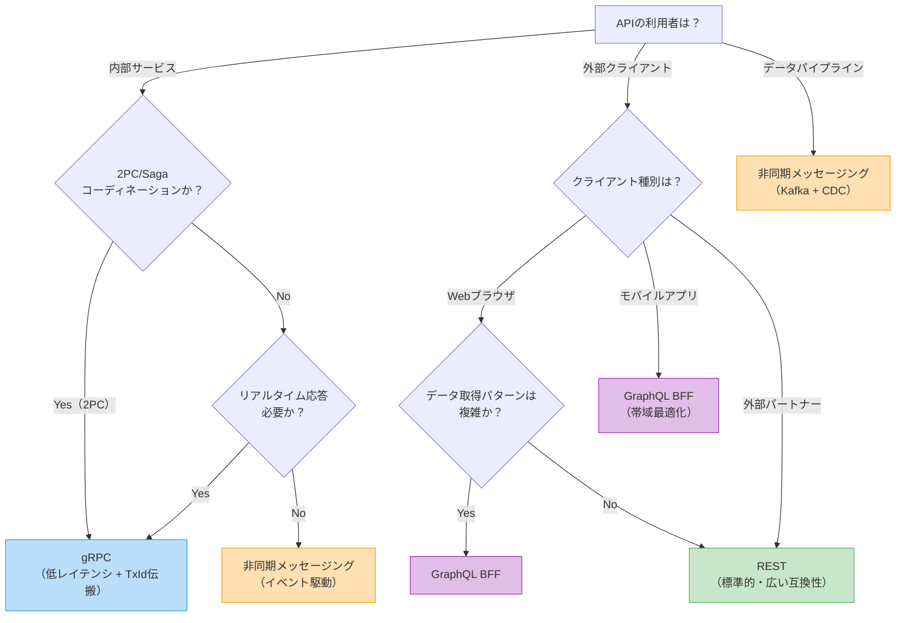
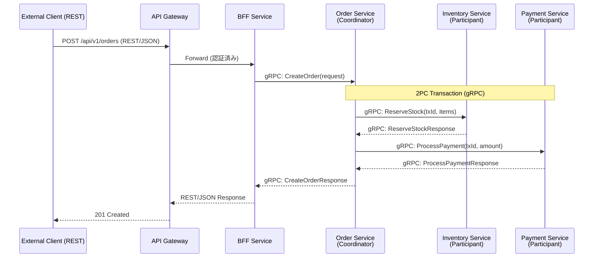
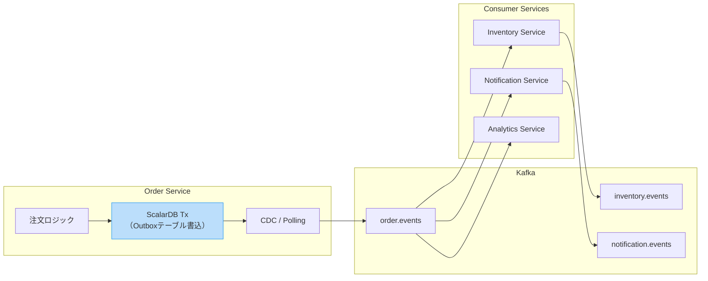
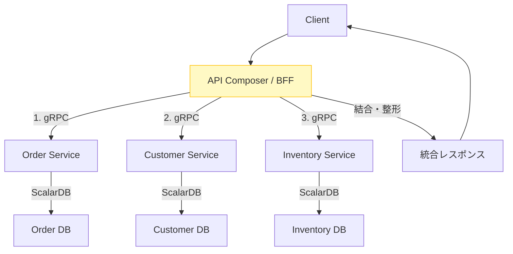
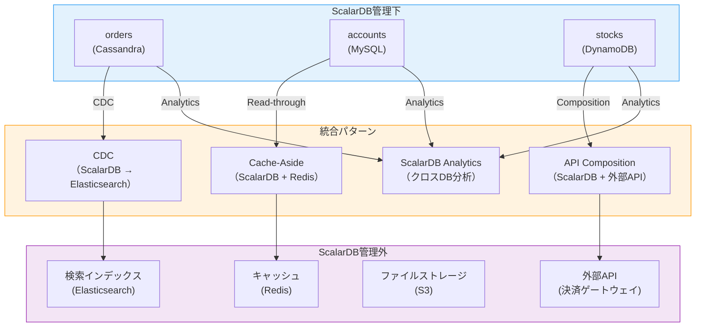
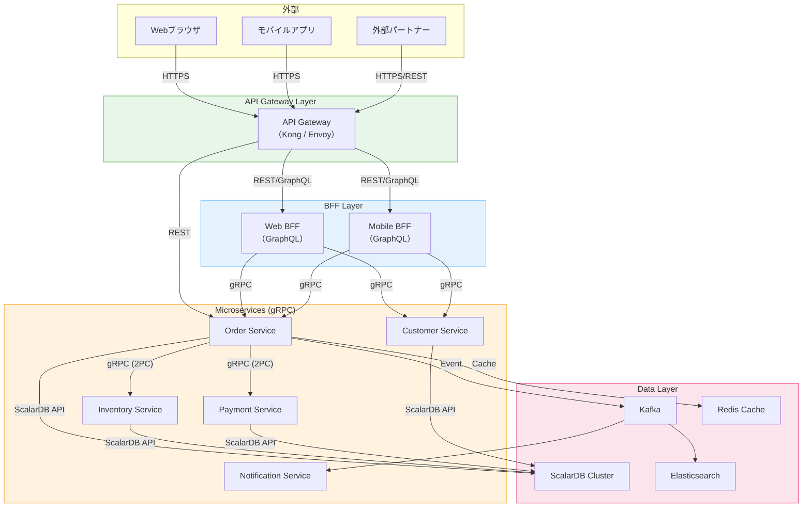

# Phase 2-3: API・インターフェース設計

## 目的

マイクロサービス間のAPI仕様とデータアクセスパターンを設計する。Step 05で策定したトランザクション設計とStep 02のドメインモデルを基に、サービス間通信の方式（gRPC、REST、非同期メッセージング等）を決定し、ScalarDB管理データへのアクセスパターンを含むAPI仕様を具体化する。

---

## 入力

| 入力 | ソース | 説明 |
|------|--------|------|
| トランザクション設計 | Step 05 成果物 | パターン割当表、2PC/Saga設計、CDC設計 |
| ドメインモデル | Step 02 成果物 | 境界コンテキスト図、集約設計 |
| データモデル | Step 04 成果物 | ScalarDBスキーマ定義、テーブル一覧 |

## 参照資料

| 資料 | パス | 主な参照セクション |
|------|------|-------------------|
| 透過的データアクセス | `../research/08_transparent_data_access.md` | ScalarDB Analytics、CDC、ハイブリッドパターン |
| マイクロサービスアーキテクチャ | `../research/01_microservice_architecture.md` | サービス間通信、API設計原則、BFFパターン |
| トランザクションモデル | `../research/07_transaction_model.md` | 2PC Interface, Sagaパターン, Outboxパターン（2PCコーディネーション設計、サービス間トランザクションパターン） |

---

## ステップ

### Step 6.1: API種別の決定

#### 6.1.1 通信方式の比較

| 通信方式 | プロトコル | レイテンシ | 型安全性 | 適用場面 |
|---------|----------|-----------|---------|---------|
| **gRPC** | HTTP/2 + Protocol Buffers | 低 | 高（IDL定義） | サービス間の同期通信、2PCコーディネーション |
| **REST** | HTTP/1.1 or HTTP/2 + JSON | 中 | 中（OpenAPI） | 外部公開API、Webクライアント向け |
| **GraphQL** | HTTP + JSON | 中 | 高（Schema定義） | BFF、フロントエンド向け柔軟なデータ取得 |
| **非同期メッセージング** | Kafka / NATS / RabbitMQ | -（非同期） | 中（Avro/Protobuf） | イベント駆動、Sagaのステップ間通信 |
| **ScalarDB SQL API** | JDBC互換 | 低 | 高 | SQL形式でのデータアクセス |
| **ScalarDB gRPC API** | gRPC | 低 | 高 | 非Javaクライアントからのアクセス |

#### 6.1.2 API種別選定デシジョンツリー



#### 6.1.3 ScalarDB API使い分け

| ScalarDB API | 用途 | 選定基準 |
|-------------|------|---------|
| **CRUD API（Java）** | サービス内からの直接アクセス | Javaサービスで細粒度制御が必要 |
| **SQL API（JDBC）** | SQL形式でのアクセス | 既存SQLスキルの活用、複雑なクエリ |
| **gRPC API** | 非Javaクライアントからのアクセス | Go、Python等の非Javaサービス |
| **ScalarDB Cluster経由** | 本番環境での推奨構成 | クラスタ管理、負荷分散、ルーティング |

---

### Step 6.2: サービス間通信パターンの設計

#### 6.2.1 同期通信: 2PCコーディネーション時のgRPC呼び出し

2PCトランザクションにおけるCoordinator-Participant間の通信を設計する。



**gRPC Service定義例:**

```protobuf
// 2PCコーディネーション用のgRPC定義
service InventoryService {
    // 2PC Participantとしての在庫引当
    rpc ReserveStock(ReserveStockRequest) returns (ReserveStockResponse);
    // 2PC Prepare
    rpc PrepareTransaction(PrepareRequest) returns (PrepareResponse);
    // 2PC Validate
    rpc ValidateTransaction(ValidateRequest) returns (ValidateResponse);
    // 2PC Commit
    rpc CommitTransaction(CommitRequest) returns (CommitResponse);
    // 2PC Abort
    rpc AbortTransaction(AbortRequest) returns (AbortResponse);
}

message ReserveStockRequest {
    string transaction_id = 1;  // ScalarDB TxId
    repeated StockReservation reservations = 2;
}

message StockReservation {
    string item_id = 1;
    string warehouse_id = 2;
    int32 quantity = 3;
}
```

#### 6.2.2 非同期通信: ドメインイベント伝搬



**イベントスキーマ設計:**

| フィールド | 型 | 説明 |
|-----------|-----|------|
| `event_id` | string (UUID) | イベントの一意識別子 |
| `event_type` | string | イベント種別（例: `OrderCreated`, `OrderConfirmed`） |
| `aggregate_id` | string | 集約ルートのID |
| `aggregate_type` | string | 集約の型名 |
| `payload` | JSON/Protobuf | イベントデータ本体 |
| `metadata.timestamp` | long | イベント発生時刻 |
| `metadata.correlation_id` | string | リクエスト追跡用ID |
| `metadata.causation_id` | string | 原因イベントID |

#### 6.2.3 API Compositionパターン

複数サービスのデータを統合して返却するAPI Compositionパターンの設計。



**API Composition設計テンプレート:**

| Composition API | 呼び出し先サービス | 並列化可否 | タイムアウト | フォールバック |
|----------------|------------------|-----------|------------|--------------|
| GET /orders/{id}/detail | Order, Customer, Inventory | Order→(Customer, Inventory並列) | 3s | Customer不可時は基本情報のみ返却 |
| GET /dashboard | Order, Payment, Analytics | 全並列 | 5s | 各サービス独立にフォールバック |

#### 6.2.4 BFFパターン（Web/Mobile別）

| BFF | 対象クライアント | 技術 | 最適化ポイント |
|-----|----------------|------|--------------|
| **Web BFF** | Webブラウザ | GraphQL / REST | ページ単位のデータ集約、SSR対応 |
| **Mobile BFF** | iOS/Android | GraphQL / REST | 帯域最適化、オフライン対応、プッシュ通知統合 |
| **Admin BFF** | 管理画面 | REST | 一括操作、CSV出力、ダッシュボード用集計 |

---

### Step 6.3: データアクセスパターンの設計

#### 6.3.1 ScalarDB管理下データへのアクセス

| アクセスパターン | 方式 | 用途 |
|----------------|------|------|
| **サービス内CRUD** | ScalarDB CRUD API / SQL API | 自サービスのデータ操作 |
| **サービス間読み取り** | gRPC API経由（データオーナーサービスに問合せ） | 他サービスデータの参照 |
| **サービス間書き込み** | 2PC Interface経由 | 複数サービスのデータ更新 |
| **分析クエリ** | ScalarDB Analytics（Spark / PostgreSQL） | クロスサービスの分析・レポート |

#### 6.3.2 ScalarDB管理外データとの統合

`08_transparent_data_access.md` を参照し、ScalarDB管理外データとの統合パターンを設計する。



| 統合パターン | 対象 | データフロー | 整合性 |
|-------------|------|------------|--------|
| **CDC** | 検索インデックス、分析DB | ScalarDB → Kafka → Elasticsearch等 | 結果整合性（秒〜分） |
| **Cache-Aside** | キャッシュ | アプリ → Redis（Miss時にScalarDB読み取り） | TTLベースの結果整合性 |
| **API Composition** | 外部サービス | アプリ → ScalarDB + 外部API → 結合 | リクエスト時点の整合性 |
| **ScalarDB Analytics** | 分析・レポート | ScalarDB管理データを直接分析クエリ | スナップショット整合性 |
| **Outbox + CDC** | イベント駆動 | ScalarDB Tx内でOutbox書込 → CDC → Kafka | Outbox内はACID、下流は結果整合性 |

#### 6.3.3 ハイブリッドパターン

ScalarDB管理データと非管理データを組み合わせるハイブリッドパターン。

| パターン | 説明 | 実装方式 |
|---------|------|---------|
| **Write: ScalarDB / Read: Elasticsearch** | ACID書き込み + 全文検索 | CDC経由でElasticsearchに同期 |
| **Write: ScalarDB / Read: Redis Cache** | ACID書き込み + 低レイテンシ読み取り | Cache-Aside or Write-Through |
| **Write: ScalarDB / Analytics: Spark** | ACID書き込み + バッチ分析 | ScalarDB Analytics with Spark |
| **Command: ScalarDB / Query: PostgreSQL** | CQRSパターン | CDC経由でリードモデルに同期 |

#### 6.3.4 Data Meshにおける位置づけ

| Data Mesh原則 | ScalarDB関連の設計指針 |
|-------------|----------------------|
| **ドメインオーナーシップ** | 各マイクロサービスが自ドメインのScalarDBテーブルを所有・管理 |
| **データプロダクト** | サービスAPIをデータプロダクトとして公開（gRPC/REST） |
| **セルフサービスプラットフォーム** | ScalarDB Clusterをセルフサービスデータプラットフォームとして提供 |
| **フェデレーテッドガバナンス** | Namespace命名規則、スキーマ互換性ルールの全チーム共通化 |

---

### Step 6.4: API仕様の定義

#### 6.4.1 エンドポイント一覧テンプレート

| # | メソッド | パス | サービス | 説明 | 認証 | レート制限 |
|---|--------|------|---------|------|------|----------|
| 1 | POST | /api/v1/orders | Order | 注文作成 | Bearer Token | 100 req/s |
| 2 | GET | /api/v1/orders/{id} | Order | 注文詳細取得 | Bearer Token | 500 req/s |
| 3 | POST | /api/v1/orders/{id}/confirm | Order | 注文確定（2PC起動） | Bearer Token | 50 req/s |
| 4 | GET | /api/v1/orders?customer_id={id} | Order (BFF) | 顧客の注文一覧 | Bearer Token | 200 req/s |

#### 6.4.2 リクエスト/レスポンス定義テンプレート

```json
// POST /api/v1/orders - リクエスト
{
    "customer_id": "cust-001",
    "items": [
        {
            "item_id": "item-001",
            "quantity": 2
        }
    ],
    "payment_method": "credit_card",
    "idempotency_key": "req-uuid-001"
}

// POST /api/v1/orders - レスポンス (201 Created)
{
    "order_id": "ord-001",
    "status": "PENDING",
    "total_amount": 5000,
    "created_at": "2026-02-17T10:00:00Z",
    "links": {
        "self": "/api/v1/orders/ord-001",
        "confirm": "/api/v1/orders/ord-001/confirm"
    }
}
```

#### 6.4.3 エラーハンドリング（ScalarDBトランザクション例外のマッピング）

ScalarDBの内部例外をHTTPステータスコードおよびgRPCステータスコードにマッピングする。

| ScalarDB例外 | 原因 | HTTPステータス | gRPCステータス | クライアント対応 |
|-------------|------|--------------|--------------|----------------|
| `CrudConflictException` | OCC競合 | 409 Conflict | ABORTED | リトライ（指数バックオフ） |
| `CommitConflictException` | Commit時のOCC競合 | 409 Conflict | ABORTED | リトライ（指数バックオフ） |
| `UncommittedRecordException` | 前Txのpendingレコード | 503 Service Unavailable | UNAVAILABLE | リトライ（短い待機後） |
| `PreparationConflictException` | 2PC Prepare時の競合 | 409 Conflict | ABORTED | リトライ |
| `ValidationConflictException` | 2PC Validation時の競合 | 409 Conflict | ABORTED | リトライ |
| `CommitException` (不明エラー) | Commit結果不明 | 500 Internal Server Error | INTERNAL | トランザクション状態を確認後リトライ |
| `TransactionNotFoundException` | トランザクションIDが見つからない（2PC join時に発生） | 404 Not Found | NOT_FOUND | トランザクションIDを確認して再送 |
| `TransactionConflictException` | 汎用的なトランザクション競合 | 409 Conflict | ABORTED | リトライ（指数バックオフ） |
| `UnsatisfiedConditionException` | 条件付き操作の条件不成立 | 412 Precondition Failed | FAILED_PRECONDITION | 条件を確認して再送 |

**エラーレスポンス形式:**

```json
{
    "error": {
        "code": "TRANSACTION_CONFLICT",
        "message": "The operation conflicted with another transaction. Please retry.",
        "details": {
            "retry_after_ms": 100,
            "max_retries": 5
        },
        "request_id": "req-uuid-001",
        "timestamp": "2026-02-17T10:00:00Z"
    }
}
```

#### 6.4.4 リトライ戦略

| エラー種別 | リトライ可否 | 戦略 | 最大回数 | 初期待機 | 最大待機 |
|-----------|------------|------|---------|---------|---------|
| OCC競合（409） | 可 | 指数バックオフ + ジッター | 5回 | 100ms | 5s |
| 一時的障害（503） | 可 | 固定間隔 | 3回 | 500ms | 500ms |
| Commit不明（500） | 条件付き | 冪等性キーで安全にリトライ | 3回 | 1s | 10s |
| バリデーションエラー（400） | 不可 | - | - | - | - |
| 認証エラー（401/403） | 不可 | - | - | - | - |

**指数バックオフ + ジッターの実装指針:**

```
wait_time = min(max_wait, initial_wait * 2^(attempt - 1)) + random(0, jitter)
jitter = wait_time * 0.1  // 10%のランダムジッター
```

---

### Step 6.5: API Gateway設計

#### 6.5.1 API Gateway機能要件

| 機能 | 説明 | 優先度 |
|------|------|--------|
| **ルーティング** | パスベース、ヘッダーベースのサービスルーティング | 必須 |
| **認証** | JWT検証、OAuth2/OIDC統合 | 必須 |
| **レート制限** | サービス別、エンドポイント別、ユーザー別 | 必須 |
| **負荷分散** | サービスインスタンスへのロードバランシング | 必須 |
| **サーキットブレーカー** | 障害サービスへのリクエスト遮断 | 推奨 |
| **リクエストログ** | アクセスログ、監査ログ | 必須 |
| **CORS** | クロスオリジンリクエスト制御 | Web API時必須 |
| **TLS終端** | HTTPS → HTTP変換 | 必須 |
| **リクエスト変換** | ヘッダー追加、パス書き換え | 推奨 |
| **ヘルスチェック** | バックエンドサービスの健全性確認 | 必須 |

#### 6.5.2 API Gateway選定

| 製品 | 特徴 | 適用場面 |
|------|------|---------|
| **Kong** | プラグインエコシステム、宣言的設定 | 汎用、プラグイン拡張性重視 |
| **Envoy + Istio** | サービスメッシュ統合、L7プロキシ | Kubernetes環境、mTLS必須 |
| **AWS API Gateway** | マネージドサービス、Lambda統合 | AWS環境、サーバーレス構成 |
| **NGINX / OpenResty** | 高パフォーマンス、Lua拡張 | 高スループット要件 |
| **Traefik** | 自動設定検出、K8s Ingress | 小〜中規模、シンプルな構成 |

#### 6.5.3 全体通信アーキテクチャ



---

## 成果物

| 成果物 | 形式 | 内容 |
|--------|------|------|
| **API仕様書** | OpenAPI 3.0 (REST) / Protobuf (gRPC) / GraphQL Schema | エンドポイント定義、リクエスト/レスポンス、エラーコード |
| **サービス間通信設計書** | 設計書 + Mermaidダイアグラム | 同期/非同期通信パターン、2PCコーディネーション、イベント設計 |
| **データアクセスパターン定義** | 設計書 | ScalarDB管理データ/非管理データのアクセス方式、統合パターン |
| **API Gateway設定** | 設定ファイル（Kong declarative config等） | ルーティング、認証、レート制限の設定 |
| **エラーハンドリング仕様** | 設計書 | ScalarDB例外マッピング、リトライ戦略 |
| **イベントスキーマ定義** | Avro / Protobuf / JSON Schema | ドメインイベントのスキーマ定義 |

---

## 完了基準チェックリスト

### API種別・通信方式

- [ ] 全サービス間の通信方式（gRPC/REST/非同期）が決定されている
- [ ] 外部公開APIの通信方式が決定されている
- [ ] BFF構成の要否が判断されている
- [ ] ScalarDB APIの使い分け（CRUD/SQL/gRPC）が決定されている

### サービス間通信

- [ ] 2PCトランザクションのgRPCサービス定義が完成している
- [ ] TxIdの伝搬方式が定義されている（gRPCメタデータ等）
- [ ] 非同期通信のイベントスキーマが定義されている
- [ ] Outboxパターンの実装方式が定義されている（該当する場合）
- [ ] API Compositionの呼び出し先と並列化可否が定義されている

### データアクセスパターン

- [ ] ScalarDB管理下データのアクセスパターンが全操作で定義されている
- [ ] ScalarDB管理外データとの統合パターンが設計されている
- [ ] CDC経由のデータ同期先と同期方式が定義されている
- [ ] キャッシュ戦略（Cache-Aside等）が設計されている（該当する場合）

### API仕様

- [ ] 全エンドポイントのHTTPメソッド、パス、リクエスト/レスポンスが定義されている
- [ ] ScalarDB例外のHTTP/gRPCステータスコードマッピングが定義されている
- [ ] リトライ戦略（指数バックオフ、最大回数、冪等性キー）が定義されている
- [ ] エラーレスポンスのJSON形式が統一されている
- [ ] API バージョニング戦略が定義されている

### API Gateway

- [ ] API Gateway製品が選定されている
- [ ] ルーティングルールが定義されている
- [ ] 認証方式（JWT検証、OAuth2等）が設定されている
- [ ] レート制限がエンドポイント別に設定されている
- [ ] サーキットブレーカーの閾値が設定されている

### 非機能要件

- [ ] 各APIのレイテンシ要件が定義されている
- [ ] 各APIのスループット要件が定義されている
- [ ] API Compositionのタイムアウトとフォールバックが設計されている
- [ ] CORSポリシーが定義されている（Web API）
