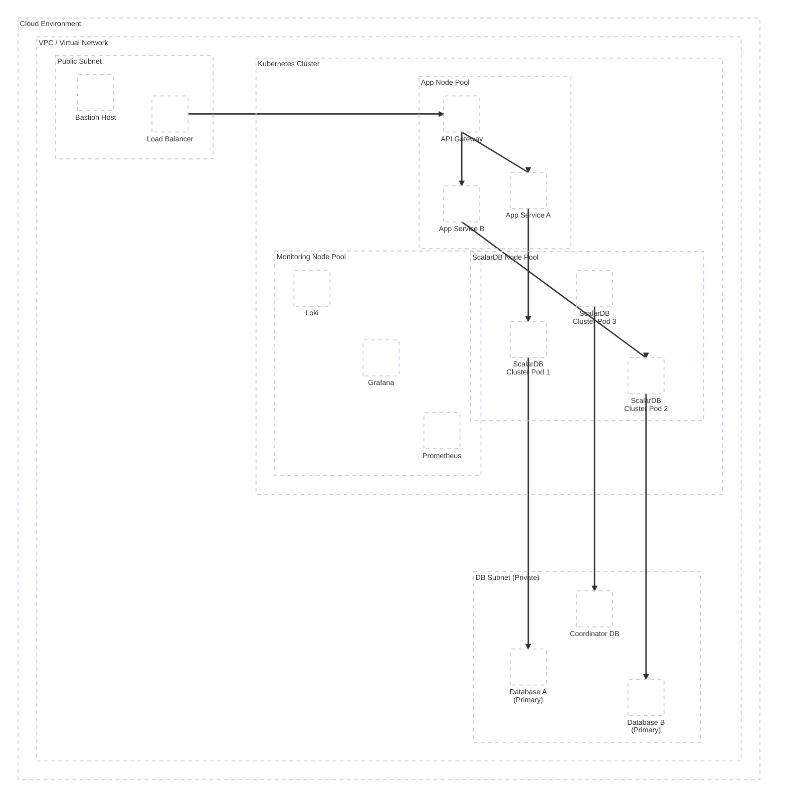
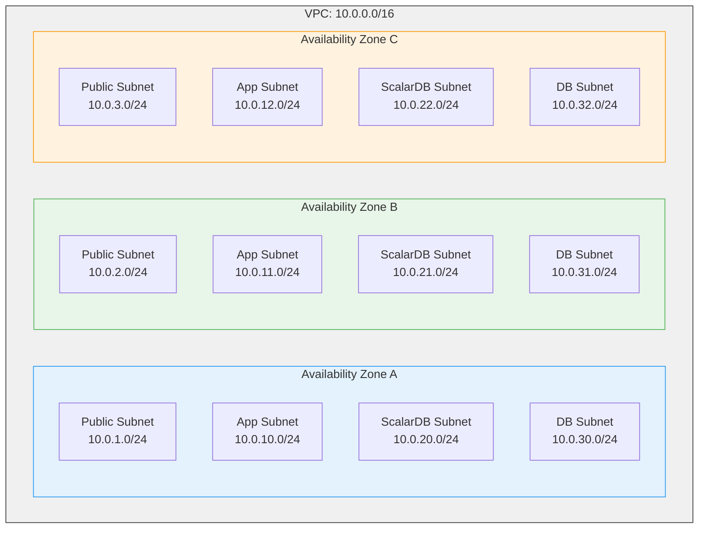
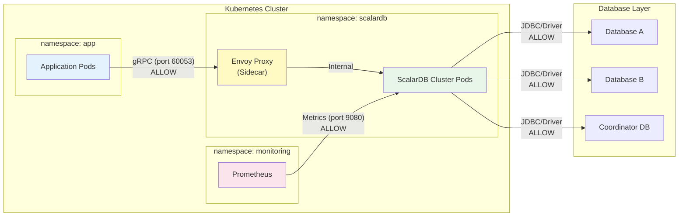
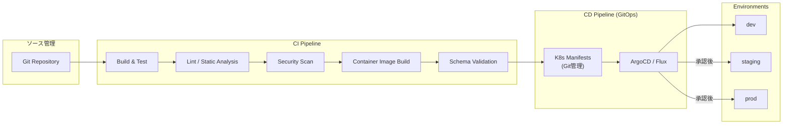

# Phase 3-1: インフラストラクチャ設計

## 目的

ScalarDB Clusterを含むKubernetes基盤のインフラストラクチャを設計する。クラウド環境の選定からKubernetesクラスタ構成、ScalarDB Clusterのデプロイ戦略、ネットワークセキュリティ、CI/CD、キャパシティプランニングまでを網羅的に設計し、本番運用に耐える基盤を構築する。

---

## 入力

| 入力物 | 説明 | 提供元 |
|--------|------|--------|
| DB選定結果 | Step 04（データモデル設計）で決定したDB種類・構成 | Phase 2 成果物 |
| 非機能要件 | Step 01（要件分析）で定義したレイテンシ・スループット・可用性目標 | Phase 1 成果物 |
| トランザクション設計 | Step 05で設計したトランザクション境界とパターン | Phase 2 成果物 |
| API設計 | Step 06で設計したサービス間通信方式 | Phase 2 成果物 |

---

## 参照資料

| 資料 | 参照箇所 | 用途 |
|------|----------|------|
| [`../research/06_infrastructure_prerequisites.md`](../research/06_infrastructure_prerequisites.md) | 全体 | インフラ前提条件、環境別推奨構成、スケーリング計算式 |
| [`../research/13_scalardb_317_deep_dive.md`](../research/13_scalardb_317_deep_dive.md) | クラスタ構成セクション | ScalarDB 3.17のクラスタ構成要件と推奨設定 |

---

## 全体アーキテクチャ概要



---

## ステップ

### Step 7.1: クラウド環境の選定と構成

クラウドプロバイダーの選定と基本的なネットワーク・DB構成を設計する。

#### クラウド環境選定マトリクス

`06_infrastructure_prerequisites.md` の環境別推奨構成を参照し、以下の観点で選定する。

| 評価項目 | AWS | Azure | GCP | オンプレミス | 自システム評価 |
|---------|-----|-------|-----|------------|--------------|
| マネージドK8s | EKS | AKS | GKE | 自前構築 | |
| マネージドDB選択肢 | RDS/Aurora (MySQL, PostgreSQL), DynamoDB | Azure Database for MySQL/PostgreSQL, Cosmos DB | Cloud SQL (MySQL/PostgreSQL), AlloyDB | 自前構築 | |
| ScalarDB対応DB可用性 | 高 | 高 | 高（Cloud SQL (PostgreSQL/MySQL), AlloyDB対応） | 中 | |
| ネットワーク制御 | VPC, Security Group | VNet, NSG | VPC, Firewall Rules | 完全制御 | |
| コスト | 従量課金 | 従量課金 | 従量課金 | 初期投資大 | |
| リージョン要件 | 東京あり | 東京あり | 東京あり | 自社DC | |
| チームの習熟度 | | | | | |

#### VPC / ネットワーク設計テンプレート



| ネットワーク項目 | 設計値 | 備考 |
|----------------|-------|------|
| VPC CIDR | 10.0.0.0/16 | 65,536 IPs |
| Public Subnet | /24 x 3 AZ | ALB, NAT Gateway, Bastion |
| App Subnet | /24 x 3 AZ | アプリケーションPod |
| ScalarDB Subnet | /24 x 3 AZ | ScalarDB Cluster Pod |
| DB Subnet | /24 x 3 AZ | マネージドDB（Private） |
| AZ数 | 最低 2、推奨 3 | |
| NAT Gateway | AZごとに配置 | 高可用性確保 |

#### マネージドDB選定テンプレート

| DB用途 | DB種類 | マネージドサービス | バージョン | 構成 | 理由 |
|--------|--------|----------------|-----------|------|------|
| サービスA データ | | | | Primary + Read Replica | |
| サービスB データ | | | | Primary + Read Replica | |
| Coordinator テーブル | | | | Multi-AZ, 高可用性必須 | |

**確認ポイント:**
- [ ] 選定したクラウド環境がチームのスキルセットと整合しているか
- [ ] ScalarDB対応DBがマネージドサービスとして利用可能か
- [ ] AZ冗長構成が確保されているか
- [ ] ネットワーク分離（Public/App/ScalarDB/DB）が設計されているか
- [ ] Coordinator DBのAZ冗長構成を別途検討したか

---

### Step 7.2: Kubernetes クラスタ設計

ScalarDB Cluster、アプリケーション、監視系を分離したKubernetesクラスタを設計する。

#### K8sクラスタ基本構成

| 項目 | 設計値 | 備考 |
|------|-------|------|
| K8sバージョン | 1.31 - 1.34 | ScalarDB Cluster互換性を確認 |
| マネージドK8s | EKS / AKS / GKE | Step 7.1の選定結果による |
| コントロールプレーン | マネージド | 高可用性はクラウド側で保証 |
| CNI | VPC CNI / Azure CNI / GKE VPC-native | Pod間通信の効率化 |

#### ノードプール設計

| ノードプール | 用途 | インスタンスタイプ | 最小 | 最大 | Taint | 備考 |
|-------------|------|------------------|------|------|-------|------|
| system | K8sシステムコンポーネント | m5.large 相当 | 2 | 4 | - | CoreDNS, kube-proxy等 |
| scalardb | ScalarDB Cluster専用 | m5.xlarge 相当 | 3 | 10 | `dedicated=scalardb:NoSchedule` | **最小4GB RAM**（06_infrastructure参照） |
| app | アプリケーションPod | m5.large 相当 | 2 | 20 | - | HPA対象 |
| monitoring | Prometheus, Grafana等 | m5.large 相当 | 2 | 4 | `dedicated=monitoring:NoSchedule` | 永続ストレージ必要 |

#### リソース見積もりテンプレート

ScalarDB Cluster Pod（06_infrastructure参照: 最小4GB RAM）:

> **注意: ライセンス制約**: ScalarDB Clusterの商用ライセンスは1ノードあたり2vCPU / 4GBメモリの制約があります。Limit値はこの制約を超えないように設定してください。

| リソース | Request | Limit | 根拠 |
|---------|---------|-------|------|
| CPU | 2000m | 2000m | ライセンス制約: 2vCPU/ノード |
| Memory | 4Gi | 4Gi | ライセンス制約: 4GB/ノード |
| Ephemeral Storage | 1Gi | 2Gi | ログ、一時ファイル |

アプリケーション Pod:

| リソース | Request | Limit | 根拠 |
|---------|---------|-------|------|
| CPU | 500m | 1000m | 非機能要件に応じて調整 |
| Memory | 512Mi | 1Gi | 非機能要件に応じて調整 |

**確認ポイント:**
- [ ] ScalarDB専用ノードプールが分離されているか
- [ ] Taintによる他Podの混在防止が設定されているか
- [ ] ノードのAZ分散が確保されているか
- [ ] ScalarDB Cluster Podのメモリが最小4GB以上確保されているか

---

### Step 7.3: ScalarDB Cluster デプロイ設計

Helm Chartを用いたScalarDB Clusterのデプロイ構成を設計する。

#### Helm Chart 構成

```yaml
# ScalarDB Cluster Helm values.yaml（設計テンプレート）
# Chart: scalar-labs/scalardb-cluster

scalardbCluster:
  # レプリカ数設計
  replicaCount: 5  # 最小3、推奨5以上

  # コンテナイメージ
  image:
    repository: ghcr.io/scalar-labs/scalardb-cluster-node
    tag: "3.17.x"  # バージョンはStep 05の選定結果に合わせる

  # リソース設定（ライセンス制約: 2vCPU / 4GB per node）
  resources:
    requests:
      cpu: "2000m"
      memory: "4Gi"
    limits:
      cpu: "2000m"
      memory: "4Gi"

  # ScalarDB Cluster設定
  scalardbClusterNodeProperties: |
    # クラスタ設定
    scalar.db.cluster.node.decommissioning_duration_secs=30
    # トランザクション設定
    scalar.db.consensus_commit.isolation_level=SERIALIZABLE
    scalar.db.consensus_commit.serializable_strategy=EXTRA_READ
    # DB接続設定（Step 04の選定結果に合わせる）
    scalar.db.contact_points=<DB_HOST>
    scalar.db.username=<DB_USER>
    scalar.db.password=<DB_PASSWORD>
    scalar.db.storage=<multi-storage or jdbc>

  # Tolerations（ScalarDB専用ノードプールへの配置）
  tolerations:
    - key: "dedicated"
      operator: "Equal"
      value: "scalardb"
      effect: "NoSchedule"

  # NodeSelector
  nodeSelector:
    dedicated: scalardb
```

#### レプリカ数設計

| 環境 | レプリカ数 | 理由 |
|------|-----------|------|
| dev | 1 | 開発用最小構成 |
| staging | 3 | 本番相当の最小可用性構成 |
| prod | 5以上 | 高可用性・ローリングアップデート対応 |

#### PodDisruptionBudget 設計

```yaml
apiVersion: policy/v1
kind: PodDisruptionBudget
metadata:
  name: scalardb-cluster-pdb
spec:
  maxUnavailable: 1
  selector:
    matchLabels:
      app.kubernetes.io/name: scalardb-cluster
      app.kubernetes.io/instance: scalardb-cluster
```

| PDB項目 | 設計値 | 根拠 |
|---------|-------|------|
| maxUnavailable | 1 | ローリングアップデート時の可用性確保 |
| 最小可用Pod数 | レプリカ数 - 1 | ローリングアップデート中のサービス可用性確保（ScalarDB Clusterはマスターレスのため、クォーラムは不要） |

#### Anti-Affinity 設計

```yaml
# Pod Anti-Affinity: 同一ノードへの配置を避ける
affinity:
  podAntiAffinity:
    requiredDuringSchedulingIgnoredDuringExecution:
      - labelSelector:
          matchExpressions:
            - key: app.kubernetes.io/name
              operator: In
              values:
                - scalardb-cluster
        topologyKey: "kubernetes.io/hostname"
    preferredDuringSchedulingIgnoredDuringExecution:
      - weight: 100
        podAffinityTerm:
          labelSelector:
            matchExpressions:
              - key: app.kubernetes.io/name
                operator: In
                values:
                  - scalardb-cluster
          topologyKey: "topology.kubernetes.io/zone"
```

| Anti-Affinity | レベル | TopologyKey | 説明 |
|--------------|-------|-------------|------|
| Pod間（同一ノード回避） | Required | `kubernetes.io/hostname` | 必須: 同一ノードに配置しない |
| AZ間分散 | Preferred | `topology.kubernetes.io/zone` | 推奨: AZを跨いで分散配置 |

#### HPA（Horizontal Pod Autoscaler）設計

```yaml
apiVersion: autoscaling/v2
kind: HorizontalPodAutoscaler
metadata:
  name: scalardb-cluster-hpa
spec:
  scaleTargetRef:
    apiVersion: apps/v1
    kind: Deployment
    name: scalardb-cluster
  minReplicas: 5
  maxReplicas: 20
  metrics:
    - type: Resource
      resource:
        name: cpu
        target:
          type: Utilization
          averageUtilization: 70
    - type: Resource
      resource:
        name: memory
        target:
          type: Utilization
          averageUtilization: 80
  behavior:
    scaleUp:
      stabilizationWindowSeconds: 60
      policies:
        - type: Pods
          value: 2
          periodSeconds: 60
    scaleDown:
      stabilizationWindowSeconds: 300
      policies:
        - type: Pods
          value: 1
          periodSeconds: 120
```

| HPA項目 | 設計値 | 根拠 |
|---------|-------|------|
| CPU閾値 | 70% | スパイク対応のためのバッファ |
| メモリ閾値 | 80% | GCプレッシャーを考慮 |
| スケールアップ安定化 | 60秒 | 急なスパイクへの素早い対応 |
| スケールダウン安定化 | 300秒 | 不安定なスケーリングを防止 |
| 最大レプリカ | 20 | キャパシティプランニング結果に基づき調整 |

**確認ポイント:**
- [ ] Helm Chart のバージョンとScalarDB Clusterのバージョンが整合しているか
- [ ] レプリカ数が可用性要件を満たしているか（本番最小3、推奨5以上）
- [ ] PodDisruptionBudgetが設定されているか
- [ ] Anti-Affinityでノード間・AZ間の分散が確保されているか
- [ ] HPAの閾値がパフォーマンス要件に適合しているか
- [ ] ScalarDB Cluster設定（Isolation Level等）がStep 05の設計と整合しているか

---

### Step 7.4: ネットワークセキュリティ設計

Kubernetes NetworkPolicyとEnvoy Proxyによるネットワーク制御を設計する。

#### NetworkPolicy 設計



**App -> ScalarDB Cluster:**

```yaml
apiVersion: networking.k8s.io/v1
kind: NetworkPolicy
metadata:
  name: allow-app-to-scalardb
  namespace: scalardb
spec:
  podSelector:
    matchLabels:
      app.kubernetes.io/name: scalardb-cluster
  policyTypes:
    - Ingress
  ingress:
    - from:
        - namespaceSelector:
            matchLabels:
              name: app
          podSelector:
            matchLabels:
              role: backend
      ports:
        - protocol: TCP
          port: 60053  # ScalarDB Cluster gRPC port
```

**ScalarDB Cluster -> Database:**

```yaml
apiVersion: networking.k8s.io/v1
kind: NetworkPolicy
metadata:
  name: allow-scalardb-to-db
  namespace: scalardb
spec:
  podSelector:
    matchLabels:
      app.kubernetes.io/name: scalardb-cluster
  policyTypes:
    - Egress
  egress:
    - to:
        - ipBlock:
            cidr: 10.0.30.0/24  # DB Subnet
      ports:
        - protocol: TCP
          port: 3306  # MySQL
        - protocol: TCP
          port: 5432  # PostgreSQL
```

#### Envoy Proxy 配置設計

| 項目 | 設計値 | 備考 |
|------|-------|------|
| 配置方式 | Sidecar / Standalone | ScalarDB Cluster標準のEnvoy構成 |
| gRPC通信 | port 60053 | ScalarDB Cluster標準ポート |
| TLS終端 | Envoy側で実施 | クライアント→ScalarDB間の暗号化 |
| ロードバランシング | Round Robin / Least Connection | gRPCに適したLB方式を選択 |
| ヘルスチェック | gRPC Health Check | ScalarDB Clusterのヘルスチェックエンドポイント |

**確認ポイント:**
- [ ] デフォルトDenyポリシーが設定されているか
- [ ] 必要な通信のみがAllowされているか
- [ ] ScalarDB Cluster→DB間の通信ポートが正しいか
- [ ] メトリクス収集用ポート（Prometheus scrape）が開放されているか

---

### Step 7.5: DevOps / CI/CD 設計

CI/CDパイプラインと環境管理を設計する（06_infrastructure Section 7参照）。

#### CI/CD パイプライン概要



#### 環境管理

| 環境 | 用途 | ScalarDB Cluster構成 | DB構成 | 備考 |
|------|------|---------------------|--------|------|
| dev | 開発・単体テスト | 1 Pod | 共有DB or コンテナDB | コスト最小化 |
| staging | 結合テスト・性能テスト | 3 Pod | 本番相当の縮小構成 | 本番と同一設定 |
| prod | 本番 | 5+ Pod | フルスペック | SLA適用 |

#### GitOpsパターン

| 項目 | 設計方針 | 備考 |
|------|---------|------|
| GitOpsツール | ArgoCD / Flux（選定） | |
| リポジトリ構成 | アプリリポジトリ + マニフェストリポジトリ | 分離管理 |
| 同期方式 | 自動同期（dev）、手動承認（staging/prod） | |
| ロールバック | Git revertによる自動ロールバック | |
| Helm管理 | ArgoCD Application (Helm) | values.yamlの環境別管理 |

#### Schema Loader 統合

ScalarDBスキーマの管理をCI/CDに組み込む。

| 項目 | 設計方針 | 備考 |
|------|---------|------|
| Schema定義 | Gitリポジトリで管理（JSON形式） | バージョン管理 |
| Schema適用 | CI/CDパイプラインで自動実行 | Schema Loader Job |
| マイグレーション | スキーマ変更はPRレビュー必須 | 破壊的変更チェック |
| ロールバック | 前バージョンのスキーマを再適用 | |

```yaml
# Schema Loader Job テンプレート
apiVersion: batch/v1
kind: Job
metadata:
  name: scalardb-schema-loader
spec:
  template:
    spec:
      containers:
        - name: schema-loader
          image: ghcr.io/scalar-labs/scalardb-schema-loader:3.17.x
          args:
            - "--config"
            - "/etc/scalardb/database.properties"
            - "--schema-file"
            - "/etc/scalardb/schema.json"
            - "--coordinator"
          volumeMounts:
            - name: config
              mountPath: /etc/scalardb
      volumes:
        - name: config
          configMap:
            name: scalardb-schema-config
      restartPolicy: Never
  backoffLimit: 3
```

**確認ポイント:**
- [ ] CI/CDパイプラインにセキュリティスキャンが含まれているか
- [ ] 環境別のScalarDB Cluster構成が定義されているか
- [ ] GitOpsツールの選定理由が明確か
- [ ] Schema Loaderの自動実行手順が設計されているか
- [ ] ロールバック手順が明確か

---

### Step 7.6: キャパシティプランニング

同時接続数・トランザクション数からリソースを見積もる（06_infrastructure参照: 計算式）。

#### スケーリング計算テンプレート

**入力パラメータ:**

| パラメータ | 値 | 根拠 |
|-----------|---|------|
| ピーク時同時接続数 | | 非機能要件（Step 01） |
| 1接続あたりの平均TPS | | トランザクション設計（Step 05） |
| ピーク時目標TPS | | 上記2つの積 |
| 平均トランザクション処理時間 | | ベンチマーク or 見積もり |
| ScalarDB Pod 1台あたりのTPS | | ベンチマーク or 06_infrastructure参照値 |

**ScalarDB Cluster Pod数計算（06_infrastructure参照）:**

```
必要Pod数 = ceil(ピーク時目標TPS / Pod 1台あたりのTPS) + バッファ（20-30%）
```

| 計算項目 | 計算式 | 算出値 |
|---------|--------|-------|
| 基本必要Pod数 | ピーク時目標TPS / Pod単位TPS | |
| バッファ込みPod数 | 基本必要Pod数 x 1.3 | |
| 最終Pod数 | max(バッファ込みPod数, 最小可用性要件Pod数) | |

**ストレージ容量見積もり:**

| 項目 | 計算式 | 見積もり値 | 備考 |
|------|--------|-----------|------|
| ビジネスデータ量 | レコード数 x 平均レコードサイズ | | |
| ScalarDBメタデータオーバーヘッド | ビジネスデータ量 x 1.3〜1.5 | | Consensus Commitのメタデータカラム分 |
| Coordinatorテーブル | TPS x 保持期間 x レコードサイズ | | トランザクション状態レコード |
| DB WAL / Binlog | データ量 x 係数 | | DB種類による |
| バックアップ | 合計 x 世代数 | | 保持ポリシーによる |
| **合計** | | | |

#### コスト見積もりテンプレート

| リソース | スペック | 単価（月額） | 数量 | 月額コスト |
|---------|---------|------------|------|-----------|
| K8s コントロールプレーン | マネージド | | 1 | |
| ScalarDB ノード | m5.xlarge相当 | | 5+ | |
| App ノード | m5.large相当 | | 3+ | |
| Monitoring ノード | m5.large相当 | | 2 | |
| マネージドDB (Primary) | | | 2+ | |
| マネージドDB (Coordinator) | | | 1 | |
| ロードバランサー | ALB/NLB相当 | | 1 | |
| ストレージ | EBS/PV | | | |
| ネットワーク転送量 | | | | |
| **合計** | | | | |

**確認ポイント:**
- [ ] ピーク時トラフィックを基にスケーリング計算が実施されているか
- [ ] ScalarDBメタデータのストレージオーバーヘッドが考慮されているか
- [ ] Coordinatorテーブルの成長見積もりが含まれているか
- [ ] コスト見積もりが予算内か
- [ ] 成長率を加味した12ヶ月先の見積もりがあるか

---

## 成果物

| 成果物 | 説明 | フォーマット |
|--------|------|-------------|
| インフラ構成図 | クラウド環境、ネットワーク、K8sクラスタの全体構成図 | Mermaid / Draw.io |
| K8sマニフェスト | Namespace, Deployment, Service, NetworkPolicy等の定義 | YAML |
| Helm values.yaml | ScalarDB Cluster Helm Chartの環境別設定ファイル | YAML（dev/staging/prod） |
| キャパシティプランニングシート | Pod数、ストレージ、コストの見積もり | スプレッドシート / Markdown表 |
| CI/CDパイプライン定義 | パイプラインの構成と各ステージの定義 | GitHub Actions / GitLab CI YAML |
| 環境構成一覧 | dev/staging/prod各環境の構成差分一覧 | Markdown表 |

---

## 完了基準チェックリスト

- [ ] クラウド環境の選定理由が明確に文書化されている
- [ ] VPC/ネットワーク設計がサブネット分離・AZ冗長を満たしている
- [ ] マネージドDB選定がScalarDB対応DBと整合している
- [ ] K8sノードプールがScalarDB専用・アプリ用・監視用に分離されている
- [ ] ScalarDB Cluster Podのリソース設定が最小要件（4GB RAM）を満たしている
- [ ] ScalarDB Clusterのレプリカ数が可用性要件を満たしている（本番5以上推奨）
- [ ] PodDisruptionBudget（maxUnavailable=1）が設定されている
- [ ] Anti-Affinityでノード間・AZ間の分散が確保されている
- [ ] HPAの閾値と動作が設計されている
- [ ] NetworkPolicyでデフォルトDeny + 必要通信のみAllowが設計されている
- [ ] CI/CDパイプラインにSchema Loaderが統合されている
- [ ] 環境別（dev/staging/prod）の構成差分が明確になっている
- [ ] キャパシティプランニングが非機能要件に基づいて計算されている
- [ ] コスト見積もりが予算制約を考慮している
- [ ] 全ての設計がPhase 2の成果物（DB選定、トランザクション設計、API設計）と整合している

---

## 次のステップへの引き継ぎ事項

### Phase 3-2: セキュリティ設計（`08_security_design.md`）への引き継ぎ

| 引き継ぎ項目 | 内容 |
|-------------|------|
| ネットワーク構成 | VPC/サブネット構成、NetworkPolicy設計 |
| K8sクラスタ構成 | Namespace分離、ノードプール構成 |
| ScalarDB Cluster構成 | デプロイ構成、通信ポート |
| Envoy Proxy構成 | TLS終端、gRPC通信設定 |

### Phase 3-3: オブザーバビリティ設計（`09_observability_design.md`）への引き継ぎ

| 引き継ぎ項目 | 内容 |
|-------------|------|
| 監視ノードプール | リソース割り当て、ストレージ構成 |
| ScalarDB Clusterメトリクスポート | Prometheus scrape設定 |
| ネットワークアクセス | 監視系→ScalarDB間の通信許可 |

### Phase 3-4: 障害復旧・DR設計（`10_disaster_recovery_design.md`）への引き継ぎ

| 引き継ぎ項目 | 内容 |
|-------------|------|
| AZ構成 | マルチAZ構成の詳細 |
| DB構成 | マネージドDBのバックアップ機能 |
| ScalarDB Cluster構成 | レプリカ数、PDB設定 |
