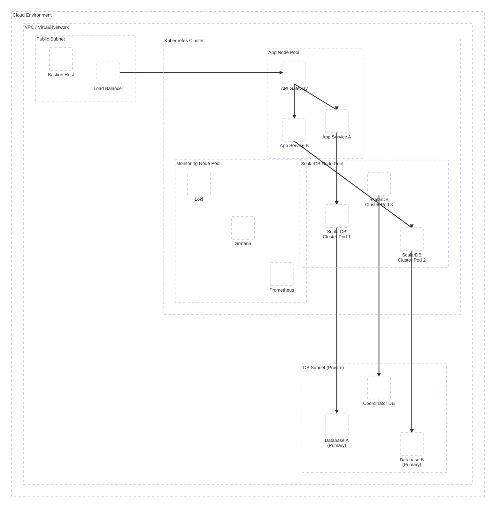
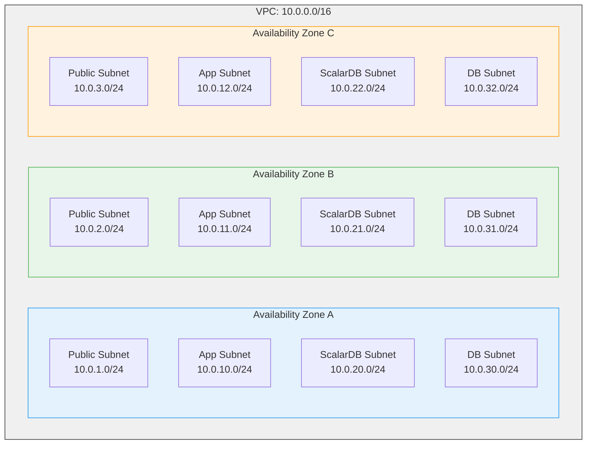
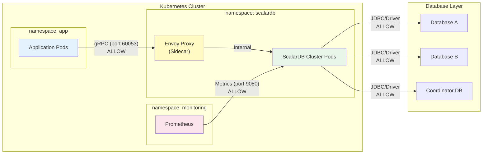
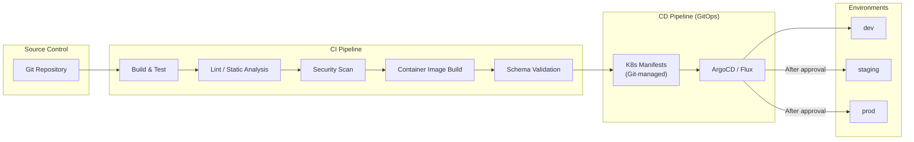

# Phase 3-1: Infrastructure Design

## Purpose

Design a Kubernetes-based infrastructure including ScalarDB Cluster. Comprehensively design from cloud environment selection to Kubernetes cluster configuration, ScalarDB Cluster deployment strategy, network security, CI/CD, and capacity planning, building a foundation that can withstand production operations.

---

## Inputs

| Input | Description | Source |
|-------|-------------|--------|
| DB Selection Results | DB types and configurations determined in Step 04 (Data Model Design) | Phase 2 Deliverables |
| Non-Functional Requirements | Latency, throughput, and availability targets defined in Step 01 (Requirements Analysis) | Phase 1 Deliverables |
| Transaction Design | Transaction boundaries and patterns designed in Step 05 | Phase 2 Deliverables |
| API Design | Inter-service communication methods designed in Step 06 | Phase 2 Deliverables |

---

## Reference Materials

| Document | Reference Section | Purpose |
|----------|-------------------|---------|
| [`../research/06_infrastructure_prerequisites.md`](../research/06_infrastructure_prerequisites.md) | Entire document | Infrastructure prerequisites, environment-specific recommended configurations, scaling formulas |
| [`../research/13_scalardb_317_deep_dive.md`](../research/13_scalardb_317_deep_dive.md) | Cluster configuration section | ScalarDB 3.17 cluster configuration requirements and recommended settings |

---

## Overall Architecture Overview



---

## Steps

### Step 7.1: Cloud Environment Selection and Configuration

Select the cloud provider and design basic network and DB configurations.

#### Cloud Environment Selection Matrix

Refer to the environment-specific recommended configurations in `06_infrastructure_prerequisites.md` and select based on the following criteria.

| Evaluation Criteria | AWS | Azure | GCP | On-Premises | System Evaluation |
|--------------------|-----|-------|-----|-------------|-------------------|
| Managed K8s | EKS | AKS | GKE | Self-built | |
| Managed DB Options | RDS/Aurora (MySQL, PostgreSQL), DynamoDB | Azure Database for MySQL/PostgreSQL, Cosmos DB | Cloud SQL (MySQL/PostgreSQL), AlloyDB | Self-built | |
| ScalarDB-Compatible DB Availability | High | High | High (Cloud SQL (PostgreSQL/MySQL), AlloyDB supported) | Medium | |
| Network Control | VPC, Security Group | VNet, NSG | VPC, Firewall Rules | Full control | |
| Cost | Pay-as-you-go | Pay-as-you-go | Pay-as-you-go | High initial investment | |
| Region Requirements | Tokyo available | Tokyo available | Tokyo available | Own DC | |
| Team Expertise | | | | | |

#### VPC / Network Design Template



| Network Item | Design Value | Notes |
|-------------|-------------|-------|
| VPC CIDR | 10.0.0.0/16 | 65,536 IPs |
| Public Subnet | /24 x 3 AZ | ALB, NAT Gateway, Bastion |
| App Subnet | /24 x 3 AZ | Application Pods |
| ScalarDB Subnet | /24 x 3 AZ | ScalarDB Cluster Pods |
| DB Subnet | /24 x 3 AZ | Managed DBs (Private) |
| Number of AZs | Minimum 2, recommended 3 | |
| NAT Gateway | Deployed per AZ | Ensure high availability |

#### Managed DB Selection Template

| DB Purpose | DB Type | Managed Service | Version | Configuration | Rationale |
|-----------|---------|-----------------|---------|---------------|-----------|
| Service A Data | | | | Primary + Read Replica | |
| Service B Data | | | | Primary + Read Replica | |
| Coordinator Table | | | | Multi-AZ, high availability required | |

**Checkpoints:**
- [ ] Does the selected cloud environment align with the team's skill set?
- [ ] Is the ScalarDB-compatible DB available as a managed service?
- [ ] Is AZ-redundant configuration ensured?
- [ ] Is network isolation (Public/App/ScalarDB/DB) designed?
- [ ] Has AZ-redundant configuration for the Coordinator DB been separately considered?

---

### Step 7.2: Kubernetes Cluster Design

Design a Kubernetes cluster with separation of ScalarDB Cluster, applications, and monitoring systems.

#### K8s Cluster Basic Configuration

| Item | Design Value | Notes |
|------|-------------|-------|
| K8s Version | 1.31 - 1.34 | Verify ScalarDB Cluster compatibility |
| Managed K8s | EKS / AKS / GKE | Based on Step 7.1 selection |
| Control Plane | Managed | High availability guaranteed by cloud provider |
| CNI | VPC CNI / Azure CNI / GKE VPC-native | Pod-to-pod communication optimization |

#### Node Pool Design

| Node Pool | Purpose | Instance Type | Min | Max | Taint | Notes |
|-----------|---------|---------------|-----|-----|-------|-------|
| system | K8s system components | m5.large equivalent | 2 | 4 | - | CoreDNS, kube-proxy, etc. |
| scalardb | ScalarDB Cluster dedicated | m5.xlarge equivalent | 3 | 10 | `dedicated=scalardb:NoSchedule` | **Minimum 4GB RAM** (per 06_infrastructure) |
| app | Application Pods | m5.large equivalent | 2 | 20 | - | HPA target |
| monitoring | Prometheus, Grafana, etc. | m5.large equivalent | 2 | 4 | `dedicated=monitoring:NoSchedule` | Persistent storage required |

#### Resource Estimation Template

ScalarDB Cluster Pod (per 06_infrastructure: minimum 4GB RAM):

> **Note: License Constraint**: The commercial license for ScalarDB Cluster has a constraint of 2 vCPU / 4GB memory per node. Set Limit values not to exceed this constraint.

| Resource | Request | Limit | Rationale |
|---------|---------|-------|-----------|
| CPU | 2000m | 2000m | License constraint: 2 vCPU/node |
| Memory | 4Gi | 4Gi | License constraint: 4GB/node |
| Ephemeral Storage | 1Gi | 2Gi | Logs, temporary files |

Application Pod:

| Resource | Request | Limit | Rationale |
|---------|---------|-------|-----------|
| CPU | 500m | 1000m | Adjust according to non-functional requirements |
| Memory | 512Mi | 1Gi | Adjust according to non-functional requirements |

**Checkpoints:**
- [ ] Is the ScalarDB dedicated node pool isolated?
- [ ] Are Taints configured to prevent co-location of other Pods?
- [ ] Is AZ distribution of nodes ensured?
- [ ] Is ScalarDB Cluster Pod memory at least 4GB or more?

---

### Step 7.3: ScalarDB Cluster Deployment Design

Design the ScalarDB Cluster deployment configuration using Helm Charts.

#### Helm Chart Configuration

```yaml
# ScalarDB Cluster Helm values.yaml (Design Template)
# Chart: scalar-labs/scalardb-cluster

scalardbCluster:
  # Replica count design
  replicaCount: 5  # Minimum 3, recommended 5 or more

  # Container image
  image:
    repository: ghcr.io/scalar-labs/scalardb-cluster-node
    tag: "3.17.x"  # Version aligned with Step 05 selection

  # Resource settings (License constraint: 2 vCPU / 4GB per node)
  resources:
    requests:
      cpu: "2000m"
      memory: "4Gi"
    limits:
      cpu: "2000m"
      memory: "4Gi"

  # ScalarDB Cluster configuration
  scalardbClusterNodeProperties: |
    # Cluster settings
    scalar.db.cluster.node.decommissioning_duration_secs=30
    # Transaction settings
    scalar.db.consensus_commit.isolation_level=SERIALIZABLE
    scalar.db.consensus_commit.serializable_strategy=EXTRA_READ
    # DB connection settings (aligned with Step 04 selection)
    scalar.db.contact_points=<DB_HOST>
    scalar.db.username=<DB_USER>
    scalar.db.password=<DB_PASSWORD>
    scalar.db.storage=<multi-storage or jdbc>

  # Tolerations (placement on ScalarDB dedicated node pool)
  tolerations:
    - key: "dedicated"
      operator: "Equal"
      value: "scalardb"
      effect: "NoSchedule"

  # NodeSelector
  nodeSelector:
    dedicated: scalardb
```

#### Replica Count Design

| Environment | Replica Count | Rationale |
|-------------|--------------|-----------|
| dev | 1 | Minimum configuration for development |
| staging | 3 | Minimum availability configuration equivalent to production |
| prod | 5 or more | High availability, rolling update support |

#### PodDisruptionBudget Design

```yaml
apiVersion: policy/v1
kind: PodDisruptionBudget
metadata:
  name: scalardb-cluster-pdb
spec:
  maxUnavailable: 1
  selector:
    matchLabels:
      app.kubernetes.io/name: scalardb-cluster
      app.kubernetes.io/instance: scalardb-cluster
```

| PDB Item | Design Value | Rationale |
|----------|-------------|-----------|
| maxUnavailable | 1 | Ensure availability during rolling updates |
| Minimum available Pods | Replica count - 1 | Ensure service availability during rolling updates (ScalarDB Cluster is masterless, so quorum is not required) |

#### Anti-Affinity Design

```yaml
# Pod Anti-Affinity: Avoid placement on the same node
affinity:
  podAntiAffinity:
    requiredDuringSchedulingIgnoredDuringExecution:
      - labelSelector:
          matchExpressions:
            - key: app.kubernetes.io/name
              operator: In
              values:
                - scalardb-cluster
        topologyKey: "kubernetes.io/hostname"
    preferredDuringSchedulingIgnoredDuringExecution:
      - weight: 100
        podAffinityTerm:
          labelSelector:
            matchExpressions:
              - key: app.kubernetes.io/name
                operator: In
                values:
                  - scalardb-cluster
          topologyKey: "topology.kubernetes.io/zone"
```

| Anti-Affinity | Level | TopologyKey | Description |
|--------------|-------|-------------|-------------|
| Inter-Pod (same node avoidance) | Required | `kubernetes.io/hostname` | Required: Do not place on the same node |
| Inter-AZ distribution | Preferred | `topology.kubernetes.io/zone` | Recommended: Distribute across AZs |

#### HPA (Horizontal Pod Autoscaler) Design

```yaml
apiVersion: autoscaling/v2
kind: HorizontalPodAutoscaler
metadata:
  name: scalardb-cluster-hpa
spec:
  scaleTargetRef:
    apiVersion: apps/v1
    kind: Deployment
    name: scalardb-cluster
  minReplicas: 5
  maxReplicas: 20
  metrics:
    - type: Resource
      resource:
        name: cpu
        target:
          type: Utilization
          averageUtilization: 70
    - type: Resource
      resource:
        name: memory
        target:
          type: Utilization
          averageUtilization: 80
  behavior:
    scaleUp:
      stabilizationWindowSeconds: 60
      policies:
        - type: Pods
          value: 2
          periodSeconds: 60
    scaleDown:
      stabilizationWindowSeconds: 300
      policies:
        - type: Pods
          value: 1
          periodSeconds: 120
```

| HPA Item | Design Value | Rationale |
|----------|-------------|-----------|
| CPU threshold | 70% | Buffer for spike handling |
| Memory threshold | 80% | Considering GC pressure |
| Scale-up stabilization | 60 seconds | Quick response to sudden spikes |
| Scale-down stabilization | 300 seconds | Prevent unstable scaling |
| Max replicas | 20 | Adjust based on capacity planning results |

**Checkpoints:**
- [ ] Are the Helm Chart version and ScalarDB Cluster version aligned?
- [ ] Does the replica count meet availability requirements (production minimum 3, recommended 5+)?
- [ ] Is PodDisruptionBudget configured?
- [ ] Is Anti-Affinity ensuring inter-node and inter-AZ distribution?
- [ ] Are HPA thresholds appropriate for performance requirements?
- [ ] Are ScalarDB Cluster settings (Isolation Level, etc.) aligned with Step 05 design?

---

### Step 7.4: Network Security Design

Design network control using Kubernetes NetworkPolicy and Envoy Proxy.

#### NetworkPolicy Design



**App -> ScalarDB Cluster:**

```yaml
apiVersion: networking.k8s.io/v1
kind: NetworkPolicy
metadata:
  name: allow-app-to-scalardb
  namespace: scalardb
spec:
  podSelector:
    matchLabels:
      app.kubernetes.io/name: scalardb-cluster
  policyTypes:
    - Ingress
  ingress:
    - from:
        - namespaceSelector:
            matchLabels:
              name: app
          podSelector:
            matchLabels:
              role: backend
      ports:
        - protocol: TCP
          port: 60053  # ScalarDB Cluster gRPC port
```

**ScalarDB Cluster -> Database:**

```yaml
apiVersion: networking.k8s.io/v1
kind: NetworkPolicy
metadata:
  name: allow-scalardb-to-db
  namespace: scalardb
spec:
  podSelector:
    matchLabels:
      app.kubernetes.io/name: scalardb-cluster
  policyTypes:
    - Egress
  egress:
    - to:
        - ipBlock:
            cidr: 10.0.30.0/24  # DB Subnet
      ports:
        - protocol: TCP
          port: 3306  # MySQL
        - protocol: TCP
          port: 5432  # PostgreSQL
```

#### Envoy Proxy Deployment Design

| Item | Design Value | Notes |
|------|-------------|-------|
| Deployment method | Sidecar / Standalone | Standard Envoy configuration for ScalarDB Cluster |
| gRPC communication | port 60053 | ScalarDB Cluster standard port |
| TLS termination | Handled at Envoy | Encryption between client and ScalarDB |
| Load balancing | Round Robin / Least Connection | Select LB method suitable for gRPC |
| Health check | gRPC Health Check | ScalarDB Cluster health check endpoint |

**Checkpoints:**
- [ ] Is a default Deny policy configured?
- [ ] Are only necessary communications Allowed?
- [ ] Are communication ports between ScalarDB Cluster and DB correct?
- [ ] Is the metrics collection port (Prometheus scrape) open?

---

### Step 7.5: DevOps / CI/CD Design

Design CI/CD pipelines and environment management (refer to 06_infrastructure Section 7).

#### CI/CD Pipeline Overview



#### Environment Management

| Environment | Purpose | ScalarDB Cluster Configuration | DB Configuration | Notes |
|-------------|---------|-------------------------------|-------------------|-------|
| dev | Development and unit testing | 1 Pod | Shared DB or containerized DB | Cost minimization |
| staging | Integration and performance testing | 3 Pods | Scaled-down production-equivalent | Same settings as production |
| prod | Production | 5+ Pods | Full spec | SLA applied |

#### GitOps Pattern

| Item | Design Policy | Notes |
|------|--------------|-------|
| GitOps tool | ArgoCD / Flux (select) | |
| Repository structure | App repository + manifest repository | Separate management |
| Sync method | Auto-sync (dev), manual approval (staging/prod) | |
| Rollback | Automatic rollback via Git revert | |
| Helm management | ArgoCD Application (Helm) | Environment-specific values.yaml management |

#### Schema Loader Integration

Integrate ScalarDB schema management into CI/CD.

| Item | Design Policy | Notes |
|------|--------------|-------|
| Schema definition | Managed in Git repository (JSON format) | Version control |
| Schema application | Automated execution in CI/CD pipeline | Schema Loader Job |
| Migration | Schema changes require PR review | Breaking change checks |
| Rollback | Reapply previous version schema | |

```yaml
# Schema Loader Job Template
apiVersion: batch/v1
kind: Job
metadata:
  name: scalardb-schema-loader
spec:
  template:
    spec:
      containers:
        - name: schema-loader
          image: ghcr.io/scalar-labs/scalardb-schema-loader:3.17.x
          args:
            - "--config"
            - "/etc/scalardb/database.properties"
            - "--schema-file"
            - "/etc/scalardb/schema.json"
            - "--coordinator"
          volumeMounts:
            - name: config
              mountPath: /etc/scalardb
      volumes:
        - name: config
          configMap:
            name: scalardb-schema-config
      restartPolicy: Never
  backoffLimit: 3
```

**Checkpoints:**
- [ ] Does the CI/CD pipeline include security scanning?
- [ ] Are environment-specific ScalarDB Cluster configurations defined?
- [ ] Is the rationale for GitOps tool selection clear?
- [ ] Are Schema Loader automated execution procedures designed?
- [ ] Are rollback procedures clear?

---

### Step 7.6: Capacity Planning

Estimate resources from concurrent connections and transaction counts (refer to 06_infrastructure: formulas).

#### Scaling Calculation Template

**Input Parameters:**

| Parameter | Value | Rationale |
|-----------|-------|-----------|
| Peak concurrent connections | | Non-functional requirements (Step 01) |
| Average TPS per connection | | Transaction design (Step 05) |
| Peak target TPS | | Product of the above two |
| Average transaction processing time | | Benchmark or estimate |
| TPS per ScalarDB Pod | | Benchmark or 06_infrastructure reference value |

**ScalarDB Cluster Pod Count Calculation (per 06_infrastructure):**

```
Required Pod count = ceil(Peak target TPS / TPS per Pod) + Buffer (20-30%)
```

| Calculation Item | Formula | Calculated Value |
|-----------------|---------|------------------|
| Base required Pod count | Peak target TPS / Per-Pod TPS | |
| Pod count with buffer | Base required Pod count x 1.3 | |
| Final Pod count | max(Pod count with buffer, Minimum availability requirement Pod count) | |

**Storage Capacity Estimation:**

| Item | Formula | Estimated Value | Notes |
|------|---------|-----------------|-------|
| Business data volume | Record count x Average record size | | |
| ScalarDB metadata overhead | Business data volume x 1.3-1.5 | | Consensus Commit metadata column overhead |
| Coordinator table | TPS x Retention period x Record size | | Transaction state records |
| DB WAL / Binlog | Data volume x Factor | | Depends on DB type |
| Backup | Total x Number of generations | | Depends on retention policy |
| **Total** | | | |

#### Cost Estimation Template

| Resource | Spec | Unit Price (Monthly) | Quantity | Monthly Cost |
|---------|------|---------------------|----------|-------------|
| K8s control plane | Managed | | 1 | |
| ScalarDB nodes | m5.xlarge equivalent | | 5+ | |
| App nodes | m5.large equivalent | | 3+ | |
| Monitoring nodes | m5.large equivalent | | 2 | |
| Managed DB (Primary) | | | 2+ | |
| Managed DB (Coordinator) | | | 1 | |
| Load balancer | ALB/NLB equivalent | | 1 | |
| Storage | EBS/PV | | | |
| Network transfer | | | | |
| **Total** | | | | |

**Checkpoints:**
- [ ] Has scaling calculation been performed based on peak traffic?
- [ ] Is ScalarDB metadata storage overhead considered?
- [ ] Is Coordinator table growth estimation included?
- [ ] Is cost estimation within budget?
- [ ] Is there a 12-month projection factoring in growth rate?

---

## Deliverables

| Deliverable | Description | Format |
|-------------|-------------|--------|
| Infrastructure Architecture Diagram | Overall architecture diagram of cloud environment, network, and K8s cluster | Mermaid / Draw.io |
| K8s Manifests | Definitions for Namespace, Deployment, Service, NetworkPolicy, etc. | YAML |
| Helm values.yaml | Environment-specific configuration files for ScalarDB Cluster Helm Chart | YAML (dev/staging/prod) |
| Capacity Planning Sheet | Pod count, storage, and cost estimates | Spreadsheet / Markdown tables |
| CI/CD Pipeline Definition | Pipeline configuration and stage definitions | GitHub Actions / GitLab CI YAML |
| Environment Configuration List | Configuration differences across dev/staging/prod environments | Markdown tables |

---

## Completion Criteria Checklist

- [ ] Cloud environment selection rationale is clearly documented
- [ ] VPC/network design satisfies subnet isolation and AZ redundancy
- [ ] Managed DB selection is aligned with ScalarDB-compatible DBs
- [ ] K8s node pools are separated for ScalarDB dedicated, application, and monitoring
- [ ] ScalarDB Cluster Pod resource settings meet minimum requirements (4GB RAM)
- [ ] ScalarDB Cluster replica count meets availability requirements (production 5+ recommended)
- [ ] PodDisruptionBudget (maxUnavailable=1) is configured
- [ ] Anti-Affinity ensures inter-node and inter-AZ distribution
- [ ] HPA thresholds and behavior are designed
- [ ] NetworkPolicy is designed with default Deny + necessary communications Allow only
- [ ] CI/CD pipeline integrates Schema Loader
- [ ] Configuration differences across environments (dev/staging/prod) are clearly defined
- [ ] Capacity planning is calculated based on non-functional requirements
- [ ] Cost estimation considers budget constraints
- [ ] All designs are aligned with Phase 2 deliverables (DB selection, transaction design, API design)

---

## Handoff to Next Steps

### Handoff to Phase 3-2: Security Design (`08_security_design.md`)

| Handoff Item | Content |
|-------------|---------|
| Network configuration | VPC/subnet configuration, NetworkPolicy design |
| K8s cluster configuration | Namespace isolation, node pool configuration |
| ScalarDB Cluster configuration | Deployment configuration, communication ports |
| Envoy Proxy configuration | TLS termination, gRPC communication settings |

### Handoff to Phase 3-3: Observability Design (`09_observability_design.md`)

| Handoff Item | Content |
|-------------|---------|
| Monitoring node pool | Resource allocation, storage configuration |
| ScalarDB Cluster metrics port | Prometheus scrape configuration |
| Network access | Communication permissions from monitoring to ScalarDB |

### Handoff to Phase 3-4: Disaster Recovery Design (`10_disaster_recovery_design.md`)

| Handoff Item | Content |
|-------------|---------|
| AZ configuration | Multi-AZ configuration details |
| DB configuration | Managed DB backup capabilities |
| ScalarDB Cluster configuration | Replica count, PDB settings |
