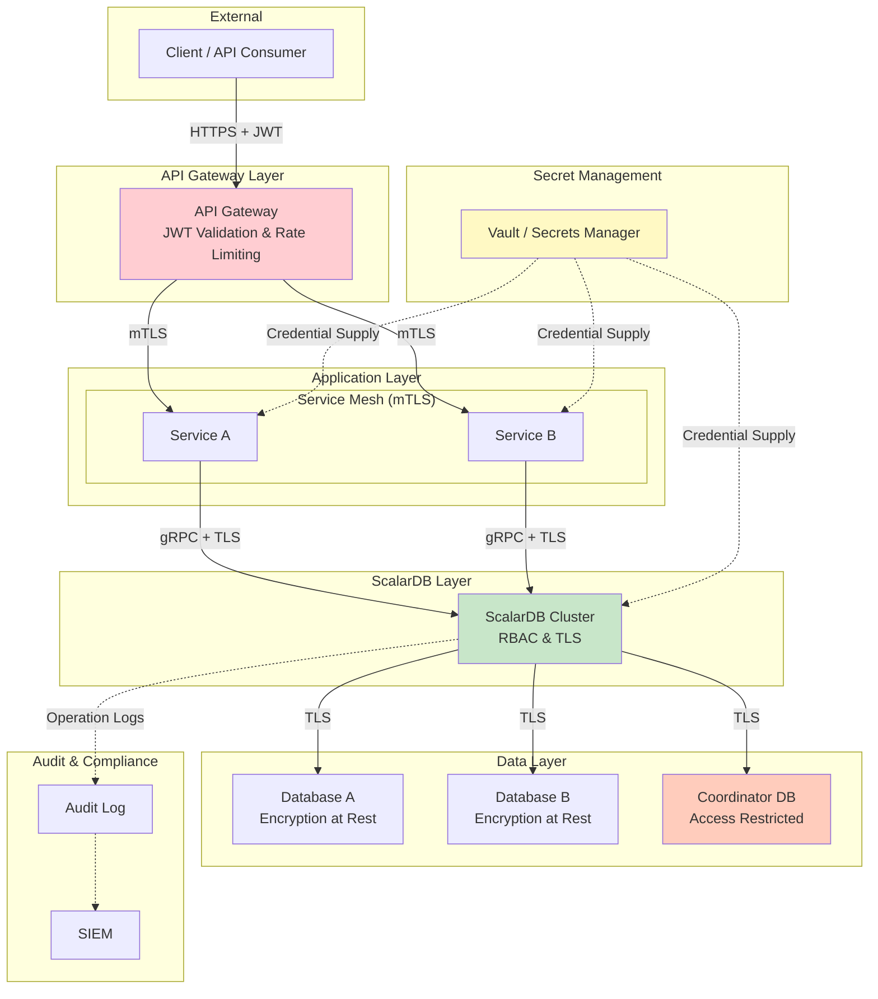
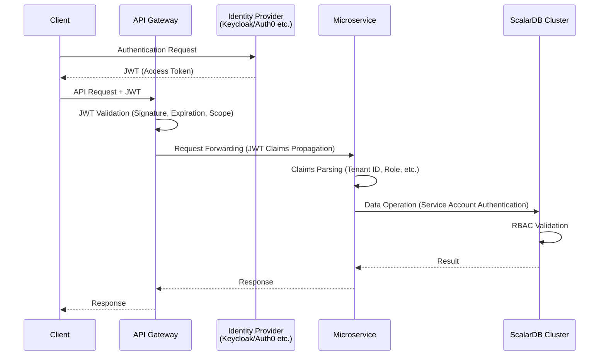
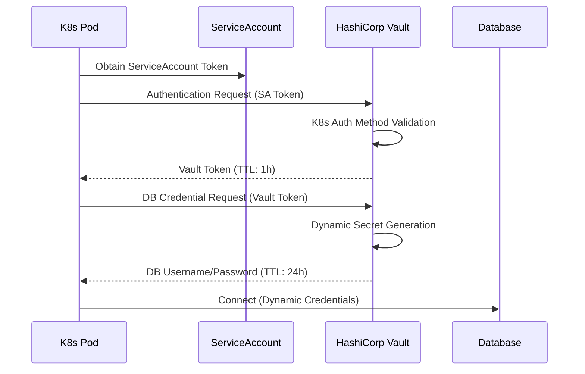
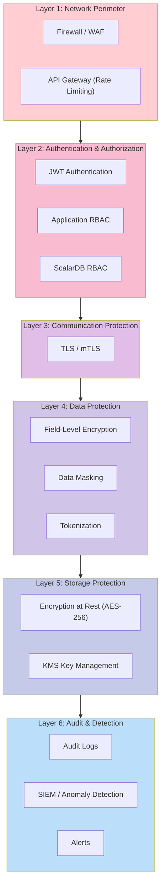

# Phase 3-2: Security Design

## Purpose

Design end-to-end security for a microservices system including ScalarDB Cluster, based on a Zero Trust architecture. Comprehensively cover authentication/authorization, communication encryption, data protection, secret management, audit logging, and compliance, achieving defense in depth.

---

## Inputs

| Input | Description | Source |
|-------|-------------|--------|
| Infrastructure Design | K8s cluster configuration and network design from Step 07 | Phase 3-1 Deliverables |
| Non-Functional Requirements | Security and compliance requirements defined in Step 01 | Phase 1 Deliverables |
| Data Model Design | Table structure and PII fields designed in Step 04 | Phase 2 Deliverables |
| Transaction Design | Transaction boundaries designed in Step 05 | Phase 2 Deliverables |

---

## Reference Materials

| Document | Section | Purpose |
|----------|---------|---------|
| [`../research/10_security.md`](../research/10_security.md) | Entire document | ScalarDB-specific security considerations, RBAC design, audit log interim measures |

---

## Security Architecture Overview



---

## Steps

### Step 8.1: Authentication & Authorization Design

Design access control to ScalarDB Cluster using a combination of RBAC, JWT, and mTLS.

#### ScalarDB RBAC Design

Leverage ScalarDB Cluster's RBAC feature to restrict accessible tables and operations per service.

**Role Design Template:**

| Role Name | Description | Target Service |
|-----------|-------------|----------------|
| `order_service_role` | Read/Write on order-related tables | Order Service |
| `inventory_service_role` | Read/Write on inventory-related tables | Inventory Service |
| `payment_service_role` | Read/Write on payment-related tables | Payment Service |
| `readonly_role` | Read Only on all tables | Analytics Service |
| `admin_role` | All operations on all tables | Admin tools (restricted use) |

**Permission Mapping Template:**

> **Note**: In ScalarDB RBAC, INSERT and UPDATE are always granted/revoked as a pair. Individual configuration is not possible.

| Role | Namespace | Table | SELECT | INSERT | UPDATE | DELETE |
|------|-----------|-------|--------|--------|--------|--------|
| `order_service_role` | `order` | `orders` | Yes | Yes | Yes | No |
| `order_service_role` | `order` | `order_items` | Yes | Yes | Yes | No |
| `order_service_role` | `inventory` | `stocks` | Yes | Yes | Yes | No |
| `inventory_service_role` | `inventory` | `stocks` | Yes | Yes | Yes | No |
| `inventory_service_role` | `inventory` | `warehouses` | Yes | Yes | Yes | No |
| `payment_service_role` | `payment` | `transactions` | Yes | Yes | Yes | No |

**User-Role Assignment:**

| Username | Assigned Role | Authentication Method | Notes |
|----------|---------------|----------------------|-------|
| `svc_order` | `order_service_role` | Certificate (mTLS) | For Order Service |
| `svc_inventory` | `inventory_service_role` | Certificate (mTLS) | For Inventory Service |
| `svc_payment` | `payment_service_role` | Certificate (mTLS) | For Payment Service |
| `svc_analytics` | `readonly_role` | Certificate (mTLS) | For Analytics Service |
| `admin` | `admin_role` | Certificate + MFA* | Administrator (restricted use) |

> **\*Note on MFA**: MFA (Multi-Factor Authentication) is not a native feature of ScalarDB RBAC. To apply MFA for administrator access, you need to implement MFA at an external layer (e.g., HashiCorp Vault, bastion host, VPN gateway, etc.) and only allow connections to ScalarDB after passing that authentication.

#### JWT Authentication Flow Design



| JWT Design Item | Design Value | Notes |
|-----------------|-------------|-------|
| Token Types | Access Token + Refresh Token | |
| Signing Algorithm | RS256 | Asymmetric key |
| Access Token Expiration | 15 minutes | Short-lived token |
| Refresh Token Expiration | 7 days | |
| Claims | sub, iss, aud, exp, tenant_id, roles, scopes | |
| Validation Location | API Gateway + Each Service (dual validation) | |

#### mTLS Design (Inter-Service Communication)

| Communication Path | mTLS | Certificate Management | Notes |
|-------------------|------|----------------------|-------|
| Client -> API Gateway | TLS (Server Certificate) | Let's Encrypt / ACM | Public endpoint |
| API Gateway -> Service | mTLS | Service Mesh / cert-manager | Internal communication |
| Service -> ScalarDB Cluster | mTLS | cert-manager / Vault PKI | ScalarDB connection authentication |
| ScalarDB Cluster -> Database | TLS | Managed DB certificate | DB connection encryption |

**Verification Points:**
- [ ] Are RBAC roles per service based on the principle of least privilege?
- [ ] Is JWT validation performed at both the API Gateway and services?
- [ ] Is automatic mTLS certificate rotation designed?
- [ ] Is usage of admin_role restricted?

---

### Step 8.2: Communication Encryption Design

Design encryption for all communication paths.

#### TLS Configuration (Client -> ScalarDB Cluster)

```yaml
# ScalarDB Cluster TLS Configuration (Helm values.yaml excerpt)
scalardbCluster:
  scalardbClusterNodeProperties: |
    # TLS Configuration
    scalar.db.cluster.tls.enabled=true
    scalar.db.cluster.tls.ca_root_cert_path=/etc/scalardb/tls/ca.crt
    scalar.db.cluster.tls.override_authority=scalardb-cluster.example.com
```

#### mTLS Configuration (Between ScalarDB Cluster Nodes)

| Item | Design Value | Notes |
|------|-------------|-------|
| CA | Internal CA (cert-manager / Vault PKI) | Self-signed CA |
| Certificate Validity | 90 days | Automatic rotation |
| Key Length | RSA 2048bit / ECDSA P-256 | |
| CRL / OCSP | cert-manager CRL feature | Revocation management |
| Rotation Method | cert-manager automatic renewal | Auto-renewal 30 days before expiration |

#### DB Connection Encryption

| DB Type | Encryption Setting | Configuration Method | Notes |
|---------|-------------------|---------------------|-------|
| MySQL (RDS) | require_secure_transport=ON | RDS Parameter Group | |
| PostgreSQL (RDS) | sslmode=verify-full | ScalarDB JDBC Configuration | |

**Verification Points:**
- [ ] Is encryption designed for all communication paths (no plaintext communication)?
- [ ] Is automatic certificate rotation designed?
- [ ] Is the CA certificate management and distribution method clearly defined?

---

### Step 8.3: Data Protection Design

Design encryption at rest, field-level encryption, and data masking.

#### Encryption at Rest

| DB/Storage | Encryption Method | Key Management | Notes |
|------------|------------------|----------------|-------|
| RDS/Aurora | AES-256 | AWS KMS (CMK) | Enable default encryption |
| Cloud SQL | AES-256 | Google Cloud KMS | Default encryption |
| EBS (K8s PV) | AES-256 | AWS KMS | PV encryption |
| S3 (Backup) | AES-256 | AWS KMS (CMK) | SSE-KMS |

#### Field-Level Encryption (PII Protection)

Design application-level encryption for PII (Personally Identifiable Information) fields identified in Step 04 (Data Model Design).

| Table | Column | Data Classification | Encryption Required | Encryption Method | Notes |
|-------|--------|-------------------|--------------------|--------------------|-------|
| `users` | `email` | PII | Yes | AES-256-GCM | Not searchable -> use hash index |
| `users` | `phone` | PII | Yes | AES-256-GCM | |
| `payments` | `card_number` | PCI-DSS | Yes | Tokenization | PCI-DSS compliant |
| `orders` | `shipping_address` | PII | Yes | AES-256-GCM | |

**Encryption Key Management:**

| Item | Design Value | Notes |
|------|-------------|-------|
| KEK (Key Encryption Key) | KMS managed | AWS KMS / Google Cloud KMS |
| DEK (Data Encryption Key) | Envelope encryption | Encrypted with KEK and stored |
| Key Rotation | Annual | KMS automatic rotation feature |

#### Data Masking Design

| Purpose | Masking Method | Target Environment | Notes |
|---------|---------------|-------------------|-------|
| Log Output | Partial masking (`***@example.com`) | All environments | Do not include PII in logs |
| Development Environment | Static masking (dummy data generation) | dev / staging | Do not use production data |
| API Response | Dynamic masking (display control based on permissions) | All environments | RBAC-linked |
| Analytics | Anonymization / Pseudonymization | analytics | GDPR compliance |

**Verification Points:**
- [ ] Is encryption at rest enabled for all databases?
- [ ] Are PII fields identified with field-level encryption designed?
- [ ] Is the encryption key management and rotation method clearly defined?
- [ ] Is a mechanism designed to prevent production data from flowing into development environments?

---

### Step 8.4: Network Security Design

Design network security at both the Kubernetes level and the service mesh level.

#### NetworkPolicy (Allow-List Approach)

Refine the NetworkPolicy designed in Step 07 based on Zero Trust principles.

```yaml
# Default Deny Policy (common across all Namespaces)
apiVersion: networking.k8s.io/v1
kind: NetworkPolicy
metadata:
  name: default-deny-all
  namespace: scalardb
spec:
  podSelector: {}
  policyTypes:
    - Ingress
    - Egress
```

**Communication Allow Matrix:**

| Source | Destination | Port | Protocol | Allow Reason |
|--------|------------|------|----------|-------------|
| app namespace | scalardb namespace | 60053 | gRPC/TLS | ScalarDB API communication |
| scalardb namespace | DB subnet | 3306/5432 | JDBC/TLS | DB connection |
| monitoring namespace | scalardb namespace | 9080 | HTTP | Metrics collection |
| scalardb namespace | scalardb namespace | - | TCP | Intra-cluster communication |
| scalardb namespace | DNS | 53 | UDP/TCP | Name resolution |
| app namespace | app namespace | - | gRPC/TLS | Inter-service communication |

#### Service Mesh Evaluation

| Item | Istio | Linkerd | No Service Mesh | Selection |
|------|-------|---------|-----------------|-----------|
| mTLS Automation | Automatic | Automatic | cert-manager manual | |
| Resource Overhead | Large | Small | None | |
| gRPC Support | Good | Good | N/A | |
| Learning Curve | High | Medium | Low | |
| Traffic Control | Feature-rich | Basic | K8s standard | |
| Operational Complexity | High | Medium | Low | |

**Decision:**
```
[ ] Adopt Istio
[ ] Adopt Linkerd
[ ] No Service Mesh (handle with NetworkPolicy + cert-manager)
Decision rationale: _______________________________________________
```

**Verification Points:**
- [ ] Is the default Deny policy applied to all Namespaces?
- [ ] Is communication allowed on an allow-list basis (minimum necessary)?
- [ ] Is the Service Mesh adoption/rejection decision justified?

---

### Step 8.5: Secret Management Design

Design secret management for database credentials, TLS certificates, API keys, etc.

#### Secret Management Method Selection

| Item | HashiCorp Vault | AWS Secrets Manager | K8s Secrets + Sealed Secrets | Selection |
|------|----------------|--------------------|-----------------------------|-----------|
| Dynamic Secret Generation | Supported | Limited | Not supported | |
| DB Credential Rotation | Automatic | Automatic | Manual | |
| K8s Integration | Vault Agent Injector | External Secrets Operator | Native | |
| Cost | Self-hosted or HCP | Pay-per-use | Free | |
| Audit Logging | Detailed | CloudTrail integration | K8s Audit Log | |
| Complexity | High | Medium | Low | |

**Decision:**
```
[ ] HashiCorp Vault
[ ] AWS Secrets Manager / Azure Key Vault / Google Secret Manager
[ ] K8s Secrets + Sealed Secrets
Decision rationale: _______________________________________________
```

#### Secret Inventory and Management Methods

| Secret Name | Purpose | Storage | Rotation | Notes |
|-------------|---------|---------|----------|-------|
| ScalarDB DB Password | ScalarDB -> DB connection | Vault / Secrets Manager | Automatic every 90 days | |
| ScalarDB License Key | ScalarDB license | Vault / Secrets Manager | At license renewal | |
| TLS Certificate (ScalarDB) | gRPC communication encryption | cert-manager / Vault PKI | Automatic every 90 days | |
| TLS Certificate (DB Connection) | DB connection encryption | cert-manager | Automatic every 90 days | |
| JWT Signing Key | Token signing | Vault / Secrets Manager | Annual | |
| API Keys | External service integration | Vault / Secrets Manager | As required | |

#### Static Token Avoidance Design

When adopting Vault, the use of auth methods rather than static tokens is recommended.

| Auth Method | Purpose | Notes |
|------------|---------|-------|
| Kubernetes Auth | K8s Pod -> Vault authentication | Automatic authentication via ServiceAccount token |
| AWS IAM Auth | AWS environment instance authentication | IAM role-based |
| AppRole | CI/CD pipeline authentication | RoleID + SecretID |



**Verification Points:**
- [ ] Are storage locations and management methods defined for all secrets?
- [ ] Is automatic rotation designed?
- [ ] Are static tokens/hard-coded credentials eliminated?
- [ ] Are auth methods used when using Vault (avoiding static tokens)?

---

### Step 8.6: Audit Log Design

Design audit logs for ScalarDB operations, DB operations, and K8s operations.

#### ScalarDB Operation Audit Logs

ScalarDB does not currently provide native audit log functionality. Refer to `10_security.md` and implement the following interim measures.

**Interim Measures (5 items):**

| # | Interim Measure | Implementation Method | Notes |
|---|----------------|----------------------|-------|
| 1 | Application-level operation logs | Output logs before and after ScalarDB API calls in each service | Structured logs (JSON) |
| 2 | gRPC Interceptor | Log all requests via Envoy/gRPC interceptor | Request/response metadata |
| 3 | DB-side audit logs | Enable audit log features of each DB | MySQL Audit Plugin, pgAudit, etc. |
| 4 | K8s Audit Log | Record ScalarDB-related Pod operations via K8s Audit Log | API Server Audit Policy |
| 5 | Coordinator table query logs | Enable query logging for the Coordinator DB | Transaction state tracking |

**Audit Log Format (Application Level):**

```json
{
  "timestamp": "2025-01-15T10:30:00.000Z",
  "level": "AUDIT",
  "service": "order-service",
  "user": "svc_order",
  "action": "PUT",
  "namespace": "order",
  "table": "orders",
  "transaction_id": "tx-12345",
  "partition_key": {"order_id": "ORD-001"},
  "result": "SUCCESS",
  "latency_ms": 25,
  "source_ip": "10.0.10.15",
  "trace_id": "abc123def456"
}
```

#### DB Operation Audit Logs

| DB Type | Audit Log Feature | Configuration Method | Storage |
|---------|-------------------|---------------------|---------|
| MySQL | MySQL Enterprise Audit / MariaDB Audit Plugin | Parameter Group | CloudWatch Logs / S3 |
| PostgreSQL | pgAudit Extension | Parameter Group | CloudWatch Logs / S3 |

#### K8s Audit Logs

| Audit Target | Audit Level | Notes |
|-------------|-------------|-------|
| All operations in ScalarDB namespace | RequestResponse | Record all requests and responses |
| Secret operations | Metadata | Do not record values such as passwords |
| ConfigMap operations | Request | Track configuration changes |
| RBAC operations | RequestResponse | Track permission changes |

**Verification Points:**
- [ ] Are all 5 interim measures for ScalarDB operation audit logs designed?
- [ ] Is DB-side audit logging designed to be enabled?
- [ ] Is the K8s Audit Policy designed?
- [ ] Are audit log retention periods and storage locations defined?
- [ ] Are audit log tamper-prevention measures considered?

---

### Step 8.7: Coordinator Table Protection

The ScalarDB Coordinator table is the core of transaction control and requires special protection. Refer to `10_security.md` and design 4 protection measures.

#### 4 Protection Measures

| # | Protection Measure | Implementation Method | Notes |
|---|-------------------|----------------------|-------|
| 1 | Dedicated DB User | Create a dedicated DB user for the Coordinator table, allowing access only from ScalarDB Cluster | Prohibit direct access from other services |
| 2 | Network Isolation | Block access to the Coordinator DB from namespaces other than ScalarDB namespace via NetworkPolicy | Allow-list approach |
| 3 | Operation Restriction | Limit DDL operations on the Coordinator table to Schema Loader only. Prohibit manual ALTER/DROP | Controlled via DB user permissions |
| 4 | Access Log Monitoring | Log all access to the Coordinator DB and detect/alert on anomalous query patterns | DB audit log + alert rules |

#### Coordinator DB Permission Design

```sql
-- Coordinator DB User (ScalarDB Cluster dedicated)
CREATE USER 'scalardb_coordinator'@'10.0.20.%' IDENTIFIED BY '<Vault managed>';
GRANT SELECT, INSERT, UPDATE, DELETE ON coordinator_db.* TO 'scalardb_coordinator'@'10.0.20.%';
-- DDL only for Schema Loader user
CREATE USER 'scalardb_schema_admin'@'<CI/CD IP>' IDENTIFIED BY '<Vault managed>';
GRANT ALL PRIVILEGES ON coordinator_db.* TO 'scalardb_schema_admin'@'<CI/CD IP>';

-- Direct access from application services is prohibited
-- (Dual defense with NetworkPolicy + DB user restrictions)
```

#### Coordinator DB Access Monitoring Alerts

| Alert Condition | Severity | Action |
|-----------------|----------|--------|
| Access attempt from unknown IP | Critical | Immediate investigation |
| DDL operation detected (not from Schema Loader) | Critical | Immediate block |
| High volume of SELECT queries (deviation from normal pattern) | Warning | Investigation |
| Consecutive authentication failures | Warning | Consider account lock |

**Verification Points:**
- [ ] Is a dedicated DB user designed for the Coordinator table?
- [ ] Is network-level access restriction designed?
- [ ] Are DDL operations limited to Schema Loader?
- [ ] Are access log monitoring and alerts designed?

---

### Step 8.8: Compliance Requirements Verification

Identify applicable compliance regulations and verify alignment with the security design.

#### Compliance Applicability Assessment

| Regulation | Applicable | Reason for Applicability | Key Requirements to Address |
|------------|-----------|------------------------|----------------------------|
| GDPR | Yes / No / N/A | | Data subject rights, DPO appointment, etc. |
| PCI-DSS | Yes / No / N/A | | Card data protection, network segmentation, etc. |
| HIPAA | Yes / No / N/A | | Medical information protection, access control, etc. |
| Personal Information Protection Act | Yes / No / N/A | | Proper management of personal data |
| SOC 2 | Yes / No / N/A | | Security, availability, etc. |

#### Compliance Mapping (GDPR Example)

| GDPR Requirement | Corresponding Security Design | Implementation Status | Gap |
|-----------------|-------------------------------|----------------------|-----|
| Art.5(1)(f) Integrity and Confidentiality | Step 8.2: Communication Encryption, Step 8.3: Encryption at Rest | | |
| Art.17 Right to Erasure (Right to be Forgotten) | Application feature + ScalarDB DELETE | | |
| Art.20 Data Portability | Data export API design | | |
| Art.25 Data Protection by Design | Step 8.3: Field-level Encryption, Masking | | |
| Art.30 Records of Processing Activities | Step 8.6: Audit Logs | | |
| Art.32 Security of Processing | Steps 8.1-8.7 Overall | | |
| Art.33 Data Breach Notification | Incident response procedures | | |

#### Defense in Depth Design for Personal Data



**Verification Points:**
- [ ] Are applicable compliance regulations identified?
- [ ] Is the mapping between each regulation requirement and design content completed?
- [ ] Are gaps (insufficient coverage) identified with countermeasures planned?
- [ ] Is defense in depth designed?

---

## Deliverables

| Deliverable | Description | Format |
|-------------|-------------|--------|
| Security Design Document | Design document reflecting the results of this document | Markdown |
| RBAC Definition | ScalarDB RBAC configuration files (roles, users, permissions) | Configuration files |
| TLS Certificate Management Plan | Operational procedures for certificate issuance, rotation, and revocation | Markdown / Runbook |
| Compliance Checklist | Mapping table of applicable regulations and design responses | Spreadsheet / Markdown |
| Secret Management Design | Secret inventory and management method definitions | Markdown |
| Audit Log Design | Log format, storage location, and retention period definitions | Markdown + JSON Schema |

---

## Completion Criteria Checklist

- [ ] The design is based on Zero Trust architecture principles (Never Trust, Always Verify)
- [ ] ScalarDB RBAC role and permission design meets the principle of least privilege
- [ ] TLS/mTLS encryption is designed for all communication paths
- [ ] Encryption at rest is designed to be enabled for all databases
- [ ] Field-level encryption and masking are designed for PII fields
- [ ] NetworkPolicy is designed with default Deny + allow-list approach
- [ ] Secret management method is selected with automatic rotation designed
- [ ] Static tokens/hard-coded credentials are eliminated
- [ ] All 5 interim measures for ScalarDB operation audit logs are designed
- [ ] All 4 protection measures for the Coordinator table are designed
- [ ] Mapping with applicable compliance regulations is completed
- [ ] Security design is consistent with the infrastructure design from Step 07
- [ ] Review by stakeholders (security team, architects) is completed

---

## Handoff Items for Next Steps

### Handoff to Phase 4-1: Implementation Guide (`11_implementation_guide.md`)

| Handoff Item | Content |
|-------------|---------|
| RBAC Configuration | Role definitions, permission mappings |
| TLS/mTLS Configuration | Certificate management method, configuration values |
| Secret Management | Vault/Secrets Manager integration method |
| Audit Log Implementation | Application-level log output specifications |
| Data Protection | Field-level encryption implementation method |
