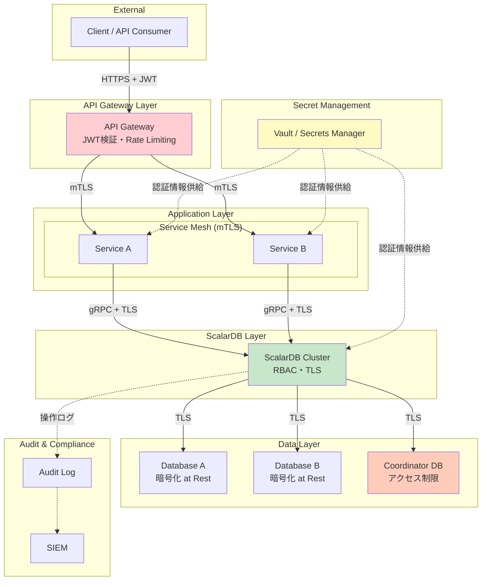
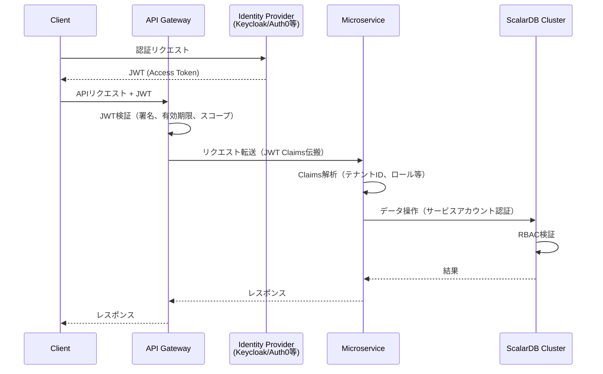
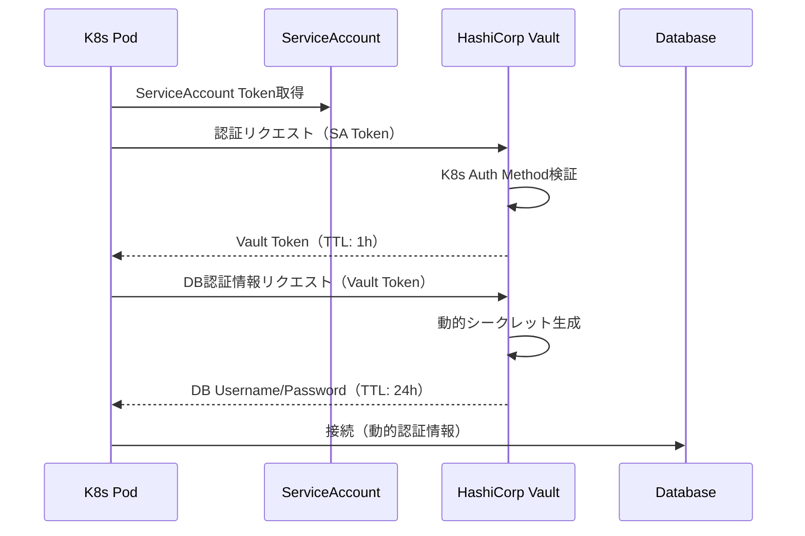
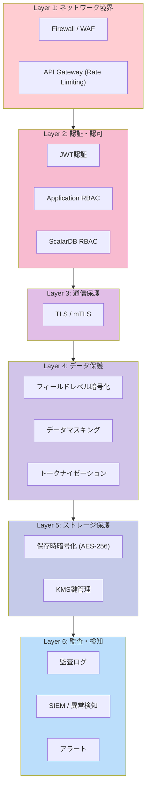

# Phase 3-2: セキュリティ設計

## 目的

ゼロトラストアーキテクチャに基づき、ScalarDB Clusterを含むマイクロサービスシステム全体のセキュリティを設計する。認証・認可、通信暗号化、データ保護、シークレット管理、監査ログ、コンプライアンス対応を網羅的にカバーし、多層防御を実現する。

---

## 入力

| 入力物 | 説明 | 提供元 |
|--------|------|--------|
| インフラ設計 | Step 07で設計したK8sクラスタ構成、ネットワーク設計 | Phase 3-1 成果物 |
| 非機能要件 | Step 01で定義したセキュリティ・コンプライアンス要件 | Phase 1 成果物 |
| データモデル設計 | Step 04で設計したテーブル構成、PII項目 | Phase 2 成果物 |
| トランザクション設計 | Step 05で設計したトランザクション境界 | Phase 2 成果物 |

---

## 参照資料

| 資料 | 参照箇所 | 用途 |
|------|----------|------|
| [`../research/10_security.md`](../research/10_security.md) | 全体 | ScalarDB固有のセキュリティ考慮事項、RBAC設計、監査ログ暫定措置 |

---

## セキュリティアーキテクチャ全体像



---

## ステップ

### Step 8.1: 認証・認可設計

ScalarDB Clusterへのアクセス制御をRBAC、JWT、mTLSの組み合わせで設計する。

#### ScalarDB RBAC 設計

ScalarDB ClusterのRBAC機能を活用し、サービスごとにアクセス可能なテーブル・操作を制限する。

**ロール設計テンプレート:**

| ロール名 | 説明 | 対象サービス |
|---------|------|-------------|
| `order_service_role` | 注文関連テーブルへのRead/Write | Order Service |
| `inventory_service_role` | 在庫関連テーブルへのRead/Write | Inventory Service |
| `payment_service_role` | 決済関連テーブルへのRead/Write | Payment Service |
| `readonly_role` | 全テーブルへのRead Only | Analytics Service |
| `admin_role` | 全テーブルへの全操作 | 管理ツール（制限的使用） |

**権限マッピングテンプレート:**

> **注意**: ScalarDB の RBAC では INSERT と UPDATE は常にセットで付与/取り消しされる。個別の設定は不可。

| ロール | Namespace | Table | SELECT | INSERT | UPDATE | DELETE |
|--------|-----------|-------|--------|--------|--------|--------|
| `order_service_role` | `order` | `orders` | Yes | Yes | Yes | No |
| `order_service_role` | `order` | `order_items` | Yes | Yes | Yes | No |
| `order_service_role` | `inventory` | `stocks` | Yes | Yes | Yes | No |
| `inventory_service_role` | `inventory` | `stocks` | Yes | Yes | Yes | No |
| `inventory_service_role` | `inventory` | `warehouses` | Yes | Yes | Yes | No |
| `payment_service_role` | `payment` | `transactions` | Yes | Yes | Yes | No |

**ユーザー・ロール割り当て:**

| ユーザー名 | 割り当てロール | 認証方式 | 備考 |
|-----------|--------------|---------|------|
| `svc_order` | `order_service_role` | Certificate (mTLS) | Order Service用 |
| `svc_inventory` | `inventory_service_role` | Certificate (mTLS) | Inventory Service用 |
| `svc_payment` | `payment_service_role` | Certificate (mTLS) | Payment Service用 |
| `svc_analytics` | `readonly_role` | Certificate (mTLS) | Analytics Service用 |
| `admin` | `admin_role` | Certificate + MFA※ | 管理者（制限的使用） |

> **※MFAに関する注意**: MFA（多要素認証）はScalarDB RBACのネイティブ機能ではありません。管理者アクセスにMFAを適用するには、外部レイヤー（例: HashiCorp Vault、踏み台サーバー（Bastion Host）、VPNゲートウェイ等）でMFAを実施し、その認証を通過した後にScalarDBへの接続を許可する構成とする必要があります。

#### JWT 認証フロー設計



| JWT設計項目 | 設計値 | 備考 |
|------------|-------|------|
| トークン種類 | Access Token + Refresh Token | |
| 署名アルゴリズム | RS256 | 非対称鍵 |
| Access Token有効期限 | 15分 | 短命トークン |
| Refresh Token有効期限 | 7日 | |
| Claims | sub, iss, aud, exp, tenant_id, roles, scopes | |
| 検証場所 | API Gateway + 各サービス（二重検証） | |

#### mTLS 設計（サービス間通信）

| 通信経路 | mTLS | 証明書管理 | 備考 |
|---------|------|-----------|------|
| Client -> API Gateway | TLS（サーバー証明書） | Let's Encrypt / ACM | 公開エンドポイント |
| API Gateway -> Service | mTLS | Service Mesh / cert-manager | 内部通信 |
| Service -> ScalarDB Cluster | mTLS | cert-manager / Vault PKI | ScalarDB接続認証 |
| ScalarDB Cluster -> Database | TLS | マネージドDB証明書 | DB接続暗号化 |

**確認ポイント:**
- [ ] サービスごとのRBACロールが最小権限原則に基づいているか
- [ ] JWT検証がAPI Gatewayとサービスの両方で実施されているか
- [ ] mTLS証明書の自動ローテーション方式が設計されているか
- [ ] admin_roleの使用が制限されているか

---

### Step 8.2: 通信暗号化設計

全通信経路の暗号化を設計する。

#### TLS 設定（Client -> ScalarDB Cluster）

```yaml
# ScalarDB Cluster TLS設定（Helm values.yaml 抜粋）
scalardbCluster:
  scalardbClusterNodeProperties: |
    # TLS設定
    scalar.db.cluster.tls.enabled=true
    scalar.db.cluster.tls.ca_root_cert_path=/etc/scalardb/tls/ca.crt
    scalar.db.cluster.tls.override_authority=scalardb-cluster.example.com
```

#### mTLS 設定（ScalarDB Cluster 間）

| 項目 | 設計値 | 備考 |
|------|-------|------|
| CA | 内部CA（cert-manager / Vault PKI） | 自己署名CA |
| 証明書有効期限 | 90日 | 自動ローテーション |
| 鍵長 | RSA 2048bit / ECDSA P-256 | |
| CRL / OCSP | cert-managerのCRL機能 | 失効管理 |
| ローテーション方式 | cert-manager自動更新 | 有効期限30日前に自動更新 |

#### DB 接続暗号化

| DB種類 | 暗号化設定 | 設定方法 | 備考 |
|--------|-----------|---------|------|
| MySQL (RDS) | require_secure_transport=ON | RDSパラメータグループ | |
| PostgreSQL (RDS) | sslmode=verify-full | ScalarDB JDBC設定 | |

**確認ポイント:**
- [ ] 全通信経路で暗号化が設計されているか（平文通信が存在しないか）
- [ ] 証明書の自動ローテーションが設計されているか
- [ ] CA証明書の管理・配布方式が明確か

---

### Step 8.3: データ保護設計

保存時暗号化、フィールドレベル暗号化、データマスキングを設計する。

#### 保存時暗号化（Encryption at Rest）

| DB/ストレージ | 暗号化方式 | 鍵管理 | 備考 |
|-------------|-----------|--------|------|
| RDS/Aurora | AES-256 | AWS KMS (CMK) | デフォルト暗号化を有効化 |
| Cloud SQL | AES-256 | Google Cloud KMS | デフォルト暗号化 |
| EBS (K8s PV) | AES-256 | AWS KMS | PV暗号化 |
| S3 (バックアップ) | AES-256 | AWS KMS (CMK) | SSE-KMS |

#### フィールドレベル暗号化（PII保護）

Step 04（データモデル設計）で特定したPII（個人情報）項目に対し、アプリケーションレベルの暗号化を設計する。

| テーブル | カラム | データ分類 | 暗号化要否 | 暗号化方式 | 備考 |
|---------|--------|-----------|-----------|-----------|------|
| `users` | `email` | PII | Yes | AES-256-GCM | 検索不可 → ハッシュインデックス併用 |
| `users` | `phone` | PII | Yes | AES-256-GCM | |
| `payments` | `card_number` | PCI-DSS | Yes | トークナイゼーション | PCI-DSS準拠 |
| `orders` | `shipping_address` | PII | Yes | AES-256-GCM | |

**暗号化鍵管理:**

| 項目 | 設計値 | 備考 |
|------|-------|------|
| KEK（鍵暗号化鍵） | KMS管理 | AWS KMS / Google Cloud KMS |
| DEK（データ暗号化鍵） | エンベロープ暗号化 | KEKで暗号化して保存 |
| 鍵ローテーション | 年1回 | KMSの自動ローテーション機能 |

#### データマスキング設計

| 用途 | マスキング方式 | 対象環境 | 備考 |
|------|--------------|---------|------|
| ログ出力 | 部分マスキング（`***@example.com`） | 全環境 | ログにPIIを含めない |
| 開発環境 | 静的マスキング（ダミーデータ生成） | dev / staging | 本番データを使用しない |
| APIレスポンス | 動的マスキング（権限に応じた表示制御） | 全環境 | RBAC連動 |
| 分析用途 | 匿名化 / 仮名化 | analytics | GDPR対応 |

**確認ポイント:**
- [ ] 全DBで保存時暗号化が有効化されているか
- [ ] PII項目が特定され、フィールドレベル暗号化が設計されているか
- [ ] 暗号化鍵の管理・ローテーション方式が明確か
- [ ] 開発環境に本番データが流入しない仕組みが設計されているか

---

### Step 8.4: ネットワークセキュリティ設計

Kubernetesレベルおよびサービスメッシュレベルのネットワークセキュリティを設計する。

#### NetworkPolicy（allow-list方式）

Step 07で設計したNetworkPolicyをゼロトラスト原則に基づき精緻化する。

```yaml
# デフォルトDenyポリシー（各Namespace共通）
apiVersion: networking.k8s.io/v1
kind: NetworkPolicy
metadata:
  name: default-deny-all
  namespace: scalardb
spec:
  podSelector: {}
  policyTypes:
    - Ingress
    - Egress
```

**通信許可マトリクス:**

| 送信元 | 送信先 | ポート | プロトコル | 許可理由 |
|--------|-------|--------|----------|---------|
| app namespace | scalardb namespace | 60053 | gRPC/TLS | ScalarDB API通信 |
| scalardb namespace | DB subnet | 3306/5432 | JDBC/TLS | DB接続 |
| monitoring namespace | scalardb namespace | 9080 | HTTP | メトリクス収集 |
| scalardb namespace | scalardb namespace | - | TCP | クラスタ内通信 |
| scalardb namespace | DNS | 53 | UDP/TCP | 名前解決 |
| app namespace | app namespace | - | gRPC/TLS | サービス間通信 |

#### Service Mesh 検討

| 項目 | Istio | Linkerd | Service Mesh なし | 選定 |
|------|-------|---------|------------------|------|
| mTLS自動化 | 自動 | 自動 | cert-manager手動 | |
| リソースオーバーヘッド | 大 | 小 | なし | |
| gRPC対応 | 良好 | 良好 | N/A | |
| 学習コスト | 高 | 中 | 低 | |
| トラフィック制御 | 高機能 | 基本的 | K8s標準 | |
| 運用複雑度 | 高 | 中 | 低 | |

**判定:**
```
[ ] Istio採用
[ ] Linkerd採用
[ ] Service Mesh不採用（NetworkPolicy + cert-managerで対応）
判定理由: _______________________________________________
```

**確認ポイント:**
- [ ] デフォルトDenyポリシーが全Namespaceに適用されているか
- [ ] 通信許可がallow-list方式（必要最小限）で設計されているか
- [ ] Service Meshの採否が根拠をもって判断されているか

---

### Step 8.5: シークレット管理設計

データベース認証情報、TLS証明書、APIキー等のシークレット管理を設計する。

#### シークレット管理方式選定

| 項目 | HashiCorp Vault | AWS Secrets Manager | K8s Secrets + Sealed Secrets | 選定 |
|------|----------------|--------------------|-----------------------------|------|
| 動的シークレット生成 | 対応 | 限定的 | 非対応 | |
| DB認証情報ローテーション | 自動 | 自動 | 手動 | |
| K8s連携 | Vault Agent Injector | External Secrets Operator | Native | |
| コスト | セルフホスト or HCP | 従量課金 | 無料 | |
| 監査ログ | 詳細 | CloudTrail連携 | K8s Audit Log | |
| 複雑度 | 高 | 中 | 低 | |

**判定:**
```
[ ] HashiCorp Vault
[ ] AWS Secrets Manager / Azure Key Vault / Google Secret Manager
[ ] K8s Secrets + Sealed Secrets
判定理由: _______________________________________________
```

#### シークレット一覧と管理方式

| シークレット名 | 用途 | 保存先 | ローテーション | 備考 |
|-------------|------|-------|-------------|------|
| ScalarDB DB Password | ScalarDB → DB接続 | Vault / Secrets Manager | 90日ごと自動 | |
| ScalarDB License Key | ScalarDB ライセンス | Vault / Secrets Manager | ライセンス更新時 | |
| TLS証明書（ScalarDB） | gRPC通信暗号化 | cert-manager / Vault PKI | 90日ごと自動 | |
| TLS証明書（DB接続） | DB接続暗号化 | cert-manager | 90日ごと自動 | |
| JWT署名鍵 | トークン署名 | Vault / Secrets Manager | 年1回 | |
| API Keys | 外部サービス連携 | Vault / Secrets Manager | 要件に応じて | |

#### 静的トークン回避設計

Vaultを採用する場合、静的トークンではなくauth methodの使用を推奨する。

| Auth Method | 用途 | 備考 |
|------------|------|------|
| Kubernetes Auth | K8s Pod → Vault認証 | ServiceAccountトークンによる自動認証 |
| AWS IAM Auth | AWS環境のインスタンス認証 | IAMロールベース |
| AppRole | CI/CDパイプライン認証 | RoleID + SecretID |



**確認ポイント:**
- [ ] 全シークレットの保存先と管理方式が定義されているか
- [ ] 自動ローテーションが設計されているか
- [ ] 静的トークン/ハードコードされた認証情報が排除されているか
- [ ] Vault利用時にauth methodが使用されているか（静的トークン回避）

---

### Step 8.6: 監査ログ設計

ScalarDB操作、DB操作、K8s操作の監査ログを設計する。

#### ScalarDB操作の監査ログ

ScalarDBは現時点でネイティブの監査ログ機能を提供していない。`10_security.md` を参照し、以下の暫定措置を実装する。

**暫定措置（5項目）:**

| # | 暫定措置 | 実装方式 | 備考 |
|---|---------|---------|------|
| 1 | アプリケーションレベルの操作ログ | 各サービスでScalarDB API呼び出し前後にログ出力 | 構造化ログ（JSON） |
| 2 | gRPCインターセプター | Envoy/gRPCインターセプターで全リクエストをログ | リクエスト/レスポンスメタデータ |
| 3 | DB側の監査ログ | 各DBの監査ログ機能を有効化 | MySQL Audit Plugin, pgAudit等 |
| 4 | K8s Audit Log | ScalarDB関連Podの操作をK8s Audit Logで記録 | API Server Audit Policy |
| 5 | Coordinatorテーブルのクエリログ | Coordinator DBのクエリログを有効化 | トランザクション状態追跡 |

**監査ログフォーマット（アプリケーションレベル）:**

```json
{
  "timestamp": "2025-01-15T10:30:00.000Z",
  "level": "AUDIT",
  "service": "order-service",
  "user": "svc_order",
  "action": "PUT",
  "namespace": "order",
  "table": "orders",
  "transaction_id": "tx-12345",
  "partition_key": {"order_id": "ORD-001"},
  "result": "SUCCESS",
  "latency_ms": 25,
  "source_ip": "10.0.10.15",
  "trace_id": "abc123def456"
}
```

#### DB操作の監査ログ

| DB種類 | 監査ログ機能 | 設定方法 | 保存先 |
|--------|------------|---------|-------|
| MySQL | MySQL Enterprise Audit / MariaDB Audit Plugin | パラメータグループ | CloudWatch Logs / S3 |
| PostgreSQL | pgAudit拡張 | パラメータグループ | CloudWatch Logs / S3 |

#### K8s 監査ログ

| 監査対象 | Audit Level | 備考 |
|---------|-------------|------|
| ScalarDB namespace全操作 | RequestResponse | 全リクエスト・レスポンスを記録 |
| Secret操作 | Metadata | パスワード等の値は記録しない |
| ConfigMap操作 | Request | 設定変更を追跡 |
| RBAC操作 | RequestResponse | 権限変更を追跡 |

**確認ポイント:**
- [ ] ScalarDB操作の監査ログ暫定措置5項目が全て設計されているか
- [ ] DB側の監査ログが有効化される設計になっているか
- [ ] K8s Audit Policyが設計されているか
- [ ] 監査ログの保存期間・保存先が定義されているか
- [ ] 監査ログの改ざん防止策が検討されているか

---

### Step 8.7: Coordinatorテーブル保護

ScalarDBのCoordinatorテーブルはトランザクション制御の中核であり、特別な保護が必要。`10_security.md` を参照し、4つの保護措置を設計する。

#### 4つの保護措置

| # | 保護措置 | 実装方法 | 備考 |
|---|---------|---------|------|
| 1 | 専用DBユーザー | Coordinatorテーブル専用のDBユーザーを作成し、ScalarDB Clusterのみがアクセス可能にする | 他サービスからの直接アクセスを禁止 |
| 2 | ネットワーク分離 | NetworkPolicyでScalarDB namespace以外からCoordinator DBへのアクセスを遮断 | allow-list方式 |
| 3 | 操作制限 | CoordinatorテーブルへのDDL操作をSchema Loaderのみに限定。手動ALTER/DROP禁止 | DBユーザー権限で制御 |
| 4 | アクセスログ監視 | Coordinator DBへの全アクセスをログ記録し、異常なクエリパターンを検出・アラート | DB監査ログ + アラートルール |

#### Coordinator DB 権限設計

```sql
-- Coordinator用DBユーザー（ScalarDB Cluster専用）
CREATE USER 'scalardb_coordinator'@'10.0.20.%' IDENTIFIED BY '<Vault管理>';
GRANT SELECT, INSERT, UPDATE, DELETE ON coordinator_db.* TO 'scalardb_coordinator'@'10.0.20.%';
-- DDLはSchema Loader用ユーザーのみ
CREATE USER 'scalardb_schema_admin'@'<CI/CD IP>' IDENTIFIED BY '<Vault管理>';
GRANT ALL PRIVILEGES ON coordinator_db.* TO 'scalardb_schema_admin'@'<CI/CD IP>';

-- アプリケーションサービスからの直接アクセスは禁止
-- （NetworkPolicy + DBユーザー制限の二重防御）
```

#### Coordinator DB アクセス監視アラート

| アラート条件 | 重要度 | 対応 |
|------------|-------|------|
| 未知のIPからのアクセス試行 | Critical | 即時調査 |
| DDL操作の検出（Schema Loader以外） | Critical | 即時ブロック |
| 大量のSELECTクエリ（通常パターン逸脱） | Warning | 調査 |
| 認証失敗の連続発生 | Warning | アカウントロック検討 |

**確認ポイント:**
- [ ] Coordinatorテーブル専用のDBユーザーが設計されているか
- [ ] ネットワークレベルでのアクセス制限が設計されているか
- [ ] DDL操作がSchema Loaderに限定されているか
- [ ] アクセスログ監視とアラートが設計されているか

---

### Step 8.8: コンプライアンス要件の確認

適用されるコンプライアンス規制を特定し、セキュリティ設計との対応を確認する。

#### コンプライアンス適用判定

| 規制 | 適用有無 | 適用理由 | 対応すべき主要要件 |
|------|---------|---------|------------------|
| GDPR | Yes / No / N/A | | データ主体の権利、DPO設置等 |
| PCI-DSS | Yes / No / N/A | | カードデータ保護、ネットワーク分離等 |
| HIPAA | Yes / No / N/A | | 医療情報保護、アクセス制御等 |
| 個人情報保護法 | Yes / No / N/A | | 個人データの適正管理 |
| SOC 2 | Yes / No / N/A | | セキュリティ、可用性等 |

#### コンプライアンスマッピング（GDPR例）

| GDPR要件 | 対応するセキュリティ設計 | 実装状況 | Gap |
|---------|----------------------|---------|-----|
| Art.5(1)(f) 完全性と機密性 | Step 8.2: 通信暗号化、Step 8.3: 保存時暗号化 | | |
| Art.17 消去権（忘れられる権利） | アプリケーション機能 + ScalarDB DELETE | | |
| Art.20 データポータビリティ | データエクスポートAPI設計 | | |
| Art.25 データ保護バイデザイン | Step 8.3: フィールドレベル暗号化、マスキング | | |
| Art.30 処理活動の記録 | Step 8.6: 監査ログ | | |
| Art.32 処理のセキュリティ | Step 8.1-8.7 全体 | | |
| Art.33 データ侵害通知 | インシデント対応手順 | | |

#### 個人データの多層防御設計



**確認ポイント:**
- [ ] 適用されるコンプライアンス規制が特定されているか
- [ ] 各規制要件と設計内容のマッピングが完了しているか
- [ ] Gap（対応不足）が特定され、対策が計画されているか
- [ ] 多層防御が設計されているか

---

## 成果物

| 成果物 | 説明 | フォーマット |
|--------|------|-------------|
| セキュリティ設計書 | 本ドキュメントの設計結果を反映した設計書 | Markdown |
| RBAC定義 | ScalarDB RBAC設定ファイル（ロール、ユーザー、権限） | 設定ファイル |
| TLS証明書管理計画 | 証明書発行・ローテーション・失効の運用手順 | Markdown / Runbook |
| コンプライアンスチェックリスト | 適用規制と設計対応のマッピング表 | スプレッドシート / Markdown |
| シークレット管理設計 | シークレット一覧と管理方式の定義 | Markdown |
| 監査ログ設計 | ログフォーマット、保存先、保持期間の定義 | Markdown + JSON Schema |

---

## 完了基準チェックリスト

- [ ] ゼロトラストアーキテクチャの原則（Never Trust, Always Verify）に基づいた設計になっている
- [ ] ScalarDB RBACのロール・権限設計が最小権限原則を満たしている
- [ ] 全通信経路でTLS/mTLSによる暗号化が設計されている
- [ ] 保存時暗号化が全DBで有効化される設計になっている
- [ ] PII項目のフィールドレベル暗号化・マスキングが設計されている
- [ ] NetworkPolicyがデフォルトDeny + allow-list方式で設計されている
- [ ] シークレット管理方式が選定され、自動ローテーションが設計されている
- [ ] 静的トークン/ハードコードされた認証情報が排除されている
- [ ] ScalarDB操作の監査ログ暫定措置5項目が全て設計されている
- [ ] Coordinatorテーブルの4つの保護措置が全て設計されている
- [ ] 適用されるコンプライアンス規制とのマッピングが完了している
- [ ] セキュリティ設計がStep 07のインフラ設計と整合している
- [ ] 関係者（セキュリティチーム、アーキテクト）のレビューが完了している

---

## 次のステップへの引き継ぎ事項

### Phase 4-1: 実装ガイド（`11_implementation_guide.md`）への引き継ぎ

| 引き継ぎ項目 | 内容 |
|-------------|------|
| RBAC設定 | ロール定義、権限マッピング |
| TLS/mTLS設定 | 証明書管理方式、設定値 |
| シークレット管理 | Vault/Secrets Manager連携方式 |
| 監査ログ実装 | アプリケーションレベルのログ出力仕様 |
| データ保護 | フィールドレベル暗号化の実装方式 |
