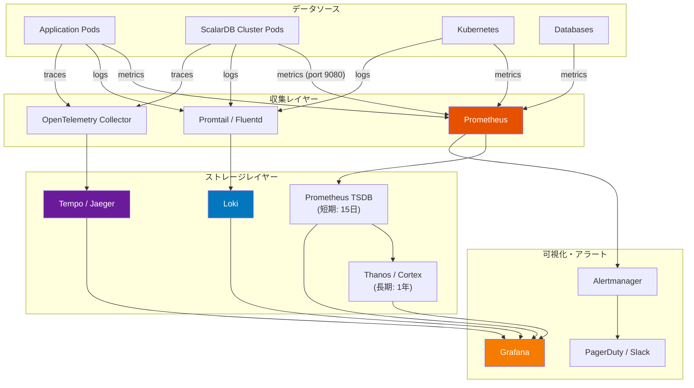
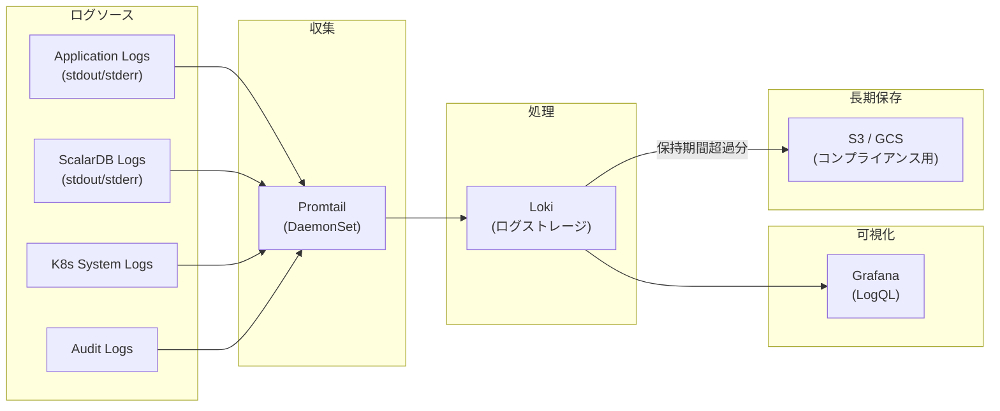
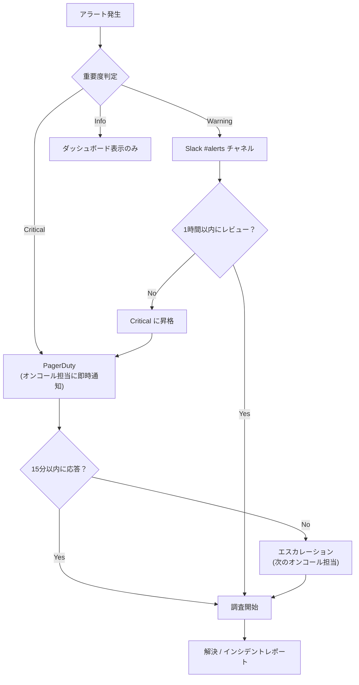
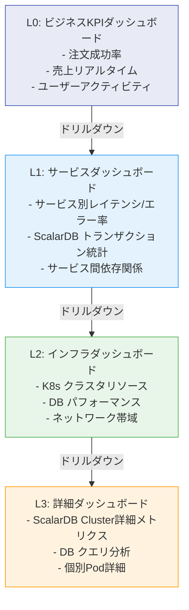
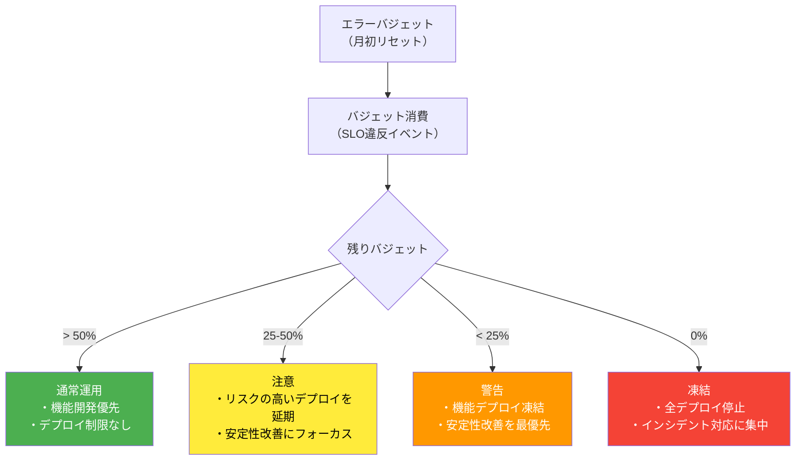

```mermaid
gantt
    title ScalarDB 2PC Transaction Trace
    dateFormat X
    axisFormat %L ms

    section Client
    API Request           :a1, 0, 5

    section App Service
    Business Logic        :a2, 5, 10
    ScalarDB Begin Tx     :a3, 10, 12

    section ScalarDB Cluster
    Transaction Begin     :s1, 12, 14
    Get (Read Phase)      :s2, 14, 20
    Put (Write Buffer)    :s3, 20, 25
    Prepare (2PC Phase 1) :s4, 25, 40
    Validate              :s5, 40, 45
    Commit (2PC Phase 2)  :s6, 45, 55
    Coordinator Write     :s7, 45, 50

    section Database A
    Read Query            :d1, 15, 19
    Prepare Write         :d2, 26, 35
    Commit Write          :d3, 46, 52

    section Database B
    Read Query            :d4, 16, 20
    Prepare Write         :d5, 28, 38
    Commit Write          :d6, 48, 54

    section Coordinator DB
    Status Write          :c1, 45, 50
```

# Phase 3-3: オブザーバビリティ設計

## 目的

メトリクス、ログ、トレースの3本柱（Three Pillars of Observability）に基づく監視基盤を設計する。ScalarDB Cluster固有のメトリクスを含む包括的な監視体制を構築し、SLI/SLOに基づいた運用を実現する。

---

## 入力

| 入力物 | 説明 | 提供元 |
|--------|------|--------|
| インフラ設計 | Step 07で設計したK8sクラスタ構成、監視ノードプール | Phase 3-1 成果物 |
| SLI/SLO定義 | Step 01で定義した非機能要件（可用性、レイテンシ、スループット目標） | Phase 1 成果物 |
| トランザクション設計 | Step 05で設計したトランザクション境界・パターン | Phase 2 成果物 |
| セキュリティ設計 | Step 08で設計したセキュリティ監視要件 | Phase 3-2 成果物 |

---

## 参照資料

| 資料 | 参照箇所 | 用途 |
|------|----------|------|
| [`../research/11_observability.md`](../research/11_observability.md) | 全体 | ScalarDB固有メトリクス、トレース設計、ダッシュボード階層、アラート設計 |

---

## オブザーバビリティ全体アーキテクチャ



---

## ステップ

### Step 9.1: メトリクス監視設計

ScalarDB Cluster固有メトリクスを含む包括的なメトリクス監視を設計する。

#### ScalarDB Cluster 固有メトリクス

`11_observability.md` を参照し、以下のScalarDB Cluster固有メトリクスを監視する。

> **注意: メトリクス名は例示です。** 以下の表に記載されているメトリクス名（`scalardb_cluster_transaction_commit_total` 等）は設計上の仮称であり、実際のメトリクス名とは異なります。ScalarDB Cluster公式のGrafanaダッシュボード（Scalar社提供）を参照し、実際のメトリクス名を確認してください。例えば、実際の命名パターンは `scalardb_cluster_distributed_transaction_commit_success` のような形式になります。

**トランザクション関連メトリクス:**

| メトリクス名 | 種類 | 説明 | アラート閾値 |
|-------------|------|------|-------------|
| `scalardb_cluster_transaction_commit_total` | Counter | コミット成功/失敗の総数 | 失敗率 > 1% |
| `scalardb_cluster_transaction_rollback_total` | Counter | ロールバック総数 | 急増時 |
| `scalardb_cluster_transaction_latency_seconds` | Histogram | トランザクションレイテンシ分布 | P99 > 200ms |
| `scalardb_cluster_active_transactions` | Gauge | 現在アクティブなトランザクション数 | 閾値超過時 |
| `scalardb_cluster_transaction_retry_total` | Counter | リトライ総数 | 急増時 |
| `scalardb_cluster_consensus_commit_duration_seconds` | Histogram | Consensus Commitの処理時間 | P99 > 500ms |

**クラスタ関連メトリクス:**

| メトリクス名 | 種類 | 説明 | アラート閾値 |
|-------------|------|------|-------------|
| `scalardb_cluster_node_count` | Gauge | クラスタノード数 | < 最小レプリカ数 |
| `scalardb_cluster_grpc_request_total` | Counter | gRPCリクエスト総数 | N/A（ダッシュボード表示） |
| `scalardb_cluster_grpc_request_latency_seconds` | Histogram | gRPCリクエストレイテンシ | P99 > 100ms |
| `scalardb_cluster_db_connection_pool_active` | Gauge | DB接続プールのアクティブ数 | 上限の80%超過 |
| `scalardb_cluster_db_connection_pool_idle` | Gauge | DB接続プールのアイドル数 | 0が継続 |

#### Prometheus スクレイプ設定

```yaml
# Prometheus ServiceMonitor for ScalarDB Cluster
apiVersion: monitoring.coreos.com/v1
kind: ServiceMonitor
metadata:
  name: scalardb-cluster-monitor
  namespace: monitoring
  labels:
    release: prometheus
spec:
  selector:
    matchLabels:
      app.kubernetes.io/name: scalardb-cluster
  namespaceSelector:
    matchNames:
      - scalardb
  endpoints:
    - port: metrics  # 9080
      interval: 15s
      path: /metrics
      scrapeTimeout: 10s
```

**スクレイプ設定一覧:**

| ターゲット | Namespace | Port | Interval | 備考 |
|-----------|-----------|------|----------|------|
| ScalarDB Cluster | scalardb | 9080 | 15s | ScalarDB固有メトリクス |
| Application Pods | app | 8080 | 30s | カスタムメトリクス |
| Node Exporter | monitoring | 9100 | 30s | ノードメトリクス |
| kube-state-metrics | monitoring | 8080 | 30s | K8sオブジェクトメトリクス |
| cAdvisor | - | - | 30s | コンテナメトリクス（kubelet統合） |
| Database Exporter | monitoring | 9104/9187 | 30s | MySQL/PostgreSQLメトリクス |

#### カスタムメトリクス定義

アプリケーション側で計測すべきカスタムメトリクスを定義する。

| メトリクス名 | 種類 | 説明 | ラベル |
|-------------|------|------|--------|
| `app_business_transaction_total` | Counter | ビジネストランザクション数 | service, type, status |
| `app_business_transaction_duration_seconds` | Histogram | ビジネストランザクション時間 | service, type |
| `app_scalardb_operation_total` | Counter | ScalarDB API呼び出し数 | service, operation, status |
| `app_scalardb_operation_duration_seconds` | Histogram | ScalarDB API呼び出し時間 | service, operation |

**確認ポイント:**
- [ ] ScalarDB Cluster固有メトリクスが全て網羅されているか
- [ ] Prometheus ServiceMonitorが正しく設定されているか
- [ ] アプリケーションのカスタムメトリクスが定義されているか
- [ ] DBエクスポーターが設定されているか

---

### Step 9.2: ログ管理設計

構造化ログの設計とログ集約パイプラインを構築する。

#### 構造化ログフォーマット（JSON）

**アプリケーションログ:**

```json
{
  "timestamp": "2025-01-15T10:30:00.000Z",
  "level": "INFO",
  "logger": "com.example.order.OrderService",
  "service": "order-service",
  "instance": "order-service-7b8c9d-abc12",
  "trace_id": "abc123def456",
  "span_id": "789ghi012",
  "transaction_id": "tx-12345",
  "message": "Order created successfully",
  "context": {
    "order_id": "ORD-001",
    "user_id": "USR-100",
    "amount": 1500
  },
  "duration_ms": 45
}
```

**ScalarDB Clusterログ:**

| ログカテゴリ | ログレベル | 監視重要度 | 備考 |
|------------|-----------|-----------|------|
| トランザクションコミット成功 | INFO | Low | 通常運用の確認用 |
| トランザクションコミット失敗 | WARN | High | 失敗原因の調査が必要 |
| Consensus Commit競合 | WARN | Medium | リトライで解決される場合が多い |
| DB接続エラー | ERROR | Critical | 即時対応が必要 |
| クラスタメンバーシップ変更 | INFO | Medium | スケーリングイベント |
| グレースフルシャットダウン | INFO | Low | デプロイ時の正常動作 |

#### ログ集約パイプライン



#### ログレベル設計

| 環境 | デフォルトログレベル | ScalarDB ログレベル | 備考 |
|------|-------------------|-------------------|------|
| dev | DEBUG | DEBUG | 詳細なデバッグ情報 |
| staging | INFO | INFO | 通常の運用情報 |
| prod | INFO | WARN | パフォーマンス考慮、WARNに集中 |

**ログ保持期間:**

| ログ種類 | 短期保存（Loki） | 長期保存（S3/GCS） | 備考 |
|---------|----------------|------------------|------|
| アプリケーションログ | 30日 | 1年 | |
| ScalarDB Clusterログ | 30日 | 1年 | |
| 監査ログ | 90日 | 7年 | コンプライアンス要件に依存 |
| K8sシステムログ | 14日 | 90日 | |

**確認ポイント:**
- [ ] 構造化ログフォーマットが統一されているか
- [ ] trace_idが全ログに含まれているか（トレースとの相関）
- [ ] ログレベルが環境別に適切に設定されているか
- [ ] ログ保持期間がコンプライアンス要件を満たしているか
- [ ] PIIがログに含まれない設計になっているか（Step 08のデータ保護と整合）

---

### Step 9.3: 分散トレーシング設計

2PCトランザクションを含む分散トレーシングを設計する。

#### 2PCトランザクショントレース設計

`11_observability.md` のCoordinatorスパン階層を参照し、ScalarDB Clusterの2PCトランザクションの全体フローを可視化するトレースを設計する。



#### スパン階層設計

| スパン名 | 親スパン | サービス | 属性 |
|---------|---------|---------|------|
| `http.request` | - | API Gateway | method, url, status_code |
| `app.business_operation` | `http.request` | App Service | operation_type |
| `scalardb.transaction` | `app.business_operation` | App Service | transaction_id |
| `scalardb.begin` | `scalardb.transaction` | ScalarDB Cluster | isolation_level |
| `scalardb.get` | `scalardb.transaction` | ScalarDB Cluster | namespace, table, key |
| `scalardb.put` | `scalardb.transaction` | ScalarDB Cluster | namespace, table, key |
| `scalardb.prepare` | `scalardb.transaction` | ScalarDB Cluster | participant_count |
| `scalardb.validate` | `scalardb.transaction` | ScalarDB Cluster | validation_result |
| `scalardb.commit` | `scalardb.transaction` | ScalarDB Cluster | commit_result |
| `scalardb.coordinator.write` | `scalardb.commit` | ScalarDB Cluster | coordinator_state |
| `db.query` | `scalardb.get/put/prepare/commit` | DB Driver | db.system, db.statement |

#### トレースID伝搬方式

| 項目 | 設計値 | 備考 |
|------|-------|------|
| 伝搬規格 | W3C Trace Context | 標準規格 |
| ヘッダー | `traceparent`, `tracestate` | W3C標準 |
| サンプリングレート（dev） | 100% | 全トレース |
| サンプリングレート（staging） | 100% | テスト検証用 |
| サンプリングレート（prod） | 10%（通常）/ 100%（エラー時） | コスト最適化 |

#### トレースバックエンド選定

| 項目 | Jaeger | Grafana Tempo | 選定 |
|------|--------|---------------|------|
| ストレージ | Elasticsearch / Cassandra | Object Storage (S3/GCS) | |
| コスト | ストレージコスト高 | ストレージコスト低 | |
| Grafana連携 | プラグイン | ネイティブ | |
| スケーラビリティ | 中 | 高 | |
| クエリ性能 | 高（インデックス） | 中（TraceID検索は高速） | |

**判定:**
```
[ ] Jaeger
[ ] Grafana Tempo
判定理由: _______________________________________________
```

**確認ポイント:**
- [ ] 2PCトランザクションの全フェーズがスパンとして設計されているか
- [ ] W3C Trace Contextで伝搬方式が統一されているか
- [ ] サンプリングレートが環境別に設定されているか
- [ ] エラー時は100%サンプリングが設計されているか

---

### Step 9.4: アラート設計

クリティカルアラートとセキュリティ異常検知アラートを設計する。

#### クリティカルアラート定義

| アラート名 | 条件（PromQL概要） | 重要度 | 通知先 | 対応 |
|-----------|-------------------|-------|-------|------|
| ScalarDBTransactionFailureRateHigh | トランザクション失敗率 > 1%（5分間） | Critical | PagerDuty + Slack | 即時調査・トランザクションパターン確認 |
| ScalarDBTransactionLatencyHigh | P99レイテンシ > 200ms（5分間） | Warning | Slack | パフォーマンス調査 |
| ScalarDBClusterNodeDown | クラスタノード数 < 最小レプリカ数 | Critical | PagerDuty + Slack | Pod/ノード復旧確認 |
| ScalarDBDBConnectionExhausted | DB接続プール使用率 > 90% | Warning | Slack | 接続プール設定見直し |
| ScalarDBCoordinatorDBUnavailable | Coordinator DB接続失敗 | Critical | PagerDuty + Slack | DB復旧・フェイルオーバー |
| ScalarDBConsensusCommitSlow | Consensus Commit P99 > 500ms | Warning | Slack | DB性能調査 |

**Prometheus アラートルール例:**

```yaml
apiVersion: monitoring.coreos.com/v1
kind: PrometheusRule
metadata:
  name: scalardb-cluster-alerts
  namespace: monitoring
spec:
  groups:
    - name: scalardb-cluster
      rules:
        - alert: ScalarDBTransactionFailureRateHigh
          # NOTE: メトリクス名は仮称です。実際の名前はScalarDB Cluster公式Grafanaダッシュボードで確認してください。
          expr: |
            (
              rate(scalardb_cluster_transaction_rollback_total[5m])
              /
              (rate(scalardb_cluster_transaction_commit_total[5m]) + rate(scalardb_cluster_transaction_rollback_total[5m]))
            ) > 0.01
          for: 5m
          labels:
            severity: critical
          annotations:
            summary: "ScalarDB transaction failure rate is above 1%"
            description: "Transaction failure rate is {{ $value | humanizePercentage }} for the last 5 minutes."
            runbook_url: "https://wiki.example.com/runbooks/scalardb-tx-failure"

        - alert: ScalarDBTransactionLatencyHigh
          # NOTE: メトリクス名は仮称です。実際の名前はScalarDB Cluster公式Grafanaダッシュボードで確認してください。
          expr: |
            histogram_quantile(0.99, rate(scalardb_cluster_transaction_latency_seconds_bucket[5m])) > 0.2
          for: 5m
          labels:
            severity: warning
          annotations:
            summary: "ScalarDB P99 transaction latency exceeds 200ms"
            description: "P99 latency is {{ $value }}s for the last 5 minutes."

        - alert: ScalarDBClusterNodeDown
          # NOTE: メトリクス名は仮称です。実際の名前はScalarDB Cluster公式Grafanaダッシュボードで確認してください。
          expr: |
            scalardb_cluster_node_count < 3
          for: 2m
          labels:
            severity: critical
          annotations:
            summary: "ScalarDB cluster has fewer nodes than minimum"
            description: "Current node count: {{ $value }}. Minimum required: 3."
```

#### セキュリティ異常検知アラート

`11_observability.md` を参照し、以下の4つのセキュリティ異常検知アラートを設計する。

| # | アラート名 | 検知条件 | 重要度 | 対応 |
|---|-----------|---------|-------|------|
| 1 | UnauthorizedScalarDBAccess | ScalarDB RBAC認証失敗が5分間に10回以上 | Critical | アクセス元の調査、必要に応じブロック |
| 2 | AnomalousTransactionPattern | 通常パターンから逸脱するトランザクション量の急増/急減 | Warning | トラフィックパターンの調査 |
| 3 | CoordinatorDBDirectAccess | Coordinator DBへのScalarDB以外からのアクセス検出 | Critical | 即時遮断、セキュリティインシデント対応 |
| 4 | DataExfiltrationSuspect | 大量のSELECTクエリ（通常パターンの10倍以上） | Warning | データ持ち出しの疑い調査 |

#### エスカレーションフロー



| エスカレーションレベル | タイムリミット | 通知先 |
|--------------------|-------------|-------|
| L1: オンコール担当 | 15分 | PagerDuty |
| L2: チームリード | 30分 | PagerDuty + 電話 |
| L3: エンジニアリングマネージャー | 1時間 | 電話 + メール |

**確認ポイント:**
- [ ] ScalarDB固有のクリティカルアラートが全て定義されているか
- [ ] セキュリティ異常検知アラート4項目が全て定義されているか
- [ ] エスカレーションフローが明確に定義されているか
- [ ] 各アラートにRunbook URLが紐付けられているか
- [ ] アラートのしきい値が非機能要件と整合しているか

---

### Step 9.5: ダッシュボード設計

4階層のダッシュボード構成を設計する。

#### ダッシュボード階層

`11_observability.md` のダッシュボード階層を参照。



#### Grafana ダッシュボード定義

**L0: ビジネスKPIダッシュボード:**

| パネル名 | メトリクス | 種類 | リフレッシュ |
|---------|-----------|------|------------|
| 注文成功率 | `app_business_transaction_total{type="order",status="success"}` / total | Stat | 10s |
| リアルタイムTPS | `rate(app_business_transaction_total[1m])` | Graph | 10s |
| エラー率 | `rate(app_business_transaction_total{status="error"}[5m])` / total | Gauge | 30s |
| レイテンシ P50/P95/P99 | `histogram_quantile(...)` | Graph | 10s |

**L1: サービスダッシュボード（ScalarDB重点）:**

| パネル名 | メトリクス | 種類 | リフレッシュ |
|---------|-----------|------|------------|
| ScalarDB トランザクション成功率 | commit / (commit + rollback) | Stat | 15s |
| ScalarDB トランザクションレイテンシ | `scalardb_cluster_transaction_latency_seconds` | Heatmap | 15s |
| アクティブトランザクション数 | `scalardb_cluster_active_transactions` | Graph | 15s |
| gRPCリクエストレート | `rate(scalardb_cluster_grpc_request_total[1m])` | Graph | 15s |
| DB接続プール使用率 | active / (active + idle) | Gauge | 30s |
| Consensus Commit時間 | `scalardb_cluster_consensus_commit_duration_seconds` | Graph | 15s |

**L2: インフラダッシュボード:**

| パネル名 | メトリクス | 種類 | リフレッシュ |
|---------|-----------|------|------------|
| K8s ノードCPU使用率 | `node_cpu_seconds_total` | Graph | 30s |
| K8s ノードメモリ使用率 | `node_memory_MemAvailable_bytes` | Graph | 30s |
| Pod CPU/Memory | `container_cpu_usage_seconds_total` | Graph | 30s |
| DB CPU使用率 | DB Exporterメトリクス | Graph | 30s |
| DB接続数 | DB Exporterメトリクス | Graph | 30s |
| ネットワークI/O | `node_network_receive_bytes_total` | Graph | 30s |

**L3: 詳細ダッシュボード:**

| パネル名 | メトリクス | 種類 | リフレッシュ |
|---------|-----------|------|------------|
| ScalarDB Pod別メトリクス | Pod別のCPU/Memory/Network | Graph | 15s |
| トランザクションリトライ詳細 | `scalardb_cluster_transaction_retry_total` | Graph | 15s |
| DB スロークエリ | DB Exporterスロークエリメトリクス | Table | 60s |
| GC Pause Time | JVM GC メトリクス | Graph | 15s |
| Heap Memory Usage | JVM Heap メトリクス | Graph | 15s |

**確認ポイント:**
- [ ] 4階層（L0-L3）のダッシュボードが全て定義されているか
- [ ] ScalarDB Cluster固有メトリクスがL1ダッシュボードに含まれているか
- [ ] ドリルダウンの導線が設計されているか
- [ ] ビジネスKPI（L0）がステークホルダーにとって意味のある指標か

---

### Step 9.6: SLI/SLO 定義

Step 01の非機能要件に基づき、具体的なSLI/SLOとエラーバジェットを定義する。

#### SLI（Service Level Indicator）定義

| SLI名 | 計算式 | 計測方法 |
|-------|--------|---------|
| 可用性 | 成功リクエスト数 / 総リクエスト数 | Prometheus (HTTP/gRPC ステータスコード) |
| レイテンシ | P99レイテンシ | Prometheus (Histogram) |
| トランザクション成功率 | コミット成功数 / トランザクション開始数 | ScalarDB メトリクス |
| エラー率 | 5xxエラー数 / 総リクエスト数 | Prometheus |

#### SLO（Service Level Objective）定義

| SLO | 目標値 | 計測期間 | エラーバジェット | 備考 |
|-----|-------|---------|----------------|------|
| 可用性 | 99.95% | 30日間 | 21.6分/月 | Step 01の非機能要件に基づく |
| レイテンシ（P99） | < 200ms | 30日間 | 0.05%がSLO違反可能 | |
| トランザクション成功率 | 99.9% | 30日間 | 0.1%が失敗可能 | |
| エラー率 | < 0.1% | 30日間 | | |

#### エラーバジェット管理



**エラーバジェットレポート（月次）:**

| 項目 | 目標 | 実績 | バジェット残 | ステータス |
|------|------|------|------------|-----------|
| 可用性 SLO | 99.95% | | /21.6分 | |
| レイテンシ SLO | P99 < 200ms | | | |
| Tx成功率 SLO | 99.9% | | | |

**確認ポイント:**
- [ ] SLI/SLOがStep 01の非機能要件と整合しているか
- [ ] エラーバジェットの計算が正しいか
- [ ] エラーバジェットに基づく運用ポリシー（デプロイ凍結等）が定義されているか
- [ ] SLOの目標値が現実的か（Step 01の要件を再確認）

---

## 成果物

| 成果物 | 説明 | フォーマット |
|--------|------|-------------|
| 監視設計書 | メトリクス、ログ、トレースの設計全体 | Markdown |
| Prometheus設定 | ServiceMonitor、Recording Rules | YAML |
| アラートルール | PrometheusRule（クリティカル + セキュリティ） | YAML |
| Grafanaダッシュボード定義 | L0-L3の4階層ダッシュボード | JSON（Grafana Dashboard） |
| SLI/SLO定義書 | SLI計算式、SLO目標、エラーバジェット管理ポリシー | Markdown |
| ログ設計書 | ログフォーマット、パイプライン、保持期間 | Markdown |

---

## 完了基準チェックリスト

- [ ] ScalarDB Cluster固有メトリクス（トランザクション成功率、レイテンシ、アクティブTx数等）が全て定義されている
- [ ] Prometheus ServiceMonitorが全ターゲットに対して設定されている
- [ ] 構造化ログフォーマット（JSON）が統一されている
- [ ] ログ集約パイプライン（Promtail→Loki→Grafana）が設計されている
- [ ] 2PCトランザクションのスパン階層が設計されている
- [ ] W3C Trace Contextによるトレース伝搬方式が定義されている
- [ ] クリティカルアラート（トランザクション失敗率、レイテンシ、ノード数）が定義されている
- [ ] セキュリティ異常検知アラート4項目が定義されている
- [ ] エスカレーションフローが明確に定義されている
- [ ] ダッシュボード4階層（L0: KPI → L1: サービス → L2: インフラ → L3: 詳細）が設計されている
- [ ] SLI/SLOがStep 01の非機能要件に基づいて定義されている
- [ ] エラーバジェット管理ポリシーが定義されている
- [ ] 全設計がStep 07のインフラ設計、Step 08のセキュリティ設計と整合している

---

## 次のステップへの引き継ぎ事項

### Phase 4-1: 実装ガイド（`11_implementation_guide.md`）への引き継ぎ

| 引き継ぎ項目 | 内容 |
|-------------|------|
| カスタムメトリクス定義 | アプリケーション側で実装すべきメトリクス一覧 |
| 構造化ログフォーマット | アプリケーション側で実装すべきログ出力仕様 |
| トレース伝搬 | W3C Trace Contextのヘッダー伝搬実装 |
| 監査ログ | アプリケーションレベルの監査ログ出力仕様（Step 08と連携） |
