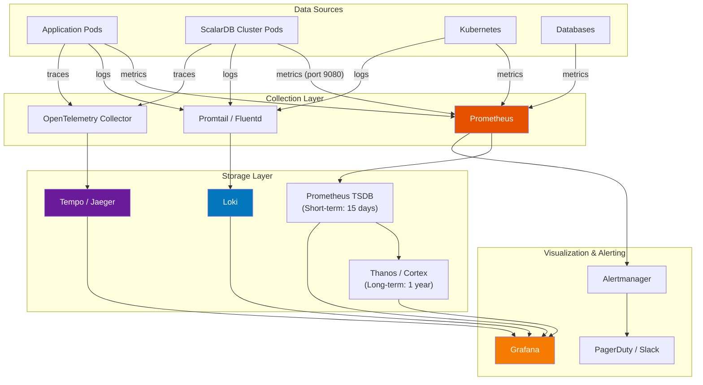
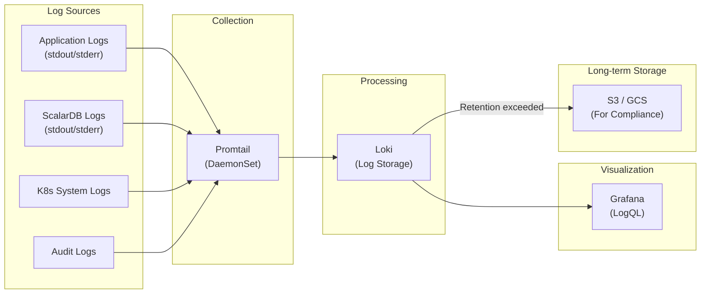
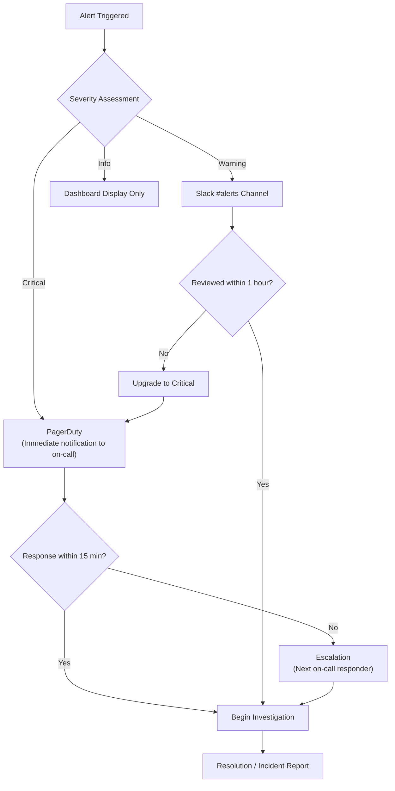
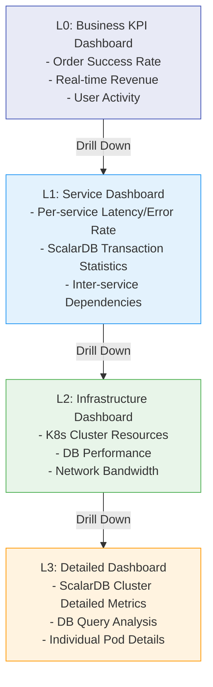
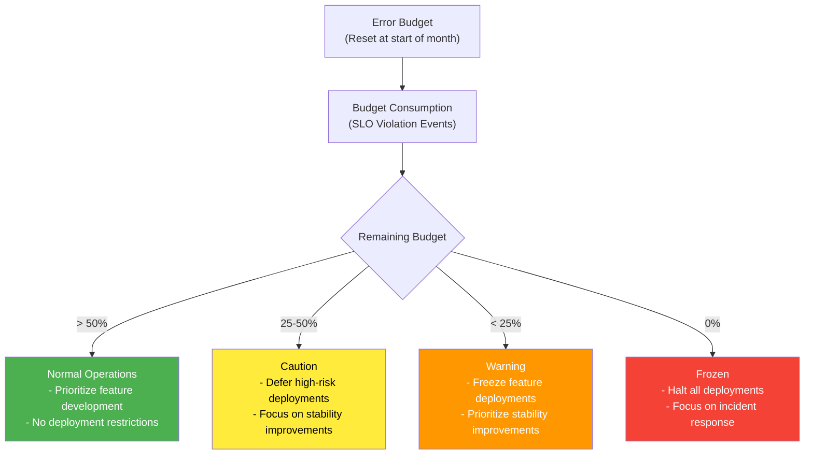

# Phase 3-3: Observability Design

## Purpose

Design a monitoring infrastructure based on the Three Pillars of Observability: Metrics, Logs, and Traces. Build a comprehensive monitoring system that includes ScalarDB Cluster-specific metrics and enables SLI/SLO-based operations.

---

## Inputs

| Input | Description | Source |
|-------|-------------|--------|
| Infrastructure Design | K8s cluster configuration and monitoring node pool designed in Step 07 | Phase 3-1 Deliverables |
| SLI/SLO Definitions | Non-functional requirements defined in Step 01 (availability, latency, throughput targets) | Phase 1 Deliverables |
| Transaction Design | Transaction boundaries and patterns designed in Step 05 | Phase 2 Deliverables |
| Security Design | Security monitoring requirements designed in Step 08 | Phase 3-2 Deliverables |

---

## References

| Document | Section | Usage |
|----------|---------|-------|
| [`../research/11_observability.md`](../research/11_observability.md) | Entire document | ScalarDB-specific metrics, trace design, dashboard hierarchy, alert design |

---

## Overall Observability Architecture



---

## Steps

### Step 9.1: Metrics Monitoring Design

Design comprehensive metrics monitoring including ScalarDB Cluster-specific metrics.

#### ScalarDB Cluster-Specific Metrics

Refer to `11_observability.md` and monitor the following ScalarDB Cluster-specific metrics.

> **Note: Metric names are illustrative.** The metric names listed in the table below (e.g., `scalardb_cluster_transaction_commit_total`) are provisional design names and may differ from actual metric names. Please refer to the official ScalarDB Cluster Grafana dashboard (provided by Scalar, Inc.) to confirm the actual metric names. For example, actual naming patterns may follow formats such as `scalardb_cluster_distributed_transaction_commit_success`.

**Transaction-Related Metrics:**

| Metric Name | Type | Description | Alert Threshold |
|-------------|------|-------------|-----------------|
| `scalardb_cluster_transaction_commit_total` | Counter | Total number of commit successes/failures | Failure rate > 1% |
| `scalardb_cluster_transaction_rollback_total` | Counter | Total number of rollbacks | On sudden increase |
| `scalardb_cluster_transaction_latency_seconds` | Histogram | Transaction latency distribution | P99 > 200ms |
| `scalardb_cluster_active_transactions` | Gauge | Number of currently active transactions | On threshold exceeded |
| `scalardb_cluster_transaction_retry_total` | Counter | Total number of retries | On sudden increase |
| `scalardb_cluster_consensus_commit_duration_seconds` | Histogram | Consensus Commit processing time | P99 > 500ms |

**Cluster-Related Metrics:**

| Metric Name | Type | Description | Alert Threshold |
|-------------|------|-------------|-----------------|
| `scalardb_cluster_node_count` | Gauge | Number of cluster nodes | < minimum replica count |
| `scalardb_cluster_grpc_request_total` | Counter | Total gRPC request count | N/A (dashboard display) |
| `scalardb_cluster_grpc_request_latency_seconds` | Histogram | gRPC request latency | P99 > 100ms |
| `scalardb_cluster_db_connection_pool_active` | Gauge | Number of active DB connection pool connections | Exceeding 80% of limit |
| `scalardb_cluster_db_connection_pool_idle` | Gauge | Number of idle DB connection pool connections | Sustained at 0 |

#### Prometheus Scrape Configuration

```yaml
# Prometheus ServiceMonitor for ScalarDB Cluster
apiVersion: monitoring.coreos.com/v1
kind: ServiceMonitor
metadata:
  name: scalardb-cluster-monitor
  namespace: monitoring
  labels:
    release: prometheus
spec:
  selector:
    matchLabels:
      app.kubernetes.io/name: scalardb-cluster
  namespaceSelector:
    matchNames:
      - scalardb
  endpoints:
    - port: metrics  # 9080
      interval: 15s
      path: /metrics
      scrapeTimeout: 10s
```

**Scrape Configuration Summary:**

| Target | Namespace | Port | Interval | Notes |
|--------|-----------|------|----------|-------|
| ScalarDB Cluster | scalardb | 9080 | 15s | ScalarDB-specific metrics |
| Application Pods | app | 8080 | 30s | Custom metrics |
| Node Exporter | monitoring | 9100 | 30s | Node metrics |
| kube-state-metrics | monitoring | 8080 | 30s | K8s object metrics |
| cAdvisor | - | - | 30s | Container metrics (kubelet integration) |
| Database Exporter | monitoring | 9104/9187 | 30s | MySQL/PostgreSQL metrics |

#### Custom Metrics Definition

Define custom metrics to be measured on the application side.

| Metric Name | Type | Description | Labels |
|-------------|------|-------------|--------|
| `app_business_transaction_total` | Counter | Number of business transactions | service, type, status |
| `app_business_transaction_duration_seconds` | Histogram | Business transaction duration | service, type |
| `app_scalardb_operation_total` | Counter | Number of ScalarDB API calls | service, operation, status |
| `app_scalardb_operation_duration_seconds` | Histogram | ScalarDB API call duration | service, operation |

**Verification Points:**
- [ ] Are all ScalarDB Cluster-specific metrics covered?
- [ ] Is the Prometheus ServiceMonitor correctly configured?
- [ ] Are application custom metrics defined?
- [ ] Are DB exporters configured?

---

### Step 9.2: Log Management Design

Design structured logging and build a log aggregation pipeline.

#### Structured Log Format (JSON)

**Application Logs:**

```json
{
  "timestamp": "2025-01-15T10:30:00.000Z",
  "level": "INFO",
  "logger": "com.example.order.OrderService",
  "service": "order-service",
  "instance": "order-service-7b8c9d-abc12",
  "trace_id": "abc123def456",
  "span_id": "789ghi012",
  "transaction_id": "tx-12345",
  "message": "Order created successfully",
  "context": {
    "order_id": "ORD-001",
    "user_id": "USR-100",
    "amount": 1500
  },
  "duration_ms": 45
}
```

**ScalarDB Cluster Logs:**

| Log Category | Log Level | Monitoring Importance | Notes |
|-------------|-----------|----------------------|-------|
| Transaction commit success | INFO | Low | For confirming normal operation |
| Transaction commit failure | WARN | High | Investigation of failure cause required |
| Consensus Commit conflict | WARN | Medium | Often resolved by retry |
| DB connection error | ERROR | Critical | Immediate action required |
| Cluster membership change | INFO | Medium | Scaling event |
| Graceful shutdown | INFO | Low | Normal behavior during deployment |

#### Log Aggregation Pipeline



#### Log Level Design

| Environment | Default Log Level | ScalarDB Log Level | Notes |
|-------------|-------------------|-------------------|-------|
| dev | DEBUG | DEBUG | Detailed debugging information |
| staging | INFO | INFO | Normal operational information |
| prod | INFO | WARN | Performance consideration, focus on WARN |

**Log Retention Period:**

| Log Type | Short-term Storage (Loki) | Long-term Storage (S3/GCS) | Notes |
|----------|--------------------------|---------------------------|-------|
| Application logs | 30 days | 1 year | |
| ScalarDB Cluster logs | 30 days | 1 year | |
| Audit logs | 90 days | 7 years | Depends on compliance requirements |
| K8s system logs | 14 days | 90 days | |

**Verification Points:**
- [ ] Is the structured log format unified?
- [ ] Is trace_id included in all logs (correlation with traces)?
- [ ] Are log levels appropriately configured per environment?
- [ ] Does the log retention period meet compliance requirements?
- [ ] Is the design ensuring PII is not included in logs (consistent with Step 08 data protection)?

---

### Step 9.3: Distributed Tracing Design

Design distributed tracing including 2PC transactions.

#### 2PC Transaction Trace Design

Refer to the Coordinator span hierarchy in `11_observability.md` and design traces to visualize the entire flow of ScalarDB Cluster 2PC transactions.

```mermaid
gantt
    title ScalarDB 2PC Transaction Trace
    dateFormat X
    axisFormat %L ms

    section Client
    API Request           :a1, 0, 5

    section App Service
    Business Logic        :a2, 5, 10
    ScalarDB Begin Tx     :a3, 10, 12

    section ScalarDB Cluster
    Transaction Begin     :s1, 12, 14
    Get (Read Phase)      :s2, 14, 20
    Put (Write Buffer)    :s3, 20, 25
    Prepare (2PC Phase 1) :s4, 25, 40
    Validate              :s5, 40, 45
    Commit (2PC Phase 2)  :s6, 45, 55
    Coordinator Write     :s7, 45, 50

    section Database A
    Read Query            :d1, 15, 19
    Prepare Write         :d2, 26, 35
    Commit Write          :d3, 46, 52

    section Database B
    Read Query            :d4, 16, 20
    Prepare Write         :d5, 28, 38
    Commit Write          :d6, 48, 54

    section Coordinator DB
    Status Write          :c1, 45, 50
```



#### Span Hierarchy Design

| Span Name | Parent Span | Service | Attributes |
|-----------|-------------|---------|------------|
| `http.request` | - | API Gateway | method, url, status_code |
| `app.business_operation` | `http.request` | App Service | operation_type |
| `scalardb.transaction` | `app.business_operation` | App Service | transaction_id |
| `scalardb.begin` | `scalardb.transaction` | ScalarDB Cluster | isolation_level |
| `scalardb.get` | `scalardb.transaction` | ScalarDB Cluster | namespace, table, key |
| `scalardb.put` | `scalardb.transaction` | ScalarDB Cluster | namespace, table, key |
| `scalardb.prepare` | `scalardb.transaction` | ScalarDB Cluster | participant_count |
| `scalardb.validate` | `scalardb.transaction` | ScalarDB Cluster | validation_result |
| `scalardb.commit` | `scalardb.transaction` | ScalarDB Cluster | commit_result |
| `scalardb.coordinator.write` | `scalardb.commit` | ScalarDB Cluster | coordinator_state |
| `db.query` | `scalardb.get/put/prepare/commit` | DB Driver | db.system, db.statement |

#### Trace ID Propagation Method

| Item | Design Value | Notes |
|------|-------------|-------|
| Propagation Standard | W3C Trace Context | Standard specification |
| Headers | `traceparent`, `tracestate` | W3C standard |
| Sampling Rate (dev) | 100% | All traces |
| Sampling Rate (staging) | 100% | For test verification |
| Sampling Rate (prod) | 10% (normal) / 100% (on error) | Cost optimization |

#### Trace Backend Selection

| Item | Jaeger | Grafana Tempo | Selection |
|------|--------|---------------|-----------|
| Storage | Elasticsearch / Cassandra | Object Storage (S3/GCS) | |
| Cost | High storage cost | Low storage cost | |
| Grafana Integration | Plugin | Native | |
| Scalability | Medium | High | |
| Query Performance | High (indexed) | Medium (TraceID search is fast) | |

**Decision:**
```
[ ] Jaeger
[ ] Grafana Tempo
Decision rationale: _______________________________________________
```

**Verification Points:**
- [ ] Are all phases of 2PC transactions designed as spans?
- [ ] Is the propagation method unified using W3C Trace Context?
- [ ] Are sampling rates configured per environment?
- [ ] Is 100% sampling designed for error cases?

---

### Step 9.4: Alert Design

Design critical alerts and security anomaly detection alerts.

#### Critical Alert Definitions

| Alert Name | Condition (PromQL Summary) | Severity | Notification Target | Response |
|------------|---------------------------|----------|-------------------|----------|
| ScalarDBTransactionFailureRateHigh | Transaction failure rate > 1% (5 min) | Critical | PagerDuty + Slack | Immediate investigation, check transaction patterns |
| ScalarDBTransactionLatencyHigh | P99 latency > 200ms (5 min) | Warning | Slack | Performance investigation |
| ScalarDBClusterNodeDown | Cluster node count < minimum replica count | Critical | PagerDuty + Slack | Verify Pod/node recovery |
| ScalarDBDBConnectionExhausted | DB connection pool usage > 90% | Warning | Slack | Review connection pool settings |
| ScalarDBCoordinatorDBUnavailable | Coordinator DB connection failure | Critical | PagerDuty + Slack | DB recovery/failover |
| ScalarDBConsensusCommitSlow | Consensus Commit P99 > 500ms | Warning | Slack | DB performance investigation |

**Prometheus Alert Rule Example:**

```yaml
apiVersion: monitoring.coreos.com/v1
kind: PrometheusRule
metadata:
  name: scalardb-cluster-alerts
  namespace: monitoring
spec:
  groups:
    - name: scalardb-cluster
      rules:
        - alert: ScalarDBTransactionFailureRateHigh
          # NOTE: Metric names are provisional. Please verify actual names in the official ScalarDB Cluster Grafana dashboard.
          expr: |
            (
              rate(scalardb_cluster_transaction_rollback_total[5m])
              /
              (rate(scalardb_cluster_transaction_commit_total[5m]) + rate(scalardb_cluster_transaction_rollback_total[5m]))
            ) > 0.01
          for: 5m
          labels:
            severity: critical
          annotations:
            summary: "ScalarDB transaction failure rate is above 1%"
            description: "Transaction failure rate is {{ $value | humanizePercentage }} for the last 5 minutes."
            runbook_url: "https://wiki.example.com/runbooks/scalardb-tx-failure"

        - alert: ScalarDBTransactionLatencyHigh
          # NOTE: Metric names are provisional. Please verify actual names in the official ScalarDB Cluster Grafana dashboard.
          expr: |
            histogram_quantile(0.99, rate(scalardb_cluster_transaction_latency_seconds_bucket[5m])) > 0.2
          for: 5m
          labels:
            severity: warning
          annotations:
            summary: "ScalarDB P99 transaction latency exceeds 200ms"
            description: "P99 latency is {{ $value }}s for the last 5 minutes."

        - alert: ScalarDBClusterNodeDown
          # NOTE: Metric names are provisional. Please verify actual names in the official ScalarDB Cluster Grafana dashboard.
          expr: |
            scalardb_cluster_node_count < 3
          for: 2m
          labels:
            severity: critical
          annotations:
            summary: "ScalarDB cluster has fewer nodes than minimum"
            description: "Current node count: {{ $value }}. Minimum required: 3."
```

#### Security Anomaly Detection Alerts

Refer to `11_observability.md` and design the following 4 security anomaly detection alerts.

| # | Alert Name | Detection Condition | Severity | Response |
|---|------------|-------------------|----------|----------|
| 1 | UnauthorizedScalarDBAccess | 10+ ScalarDB RBAC authentication failures within 5 minutes | Critical | Investigate access source, block if necessary |
| 2 | AnomalousTransactionPattern | Sudden increase/decrease in transaction volume deviating from normal patterns | Warning | Investigate traffic patterns |
| 3 | CoordinatorDBDirectAccess | Detection of non-ScalarDB access to Coordinator DB | Critical | Immediate block, security incident response |
| 4 | DataExfiltrationSuspect | Massive SELECT queries (10x or more above normal pattern) | Warning | Investigate suspected data exfiltration |

#### Escalation Flow



| Escalation Level | Time Limit | Notification Target |
|-----------------|------------|-------------------|
| L1: On-call responder | 15 min | PagerDuty |
| L2: Team lead | 30 min | PagerDuty + Phone |
| L3: Engineering manager | 1 hour | Phone + Email |

**Verification Points:**
- [ ] Are all ScalarDB-specific critical alerts defined?
- [ ] Are all 4 security anomaly detection alerts defined?
- [ ] Is the escalation flow clearly defined?
- [ ] Is a Runbook URL linked to each alert?
- [ ] Are alert thresholds consistent with non-functional requirements?

---

### Step 9.5: Dashboard Design

Design a 4-tier dashboard structure.

#### Dashboard Hierarchy

Refer to the dashboard hierarchy in `11_observability.md`.



#### Grafana Dashboard Definitions

**L0: Business KPI Dashboard:**

| Panel Name | Metrics | Type | Refresh |
|-----------|---------|------|---------|
| Order Success Rate | `app_business_transaction_total{type="order",status="success"}` / total | Stat | 10s |
| Real-time TPS | `rate(app_business_transaction_total[1m])` | Graph | 10s |
| Error Rate | `rate(app_business_transaction_total{status="error"}[5m])` / total | Gauge | 30s |
| Latency P50/P95/P99 | `histogram_quantile(...)` | Graph | 10s |

**L1: Service Dashboard (ScalarDB Focus):**

| Panel Name | Metrics | Type | Refresh |
|-----------|---------|------|---------|
| ScalarDB Transaction Success Rate | commit / (commit + rollback) | Stat | 15s |
| ScalarDB Transaction Latency | `scalardb_cluster_transaction_latency_seconds` | Heatmap | 15s |
| Active Transaction Count | `scalardb_cluster_active_transactions` | Graph | 15s |
| gRPC Request Rate | `rate(scalardb_cluster_grpc_request_total[1m])` | Graph | 15s |
| DB Connection Pool Utilization | active / (active + idle) | Gauge | 30s |
| Consensus Commit Duration | `scalardb_cluster_consensus_commit_duration_seconds` | Graph | 15s |

**L2: Infrastructure Dashboard:**

| Panel Name | Metrics | Type | Refresh |
|-----------|---------|------|---------|
| K8s Node CPU Usage | `node_cpu_seconds_total` | Graph | 30s |
| K8s Node Memory Usage | `node_memory_MemAvailable_bytes` | Graph | 30s |
| Pod CPU/Memory | `container_cpu_usage_seconds_total` | Graph | 30s |
| DB CPU Usage | DB Exporter metrics | Graph | 30s |
| DB Connection Count | DB Exporter metrics | Graph | 30s |
| Network I/O | `node_network_receive_bytes_total` | Graph | 30s |

**L3: Detailed Dashboard:**

| Panel Name | Metrics | Type | Refresh |
|-----------|---------|------|---------|
| ScalarDB Per-Pod Metrics | CPU/Memory/Network per Pod | Graph | 15s |
| Transaction Retry Details | `scalardb_cluster_transaction_retry_total` | Graph | 15s |
| DB Slow Queries | DB Exporter slow query metrics | Table | 60s |
| GC Pause Time | JVM GC metrics | Graph | 15s |
| Heap Memory Usage | JVM Heap metrics | Graph | 15s |

**Verification Points:**
- [ ] Are all 4 tiers (L0-L3) of dashboards defined?
- [ ] Are ScalarDB Cluster-specific metrics included in the L1 dashboard?
- [ ] Are drill-down navigation paths designed?
- [ ] Are business KPIs (L0) meaningful indicators for stakeholders?

---

### Step 9.6: SLI/SLO Definition

Define specific SLIs/SLOs and error budgets based on the non-functional requirements from Step 01.

#### SLI (Service Level Indicator) Definitions

| SLI Name | Formula | Measurement Method |
|----------|---------|-------------------|
| Availability | Successful requests / Total requests | Prometheus (HTTP/gRPC status codes) |
| Latency | P99 latency | Prometheus (Histogram) |
| Transaction Success Rate | Successful commits / Total transactions started | ScalarDB metrics |
| Error Rate | 5xx errors / Total requests | Prometheus |

#### SLO (Service Level Objective) Definitions

| SLO | Target Value | Measurement Period | Error Budget | Notes |
|-----|-------------|-------------------|-------------|-------|
| Availability | 99.95% | 30 days | 21.6 min/month | Based on Step 01 non-functional requirements |
| Latency (P99) | < 200ms | 30 days | 0.05% may violate SLO | |
| Transaction Success Rate | 99.9% | 30 days | 0.1% may fail | |
| Error Rate | < 0.1% | 30 days | | |

#### Error Budget Management



**Error Budget Report (Monthly):**

| Item | Target | Actual | Budget Remaining | Status |
|------|--------|--------|-----------------|--------|
| Availability SLO | 99.95% | | /21.6 min | |
| Latency SLO | P99 < 200ms | | | |
| Tx Success Rate SLO | 99.9% | | | |

**Verification Points:**
- [ ] Are SLI/SLOs consistent with Step 01 non-functional requirements?
- [ ] Are error budget calculations correct?
- [ ] Are operational policies based on error budgets (deployment freeze, etc.) defined?
- [ ] Are SLO target values realistic (re-verify Step 01 requirements)?

---

## Deliverables

| Deliverable | Description | Format |
|-------------|-------------|--------|
| Monitoring Design Document | Overall design for metrics, logs, and traces | Markdown |
| Prometheus Configuration | ServiceMonitor, Recording Rules | YAML |
| Alert Rules | PrometheusRule (Critical + Security) | YAML |
| Grafana Dashboard Definitions | 4-tier dashboards L0-L3 | JSON (Grafana Dashboard) |
| SLI/SLO Definition Document | SLI formulas, SLO targets, error budget management policy | Markdown |
| Log Design Document | Log format, pipeline, retention period | Markdown |

---

## Completion Criteria Checklist

- [ ] All ScalarDB Cluster-specific metrics (transaction success rate, latency, active Tx count, etc.) are defined
- [ ] Prometheus ServiceMonitor is configured for all targets
- [ ] Structured log format (JSON) is unified
- [ ] Log aggregation pipeline (Promtail -> Loki -> Grafana) is designed
- [ ] 2PC transaction span hierarchy is designed
- [ ] Trace propagation method using W3C Trace Context is defined
- [ ] Critical alerts (transaction failure rate, latency, node count) are defined
- [ ] All 4 security anomaly detection alerts are defined
- [ ] Escalation flow is clearly defined
- [ ] 4-tier dashboards (L0: KPI -> L1: Service -> L2: Infrastructure -> L3: Detailed) are designed
- [ ] SLI/SLOs are defined based on Step 01 non-functional requirements
- [ ] Error budget management policy is defined
- [ ] All designs are consistent with Step 07 infrastructure design and Step 08 security design

---

## Handoff to Next Steps

### Handoff to Phase 4-1: Implementation Guide (`11_implementation_guide.md`)

| Handoff Item | Content |
|-------------|---------|
| Custom Metrics Definitions | List of metrics to be implemented on the application side |
| Structured Log Format | Log output specifications to be implemented on the application side |
| Trace Propagation | W3C Trace Context header propagation implementation |
| Audit Logs | Application-level audit log output specifications (in coordination with Step 08) |
