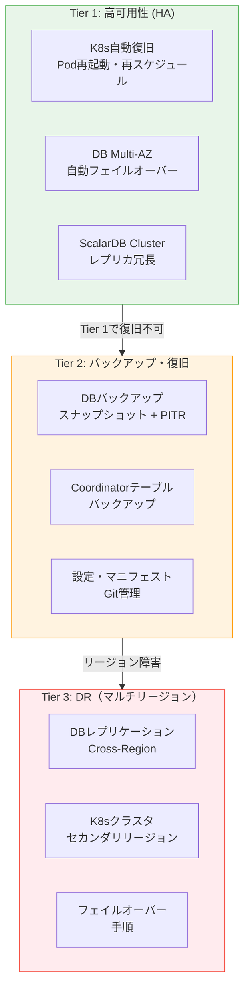
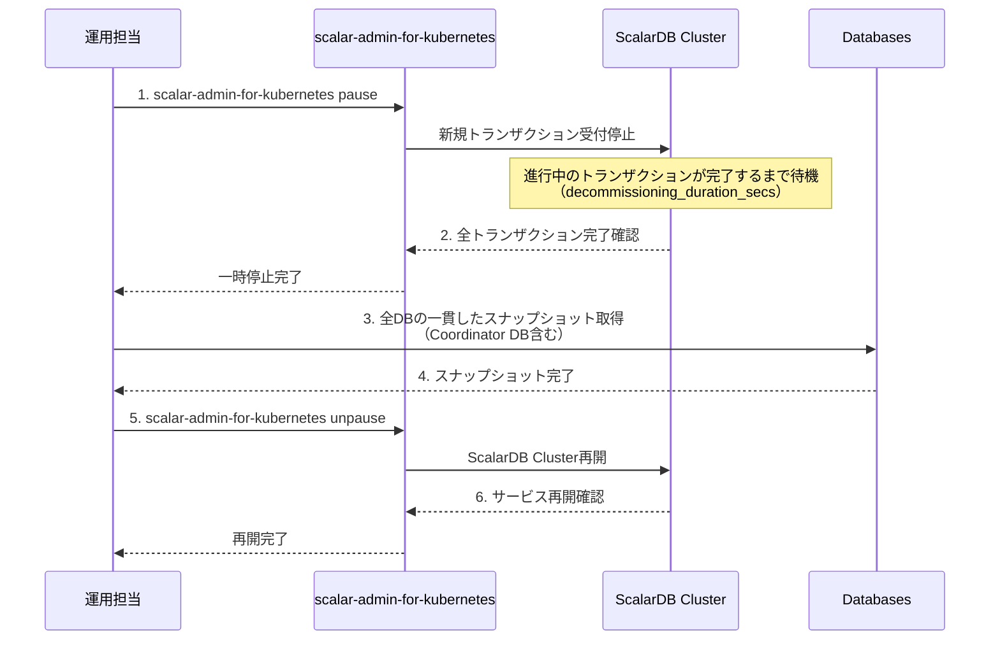
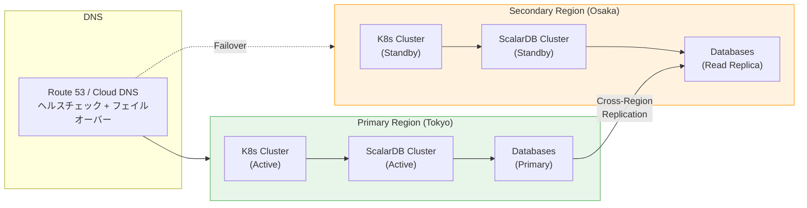
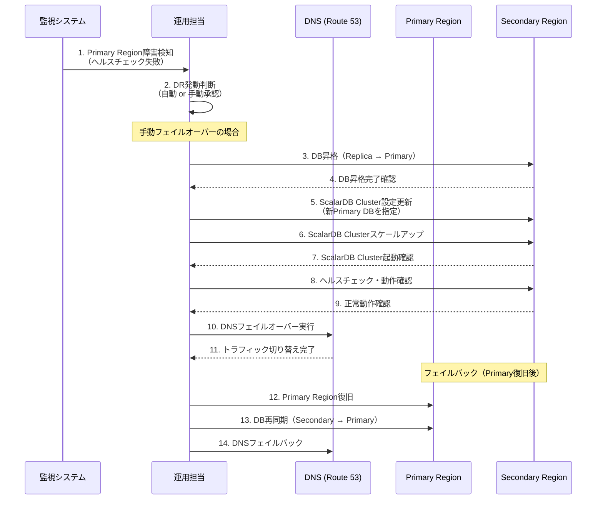

# Phase 3-4: 障害復旧・DR設計

## 目的

RPO（Recovery Point Objective）/RTO（Recovery Time Objective）に基づくバックアップ・復旧計画を設計する。ScalarDB Clusterの特性（Coordinatorテーブル、2PCトランザクション、Lazy Recovery）を考慮した障害パターン別の復旧手順を策定し、マルチリージョンDRの要否を判断する。

---

## 入力

| 入力物 | 説明 | 提供元 |
|--------|------|--------|
| インフラ設計 | Step 07で設計したK8sクラスタ構成、AZ構成、DB構成 | Phase 3-1 成果物 |
| 非機能要件 | Step 01で定義した可用性目標、RPO/RTO要件 | Phase 1 成果物 |
| セキュリティ設計 | Step 08で設計したCoordinatorテーブル保護設計 | Phase 3-2 成果物 |
| オブザーバビリティ設計 | Step 09で設計したアラート・監視体制 | Phase 3-3 成果物 |

---

## 参照資料

| 資料 | 参照箇所 | 用途 |
|------|----------|------|
| [`../research/12_disaster_recovery.md`](../research/12_disaster_recovery.md) | 全体 | ScalarDB固有のDR考慮事項、Coordinatorテーブル設計、障害パターン、SLA達成可能性 |

---

## DR戦略全体像



---

## ステップ

### Step 10.1: RPO/RTO要件の確定

ビジネスインパクト分析に基づき、ティア別のRPO/RTO要件を確定する。

#### ビジネスインパクト分析（BIA）

| サービス/機能 | 停止時のビジネス影響 | 影響の大きさ | 最大許容停止時間 | データ損失許容量 |
|-------------|-------------------|------------|----------------|----------------|
| 注文処理 | 売上機会損失 | Critical | | |
| 決済処理 | 収益直接影響、規制リスク | Critical | | |
| 在庫管理 | 過剰販売リスク | High | | |
| ユーザー認証 | 全サービス停止 | Critical | | |
| 分析・レポート | 意思決定遅延 | Medium | | |
| 通知送信 | UX低下 | Low | | |

#### ティア別 RPO/RTO 設定

`12_disaster_recovery.md` を参照し、Coordinatorテーブルの設計で3構成を検討する。

| ティア | 対象 | RPO | RTO | 構成 | 備考 |
|--------|------|-----|-----|------|------|
| Tier 1 (Critical) | 注文処理、決済処理、Coordinatorテーブル | < 1分 | < 5分 | Multi-AZ, 自動フェイルオーバー | |
| Tier 2 (High) | 在庫管理、ユーザー認証 | < 5分 | < 15分 | Multi-AZ, 自動フェイルオーバー | |
| Tier 3 (Medium) | 分析、通知 | < 1時間 | < 4時間 | バックアップ復元 | |

#### Coordinator テーブル3構成検討

`12_disaster_recovery.md` を参照し、Coordinatorテーブルの可用性構成を選択する。

| 構成 | 説明 | RPO | RTO | コスト | 推奨条件 |
|------|------|-----|-----|-------|---------|
| 構成A: Single-AZ | 単一AZにCoordinator DB配置 | バックアップ間隔依存 | 手動復旧（数時間） | 低 | 開発/テスト環境 |
| 構成B: Multi-AZ | Multi-AZ構成で自動フェイルオーバー | < 1分（同期レプリケーション） | < 5分（自動フェイルオーバー） | 中 | 本番環境（推奨） |
| 構成C: Cross-Region | リージョン間レプリケーション | < 1分（準同期） | < 15分（手動フェイルオーバー） | 高 | 高可用性要件 |

**判定:**
```
[ ] 構成A: Single-AZ
[ ] 構成B: Multi-AZ（推奨）
[ ] 構成C: Cross-Region
判定理由: _______________________________________________
```

#### SLA 現実性評価

`12_disaster_recovery.md` を参照し、SLA目標の達成可能性を評価する。

| SLA目標 | 年間許容ダウンタイム | 達成に必要な条件 | 達成可能性 | 備考 |
|---------|-------------------|----------------|-----------|------|
| 99.9% | 8時間45分/年 | Multi-AZ + 自動フェイルオーバー | 高 | 基本的に達成可能 |
| 99.95% | 4時間23分/年 | 上記 + 高速検知・復旧 | 中〜高 | 監視・アラート体制が重要 |
| 99.99% | 52分/年 | Cross-Region + 自動フェイルオーバー + Chaos Engineering | 低〜中 | 大幅なコスト増、ScalarDB Clusterの制約も考慮 |

**確認ポイント:**
- [ ] ビジネスインパクト分析が全サービス/機能に対して実施されているか
- [ ] ティア別のRPO/RTOが合意されているか
- [ ] Coordinatorテーブルの構成が選定されているか
- [ ] SLA目標が現実的かが評価されているか

---

### Step 10.2: バックアップ設計

DB別のバックアップ方式と、特に重要なCoordinatorテーブルのバックアップを設計する。

#### DB別バックアップ方式

| DB種類 | バックアップ方式 | RPO | 頻度 | 保持期間 | 備考 |
|--------|---------------|-----|------|---------|------|
| RDS/Aurora (MySQL) | 自動スナップショット + PITR | 5分以内 | 日次スナップショット | 35日 | PITRで最大5秒前まで復旧可能 |
| RDS (PostgreSQL) | 自動スナップショット + PITR | 5分以内 | 日次スナップショット | 35日 | |
| Cloud SQL | 自動バックアップ + PITR | 数秒 | 日次 | 365日 | |
| DynamoDB | PITR + オンデマンドバックアップ | 5分以内 | 継続的PITR | 35日 | |
| Cosmos DB | 自動バックアップ + 継続的バックアップ | 数秒（継続的バックアップ時） | 継続的 | 7〜30日（ティアにより異なる） | ポイントインタイムリストア対応 |

#### Coordinatorテーブルのバックアップ（特に重要）

Coordinatorテーブルはトランザクション制御の中核であり、他のビジネスデータとは独立して保護する必要がある。

| 項目 | 設計値 | 備考 |
|------|-------|------|
| バックアップ方式 | DB自動スナップショット + PITR | 最も高い保護レベル |
| バックアップ頻度 | 日次スナップショット + 継続的PITR | |
| 保持期間 | 90日（スナップショット）、35日（PITR） | |
| Cross-Region複製 | 必要に応じて（Tier 3のみ） | リージョン障害対策 |
| 整合性確認 | バックアップ後にチェックサムで検証 | |

> **⚠️ 重要: Coordinatorテーブルとビジネスデータの同時バックアップ**
>
> Coordinatorテーブルは他のビジネスデータDBと**必ず同時にバックアップ**する必要がある。異なるタイミングのバックアップから復元すると、トランザクション状態の不整合が発生し、データの一貫性が保証できなくなる。

#### バックアップスケジュール

| 時間帯 | バックアップ種類 | 対象 | 備考 |
|-------|---------------|------|------|
| 毎日 02:00 JST | 自動スナップショット | 全DB | 低トラフィック時間帯 |
| 継続的 | PITR（WAL/Binlog） | 全DB | リアルタイム |
| 毎週日曜 03:00 JST | 論理バックアップ | Coordinatorテーブル | 追加の安全策 |
| 毎月1日 04:00 JST | バックアップ復元テスト | 選定DB | 復元可能性の確認 |

#### 一時停止手順（整合性のあるバックアップ）

マネージドDBのPITR/スナップショットでは通常不要だが、論理バックアップ等で整合性を確保する場合の手順。

> **推奨**: 公式の scalar-admin-for-kubernetes ツール（`scalar-admin-for-kubernetes pause/unpause`）を使用した一時停止手順を推奨。HPA最小値変更は非公式な手法であり、scalar-admin による一時停止の方が確実。

**バックエンド構成別の一時停止要否:**

| バックエンド構成 | 一時停止の要否 | 理由 | 推奨バックアップ方式 |
|----------------|-------------|------|-------------------|
| **単一RDB（PostgreSQL/MySQL等）** | **不要** | DBのトランザクショナルバックアップ（PITR/スナップショット）で整合性が保証されるため | DB標準のPITR/自動スナップショット |
| **NoSQLバックエンド（Cassandra/DynamoDB等）** | **必要** | NoSQLはトランザクショナルバックアップをネイティブにサポートしないため | scalar-admin で一時停止後にスナップショット |
| **複数DB（異種DB間2PC構成）** | **必要** | 複数DBにまたがる整合性を確保するため、全DBを同時点でバックアップする必要がある | scalar-admin で一時停止後に全DBの同時スナップショット |



**確認ポイント:**
- [ ] 全DBのバックアップ方式が定義されているか
- [ ] CoordinatorテーブルのバックアップがTier 1として設計されているか
- [ ] バックアップの保持期間がコンプライアンス要件を満たしているか
- [ ] 月次のバックアップ復元テストが計画されているか
- [ ] 一時停止手順が文書化されているか

---

### Step 10.3: 障害パターン別復旧手順

ScalarDB Clusterの特性を考慮した障害パターン別の復旧手順を設計する。

#### 基本障害パターン

| # | 障害パターン | 影響範囲 | 検知方法 | 復旧方式 | RTO目安 |
|---|------------|---------|---------|---------|---------|
| 1 | ScalarDB Pod クラッシュ | 処理中Txのリトライ | K8sヘルスチェック | K8s自動再起動（RestartPolicy: Always） | < 1分 |
| 2 | ScalarDB Podの全滅 | 全トランザクション停止 | アラート（ノード数 < 最小値） | K8s Deployment自動復旧 + HPA | < 5分 |
| 3 | ノード障害（単一） | 該当ノード上のPod停止 | K8sノードNotReady | K8s自動再スケジュール（Anti-Affinity） | < 3分 |
| 4 | AZ障害 | 該当AZ内のPod/DB停止 | クラウドヘルスチェック | Multi-AZフェイルオーバー | < 10分 |
| 5 | DB障害（Primary） | ScalarDB Read/Write失敗 | DB接続エラーアラート | Multi-AZ自動フェイルオーバー | < 5分（RDS等） |
| 6 | DB障害（Read Replica） | 読み取り性能低下 | DBメトリクスアラート | レプリカ再構築 | < 15分 |
| 7 | ネットワーク分断 | 一部サービス通信不可 | gRPCタイムアウトアラート | ネットワーク復旧 + Tx再試行 | 状況依存 |

#### Lazy Recovery の適用範囲

ScalarDB の Lazy Recovery は、未完了のトランザクション（Prepareフェーズ完了・Commit未完了）を後続のトランザクションが検出した際に自動的にロールフォワード/ロールバックする機能。

| 障害シナリオ | Lazy Recovery適用 | 説明 |
|------------|-----------------|------|
| Podクラッシュ（Commit前） | 適用可能 | 後続Txが未完了レコードを検出し自動復旧 |
| Podクラッシュ（Prepare後、Commit前） | 適用可能 | Coordinatorの状態に基づきロールフォワード/ロールバック |
| DB障害後の復旧 | 適用可能 | DBフェイルオーバー後、未完了Txを自動復旧 |
| Coordinatorテーブル障害 | **適用不可** | Coordinator状態を参照できないため手動復旧が必要 |

#### Coordinatorテーブル障害パターン（8つの追加パターン）

`12_disaster_recovery.md` を参照し、ScalarDB固有の追加障害パターンを設計する。

| # | 障害パターン | 影響 | 検知方法 | 復旧手順 | RTO目安 |
|---|------------|------|---------|---------|---------|
| C1 | Coordinator DB接続不可 | 全Tx Commit不可 | 接続エラーアラート | DB復旧/フェイルオーバー | < 5分 |
| C2 | Coordinator テーブル破損 | Tx状態不整合 | データ整合性チェック | バックアップから復元 | 1-4時間 |
| C3 | Coordinator テーブル誤削除 | 全Tx停止 | DDLアラート（Step 08） | バックアップから復元 | 1-4時間 |
| C4 | Coordinator テーブルの容量枯渇 | Write失敗 | ストレージアラート | ストレージ拡張 + 古いレコード削除 | < 30分 |
| C5 | Coordinator DB レプリケーション遅延 | フェイルオーバー時のデータ損失リスク | レプリカラグアラート | 原因調査・レプリケーション復旧 | 状況依存 |
| C6 | Coordinator レコードの不整合 | 特定Txの復旧不可 | アプリケーションエラーログ | 手動レコード修復（要熟練） | 1-2時間 |
| C7 | ScalarDB Cluster全ノードと DB間のネットワーク分断 | 全Tx停止 | 接続タイムアウトアラート | ネットワーク復旧 | 状況依存 |
| C8 | Coordinator DB の性能劣化 | Tx レイテンシ増大 | レイテンシアラート | クエリ最適化、スケールアップ | < 1時間 |

#### 復旧手順書テンプレート（ランブック）

各障害パターンについて以下のフォーマットで復旧手順書を作成する。

```
## [障害パターン名]

### 概要
- 影響範囲:
- 重要度: Critical / High / Medium
- 想定RTO:

### 検知
- アラート名:
- 確認コマンド:

### 判断基準
- 自動復旧を待つ条件:
- 手動介入が必要な条件:

### 復旧手順
1.
2.
3.

### 復旧確認
- [ ] 確認項目1
- [ ] 確認項目2

### エスカレーション
- L1→L2: [条件]
- L2→L3: [条件]

### 事後対応
- インシデントレポート作成
- 根本原因分析（RCA）
```

**確認ポイント:**
- [ ] 基本障害パターン7つが全て定義されているか
- [ ] Coordinatorテーブル障害パターン8つが全て定義されているか
- [ ] Lazy Recoveryの適用範囲が明確か
- [ ] 各障害パターンにRTO目安が設定されているか
- [ ] ランブックのテンプレートが用意されているか

---

### Step 10.4: マルチリージョンDR設計（必要な場合）

リージョン障害への対策が必要な場合、マルチリージョンDRを設計する。

#### DR要否判定

| 判定基準 | 条件 | 自システム評価 |
|---------|------|--------------|
| SLA要件 | 99.99%以上の可用性が必要 | Yes / No |
| 規制要件 | 地理的冗長性が義務付けられている | Yes / No |
| ビジネス要件 | リージョン障害時もサービス継続が必要 | Yes / No |
| コスト許容 | 2倍以上のインフラコストが許容可能 | Yes / No |

**判定:**
```
[ ] マルチリージョンDR必要
[ ] マルチリージョンDR不要（Multi-AZで十分）
判定理由: _______________________________________________
```

#### Active-Passive 構成

マルチリージョンDRが必要な場合の推奨構成。



| 項目 | Primary Region | Secondary Region | 備考 |
|------|---------------|-----------------|------|
| K8s Cluster | Active（フルスペック） | Standby（縮小構成） | DR発動時にスケールアップ |
| ScalarDB Cluster | Active（5+ Pod） | Standby（1-2 Pod warm standby） | DR発動時にスケールアップ |
| Database | Primary (Read/Write) | Read Replica (Cross-Region) | 非同期レプリケーション |
| Coordinator DB | Primary | Cross-Region Read Replica | **最も重要**: RPOに注意 |
| DNS | ヘルスチェック付きフェイルオーバー | | Route 53 / Cloud DNS |

#### フェイルオーバー手順



**フェイルオーバー所要時間見積もり:**

| ステップ | 所要時間 | 備考 |
|---------|---------|------|
| 障害検知 | 1-5分 | ヘルスチェック間隔に依存 |
| DR発動判断 | 5-15分 | 手動承認の場合 |
| DB昇格 | 5-10分 | クラウドプロバイダーに依存 |
| ScalarDB設定更新・起動 | 5-10分 | |
| DNS切り替え | 1-5分 | TTLに依存 |
| **合計** | **17-45分** | |

#### Remote Replication 設定

| 項目 | 設計値 | 備考 |
|------|-------|------|
| レプリケーション方式 | 非同期（Cross-Region） | 同期はレイテンシ影響大 |
| レプリケーションラグ目標 | < 1秒（通常時） | 監視・アラート対象 |
| RPO（DR発動時） | レプリケーションラグ分 | 数秒〜数十秒のデータ損失可能性 |

**確認ポイント:**
- [ ] マルチリージョンDRの要否が判定されているか
- [ ] Active-Passive構成が設計されているか（必要な場合）
- [ ] フェイルオーバー手順が詳細に文書化されているか
- [ ] RPO（レプリケーションラグ分のデータ損失）がビジネス上許容されているか
- [ ] フェイルバック手順が設計されているか

---

### Step 10.5: DRテスト計画

DR計画の有効性を検証するためのテスト計画を策定する。

#### テスト種別

| テスト種別 | 説明 | 頻度 | 影響 | 参加者 |
|-----------|------|------|------|--------|
| Tabletop Exercise | 机上シミュレーション。ランブックの手順確認・ウォークスルー | 月次 | なし | エンジニア全員 |
| Failover Test | 実際のフェイルオーバーを非本番環境で実行 | 四半期 | staging環境一時停止 | SRE + インフラ |
| Full DR Test | 本番環境でのDR発動テスト（メンテナンスウィンドウ内） | 年1-2回 | 本番一時停止（計画メンテナンス） | 全チーム |
| Chaos Engineering | 本番環境で擬似障害を注入（Pod Kill、ネットワーク遅延等） | 継続的 | 限定的 | SRE |

#### テストシナリオ

| # | シナリオ | テスト種別 | 目的 | 成功基準 |
|---|---------|-----------|------|---------|
| T1 | ScalarDB Pod 1台強制終了 | Chaos Engineering | K8s自動復旧の確認 | 1分以内に復旧、Tx影響なし |
| T2 | ScalarDB Pod 全台強制終了 | Failover Test | 全滅からの復旧確認 | RTO内に復旧 |
| T3 | DB Primary フェイルオーバー | Failover Test | DB自動フェイルオーバー確認 | RTO内に復旧、データ損失なし |
| T4 | Coordinatorテーブル復元 | Failover Test | バックアップからの復元確認 | RPO内のデータ損失、手順通り復旧 |
| T5 | AZ障害シミュレーション | Failover Test | Multi-AZ復旧確認 | RTO内に復旧 |
| T6 | リージョンフェイルオーバー | Full DR Test | DR全手順確認 | フェイルオーバー手順通り復旧 |
| T7 | ネットワーク分断 | Chaos Engineering | 分断耐性確認 | 想定通りの動作・復旧 |
| T8 | 高負荷時のPodクラッシュ | Chaos Engineering | 負荷時の復旧確認 | 性能劣化が限定的 |

#### テストスケジュール（年間計画）

| 月 | テスト内容 | 種別 | 環境 |
|----|-----------|------|------|
| 1月 | Tabletop: ランブック全体レビュー | Tabletop | - |
| 2月 | Chaos: ScalarDB Pod Kill | Chaos Engineering | prod（限定的） |
| 3月 | Failover: DB フェイルオーバー | Failover Test | staging |
| 4月 | Tabletop: Coordinatorテーブル障害 | Tabletop | - |
| 5月 | Chaos: ネットワーク遅延注入 | Chaos Engineering | prod（限定的） |
| 6月 | Failover: AZ障害シミュレーション | Failover Test | staging |
| 7月 | Tabletop: リージョンDR | Tabletop | - |
| 8月 | Chaos: 高負荷 + Pod Kill | Chaos Engineering | staging |
| 9月 | Failover: Coordinator復元テスト | Failover Test | staging |
| 10月 | Tabletop: セキュリティインシデント | Tabletop | - |
| 11月 | Full DR: リージョンフェイルオーバー | Full DR Test | prod（計画メンテナンス） |
| 12月 | 年間振り返り・計画更新 | - | - |

#### ランブック作成計画

以下のランブックを作成する。

| ランブック名 | 対象障害パターン | 優先度 | 担当 |
|------------|----------------|-------|------|
| ScalarDB Pod 障害復旧 | #1, #2 | High | SRE |
| ノード/AZ障害復旧 | #3, #4 | High | SRE + インフラ |
| DB障害復旧 | #5, #6 | High | DBA + SRE |
| Coordinatorテーブル障害復旧 | C1-C8 | Critical | SRE + ScalarDB専門 |
| ネットワーク障害復旧 | #7, C7 | High | ネットワーク + SRE |
| リージョンフェイルオーバー | リージョン障害 | Critical | 全チーム |
| フェイルバック手順 | DR発動後の復帰 | High | 全チーム |

**確認ポイント:**
- [ ] テスト種別（Tabletop、Failover、Full DR、Chaos）が全て計画されているか
- [ ] 四半期ごとのフェイルオーバーテストが計画されているか
- [ ] 各テストシナリオに成功基準が定義されているか
- [ ] ランブックの作成計画が策定されているか
- [ ] テスト結果のフィードバックループ（計画改善）が設計されているか

---

## 成果物

| 成果物 | 説明 | フォーマット |
|--------|------|-------------|
| DR計画書 | RPO/RTO要件、DR戦略、フェイルオーバー手順 | Markdown |
| バックアップ設計書 | DB別バックアップ方式、スケジュール、保持期間 | Markdown |
| ランブック | 障害パターン別の復旧手順書 | Markdown（ランブックテンプレートに基づく） |
| DRテスト計画 | テスト種別、シナリオ、年間スケジュール | Markdown / スプレッドシート |
| BIA（ビジネスインパクト分析） | サービス別の影響分析とティア分類 | Markdown / スプレッドシート |

---

## 完了基準チェックリスト

- [ ] ビジネスインパクト分析（BIA）が全サービスに対して実施されている
- [ ] ティア別のRPO/RTO要件が確定し、関係者の合意が得られている
- [ ] Coordinatorテーブルの3構成から適切な構成が選定されている
- [ ] SLA目標の達成可能性が現実的に評価されている
- [ ] 全DBのバックアップ方式・頻度・保持期間が定義されている
- [ ] Coordinatorテーブルのバックアップが最高優先度で設計されている
- [ ] 基本障害パターン7つの復旧手順が文書化されている
- [ ] Coordinatorテーブル障害パターン8つの復旧手順が文書化されている
- [ ] Lazy Recoveryの適用範囲が明確に文書化されている
- [ ] マルチリージョンDRの要否が判定されている
- [ ] DRテスト計画（Tabletop、Failover、Full DR、Chaos）が策定されている
- [ ] ランブックが主要障害パターンについて作成されている（または作成計画がある）
- [ ] DR設計がStep 07のインフラ設計、Step 08のセキュリティ設計、Step 09のオブザーバビリティ設計と整合している

---

## 次のステップへの引き継ぎ事項

### Phase 4-1: 実装ガイド（`11_implementation_guide.md`）への引き継ぎ

| 引き継ぎ項目 | 内容 |
|-------------|------|
| バックアップ設定 | 各DBのバックアップ設定値 |
| リトライ設計 | Lazy Recovery前提でのアプリケーションリトライ戦略 |
| ヘルスチェック設計 | K8s Liveness/Readiness Probeの設定 |

### Phase 4-3: デプロイ・ロールアウト（`13_deployment_rollout.md`）への引き継ぎ

| 引き継ぎ項目 | 内容 |
|-------------|------|
| PDB設定 | ローリングアップデート時のPodDisruptionBudget |
| ロールバック手順 | デプロイ失敗時のロールバック（DR手順と連携） |
| フェイルオーバー手順 | DR発動時のフェイルオーバー手順 |
| DRテスト計画 | デプロイ後のDRテスト実施計画 |
