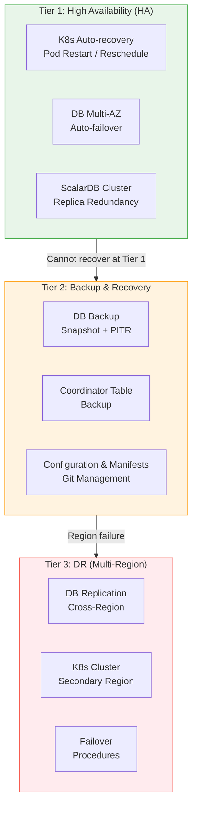
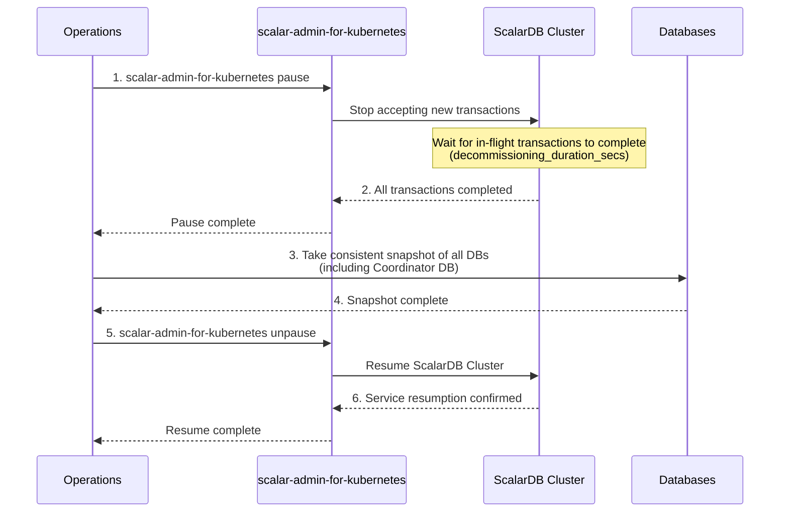
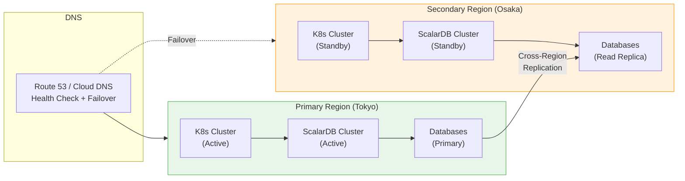
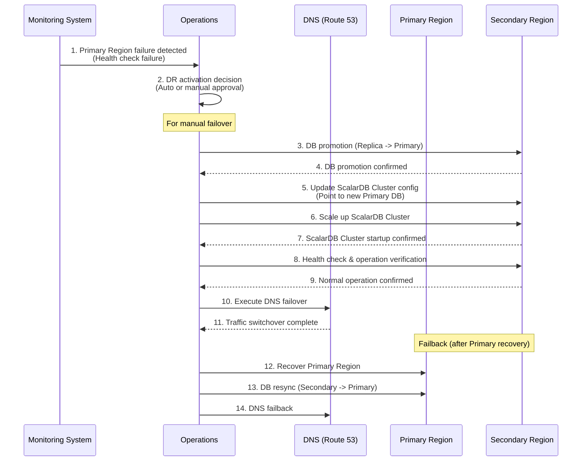

# Phase 3-4: Disaster Recovery Design

## Purpose

Design a backup and recovery plan based on RPO (Recovery Point Objective) / RTO (Recovery Time Objective). Develop recovery procedures for each failure pattern considering ScalarDB Cluster characteristics (Coordinator table, 2PC transactions, Lazy Recovery), and determine the need for multi-region DR.

---

## Inputs

| Input | Description | Source |
|-------|-------------|--------|
| Infrastructure Design | K8s cluster configuration, AZ configuration, and DB configuration designed in Step 07 | Phase 3-1 Deliverables |
| Non-functional Requirements | Availability targets and RPO/RTO requirements defined in Step 01 | Phase 1 Deliverables |
| Security Design | Coordinator table protection design from Step 08 | Phase 3-2 Deliverables |
| Observability Design | Alert and monitoring system designed in Step 09 | Phase 3-3 Deliverables |

---

## References

| Document | Section | Usage |
|----------|---------|-------|
| [`../research/12_disaster_recovery.md`](../research/12_disaster_recovery.md) | Entire document | ScalarDB-specific DR considerations, Coordinator table design, failure patterns, SLA achievability |

---

## Overall DR Strategy



---

## Steps

### Step 10.1: Finalize RPO/RTO Requirements

Finalize tier-specific RPO/RTO requirements based on business impact analysis.

#### Business Impact Analysis (BIA)

| Service/Function | Business Impact When Stopped | Impact Severity | Maximum Tolerable Downtime | Tolerable Data Loss |
|-----------------|----------------------------|-----------------|---------------------------|-------------------|
| Order Processing | Revenue opportunity loss | Critical | | |
| Payment Processing | Direct revenue impact, regulatory risk | Critical | | |
| Inventory Management | Overselling risk | High | | |
| User Authentication | All services stop | Critical | | |
| Analytics & Reporting | Decision-making delays | Medium | | |
| Notification Delivery | UX degradation | Low | | |

#### Tier-Specific RPO/RTO Settings

Refer to `12_disaster_recovery.md` and consider 3 configurations for Coordinator table design.

| Tier | Target | RPO | RTO | Configuration | Notes |
|------|--------|-----|-----|---------------|-------|
| Tier 1 (Critical) | Order processing, payment processing, Coordinator table | < 1 min | < 5 min | Multi-AZ, auto-failover | |
| Tier 2 (High) | Inventory management, user authentication | < 5 min | < 15 min | Multi-AZ, auto-failover | |
| Tier 3 (Medium) | Analytics, notifications | < 1 hour | < 4 hours | Backup restore | |

#### Coordinator Table 3-Configuration Evaluation

Refer to `12_disaster_recovery.md` and select the availability configuration for the Coordinator table.

| Configuration | Description | RPO | RTO | Cost | Recommended For |
|--------------|-------------|-----|-----|------|----------------|
| Config A: Single-AZ | Coordinator DB placed in a single AZ | Depends on backup interval | Manual recovery (several hours) | Low | Development/test environments |
| Config B: Multi-AZ | Multi-AZ configuration with auto-failover | < 1 min (synchronous replication) | < 5 min (auto-failover) | Medium | Production (recommended) |
| Config C: Cross-Region | Cross-region replication | < 1 min (semi-synchronous) | < 15 min (manual failover) | High | High availability requirements |

**Decision:**
```
[ ] Config A: Single-AZ
[ ] Config B: Multi-AZ (Recommended)
[ ] Config C: Cross-Region
Decision rationale: _______________________________________________
```

#### SLA Feasibility Assessment

Refer to `12_disaster_recovery.md` and evaluate the achievability of SLA targets.

| SLA Target | Annual Allowable Downtime | Required Conditions | Achievability | Notes |
|-----------|--------------------------|--------------------|--------------|----|
| 99.9% | 8 hours 45 min/year | Multi-AZ + auto-failover | High | Generally achievable |
| 99.95% | 4 hours 23 min/year | Above + fast detection/recovery | Medium-High | Monitoring and alerting system is critical |
| 99.99% | 52 min/year | Cross-Region + auto-failover + Chaos Engineering | Low-Medium | Significant cost increase, ScalarDB Cluster constraints also to be considered |

**Verification Points:**
- [ ] Has business impact analysis been conducted for all services/functions?
- [ ] Have tier-specific RPO/RTOs been agreed upon?
- [ ] Has a Coordinator table configuration been selected?
- [ ] Has the feasibility of SLA targets been assessed?

---

### Step 10.2: Backup Design

Design backup methods per DB and especially the backup of the critical Coordinator table.

#### Backup Methods by DB Type

| DB Type | Backup Method | RPO | Frequency | Retention Period | Notes |
|---------|--------------|-----|-----------|-----------------|-------|
| RDS/Aurora (MySQL) | Auto snapshot + PITR | Within 5 min | Daily snapshot | 35 days | PITR can recover up to 5 seconds prior |
| RDS (PostgreSQL) | Auto snapshot + PITR | Within 5 min | Daily snapshot | 35 days | |
| Cloud SQL | Auto backup + PITR | Seconds | Daily | 365 days | |
| DynamoDB | PITR + On-demand backup | Within 5 min | Continuous PITR | 35 days | |
| Cosmos DB | Auto backup + Continuous backup | Seconds (with continuous backup) | Continuous | 7-30 days (varies by tier) | Point-in-time restore supported |

#### Coordinator Table Backup (Critical)

The Coordinator table is the core of transaction control and must be protected independently from other business data.

| Item | Design Value | Notes |
|------|-------------|-------|
| Backup Method | DB auto snapshot + PITR | Highest protection level |
| Backup Frequency | Daily snapshot + continuous PITR | |
| Retention Period | 90 days (snapshot), 35 days (PITR) | |
| Cross-Region Replication | As needed (Tier 3 only) | Region failure countermeasure |
| Integrity Verification | Verify with checksum after backup | |

> **Warning: Simultaneous Backup of Coordinator Table and Business Data**
>
> The Coordinator table **must always be backed up simultaneously** with other business data DBs. Restoring from backups taken at different points in time will cause transaction state inconsistency, making data consistency unguaranteed.

#### Backup Schedule

| Time Slot | Backup Type | Target | Notes |
|-----------|------------|--------|-------|
| Daily 02:00 JST | Auto snapshot | All DBs | Low-traffic period |
| Continuous | PITR (WAL/Binlog) | All DBs | Real-time |
| Weekly Sunday 03:00 JST | Logical backup | Coordinator table | Additional safety measure |
| Monthly 1st 04:00 JST | Backup restore test | Selected DBs | Verify restorability |

#### Pause Procedure (Consistent Backups)

Usually unnecessary for managed DB PITR/snapshots, but here is the procedure for ensuring consistency during logical backups.

> **Recommended**: Use the official scalar-admin-for-kubernetes tool (`scalar-admin-for-kubernetes pause/unpause`) for the pause procedure. Changing HPA minimum values is an unofficial approach; pausing via scalar-admin is more reliable.

**Pause Requirements by Backend Configuration:**

| Backend Configuration | Pause Required? | Reason | Recommended Backup Method |
|----------------------|----------------|--------|--------------------------|
| **Single RDB (PostgreSQL/MySQL, etc.)** | **Not required** | DB transactional backup (PITR/snapshot) guarantees consistency | DB standard PITR/auto snapshot |
| **NoSQL Backend (Cassandra/DynamoDB, etc.)** | **Required** | NoSQL does not natively support transactional backups | Snapshot after pausing with scalar-admin |
| **Multiple DBs (heterogeneous DB 2PC configuration)** | **Required** | Need to back up all DBs at the same point in time to ensure cross-DB consistency | Simultaneous snapshot of all DBs after pausing with scalar-admin |



**Verification Points:**
- [ ] Are backup methods defined for all DBs?
- [ ] Is the Coordinator table backup designed as Tier 1?
- [ ] Does the backup retention period meet compliance requirements?
- [ ] Is a monthly backup restore test planned?
- [ ] Is the pause procedure documented?

---

### Step 10.3: Recovery Procedures by Failure Pattern

Design recovery procedures for each failure pattern considering ScalarDB Cluster characteristics.

#### Basic Failure Patterns

| # | Failure Pattern | Impact Scope | Detection Method | Recovery Method | RTO Estimate |
|---|----------------|-------------|-----------------|----------------|-------------|
| 1 | ScalarDB Pod Crash | Retry for in-flight Tx | K8s health check | K8s auto-restart (RestartPolicy: Always) | < 1 min |
| 2 | All ScalarDB Pods Down | All transactions stop | Alert (node count < minimum) | K8s Deployment auto-recovery + HPA | < 5 min |
| 3 | Node Failure (Single) | Pods on affected node stop | K8s node NotReady | K8s auto-reschedule (Anti-Affinity) | < 3 min |
| 4 | AZ Failure | Pods/DBs in affected AZ stop | Cloud health check | Multi-AZ failover | < 10 min |
| 5 | DB Failure (Primary) | ScalarDB Read/Write failure | DB connection error alert | Multi-AZ auto-failover | < 5 min (RDS, etc.) |
| 6 | DB Failure (Read Replica) | Read performance degradation | DB metrics alert | Replica rebuild | < 15 min |
| 7 | Network Partition | Some service communication unavailable | gRPC timeout alert | Network recovery + Tx retry | Situation dependent |

#### Lazy Recovery Scope

ScalarDB's Lazy Recovery is a feature that automatically rolls forward/back incomplete transactions (Prepare phase completed, Commit not completed) when subsequent transactions detect them.

| Failure Scenario | Lazy Recovery Applicable | Description |
|-----------------|------------------------|-------------|
| Pod crash (before Commit) | Applicable | Subsequent Tx detects incomplete records and auto-recovers |
| Pod crash (after Prepare, before Commit) | Applicable | Roll forward/back based on Coordinator state |
| Recovery after DB failure | Applicable | Auto-recover incomplete Tx after DB failover |
| Coordinator table failure | **Not applicable** | Manual recovery required as Coordinator state cannot be referenced |

#### Coordinator Table Failure Patterns (8 Additional Patterns)

Refer to `12_disaster_recovery.md` and design additional failure patterns specific to ScalarDB.

| # | Failure Pattern | Impact | Detection Method | Recovery Procedure | RTO Estimate |
|---|----------------|--------|-----------------|-------------------|-------------|
| C1 | Coordinator DB connection unavailable | All Tx Commit impossible | Connection error alert | DB recovery/failover | < 5 min |
| C2 | Coordinator table corruption | Tx state inconsistency | Data integrity check | Restore from backup | 1-4 hours |
| C3 | Coordinator table accidental deletion | All Tx stop | DDL alert (Step 08) | Restore from backup | 1-4 hours |
| C4 | Coordinator table storage exhaustion | Write failure | Storage alert | Storage expansion + old record deletion | < 30 min |
| C5 | Coordinator DB replication lag | Data loss risk on failover | Replica lag alert | Investigate cause, restore replication | Situation dependent |
| C6 | Coordinator record inconsistency | Specific Tx unrecoverable | Application error logs | Manual record repair (expertise required) | 1-2 hours |
| C7 | Network partition between all ScalarDB Cluster nodes and DB | All Tx stop | Connection timeout alert | Network recovery | Situation dependent |
| C8 | Coordinator DB performance degradation | Tx latency increase | Latency alert | Query optimization, scale up | < 1 hour |

#### Recovery Procedure Template (Runbook)

Create recovery procedure documents for each failure pattern using the following format.

```
## [Failure Pattern Name]

### Overview
- Impact scope:
- Severity: Critical / High / Medium
- Expected RTO:

### Detection
- Alert name:
- Verification command:

### Decision Criteria
- Conditions to wait for auto-recovery:
- Conditions requiring manual intervention:

### Recovery Procedure
1.
2.
3.

### Recovery Verification
- [ ] Verification item 1
- [ ] Verification item 2

### Escalation
- L1 -> L2: [Condition]
- L2 -> L3: [Condition]

### Post-Incident Actions
- Create incident report
- Root cause analysis (RCA)
```

**Verification Points:**
- [ ] Are all 7 basic failure patterns defined?
- [ ] Are all 8 Coordinator table failure patterns defined?
- [ ] Is the scope of Lazy Recovery clear?
- [ ] Is an RTO estimate set for each failure pattern?
- [ ] Is a runbook template prepared?

---

### Step 10.4: Multi-Region DR Design (If Required)

Design multi-region DR if countermeasures for region failures are needed.

#### DR Requirement Assessment

| Assessment Criteria | Condition | Self-Assessment |
|--------------------|-----------|-----------------|
| SLA Requirements | 99.99%+ availability required | Yes / No |
| Regulatory Requirements | Geographic redundancy is mandated | Yes / No |
| Business Requirements | Service continuity required during region failure | Yes / No |
| Cost Tolerance | 2x+ infrastructure cost is acceptable | Yes / No |

**Decision:**
```
[ ] Multi-region DR required
[ ] Multi-region DR not required (Multi-AZ is sufficient)
Decision rationale: _______________________________________________
```

#### Active-Passive Configuration

Recommended configuration when multi-region DR is required.



| Item | Primary Region | Secondary Region | Notes |
|------|---------------|-----------------|-------|
| K8s Cluster | Active (full spec) | Standby (reduced configuration) | Scale up on DR activation |
| ScalarDB Cluster | Active (5+ Pods) | Standby (1-2 Pod warm standby) | Scale up on DR activation |
| Database | Primary (Read/Write) | Read Replica (Cross-Region) | Asynchronous replication |
| Coordinator DB | Primary | Cross-Region Read Replica | **Most critical**: Pay attention to RPO |
| DNS | Failover with health check | | Route 53 / Cloud DNS |

#### Failover Procedure



**Failover Time Estimate:**

| Step | Duration | Notes |
|------|----------|-------|
| Failure detection | 1-5 min | Depends on health check interval |
| DR activation decision | 5-15 min | For manual approval |
| DB promotion | 5-10 min | Depends on cloud provider |
| ScalarDB config update & startup | 5-10 min | |
| DNS switchover | 1-5 min | Depends on TTL |
| **Total** | **17-45 min** | |

#### Remote Replication Settings

| Item | Design Value | Notes |
|------|-------------|-------|
| Replication Method | Asynchronous (Cross-Region) | Synchronous has significant latency impact |
| Replication Lag Target | < 1 second (normal operation) | Subject to monitoring & alerting |
| RPO (on DR activation) | Equal to replication lag | Possible data loss of seconds to tens of seconds |

**Verification Points:**
- [ ] Has the need for multi-region DR been determined?
- [ ] Has an Active-Passive configuration been designed (if required)?
- [ ] Is the failover procedure documented in detail?
- [ ] Is the RPO (data loss equal to replication lag) acceptable from a business perspective?
- [ ] Is the failback procedure designed?

---

### Step 10.5: DR Test Plan

Develop a test plan to verify the effectiveness of the DR plan.

#### Test Types

| Test Type | Description | Frequency | Impact | Participants |
|-----------|-------------|-----------|--------|-------------|
| Tabletop Exercise | Desktop simulation. Runbook procedure review & walkthrough | Monthly | None | All engineers |
| Failover Test | Execute actual failover in non-production environment | Quarterly | Staging environment temporary outage | SRE + Infrastructure |
| Full DR Test | DR activation test in production (within maintenance window) | 1-2 times/year | Production temporary outage (planned maintenance) | All teams |
| Chaos Engineering | Inject simulated failures in production (Pod Kill, network delay, etc.) | Continuous | Limited | SRE |

#### Test Scenarios

| # | Scenario | Test Type | Purpose | Success Criteria |
|---|---------|-----------|---------|-----------------|
| T1 | Force-kill 1 ScalarDB Pod | Chaos Engineering | Verify K8s auto-recovery | Recovery within 1 min, no Tx impact |
| T2 | Force-kill all ScalarDB Pods | Failover Test | Verify recovery from total outage | Recovery within RTO |
| T3 | DB Primary failover | Failover Test | Verify DB auto-failover | Recovery within RTO, no data loss |
| T4 | Coordinator table restore | Failover Test | Verify restoration from backup | Data loss within RPO, recovery per procedure |
| T5 | AZ failure simulation | Failover Test | Verify Multi-AZ recovery | Recovery within RTO |
| T6 | Region failover | Full DR Test | Verify full DR procedure | Recovery per failover procedure |
| T7 | Network partition | Chaos Engineering | Verify partition tolerance | Expected behavior & recovery |
| T8 | Pod crash under high load | Chaos Engineering | Verify recovery under load | Performance degradation is limited |

#### Test Schedule (Annual Plan)

| Month | Test Content | Type | Environment |
|-------|-------------|------|-------------|
| January | Tabletop: Full runbook review | Tabletop | - |
| February | Chaos: ScalarDB Pod Kill | Chaos Engineering | prod (limited) |
| March | Failover: DB failover | Failover Test | staging |
| April | Tabletop: Coordinator table failure | Tabletop | - |
| May | Chaos: Network delay injection | Chaos Engineering | prod (limited) |
| June | Failover: AZ failure simulation | Failover Test | staging |
| July | Tabletop: Region DR | Tabletop | - |
| August | Chaos: High load + Pod Kill | Chaos Engineering | staging |
| September | Failover: Coordinator restore test | Failover Test | staging |
| October | Tabletop: Security incident | Tabletop | - |
| November | Full DR: Region failover | Full DR Test | prod (planned maintenance) |
| December | Annual review & plan update | - | - |

#### Runbook Creation Plan

Create the following runbooks.

| Runbook Name | Target Failure Patterns | Priority | Owner |
|-------------|----------------------|----------|-------|
| ScalarDB Pod Failure Recovery | #1, #2 | High | SRE |
| Node/AZ Failure Recovery | #3, #4 | High | SRE + Infrastructure |
| DB Failure Recovery | #5, #6 | High | DBA + SRE |
| Coordinator Table Failure Recovery | C1-C8 | Critical | SRE + ScalarDB Specialist |
| Network Failure Recovery | #7, C7 | High | Network + SRE |
| Region Failover | Region failure | Critical | All teams |
| Failback Procedure | Return after DR activation | High | All teams |

**Verification Points:**
- [ ] Are all test types (Tabletop, Failover, Full DR, Chaos) planned?
- [ ] Are quarterly failover tests planned?
- [ ] Are success criteria defined for each test scenario?
- [ ] Is a runbook creation plan developed?
- [ ] Is a feedback loop for test results (plan improvement) designed?

---

## Deliverables

| Deliverable | Description | Format |
|-------------|-------------|--------|
| DR Plan Document | RPO/RTO requirements, DR strategy, failover procedures | Markdown |
| Backup Design Document | Backup methods per DB, schedule, retention period | Markdown |
| Runbooks | Recovery procedure documents per failure pattern | Markdown (based on runbook template) |
| DR Test Plan | Test types, scenarios, annual schedule | Markdown / Spreadsheet |
| BIA (Business Impact Analysis) | Per-service impact analysis and tier classification | Markdown / Spreadsheet |

---

## Completion Criteria Checklist

- [ ] Business Impact Analysis (BIA) has been conducted for all services
- [ ] Tier-specific RPO/RTO requirements are finalized with stakeholder agreement
- [ ] An appropriate configuration has been selected from the 3 Coordinator table configurations
- [ ] SLA target achievability has been realistically assessed
- [ ] Backup methods, frequency, and retention periods are defined for all DBs
- [ ] Coordinator table backup is designed with highest priority
- [ ] Recovery procedures for all 7 basic failure patterns are documented
- [ ] Recovery procedures for all 8 Coordinator table failure patterns are documented
- [ ] Lazy Recovery scope is clearly documented
- [ ] The need for multi-region DR has been determined
- [ ] DR test plan (Tabletop, Failover, Full DR, Chaos) has been developed
- [ ] Runbooks have been created for major failure patterns (or a creation plan exists)
- [ ] DR design is consistent with Step 07 infrastructure design, Step 08 security design, and Step 09 observability design

---

## Handoff to Next Steps

### Handoff to Phase 4-1: Implementation Guide (`11_implementation_guide.md`)

| Handoff Item | Content |
|-------------|---------|
| Backup Settings | Backup configuration values for each DB |
| Retry Design | Application retry strategy assuming Lazy Recovery |
| Health Check Design | K8s Liveness/Readiness Probe configuration |

### Handoff to Phase 4-3: Deployment & Rollout (`13_deployment_rollout.md`)

| Handoff Item | Content |
|-------------|---------|
| PDB Settings | PodDisruptionBudget for rolling updates |
| Rollback Procedure | Rollback on deployment failure (coordinated with DR procedures) |
| Failover Procedure | Failover procedures on DR activation |
| DR Test Plan | DR test execution plan after deployment |
