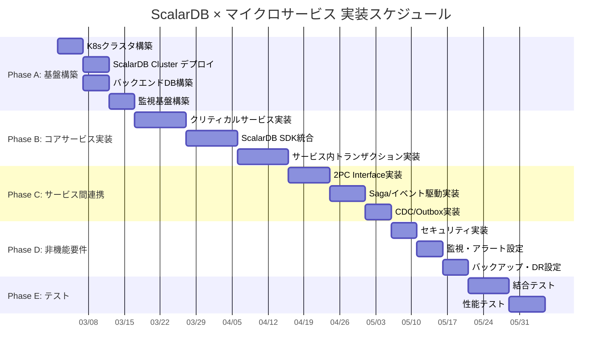

# Phase 4-1: 実装ガイド

## 目的

設計成果物をもとに、実装タスクを定義し優先順位をつける。Phase 1〜3で策定した要件分析、設計、基盤設計の全成果物を入力として、段階的かつ安全に実装を進めるためのガイドラインを策定する。

---

## 入力

| 入力物 | 説明 | 提供元 |
|--------|------|--------|
| Phase 1〜3の全設計成果物 | 要件分析、ドメインモデル、データモデル設計、トランザクション設計、API設計、インフラ設計、セキュリティ設計、オブザーバビリティ設計、DR設計 | 前フェーズ全体 |
| 実装タスク一覧（ドラフト） | Phase 3完了時点で識別された実装タスク候補 | 前フェーズ |

---

## 参照資料

| 資料 | 参照箇所 | 用途 |
|------|----------|------|
| [`../research/00_summary_report.md`](../research/00_summary_report.md) | Section 12 ロードマップ | 実装フェーズの全体スケジュール・マイルストーンの参考 |
| [`../research/13_scalardb_317_deep_dive.md`](../research/13_scalardb_317_deep_dive.md) | 全体 | ScalarDB 3.17の新機能（Batch Operations、Write Buffering等）の実装方法 |

---

## ステップ

### Step 11.1: 実装フェーズの定義

実装を5つのフェーズに分割し、段階的に進める。各フェーズは前フェーズの完了を前提とする。



#### Phase A: 基盤構築（3〜4週間）

プロジェクト全体のインフラ基盤を構築する。

| タスク | 内容 | 前提条件 | 完了基準 |
|--------|------|---------|---------|
| K8sクラスタ構築 | Kubernetes環境の構築（EKS/GKE/AKS等）。Namespace設計、RBAC設定、ネットワークポリシーの適用 | クラウドアカウント・権限の準備 | kubectlで全Namespaceにアクセス可能、RBAC適用済み |
| ScalarDB Cluster デプロイ | Helm Chartを使ったScalarDB Clusterのデプロイ。Envoy Proxy設定、ScalarDB Cluster ノード構成 | K8sクラスタ稼働済み | ScalarDB Clusterの全ノードがReadyかつヘルスチェック通過 |

> **注意**: ScalarDB Clusterの商用ライセンスでは1ノードあたり2vCPU / 4GBメモリの制約があります（詳細は `07_infrastructure_design.md` Step 7.3参照）。

| バックエンドDB構築 | 各マイクロサービスが使用するバックエンドDBの構築（MySQL/PostgreSQL/Cassandra等） | K8sクラスタ稼働済み | 各DBへの接続確認、ScalarDBからの接続確認 |
| 監視基盤構築 | Prometheus/Grafana/Loki等の監視スタックのデプロイ | K8sクラスタ稼働済み | メトリクス収集、ログ収集が動作確認済み |

#### Phase B: コアサービス実装（4〜6週間）

最もクリティカルなサービスから実装を開始する。

| タスク | 内容 | 前提条件 | 完了基準 |
|--------|------|---------|---------|
| クリティカルサービスの実装 | ドメインモデル（Step 02成果物）に基づき、最もビジネスインパクトが高いサービスから実装。基本的なCRUD操作とビジネスロジックの実装 | Phase A完了 | 単体テスト通過、基本APIが動作 |
| ScalarDB SDK統合 | 各サービスにScalarDB SDKを統合。database.propertiesの設定、DistributedTransactionManagerの初期化 | クリティカルサービスの骨格完成 | ScalarDB経由のDB操作が動作確認済み |
| サービス内トランザクション実装 | 各サービス内のローカルトランザクション実装。ScalarDB DistributedTransaction APIの使用 | ScalarDB SDK統合完了 | サービス内トランザクションの正常系・異常系テスト通過 |

#### Phase C: サービス間連携（3〜4週間）

サービス間のトランザクション連携を実装する。

| タスク | 内容 | 前提条件 | 完了基準 |
|--------|------|---------|---------|
| 2PC Interfaceの実装 | ScalarDB TwoPhaseCommitTransaction APIを使用したサービス間2PC実装。Coordinator/Participant役割の実装 | Phase B完了 | 2PCの正常系シナリオが動作確認済み |
| Saga/イベント駆動の実装 | 結果整合性が許容されるサービス間連携のSagaパターン実装。補償トランザクションの設計・実装 | Phase B完了 | Sagaの正常系・補償シナリオが動作確認済み |
| CDC/Outboxの実装 | Outboxパターンによるイベント発行の実装。ScalarDB CDC機能の活用（該当する場合） | Phase B完了 | イベント発行・購読が動作確認済み |

#### Phase D: 非機能要件実装（2〜3週間）

セキュリティ、監視、バックアップ等の非機能要件を実装する。

| タスク | 内容 | 前提条件 | 完了基準 |
|--------|------|---------|---------|
| セキュリティ実装 | TLS/mTLS設定、RBAC権限設定、認証・認可の実装。ScalarDB Clusterの認証設定 | Phase C完了 | セキュリティテスト通過、脆弱性スキャン合格 |
| 監視・アラート設定 | Grafanaダッシュボード作成、アラートルール定義。ScalarDB固有メトリクスの監視設定 | Phase C完了 | 全メトリクス収集確認、アラート発火テスト通過 |
| バックアップ・DR設定 | バックアップジョブの設定、DR手順の実装・テスト | Phase C完了 | バックアップ・リストアの動作確認、RTO/RPO要件の達成確認 |

#### Phase E: 結合テスト・性能テスト（2〜3週間）

システム全体の結合テストおよび性能テストを実施する。

| タスク | 内容 | 前提条件 | 完了基準 |
|--------|------|---------|---------|
| 結合テスト | 全サービスを統合した状態でのE2Eテスト。2PC/Sagaのシナリオテスト、障害シナリオテスト | Phase D完了 | 全結合テストケース通過 |
| 性能テスト | スループット・レイテンシの計測。OCC競合率テスト、スケーラビリティテスト | Phase D完了 | 性能目標（目標TPS、P95レイテンシ）達成 |

---

### Step 11.2: 各サービスの実装チェックリスト

各マイクロサービスの実装時に確認すべき項目を定義する。

#### 11.2.1: ScalarDB設定ファイル（database.properties）の作成

```properties
# ScalarDB Cluster接続設定
scalar.db.transaction_manager=cluster
scalar.db.contact_points=indirect:scalardb-cluster-envoy.<namespace>.svc.cluster.local

# トランザクション設定
scalar.db.consensus_commit.isolation_level=SNAPSHOT
scalar.db.consensus_commit.serializable_strategy=EXTRA_READ

# 接続プール設定
scalar.db.cluster.grpc.deadline_duration_millis=60000
```

**確認ポイント:**
- [ ] contact_pointsがScalarDB Cluster Envoyのサービス名を指しているか
- [ ] isolation_levelがトランザクション要件に合致しているか
- [ ] タイムアウト値がSLAに適切か

#### 11.2.2: トランザクション管理クラスの実装

```java
// トランザクション管理の基本パターン
public class TransactionService {
    private final DistributedTransactionManager manager;

    public void executeInTransaction(TransactionAction action) {
        DistributedTransaction tx = null;
        int retryCount = 0;
        while (retryCount < MAX_RETRIES) {
            try {
                tx = manager.begin();
                action.execute(tx);
                tx.commit();
                return;
            } catch (CrudConflictException e) {
                // OCC競合 → ロールバック後リトライ
                if (tx != null) {
                    try { tx.rollback(); } catch (Exception re) { /* log */ }
                }
                retryCount++;
                if (retryCount >= MAX_RETRIES) {
                    throw new TransactionConflictException("Max retries exceeded", e);
                }
                backoff(retryCount);
            } catch (CommitConflictException e) {
                // コミット時競合 → ロールバック後リトライ
                if (tx != null) {
                    try { tx.rollback(); } catch (Exception re) { /* log */ }
                }
                retryCount++;
                if (retryCount >= MAX_RETRIES) {
                    throw new TransactionConflictException("Max retries exceeded", e);
                }
                backoff(retryCount);
            } catch (UnknownTransactionStatusException e) {
                // コミット結果不明 → ログ出力し調査
                throw new TransactionUnknownException("Commit status unknown", e);
            } catch (Exception e) {
                if (tx != null) {
                    try { tx.rollback(); } catch (Exception re) { /* log */ }
                }
                throw new TransactionFailedException("Transaction failed", e);
            }
        }
    }
}
```

**確認ポイント:**
- [ ] CrudConflictException/CommitConflictExceptionのリトライが実装されているか
- [ ] UnknownTransactionStatusExceptionのハンドリングが適切か
- [ ] rollbackが確実に呼ばれるか（finallyブロック or try-with-resources）
- [ ] リトライ間隔にExponential Backoffが適用されているか

#### 11.2.3: リポジトリ層の実装（ScalarDB API経由）

```java
// ScalarDB APIを使用したリポジトリパターン
public class OrderRepository {
    private static final String NAMESPACE = "order_service";
    private static final String TABLE = "orders";

    public Optional<Order> findById(DistributedTransaction tx, String orderId)
            throws CrudException {
        Get get = Get.newBuilder()
            .namespace(NAMESPACE)
            .table(TABLE)
            .partitionKey(Key.ofText("order_id", orderId))
            .build();
        return tx.get(get).map(this::toOrder);
    }

    public void save(DistributedTransaction tx, Order order) throws CrudException {
        Put put = Put.newBuilder()
            .namespace(NAMESPACE)
            .table(TABLE)
            .partitionKey(Key.ofText("order_id", order.getId()))
            .textValue("customer_id", order.getCustomerId())
            .intValue("total_amount", order.getTotalAmount())
            .textValue("status", order.getStatus().name())
            .build();
        tx.put(put);
    }
}
```

**確認ポイント:**
- [ ] トランザクション（tx）が外部から注入されているか（リポジトリ内でbegin/commitしない）
- [ ] Namespace/Table名がスキーマ定義と一致しているか
- [ ] パーティションキー・クラスタリングキーが正しく設定されているか

#### 11.2.4: エラーハンドリング設計

ScalarDB固有の例外を適切にハンドリングする。

| 例外クラス | 発生タイミング | 対応方針 |
|-----------|-------------|---------|
| `CrudConflictException` | Get/Put/Delete操作時のOCC競合 | リトライ（Exponential Backoff） |
| `CommitConflictException` | コミット時のOCC競合 | トランザクション全体をリトライ |
| `UnknownTransactionStatusException` | コミット結果が不明 | ログ記録し、Coordinatorテーブルで確認 |
| `CrudException` | CRUD操作の一般的な失敗 | ロールバックしてエラー返却 |
| `TransactionException` | トランザクション操作の一般的な失敗 | ロールバックしてエラー返却 |
| `TransactionNotFoundException` | トランザクションIDが見つからない | 新規トランザクションで再実行 |

#### 11.2.5: Spring Boot / Quarkus統合

```java
// Spring Boot統合の例
@Configuration
public class ScalarDbConfig {

    @Bean
    public DistributedTransactionManager transactionManager() throws Exception {
        return TransactionFactory.create("database.properties")
            .getTransactionManager();
    }
}

// Quarkus統合の例（CDI Producer）
@ApplicationScoped
public class ScalarDbProducer {

    @Produces
    @ApplicationScoped
    public DistributedTransactionManager transactionManager() throws Exception {
        return TransactionFactory.create("database.properties")
            .getTransactionManager();
    }
}
```

**確認ポイント:**
- [ ] TransactionManagerがシングルトン（ApplicationScoped）で管理されているか
- [ ] アプリケーション終了時にclose()が呼ばれるか（@PreDestroy）
- [ ] database.propertiesのパスが正しいか

---

### Step 11.3: ScalarDB固有の実装パターン

ScalarDB APIの正しい使い方を整理する。

#### 11.3.1: DistributedTransaction APIの使い方

単一サービス内のトランザクションに使用する。

```
begin → 操作（Get/Put/Delete/Scan） → commit
  |                                       |
  +------------ rollback（異常時）---------+
```

```java
DistributedTransaction tx = manager.begin();
try {
    // 1. 読み取り
    Optional<Result> result = tx.get(getOperation);

    // 2. ビジネスロジック
    // ...

    // 3. 書き込み
    tx.put(putOperation);

    // 4. コミット
    tx.commit();
} catch (CrudConflictException | CommitConflictException e) {
    // OCC競合 → リトライ
    tx.rollback();
    // retry logic
} catch (Exception e) {
    tx.rollback();
    throw e;
}
```

#### 11.3.2: TwoPhaseCommitTransaction APIの使い方

サービス間の分散トランザクションに使用する。

```
【Coordinator】           【Participant】
start() ──────────────→ join(txId)
    |                        |
  操作                      操作
    |                        |
prepare() ←──────────── prepare()
    |                        |
validate() ←─────────── validate()
    |                        |
commit() ──────────────→ commit()
```

```java
// Coordinator側
TwoPhaseCommitTransaction tx = manager.start();
try {
    String txId = tx.getId();

    // 1. ローカル操作
    tx.put(localPutOperation);

    // 2. Participantに txId を渡して操作を依頼（gRPC/REST）
    participantClient.executeInTransaction(txId, request);

    // 3. Prepare（全Participant + 自身）
    tx.prepare();

    // 4. Validate（全Participant + 自身）
    tx.validate();

    // 5. Commit（全Participant + 自身）
    tx.commit();
} catch (Exception e) {
    tx.rollback();
    throw e;
}

// Participant側
TwoPhaseCommitTransaction tx = manager.join(txId);
try {
    // ローカル操作
    tx.put(localPutOperation);

    // Coordinator側でprepare/validate/commitが呼ばれる
    tx.prepare();
    tx.validate();
    tx.commit();
} catch (Exception e) {
    tx.rollback();
    throw e;
}
```

#### 11.3.3: Batch Operations APIの使い方（3.17新機能）

複数の操作をバッチで実行し、パフォーマンスを向上させる。

```java
// Batch Put
List<Put> puts = new ArrayList<>();
for (OrderItem item : order.getItems()) {
    Put put = Put.newBuilder()
        .namespace(NAMESPACE)
        .table(TABLE)
        .partitionKey(Key.ofText("order_id", order.getId()))
        .clusteringKey(Key.ofInt("item_seq", item.getSeq()))
        .textValue("product_id", item.getProductId())
        .intValue("quantity", item.getQuantity())
        .build();
    puts.add(put);
}
tx.mutate(puts);  // バッチ実行
```

**注意:** Batch Operationsは同一トランザクション内で実行される。個々のPut/Deleteを逐次実行するよりも効率的。

#### 11.3.4: Write Buffering / Piggyback Begin の設定方法

ScalarDB 3.17で導入されたパフォーマンス最適化機能。

```properties
# Write Buffering（書き込みバッファリング）
# 非条件的な書込み操作（insert, upsert, 無条件put/update/delete）をバッファし、
# Read時やCommit時にまとめて送信。条件付きミューテーション（updateIf, deleteIf等）は対象外。
scalar.db.cluster.client.write_buffering.enabled=true

# Piggyback Begin（トランザクション開始の最適化）
# 最初の操作と同時にトランザクションを開始
scalar.db.cluster.client.piggyback_begin.enabled=true
# デフォルトOFF。明示的に有効化が必要
```

**確認ポイント:**
- [ ] Write Bufferingを有効にする場合、バッファサイズの上限を考慮しているか
- [ ] 書き込みが多いワークロードでWrite Bufferingの効果を計測しているか

---

### Step 11.4: AI Coding エージェント活用ガイド

AI Codingエージェントを活用して実装を効率化する方法を定義する。

#### 11.4.1: ScalarDB APIのコード生成テンプレート

AI Codingエージェントに以下のコンテキストを提供し、コード生成を依頼する。

**プロンプトテンプレート（リポジトリ層生成）:**

```
以下の仕様に基づき、ScalarDB APIを使用したリポジトリクラスを生成してください。

- エンティティ名: {エンティティ名}
- Namespace: {namespace}
- Table: {table}
- パーティションキー: {partition_key} ({型})
- クラスタリングキー: {clustering_key} ({型}) ※あれば
- カラム:
  - {column1}: {型}
  - {column2}: {型}
  ...

要件:
- DistributedTransactionを外部から受け取るメソッド設計
- findById, save, delete, findByConditionメソッドを実装
- 全てのCrudExceptionをthrowsで宣言
- Optionalを活用した戻り値設計
```

#### 11.4.2: トランザクションパターン実装のプロンプト設計

**プロンプトテンプレート（2PCパターン）:**

```
以下の仕様に基づき、ScalarDB TwoPhaseCommitTransaction APIを使用した
サービス間トランザクションを実装してください。

- Coordinatorサービス: {coordinator_service}
- Participantサービス: {participant_services}
- ビジネスプロセス: {process_description}
- 操作内容:
  - Coordinator側: {coordinator_operations}
  - Participant側: {participant_operations}

要件:
- start → 操作 → prepare → validate → commitのフロー
- CrudConflictException/CommitConflictExceptionのリトライ（最大3回、Exponential Backoff）
- UnknownTransactionStatusExceptionのハンドリング
- rollbackの確実な実行
- 各Participantへのトランザクション伝搬（gRPC推奨）
```

#### 11.4.3: テストコード自動生成

**プロンプトテンプレート（テストコード）:**

```
以下のサービスクラスに対する単体テストと統合テストを生成してください。

- テスト対象クラス: {class_name}
- テストフレームワーク: JUnit 5 + Mockito
- ScalarDBのモック化: DistributedTransactionManagerをモック

テストケース:
- 正常系: トランザクション成功
- 異常系: CrudConflictException発生時のリトライ
- 異常系: CommitConflictException発生時のリトライ
- 異常系: UnknownTransactionStatusException発生時の処理
- 異常系: 最大リトライ回数超過
```

---

### Step 11.5: コードレビュー観点

実装のコードレビュー時に確認すべき観点を定義する。

#### 11.5.1: ScalarDB固有のレビュー観点

| # | レビュー観点 | 確認内容 | 重要度 |
|---|------------|---------|--------|
| 1 | トランザクションスコープ | トランザクションが必要以上に長くないか。長時間トランザクションはOCC競合率を上げる | Critical |
| 2 | エラーハンドリング | CrudConflictException、CommitConflictExceptionのリトライが実装されているか | Critical |
| 3 | UnknownTransactionStatus | UnknownTransactionStatusExceptionが適切にハンドリングされているか | Critical |
| 4 | リソースクリーンアップ | TransactionManagerのclose()、トランザクションのrollback()が確実に呼ばれるか | High |
| 5 | トランザクション伝搬 | リポジトリメソッドがDistributedTransactionを引数で受け取っているか（内部でbegin/commitしていないか） | High |
| 6 | キー設計 | パーティションキー・クラスタリングキーがスキーマ定義と一致しているか | High |
| 7 | Namespace/Table名 | ハードコードされていないか、定数化されているか | Medium |
| 8 | バッチ操作 | 複数の同種操作がある場合、Batch Operations APIが活用されているか | Medium |

#### 11.5.2: パフォーマンスレビュー観点

| # | レビュー観点 | 確認内容 | 重要度 |
|---|------------|---------|--------|
| 1 | N+1問題 | ループ内でGet操作を繰り返していないか | Critical |
| 2 | Scan範囲 | Scanの範囲が必要以上に広くないか。Limitは設定されているか | High |
| 3 | トランザクション粒度 | 1トランザクション内の操作数が適切か（多すぎるとOCC競合率上昇） | High |
| 4 | インデックス設計 | セカンダリインデックスが適切に定義されているか | High |
| 5 | 接続プール | ScalarDB Cluster接続のタイムアウトとプール設定が適切か | Medium |
| 6 | Write Buffering | 書き込みが多い場合、Write Bufferingが活用されているか | Medium |

---

## 成果物

| 成果物 | 説明 | テンプレート |
|--------|------|-------------|
| 実装タスク一覧（優先順位付き） | Phase A〜Eの全タスクを優先順位付きでリスト化 | Step 11.1の各フェーズのタスク表 |
| 実装ガイドライン | ScalarDB APIの使用方法、エラーハンドリング、実装パターン集 | Step 11.2〜11.3のコードテンプレート |
| コーディング規約 | ScalarDB固有のコーディング規約、レビュー観点 | Step 11.5のレビュー観点表 |
| AI Codingエージェント活用ガイド | コード生成テンプレート、プロンプト設計 | Step 11.4のプロンプトテンプレート |

---

## 完了基準チェックリスト

- [ ] 実装フェーズ（Phase A〜E）が定義され、各フェーズのタスク・前提条件・完了基準が明確である
- [ ] 各サービスの実装チェックリストが作成されている
- [ ] ScalarDB設定ファイル（database.properties）のテンプレートが作成されている
- [ ] トランザクション管理クラスの実装テンプレートが作成されている
- [ ] リポジトリ層の実装テンプレートが作成されている
- [ ] エラーハンドリング（CrudConflictException、CommitConflictException、UnknownTransactionStatusException）の対応方針が定義されている
- [ ] DistributedTransaction APIの使い方がサンプルコード付きで文書化されている
- [ ] TwoPhaseCommitTransaction APIの使い方がサンプルコード付きで文書化されている
- [ ] Batch Operations API（3.17新機能）の使い方がサンプルコード付きで文書化されている
- [ ] AI Codingエージェント活用のためのプロンプトテンプレートが作成されている
- [ ] コードレビュー観点（ScalarDB固有、パフォーマンス）が定義されている
- [ ] 実装タスク一覧について関係者（アーキテクト、テックリード、開発チーム）の合意が得られている
- [ ] ガントチャートによるスケジュールが関係者に共有されている

---

## 次のステップへの引き継ぎ事項

### Phase 4-2: テスト戦略（`12_testing_strategy.md`）への引き継ぎ

| 引き継ぎ項目 | 内容 |
|-------------|------|
| 実装フェーズ定義 | Phase A〜Eの各タスクとスケジュール |
| エラーハンドリング設計 | ScalarDB例外の分類とリトライ設計（テストシナリオの入力） |
| ScalarDB実装パターン | DistributedTransaction / 2PC / Batch Operationsの実装パターン（テスト対象の入力） |
| コーディング規約 | レビュー観点に基づくテスト観点の導出 |
