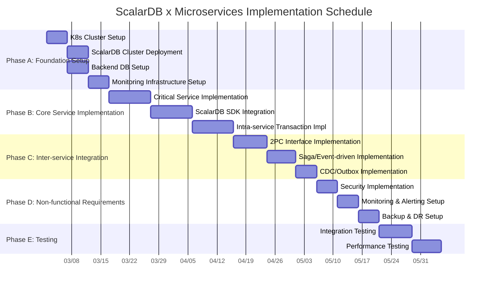

# Phase 4-1: Implementation Guide

## Purpose

Define implementation tasks and prioritize them based on design artifacts. Using all deliverables from Phase 1-3 (requirements analysis, design, and infrastructure design) as input, establish guidelines for progressing implementation incrementally and safely.

---

## Input

| Input | Description | Source |
|-------|-------------|--------|
| All design artifacts from Phase 1-3 | Requirements analysis, domain model, data model design, transaction design, API design, infrastructure design, security design, observability design, DR design | All previous phases |
| Implementation task list (draft) | Implementation task candidates identified at Phase 3 completion | Previous phase |

---

## References

| Document | Reference Section | Purpose |
|----------|-------------------|---------|
| [`../research/00_summary_report.md`](../research/00_summary_report.md) | Section 12 Roadmap | Reference for overall schedule and milestones of the implementation phase |
| [`../research/13_scalardb_317_deep_dive.md`](../research/13_scalardb_317_deep_dive.md) | Entire document | Implementation methods for ScalarDB 3.17 new features (Batch Operations, Write Buffering, etc.) |

---

## Steps

### Step 11.1: Defining Implementation Phases

Divide the implementation into 5 phases and proceed incrementally. Each phase assumes the completion of the previous phase.



#### Phase A: Foundation Setup (3-4 weeks)

Build the infrastructure foundation for the entire project.

| Task | Details | Prerequisites | Completion Criteria |
|------|---------|---------------|---------------------|
| K8s Cluster Setup | Build Kubernetes environment (EKS/GKE/AKS, etc.). Namespace design, RBAC configuration, network policy application | Cloud account and permissions ready | All Namespaces accessible via kubectl, RBAC applied |
| ScalarDB Cluster Deployment | Deploy ScalarDB Cluster using Helm Chart. Envoy Proxy configuration, ScalarDB Cluster node configuration | K8s cluster operational | All ScalarDB Cluster nodes are Ready and pass health checks |

> **Note**: The ScalarDB Cluster commercial license has a constraint of 2 vCPU / 4GB memory per node (see `07_infrastructure_design.md` Step 7.3 for details).

| Backend DB Setup | Build backend databases used by each microservice (MySQL/PostgreSQL/Cassandra, etc.) | K8s cluster operational | Connection to each DB confirmed, connection from ScalarDB confirmed |
| Monitoring Infrastructure Setup | Deploy monitoring stack (Prometheus/Grafana/Loki, etc.) | K8s cluster operational | Metrics collection and log collection verified |

#### Phase B: Core Service Implementation (4-6 weeks)

Start implementation with the most critical services.

| Task | Details | Prerequisites | Completion Criteria |
|------|---------|---------------|---------------------|
| Critical Service Implementation | Implement services starting from those with the highest business impact based on the domain model (Step 02 deliverables). Implement basic CRUD operations and business logic | Phase A complete | Unit tests pass, basic APIs operational |
| ScalarDB SDK Integration | Integrate ScalarDB SDK into each service. Configure database.properties, initialize DistributedTransactionManager | Critical service skeleton complete | DB operations via ScalarDB verified |
| Intra-service Transaction Implementation | Implement local transactions within each service. Use ScalarDB DistributedTransaction API | ScalarDB SDK integration complete | Normal and error path tests for intra-service transactions pass |

#### Phase C: Inter-service Integration (3-4 weeks)

Implement transaction coordination between services.

| Task | Details | Prerequisites | Completion Criteria |
|------|---------|---------------|---------------------|
| 2PC Interface Implementation | Implement inter-service 2PC using ScalarDB TwoPhaseCommitTransaction API. Implement Coordinator/Participant roles | Phase B complete | Normal path scenarios for 2PC verified |
| Saga/Event-driven Implementation | Implement Saga pattern for inter-service integration where eventual consistency is acceptable. Design and implement compensation transactions | Phase B complete | Normal path and compensation scenarios for Saga verified |
| CDC/Outbox Implementation | Implement event publishing via the Outbox pattern. Leverage ScalarDB CDC features (if applicable) | Phase B complete | Event publishing and subscription verified |

#### Phase D: Non-functional Requirements Implementation (2-3 weeks)

Implement non-functional requirements such as security, monitoring, and backup.

| Task | Details | Prerequisites | Completion Criteria |
|------|---------|---------------|---------------------|
| Security Implementation | TLS/mTLS configuration, RBAC permissions, authentication and authorization implementation. ScalarDB Cluster authentication configuration | Phase C complete | Security tests pass, vulnerability scan passed |
| Monitoring & Alerting Setup | Create Grafana dashboards, define alert rules. Configure monitoring for ScalarDB-specific metrics | Phase C complete | All metrics collection confirmed, alert firing tests pass |
| Backup & DR Setup | Configure backup jobs, implement and test DR procedures | Phase C complete | Backup and restore verified, RTO/RPO requirements met |

#### Phase E: Integration Testing & Performance Testing (2-3 weeks)

Conduct system-wide integration testing and performance testing.

| Task | Details | Prerequisites | Completion Criteria |
|------|---------|---------------|---------------------|
| Integration Testing | E2E testing with all services integrated. 2PC/Saga scenario testing, failure scenario testing | Phase D complete | All integration test cases pass |
| Performance Testing | Measure throughput and latency. OCC conflict rate testing, scalability testing | Phase D complete | Performance targets (target TPS, P95 latency) achieved |

---

### Step 11.2: Implementation Checklist for Each Service

Define the items to verify when implementing each microservice.

#### 11.2.1: Creating the ScalarDB Configuration File (database.properties)

```properties
# ScalarDB Cluster connection settings
scalar.db.transaction_manager=cluster
scalar.db.contact_points=indirect:scalardb-cluster-envoy.<namespace>.svc.cluster.local

# Transaction settings
scalar.db.consensus_commit.isolation_level=SNAPSHOT
scalar.db.consensus_commit.serializable_strategy=EXTRA_READ

# Connection pool settings
scalar.db.cluster.grpc.deadline_duration_millis=60000
```

**Verification Points:**
- [ ] Does contact_points point to the ScalarDB Cluster Envoy service name?
- [ ] Does isolation_level match the transaction requirements?
- [ ] Are timeout values appropriate for the SLA?

#### 11.2.2: Implementing the Transaction Management Class

```java
// Basic transaction management pattern
public class TransactionService {
    private final DistributedTransactionManager manager;

    public void executeInTransaction(TransactionAction action) {
        DistributedTransaction tx = null;
        int retryCount = 0;
        while (retryCount < MAX_RETRIES) {
            try {
                tx = manager.begin();
                action.execute(tx);
                tx.commit();
                return;
            } catch (CrudConflictException e) {
                // OCC conflict -> rollback then retry
                if (tx != null) {
                    try { tx.rollback(); } catch (Exception re) { /* log */ }
                }
                retryCount++;
                if (retryCount >= MAX_RETRIES) {
                    throw new TransactionConflictException("Max retries exceeded", e);
                }
                backoff(retryCount);
            } catch (CommitConflictException e) {
                // Conflict at commit -> rollback then retry
                if (tx != null) {
                    try { tx.rollback(); } catch (Exception re) { /* log */ }
                }
                retryCount++;
                if (retryCount >= MAX_RETRIES) {
                    throw new TransactionConflictException("Max retries exceeded", e);
                }
                backoff(retryCount);
            } catch (UnknownTransactionStatusException e) {
                // Commit result unknown -> log and investigate
                throw new TransactionUnknownException("Commit status unknown", e);
            } catch (Exception e) {
                if (tx != null) {
                    try { tx.rollback(); } catch (Exception re) { /* log */ }
                }
                throw new TransactionFailedException("Transaction failed", e);
            }
        }
    }
}
```

**Verification Points:**
- [ ] Is retry implemented for CrudConflictException/CommitConflictException?
- [ ] Is UnknownTransactionStatusException handled appropriately?
- [ ] Is rollback reliably called (via finally block or try-with-resources)?
- [ ] Is Exponential Backoff applied to retry intervals?

#### 11.2.3: Implementing the Repository Layer (via ScalarDB API)

```java
// Repository pattern using ScalarDB API
public class OrderRepository {
    private static final String NAMESPACE = "order_service";
    private static final String TABLE = "orders";

    public Optional<Order> findById(DistributedTransaction tx, String orderId)
            throws CrudException {
        Get get = Get.newBuilder()
            .namespace(NAMESPACE)
            .table(TABLE)
            .partitionKey(Key.ofText("order_id", orderId))
            .build();
        return tx.get(get).map(this::toOrder);
    }

    public void save(DistributedTransaction tx, Order order) throws CrudException {
        Put put = Put.newBuilder()
            .namespace(NAMESPACE)
            .table(TABLE)
            .partitionKey(Key.ofText("order_id", order.getId()))
            .textValue("customer_id", order.getCustomerId())
            .intValue("total_amount", order.getTotalAmount())
            .textValue("status", order.getStatus().name())
            .build();
        tx.put(put);
    }
}
```

**Verification Points:**
- [ ] Is the transaction (tx) injected from outside (no begin/commit inside the repository)?
- [ ] Do Namespace/Table names match the schema definition?
- [ ] Are the partition key and clustering key correctly configured?

#### 11.2.4: Error Handling Design

Handle ScalarDB-specific exceptions appropriately.

| Exception Class | When It Occurs | Response Strategy |
|----------------|----------------|-------------------|
| `CrudConflictException` | OCC conflict during Get/Put/Delete operations | Retry (Exponential Backoff) |
| `CommitConflictException` | OCC conflict at commit time | Retry the entire transaction |
| `UnknownTransactionStatusException` | Commit result is unknown | Log and verify via Coordinator table |
| `CrudException` | General CRUD operation failure | Rollback and return error |
| `TransactionException` | General transaction operation failure | Rollback and return error |
| `TransactionNotFoundException` | Transaction ID not found | Re-execute with a new transaction |

#### 11.2.5: Spring Boot / Quarkus Integration

```java
// Spring Boot integration example
@Configuration
public class ScalarDbConfig {

    @Bean
    public DistributedTransactionManager transactionManager() throws Exception {
        return TransactionFactory.create("database.properties")
            .getTransactionManager();
    }
}

// Quarkus integration example (CDI Producer)
@ApplicationScoped
public class ScalarDbProducer {

    @Produces
    @ApplicationScoped
    public DistributedTransactionManager transactionManager() throws Exception {
        return TransactionFactory.create("database.properties")
            .getTransactionManager();
    }
}
```

**Verification Points:**
- [ ] Is the TransactionManager managed as a singleton (ApplicationScoped)?
- [ ] Is close() called on application shutdown (@PreDestroy)?
- [ ] Is the database.properties path correct?

---

### Step 11.3: ScalarDB-Specific Implementation Patterns

Organize the correct usage of ScalarDB APIs.

#### 11.3.1: Using the DistributedTransaction API

Used for transactions within a single service.

```
begin -> operations (Get/Put/Delete/Scan) -> commit
  |                                            |
  +------------ rollback (on error) -----------+
```

```java
DistributedTransaction tx = manager.begin();
try {
    // 1. Read
    Optional<Result> result = tx.get(getOperation);

    // 2. Business logic
    // ...

    // 3. Write
    tx.put(putOperation);

    // 4. Commit
    tx.commit();
} catch (CrudConflictException | CommitConflictException e) {
    // OCC conflict -> retry
    tx.rollback();
    // retry logic
} catch (Exception e) {
    tx.rollback();
    throw e;
}
```

#### 11.3.2: Using the TwoPhaseCommitTransaction API

Used for distributed transactions across services.

```
[Coordinator]              [Participant]
start() -----------------> join(txId)
    |                          |
  operations                 operations
    |                          |
prepare() <--------------- prepare()
    |                          |
validate() <-------------- validate()
    |                          |
commit() -----------------> commit()
```

```java
// Coordinator side
TwoPhaseCommitTransaction tx = manager.start();
try {
    String txId = tx.getId();

    // 1. Local operations
    tx.put(localPutOperation);

    // 2. Pass txId to Participant and request operations (gRPC/REST)
    participantClient.executeInTransaction(txId, request);

    // 3. Prepare (all Participants + self)
    tx.prepare();

    // 4. Validate (all Participants + self)
    tx.validate();

    // 5. Commit (all Participants + self)
    tx.commit();
} catch (Exception e) {
    tx.rollback();
    throw e;
}

// Participant side
TwoPhaseCommitTransaction tx = manager.join(txId);
try {
    // Local operations
    tx.put(localPutOperation);

    // prepare/validate/commit are called from the Coordinator side
    tx.prepare();
    tx.validate();
    tx.commit();
} catch (Exception e) {
    tx.rollback();
    throw e;
}
```

#### 11.3.3: Using the Batch Operations API (3.17 New Feature)

Execute multiple operations in batch to improve performance.

```java
// Batch Put
List<Put> puts = new ArrayList<>();
for (OrderItem item : order.getItems()) {
    Put put = Put.newBuilder()
        .namespace(NAMESPACE)
        .table(TABLE)
        .partitionKey(Key.ofText("order_id", order.getId()))
        .clusteringKey(Key.ofInt("item_seq", item.getSeq()))
        .textValue("product_id", item.getProductId())
        .intValue("quantity", item.getQuantity())
        .build();
    puts.add(put);
}
tx.mutate(puts);  // Batch execution
```

**Note:** Batch Operations are executed within the same transaction. They are more efficient than executing individual Put/Delete operations sequentially.

#### 11.3.4: Configuring Write Buffering / Piggyback Begin

Performance optimization features introduced in ScalarDB 3.17.

```properties
# Write Buffering
# Buffers unconditional write operations (insert, upsert, unconditional put/update/delete)
# and sends them together during Read or Commit. Conditional mutations (updateIf, deleteIf, etc.)
# are not buffered.
scalar.db.cluster.client.write_buffering.enabled=true

# Piggyback Begin (transaction start optimization)
# Starts the transaction together with the first operation
scalar.db.cluster.client.piggyback_begin.enabled=true
# Off by default. Must be explicitly enabled
```

**Verification Points:**
- [ ] When enabling Write Buffering, has the buffer size limit been considered?
- [ ] Has the effectiveness of Write Buffering been measured for write-heavy workloads?

---

### Step 11.4: AI Coding Agent Utilization Guide

Define methods for leveraging AI Coding agents to streamline implementation.

#### 11.4.1: Code Generation Templates for ScalarDB API

Provide the following context to the AI Coding agent and request code generation.

**Prompt Template (Repository Layer Generation):**

```
Generate a repository class using ScalarDB API based on the following specification.

- Entity name: {entity_name}
- Namespace: {namespace}
- Table: {table}
- Partition key: {partition_key} ({type})
- Clustering key: {clustering_key} ({type}) * if applicable
- Columns:
  - {column1}: {type}
  - {column2}: {type}
  ...

Requirements:
- Method design that receives DistributedTransaction from outside
- Implement findById, save, delete, findByCondition methods
- Declare all CrudExceptions in throws
- Return value design utilizing Optional
```

#### 11.4.2: Prompt Design for Transaction Pattern Implementation

**Prompt Template (2PC Pattern):**

```
Implement an inter-service transaction using ScalarDB TwoPhaseCommitTransaction API
based on the following specification.

- Coordinator service: {coordinator_service}
- Participant services: {participant_services}
- Business process: {process_description}
- Operation details:
  - Coordinator side: {coordinator_operations}
  - Participant side: {participant_operations}

Requirements:
- Flow: start -> operations -> prepare -> validate -> commit
- Retry for CrudConflictException/CommitConflictException (max 3 retries, Exponential Backoff)
- Handling of UnknownTransactionStatusException
- Reliable execution of rollback
- Transaction propagation to each Participant (gRPC recommended)
```

#### 11.4.3: Automated Test Code Generation

**Prompt Template (Test Code):**

```
Generate unit tests and integration tests for the following service class.

- Target class: {class_name}
- Test framework: JUnit 5 + Mockito
- ScalarDB mocking: Mock DistributedTransactionManager

Test cases:
- Normal path: Transaction success
- Error path: Retry on CrudConflictException
- Error path: Retry on CommitConflictException
- Error path: Handling of UnknownTransactionStatusException
- Error path: Maximum retry count exceeded
```

---

### Step 11.5: Code Review Perspectives

Define perspectives to verify during code review of the implementation.

#### 11.5.1: ScalarDB-Specific Review Perspectives

| # | Review Perspective | Verification Details | Severity |
|---|-------------------|----------------------|----------|
| 1 | Transaction Scope | Is the transaction longer than necessary? Long-running transactions increase OCC conflict rates | Critical |
| 2 | Error Handling | Are retries implemented for CrudConflictException and CommitConflictException? | Critical |
| 3 | UnknownTransactionStatus | Is UnknownTransactionStatusException handled appropriately? | Critical |
| 4 | Resource Cleanup | Is TransactionManager.close() and transaction rollback() reliably called? | High |
| 5 | Transaction Propagation | Do repository methods receive DistributedTransaction as a parameter (not begin/commit internally)? | High |
| 6 | Key Design | Do partition keys and clustering keys match the schema definition? | High |
| 7 | Namespace/Table Names | Are they not hardcoded? Are they defined as constants? | Medium |
| 8 | Batch Operations | When there are multiple operations of the same type, is the Batch Operations API being utilized? | Medium |

#### 11.5.2: Performance Review Perspectives

| # | Review Perspective | Verification Details | Severity |
|---|-------------------|----------------------|----------|
| 1 | N+1 Problem | Are Get operations being repeated inside loops? | Critical |
| 2 | Scan Range | Is the Scan range wider than necessary? Is a Limit set? | High |
| 3 | Transaction Granularity | Is the number of operations within a single transaction appropriate (too many increases OCC conflict rate)? | High |
| 4 | Index Design | Are secondary indexes appropriately defined? | High |
| 5 | Connection Pool | Are timeout and pool settings for ScalarDB Cluster connections appropriate? | Medium |
| 6 | Write Buffering | For write-heavy cases, is Write Buffering being utilized? | Medium |

---

## Deliverables

| Deliverable | Description | Template |
|-------------|-------------|----------|
| Implementation Task List (Prioritized) | All tasks from Phase A-E listed with priorities | Task tables for each phase in Step 11.1 |
| Implementation Guidelines | ScalarDB API usage, error handling, implementation pattern collection | Code templates from Step 11.2-11.3 |
| Coding Standards | ScalarDB-specific coding standards and review perspectives | Review perspective tables from Step 11.5 |
| AI Coding Agent Utilization Guide | Code generation templates, prompt design | Prompt templates from Step 11.4 |

---

## Completion Criteria Checklist

- [ ] Implementation phases (Phase A-E) are defined with clear tasks, prerequisites, and completion criteria for each phase
- [ ] Implementation checklists for each service have been created
- [ ] ScalarDB configuration file (database.properties) template has been created
- [ ] Transaction management class implementation template has been created
- [ ] Repository layer implementation template has been created
- [ ] Error handling strategies for CrudConflictException, CommitConflictException, and UnknownTransactionStatusException are defined
- [ ] DistributedTransaction API usage is documented with sample code
- [ ] TwoPhaseCommitTransaction API usage is documented with sample code
- [ ] Batch Operations API (3.17 new feature) usage is documented with sample code
- [ ] Prompt templates for AI Coding agent utilization have been created
- [ ] Code review perspectives (ScalarDB-specific, performance) are defined
- [ ] Consensus on the implementation task list has been obtained from stakeholders (architect, tech lead, development team)
- [ ] The Gantt chart schedule has been shared with stakeholders

---

## Handoff Items to the Next Step

### Handoff to Phase 4-2: Testing Strategy (`12_testing_strategy.md`)

| Handoff Item | Details |
|-------------|---------|
| Implementation Phase Definition | All tasks and schedules for Phase A-E |
| Error Handling Design | ScalarDB exception classification and retry design (input for test scenarios) |
| ScalarDB Implementation Patterns | DistributedTransaction / 2PC / Batch Operations implementation patterns (input for test targets) |
| Coding Standards | Derivation of test perspectives based on review perspectives |
