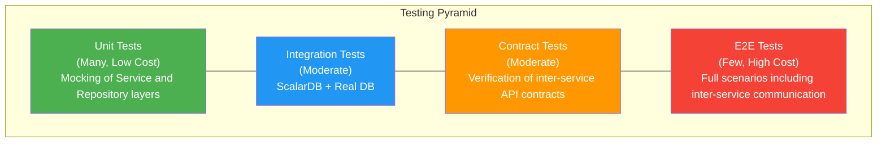
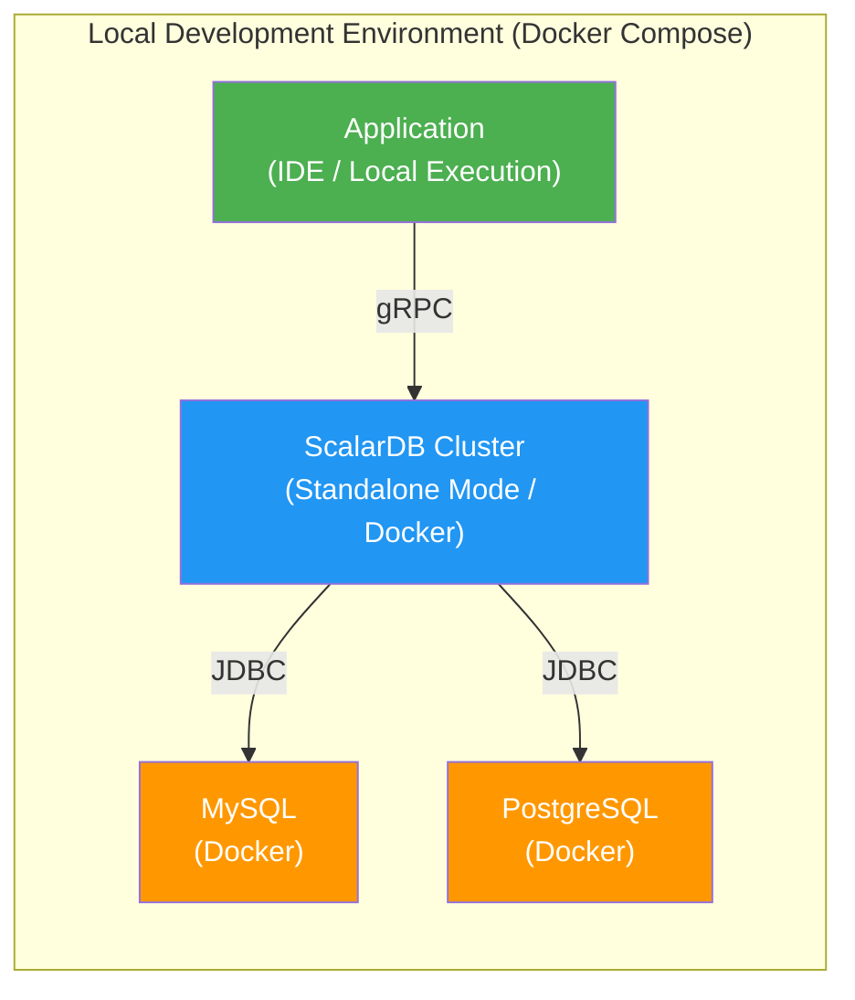

# Phase 4-2: Testing Strategy

## Purpose

Establish a testing strategy for ScalarDB x Microservices. Design test levels based on the testing pyramid, define ScalarDB-specific test perspectives, plan performance testing, failure testing, and security testing, and clarify quality criteria.

---

## Input

| Input | Description | Source |
|-------|-------------|--------|
| Implementation Guide | Deliverables from Phase 4-1 (`11_implementation_guide.md`). Implementation patterns, error handling design | Previous step |
| All Design Artifacts | Design deliverables from Phase 1-3 (data model, transaction design, API design, infrastructure design, etc.) | Previous phases |
| Non-functional Requirements | Target values for latency, throughput, and availability | Phase 1-1 deliverables |

---

## References

| Document | Reference Section | Purpose |
|----------|-------------------|---------|
| [`../research/07_transaction_model.md`](../research/07_transaction_model.md) | Entire transaction model | Understanding transaction patterns as test targets |
| [`../research/13_scalardb_317_deep_dive.md`](../research/13_scalardb_317_deep_dive.md) | Entire document | Test perspectives for 3.17 new features |
| [`../research/12_disaster_recovery.md`](../research/12_disaster_recovery.md) | Entire document | Reference for failure test scenarios |

---

## Steps

### Step 12.1: Testing Pyramid Design

Define the scope, purpose, and tools for each test level based on the testing pyramid.



#### 12.1.1: Unit Tests

Test logic in Service and Repository layers using mocks.

| Item | Details |
|------|---------|
| **Purpose** | Rapidly verify the correctness of business logic |
| **Scope** | Service layer, Repository layer, Domain models |
| **Mock Targets** | DistributedTransactionManager, DistributedTransaction, external service clients |
| **Tools** | JUnit 5, Mockito, AssertJ |
| **Execution Timing** | On commit (pre-commit hook), CI/CD pipeline |
| **Coverage Target** | Line: 80% or higher, Branch: 70% or higher |

```java
// Unit test example: Testing retry logic
@ExtendWith(MockitoExtension.class)
class OrderServiceTest {

    @Mock
    private DistributedTransactionManager txManager;
    @Mock
    private DistributedTransaction tx;
    @Mock
    private OrderRepository orderRepository;

    @InjectMocks
    private OrderService orderService;

    @Test
    void shouldRetryOnCrudConflictException() throws Exception {
        // Given
        when(txManager.begin()).thenReturn(tx);
        doThrow(new CrudConflictException("conflict", null))
            .doNothing()
            .when(orderRepository).save(any(), any());

        // When
        orderService.createOrder(new CreateOrderRequest(...));

        // Then
        verify(txManager, times(2)).begin();
        verify(tx, times(1)).commit();
    }
}
```

#### 12.1.2: Integration Tests (ScalarDB + Real DB)

Verify the correctness of the data access layer using ScalarDB and actual databases.

| Item | Details |
|------|---------|
| **Purpose** | Verify that DB operations via ScalarDB work correctly |
| **Scope** | Repository layer + ScalarDB + Real DB |
| **Environment** | Testcontainers (DB running on Docker) |
| **Tools** | JUnit 5, Testcontainers, ScalarDB Schema Loader |
| **Execution Timing** | CI/CD pipeline |
| **Coverage Target** | 100% coverage of major CRUD paths |

```java
// Integration test example using Testcontainers
@Testcontainers
class OrderRepositoryIntegrationTest {

    @Container
    static PostgreSQLContainer<?> postgres = new PostgreSQLContainer<>("postgres:15")
        .withDatabaseName("testdb");

    private static DistributedTransactionManager manager;

    @BeforeAll
    static void setup() throws Exception {
        // Create tables using ScalarDB Schema Loader
        Properties props = new Properties();
        props.setProperty("scalar.db.storage", "jdbc");
        props.setProperty("scalar.db.contact_points",
            postgres.getJdbcUrl());
        props.setProperty("scalar.db.username", postgres.getUsername());
        props.setProperty("scalar.db.password", postgres.getPassword());

        manager = TransactionFactory.create(props).getTransactionManager();
        // Create schema...
    }

    // > **Note**: The above is an example using direct JDBC connection mode. In production,
    // > ScalarDB Cluster mode (`scalar.db.transaction_manager=cluster`) is used, so
    // > also perform integration tests using ScalarDB Cluster standalone mode (Docker).

    @Test
    void shouldSaveAndFindOrder() throws Exception {
        DistributedTransaction tx = manager.begin();
        try {
            OrderRepository repo = new OrderRepository();
            Order order = new Order("order-1", "customer-1", 1000);
            repo.save(tx, order);
            tx.commit();

            tx = manager.begin();
            Optional<Order> found = repo.findById(tx, "order-1");
            tx.commit();

            assertThat(found).isPresent();
            assertThat(found.get().getTotalAmount()).isEqualTo(1000);
        } catch (Exception e) {
            tx.rollback();
            throw e;
        }
    }
}
```

#### 12.1.3: E2E Tests (Including Inter-service Communication)

Verify end-to-end business scenarios with all services integrated.

| Item | Details |
|------|---------|
| **Purpose** | Verify the correctness of business scenarios with all services integrated |
| **Scope** | All microservices + ScalarDB Cluster + DB + Message broker |
| **Environment** | Docker Compose (local) / K8s (staging) |
| **Tools** | REST Assured / Karate / Cucumber |
| **Execution Timing** | After deployment, before release |
| **Test Case Count** | Major business scenarios x normal paths + major error paths |

#### 12.1.4: Contract Tests

Verify API contracts between services to ensure compatibility during independent deployments.

| Item | Details |
|------|---------|
| **Purpose** | Verify consistency of inter-service API contracts |
| **Scope** | Contracts between Consumer (API caller) and Provider (API provider) |
| **Tools** | Pact / Spring Cloud Contract |
| **Execution Timing** | CI/CD pipeline |
| **Targets** | REST API, gRPC interfaces |

---

### Step 12.2: ScalarDB-Specific Test Perspectives

Define test perspectives specific to systems using ScalarDB.

#### 12.2.1: Transaction Isolation Level Tests

| Test Case ID | Test Content | Expected Result | Isolation Level |
|-------------|-------------|-----------------|-----------------|
| ISO-001 | Concurrent reads on the same record | Both read consistent data | Snapshot Isolation |
| ISO-002 | Concurrent writes to the same record (OCC) | One fails with CrudConflictException, succeeds after retry | Snapshot Isolation |
| ISO-003 | Write Skew Anomaly detection | Write Skew is detected under Serializable setting | Serializable |
| ISO-004 | Phantom Read prevention | Phantom Read does not occur under Serializable setting | Serializable |

#### 12.2.2: OCC Conflict Retry Tests

| Test Case ID | Test Content | Expected Result |
|-------------|-------------|-----------------|
| OCC-001 | Two transactions simultaneously update the same record | One receives a conflict exception and succeeds after retry |
| OCC-002 | Maximum retry count reached | TransactionConflictException is thrown and an appropriate error response is returned |
| OCC-003 | Exponential Backoff behavior verification | Retry intervals increase exponentially |
| OCC-004 | Conflict rate measurement under high load | Conflict rate is below the threshold (e.g., 5%) |

#### 12.2.3: 2PC Failure Scenario Tests

| Test Case ID | Test Content | Expected Result |
|-------------|-------------|-----------------|
| 2PC-001 | Coordinator failure (before Prepare) | Transaction is rolled back |
| 2PC-002 | Coordinator failure (after Prepare, before Commit) | Eventually resolved to Commit or Rollback via Lazy Recovery |
| 2PC-003 | Participant failure (before Prepare) | Entire transaction is rolled back |
| 2PC-004 | Participant failure (after Prepare, before Commit) | Coordinator retries or rolls back |
| 2PC-005 | Network partition (between Coordinator and Participant) | Rollback after timeout, recovery via Lazy Recovery |
| 2PC-006 | All Participants normal, Coordinator restarts during Commit | Incomplete transactions are resolved via Lazy Recovery |

#### 12.2.4: Lazy Recovery Behavior Verification

| Test Case ID | Test Content | Expected Result |
|-------------|-------------|-----------------|
| LR-001 | Automatic recovery of Prepared but uncommitted transactions | After a certain time, automatically Commit or Rollback based on the Coordinator table state |
| LR-002 | Recovery when state is recorded in the Coordinator table | Recovery follows the Coordinator table decision (Commit/Abort) |
| LR-003 | Recovery when state is not recorded in the Coordinator table | Processed as Abort |

#### 12.2.5: Piggyback Begin / Write Buffering Tests (ScalarDB 3.17+)

| Test Case ID | Test Content | Expected Result |
|-------------|-------------|-----------------|
| PBB-001 | Verify reduction of begin overhead with Piggyback Begin enabled | Round trips for begin calls are reduced, improving transaction start latency |
| PBB-002 | Performance comparison with Piggyback Begin disabled (default) | With Piggyback Begin enabled, transaction start overhead is reduced compared to disabled |
| WBF-001 | Verify CRUD operation latency improvement with Write Buffering enabled | Write operations are buffered, improving individual CRUD operation latency |
| WBF-002 | Crash recovery with Write Buffering enabled (no data loss on pre-commit crash) | Verify that uncommitted data is not persisted and no data loss occurs even if a crash happens before commit |

#### 12.2.6: Metadata Integrity Verification

| Test Case ID | Test Content | Expected Result |
|-------------|-------------|-----------------|
| META-001 | Verify existence of ScalarDB metadata tables | coordinator and metadata tables exist |
| META-002 | Metadata integrity after schema changes | After Schema Loader execution, metadata is correctly updated |
| META-003 | Metadata cleanup after transaction completion | Coordinator records for completed transactions are properly managed |

---

### Step 12.3: Performance Testing

Verify that the system meets non-functional requirements.

#### 12.3.1: Throughput Tests

| Test Item | Measurement Method | Target Value (Example) | Tool |
|-----------|-------------------|----------------------|------|
| Single-service Tx TPS | Load test single service API calls | 1,000 TPS or higher | Gatling / k6 / JMeter |
| Inter-service 2PC TPS | Load test API flow including 2PC | 200 TPS or higher | Gatling / k6 |
| Read-only Tx TPS | Load test read-only APIs | 5,000 TPS or higher | Gatling / k6 |

#### 12.3.2: Latency Tests

| Test Item | Measurement Metric | Target Value (Example) | Condition |
|-----------|-------------------|----------------------|-----------|
| Single-service Tx | P50 / P95 / P99 | P50 < 50ms, P95 < 100ms, P99 < 200ms | Normal load |
| Inter-service 2PC | P50 / P95 / P99 | P50 < 200ms, P95 < 500ms, P99 < 1000ms | Normal load |
| Peak load latency | P99 | P99 < 2000ms | Peak load (3x normal) |

#### 12.3.3: OCC Conflict Rate Tests

| Test Item | Measurement Method | Target Value (Example) |
|-----------|-------------------|----------------------|
| Conflict rate under normal load | CrudConflictException count / Total transaction count | 5% or less |
| Conflict rate under peak load | Same as above | 15% or less |
| Hotspot detection | Conflict concentration on specific keys | Single key conflict rate < 10% |
| Retry success rate | Transactions succeeding after retry / Transactions requiring retry | 95% or higher |

#### 12.3.4: Scalability Tests

| Test Item | Measurement Method | Expected Result |
|-----------|-------------------|-----------------|
| Scale-out effectiveness | Measure TPS as ScalarDB Cluster nodes increase from 2 -> 4 -> 8 | TPS increases roughly proportional to node count |
| Stability during scale-out | Transaction success rate while adding nodes | 99.9% or higher |
| Maximum throughput | Identify the saturation point by increasing node count | Identify bottleneck (DB/Network/CPU) |

---

### Step 12.4: Failure Testing (Chaos Engineering)

Inject failures in a production-like environment to verify system fault tolerance.

#### 12.4.1: Pod Force Termination Tests

| Test Case ID | Test Content | Expected Result | Tool |
|-------------|-------------|-----------------|------|
| CHAOS-001 | Force terminate one ScalarDB Cluster Pod | Transaction fails over to another node and processing continues | Chaos Mesh / Litmus |
| CHAOS-002 | Force terminate one application Pod | K8s recreates the Pod and processing resumes. In-flight 2PC resolved via Lazy Recovery | Chaos Mesh / Litmus |
| CHAOS-003 | Force terminate all ScalarDB Cluster Pods simultaneously | After all Pods restart, incomplete Txs are resolved via Lazy Recovery | Chaos Mesh / Litmus |

#### 12.4.2: Network Delay/Partition Tests

| Test Case ID | Test Content | Expected Result | Tool |
|-------------|-------------|-----------------|------|
| CHAOS-004 | Inter-service network delay (+100ms) | Latency increases but transactions succeed | Chaos Mesh / tc |
| CHAOS-005 | Network partition between ScalarDB Cluster and DB | Error returned after timeout, processing resumes after recovery | Chaos Mesh / tc |
| CHAOS-006 | Network partition between Coordinator and Participant | 2PC rolls back on timeout, recovery via Lazy Recovery | Chaos Mesh / tc |

#### 12.4.3: DB Connection Interruption Tests

| Test Case ID | Test Content | Expected Result |
|-------------|-------------|-----------------|
| CHAOS-007 | Temporary backend DB connection interruption (30 seconds) | Processing resumes after connection pool reconnection |
| CHAOS-008 | Backend DB failover (replica promotion) | Processing resumes after reconnection to new primary |
| CHAOS-009 | Backend DB disk full | Appropriate handling of write errors, alert fired |

#### 12.4.4: Coordinator Table Failure Tests

| Test Case ID | Test Content | Expected Result |
|-------------|-------------|-----------------|
| CHAOS-010 | Temporary failure of DB hosting the Coordinator table | New transaction starts are blocked, existing Txs processed based on state |
| CHAOS-011 | Coordinator table replica lag | No impact on read consistency (reads from primary) |

---

### Step 12.5: Security Testing

Verify the correctness of authentication, authorization, and encryption.

#### 12.5.1: Authentication Bypass Tests

| Test Case ID | Test Content | Expected Result |
|-------------|-------------|-----------------|
| SEC-001 | API call without authentication token | 401 Unauthorized returned |
| SEC-002 | API call with expired token | 401 Unauthorized returned |
| SEC-003 | API call with tampered token | 401 Unauthorized returned |
| SEC-004 | Direct access to ScalarDB Cluster (bypassing Envoy) | Connection refused |

#### 12.5.2: TLS/mTLS Verification

| Test Case ID | Test Content | Expected Result |
|-------------|-------------|-----------------|
| SEC-005 | TLS communication between client and ScalarDB Cluster | Communication is encrypted (verified via tcpdump) |
| SEC-006 | TLS communication between ScalarDB Cluster and backend DB | Communication is encrypted |
| SEC-007 | ScalarDB Cluster connection with invalid certificate | Connection refused |
| SEC-008 | Behavior on certificate revocation | Connection refused, alert fired |

#### 12.5.3: RBAC Permission Tests

| Test Case ID | Test Content | Expected Result |
|-------------|-------------|-----------------|
| SEC-009 | Access to unauthorized Namespace | Access denied |
| SEC-010 | Write by read-only user | Write denied |
| SEC-011 | Schema operations with admin privileges | Schema operations succeed |
| SEC-012 | Schema operations with regular user | Schema operations denied |

---

### Step 12.6: Test Environment Design

Define test environments corresponding to each test level.

#### 12.6.1: Local Development Environment



| Item | Details |
|------|---------|
| Configuration | Docker Compose + ScalarDB Cluster (standalone mode) |
| Purpose | Execution of unit tests and integration tests |
| Data | Test seed data (small scale) |
| Startup Method | One-command startup with `docker compose up -d` |

#### 12.6.2: CI Environment

| Item | Details |
|------|---------|
| Configuration | Testcontainers + GitHub Actions / GitLab CI |
| Purpose | Automated execution of unit tests, integration tests, and contract tests |
| Data | Test seed data (initialized per test case) |
| Execution Trigger | Push / Pull Request |

```yaml
# GitHub Actions CI configuration example
name: CI
on: [push, pull_request]
jobs:
  test:
    runs-on: ubuntu-latest
    steps:
      - uses: actions/checkout@v4
      - uses: actions/setup-java@v4
        with:
          java-version: '17'
          distribution: 'temurin'
      - name: Run Unit Tests
        run: ./gradlew test
      - name: Run Integration Tests
        run: ./gradlew integrationTest
        # Testcontainers automatically starts DBs on Docker
      - name: Run Contract Tests
        run: ./gradlew contractTest
```

#### 12.6.3: Staging Environment

| Item | Details |
|------|---------|
| Configuration | Production-equivalent K8s environment (ScalarDB Cluster + all microservices + backend DBs) |
| Purpose | E2E tests, performance tests, failure tests, security tests |
| Data | Anonymized copy of production data (large scale) |
| Execution Trigger | On deployment of release candidates |

---

## Deliverables

| Deliverable | Description | Template |
|-------------|-------------|----------|
| Test Plan | Definition of purpose, scope, tools, and execution timing for each test pyramid level | Test level definitions in Step 12.1 |
| Test Case List | All test cases for ScalarDB-specific tests, performance tests, failure tests, and security tests | Test case tables in Step 12.2-12.5 |
| Test Environment Architecture Diagram | Configuration definitions for local, CI, and staging environments | Environment definitions in Step 12.6 |

---

## Quality Criteria

### Coverage Targets

| Test Level | Target |
|------------|--------|
| Unit Tests (Line Coverage) | 80% or higher |
| Unit Tests (Branch Coverage) | 70% or higher |
| Integration Tests (CRUD Path Coverage) | 100% |
| E2E Tests (Major Scenario Coverage) | 100% |

### Test Pass Criteria

| Criteria | Condition |
|----------|-----------|
| Unit Tests | All test cases pass |
| Integration Tests | All test cases pass |
| Contract Tests | All test cases pass |
| E2E Tests | All major scenarios pass, non-major scenarios 90% or higher pass |
| Performance Tests | All performance targets achieved |
| Failure Tests | Expected results achieved for all failure scenarios |
| Security Tests | All security test cases pass |

### Performance Criteria

| Metric | Target Value (Example) | Measurement Condition |
|--------|----------------------|----------------------|
| Single-service Tx TPS | 1,000 TPS or higher | Normal load |
| Inter-service 2PC TPS | 200 TPS or higher | Normal load |
| Single-service Tx P95 Latency | 100ms or less | Normal load |
| Inter-service 2PC P95 Latency | 500ms or less | Normal load |
| OCC Conflict Rate | 5% or less | Normal load |
| Transaction Success Rate | 99.9% or higher | Normal load |
| Error Rate | 0.1% or less | Normal load |

---

## Completion Criteria Checklist

- [ ] The testing pyramid is designed with purpose, scope, and tools defined for each test level
- [ ] Unit test templates and mock strategies are defined
- [ ] Testcontainers configuration for integration tests is created
- [ ] E2E test scenario list is created
- [ ] Target API list for contract tests is created
- [ ] All ScalarDB-specific test perspectives (isolation level, OCC conflict, 2PC failure, Lazy Recovery, metadata integrity) are defined
- [ ] Performance test target values (TPS, latency, OCC conflict rate) are defined
- [ ] Failure test scenarios (Pod force termination, network delay/partition, DB connection interruption, Coordinator table failure) are defined
- [ ] Security tests (authentication bypass, TLS/mTLS, RBAC) are defined
- [ ] Test environment configurations (local, CI, staging) are designed
- [ ] Coverage targets, test pass criteria, and performance criteria are clearly defined
- [ ] Consensus on the test plan has been obtained from stakeholders (QA lead, tech lead, development team)

---

## Handoff Items to the Next Step

### Handoff to Phase 4-3: Deployment & Rollout Strategy (`13_deployment_rollout.md`)

| Handoff Item | Details |
|-------------|---------|
| Test Pass Criteria | Test pass conditions as input for Go/No-Go decisions |
| Performance Criteria | Performance verification criteria after deployment |
| Failure Test Results | Reference information for rollback decisions |
| Test Environment Configuration | Deployment verification methods in the staging environment |
