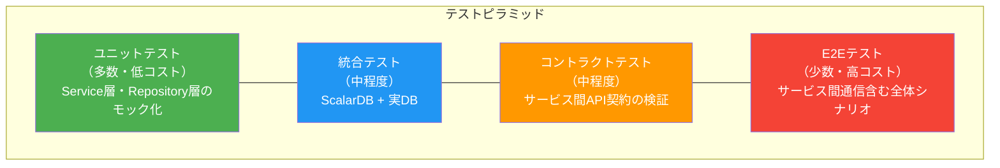
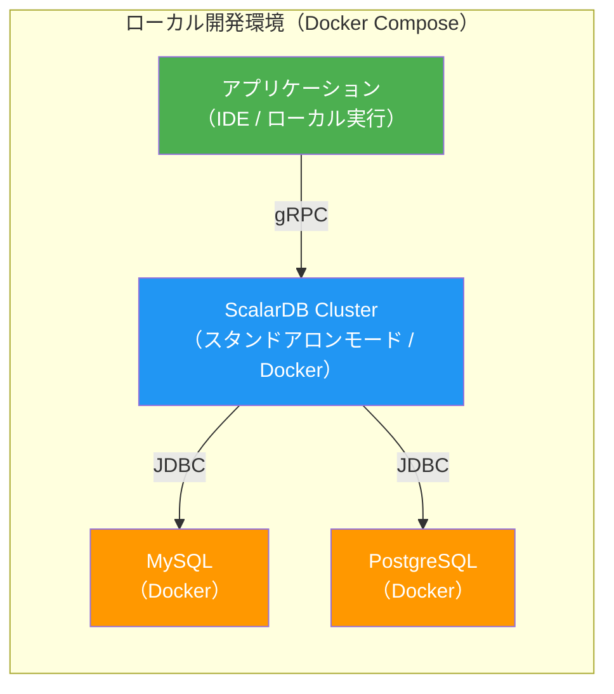

# Phase 4-2: テスト戦略

## 目的

ScalarDB × マイクロサービスのテスト戦略を策定する。テストピラミッドに基づいたテストレベルの設計、ScalarDB固有のテスト観点の定義、性能テスト・障害テスト・セキュリティテストの計画を策定し、品質基準を明確にする。

---

## 入力

| 入力物 | 説明 | 提供元 |
|--------|------|--------|
| 実装ガイド | Phase 4-1（`11_implementation_guide.md`）の成果物。実装パターン、エラーハンドリング設計 | 前ステップ |
| 全設計成果物 | Phase 1〜3の設計成果物（データモデル、トランザクション設計、API設計、インフラ設計等） | 前フェーズ |
| 非機能要件 | レイテンシ、スループット、可用性の目標値 | Phase 1-1成果物 |

---

## 参照資料

| 資料 | 参照箇所 | 用途 |
|------|----------|------|
| [`../research/07_transaction_model.md`](../research/07_transaction_model.md) | トランザクションモデル全体 | テスト対象のトランザクションパターン把握 |
| [`../research/13_scalardb_317_deep_dive.md`](../research/13_scalardb_317_deep_dive.md) | 全体 | 3.17新機能のテスト観点 |
| [`../research/12_disaster_recovery.md`](../research/12_disaster_recovery.md) | 全体 | 障害テストシナリオの参考 |

---

## ステップ

### Step 12.1: テストピラミッドの設計

テストピラミッドに基づき、各テストレベルの範囲・目的・ツールを定義する。



#### 12.1.1: ユニットテスト

Service層、Repository層のロジックをモック化によりテストする。

| 項目 | 内容 |
|------|------|
| **目的** | ビジネスロジックの正確性を高速に検証 |
| **範囲** | Service層、Repository層、ドメインモデル |
| **モック対象** | DistributedTransactionManager、DistributedTransaction、外部サービスクライアント |
| **ツール** | JUnit 5、Mockito、AssertJ |
| **実行タイミング** | コミット時（pre-commit hook）、CI/CDパイプライン |
| **カバレッジ目標** | ライン: 80%以上、ブランチ: 70%以上 |

```java
// ユニットテスト例：リトライロジックのテスト
@ExtendWith(MockitoExtension.class)
class OrderServiceTest {

    @Mock
    private DistributedTransactionManager txManager;
    @Mock
    private DistributedTransaction tx;
    @Mock
    private OrderRepository orderRepository;

    @InjectMocks
    private OrderService orderService;

    @Test
    void shouldRetryOnCrudConflictException() throws Exception {
        // Given
        when(txManager.begin()).thenReturn(tx);
        doThrow(new CrudConflictException("conflict", null))
            .doNothing()
            .when(orderRepository).save(any(), any());

        // When
        orderService.createOrder(new CreateOrderRequest(...));

        // Then
        verify(txManager, times(2)).begin();
        verify(tx, times(1)).commit();
    }
}
```

#### 12.1.2: 統合テスト（ScalarDB + 実DB）

ScalarDBと実際のデータベースを使用して、データアクセス層の正確性を検証する。

| 項目 | 内容 |
|------|------|
| **目的** | ScalarDB経由のDB操作が正しく動作することを検証 |
| **範囲** | Repository層 + ScalarDB + 実DB |
| **環境** | Testcontainers（Docker上にDBを起動） |
| **ツール** | JUnit 5、Testcontainers、ScalarDB Schema Loader |
| **実行タイミング** | CI/CDパイプライン |
| **カバレッジ目標** | 主要CRUDパスの100%カバー |

```java
// Testcontainersを使った統合テスト例
@Testcontainers
class OrderRepositoryIntegrationTest {

    @Container
    static PostgreSQLContainer<?> postgres = new PostgreSQLContainer<>("postgres:15")
        .withDatabaseName("testdb");

    private static DistributedTransactionManager manager;

    @BeforeAll
    static void setup() throws Exception {
        // ScalarDB Schema Loaderでテーブル作成
        Properties props = new Properties();
        props.setProperty("scalar.db.storage", "jdbc");
        props.setProperty("scalar.db.contact_points",
            postgres.getJdbcUrl());
        props.setProperty("scalar.db.username", postgres.getUsername());
        props.setProperty("scalar.db.password", postgres.getPassword());

        manager = TransactionFactory.create(props).getTransactionManager();
        // Schema作成...
    }

    // > **注意**: 上記はJDBC直接接続モードの例です。本番環境ではScalarDB Clusterモード（`scalar.db.transaction_manager=cluster`）を使用するため、
    // > ScalarDB Cluster スタンドアロンモード（Docker）での結合テストも実施してください。

    @Test
    void shouldSaveAndFindOrder() throws Exception {
        DistributedTransaction tx = manager.begin();
        try {
            OrderRepository repo = new OrderRepository();
            Order order = new Order("order-1", "customer-1", 1000);
            repo.save(tx, order);
            tx.commit();

            tx = manager.begin();
            Optional<Order> found = repo.findById(tx, "order-1");
            tx.commit();

            assertThat(found).isPresent();
            assertThat(found.get().getTotalAmount()).isEqualTo(1000);
        } catch (Exception e) {
            tx.rollback();
            throw e;
        }
    }
}
```

#### 12.1.3: E2Eテスト（サービス間通信含む）

全サービスを統合した状態で、エンドツーエンドのビジネスシナリオを検証する。

| 項目 | 内容 |
|------|------|
| **目的** | 全サービス統合状態でのビジネスシナリオの正確性を検証 |
| **範囲** | 全マイクロサービス + ScalarDB Cluster + DB + メッセージブローカー |
| **環境** | Docker Compose（ローカル）/ K8s（ステージング） |
| **ツール** | REST Assured / Karate / Cucumber |
| **実行タイミング** | デプロイ後、リリース前 |
| **テストケース数** | 主要ビジネスシナリオ × 正常系 + 主要異常系 |

#### 12.1.4: コントラクトテスト

サービス間のAPI契約を検証し、独立したデプロイ時の互換性を担保する。

| 項目 | 内容 |
|------|------|
| **目的** | サービス間API契約の整合性を検証 |
| **範囲** | Consumer（API呼び出し側）とProvider（API提供側）の契約 |
| **ツール** | Pact / Spring Cloud Contract |
| **実行タイミング** | CI/CDパイプライン |
| **対象** | REST API、gRPCインターフェース |

---

### Step 12.2: ScalarDB固有のテスト観点

ScalarDBを使用するシステムに特有のテスト観点を定義する。

#### 12.2.1: トランザクション分離レベルのテスト

| テストケースID | テスト内容 | 期待結果 | 分離レベル |
|--------------|---------|---------|-----------|
| ISO-001 | 同一レコードへの同時読み取り | 両方とも一貫したデータを読み取る | Snapshot Isolation |
| ISO-002 | 同一レコードへの同時書き込み（OCC） | 一方がCrudConflictExceptionで失敗し、リトライ後に成功 | Snapshot Isolation |
| ISO-003 | Write Skew Anomalyの検出 | Serializable設定時はWrite Skewが検出される | Serializable |
| ISO-004 | Phantom Readの防止 | Serializable設定時はPhantom Readが発生しない | Serializable |

#### 12.2.2: OCC競合時のリトライテスト

| テストケースID | テスト内容 | 期待結果 |
|--------------|---------|---------|
| OCC-001 | 2つのトランザクションが同一レコードを同時更新 | 一方が競合例外を受け取り、リトライ後に成功 |
| OCC-002 | リトライ上限回数に達した場合 | TransactionConflictExceptionがスローされ、適切なエラーレスポンスが返却 |
| OCC-003 | Exponential Backoffの動作確認 | リトライ間隔が指数的に増加する |
| OCC-004 | 高負荷時の競合率計測 | 競合率がしきい値（例: 5%）以下であること |

#### 12.2.3: 2PCの障害シナリオテスト

| テストケースID | テスト内容 | 期待結果 |
|--------------|---------|---------|
| 2PC-001 | Coordinator障害（Prepare前） | トランザクションがロールバックされる |
| 2PC-002 | Coordinator障害（Prepare後、Commit前） | Lazy Recoveryにより最終的にCommitまたはRollback |
| 2PC-003 | Participant障害（Prepare前） | トランザクション全体がロールバックされる |
| 2PC-004 | Participant障害（Prepare後、Commit前） | Coordinatorのリトライまたはロールバック |
| 2PC-005 | ネットワーク分断（Coordinator↔Participant間） | タイムアウト後にロールバック、Lazy Recoveryで回復 |
| 2PC-006 | 全Participant正常、Commit中にCoordinator再起動 | Lazy Recoveryにより未完了トランザクションが解決される |

#### 12.2.4: Lazy Recoveryの動作確認

| テストケースID | テスト内容 | 期待結果 |
|--------------|---------|---------|
| LR-001 | Prepare済み・未Commitのトランザクションの自動回復 | 一定時間後にCoordinatorテーブルの状態に基づき自動的にCommitまたはRollback |
| LR-002 | Coordinatorテーブルに状態が記録されている場合の回復 | Coordinatorテーブルの決定（Commit/Abort）に従って回復 |
| LR-003 | Coordinatorテーブルに状態が記録されていない場合の回復 | Abortとして処理される |

#### 12.2.5: Piggyback Begin / Write Bufferingのテスト（ScalarDB 3.17+）

| テストケースID | テスト内容 | 期待結果 |
|--------------|---------|---------|
| PBB-001 | Piggyback Begin有効時のbeginオーバーヘッド削減の検証 | begin呼び出しのラウンドトリップが削減され、トランザクション開始レイテンシが改善される |
| PBB-002 | Piggyback Begin無効時（デフォルト）との性能比較 | Piggyback Begin有効時は無効時と比較してトランザクション開始のオーバーヘッドが低減される |
| WBF-001 | Write Buffering有効時のCRUD操作レイテンシ改善の検証 | 書き込み操作がバッファリングされ、個別CRUD操作のレイテンシが改善される |
| WBF-002 | Write Buffering有効時のクラッシュリカバリ（コミット前クラッシュでデータロスなし） | コミット前にクラッシュが発生しても、未コミットのデータが永続化されず、データロスが発生しないことを確認 |

#### 12.2.6: メタデータ整合性の検証

| テストケースID | テスト内容 | 期待結果 |
|--------------|---------|---------|
| META-001 | ScalarDBメタデータテーブルの存在確認 | coordinator、metadata各テーブルが存在する |
| META-002 | スキーマ変更後のメタデータ整合性 | Schema Loader実行後、メタデータが正しく更新されている |
| META-003 | トランザクション完了後のメタデータクリーンアップ | 完了済みトランザクションのCoordinatorレコードが適切に管理されている |

---

### Step 12.3: 性能テスト

システムが非機能要件を満たすことを検証する。

#### 12.3.1: スループットテスト

| テスト項目 | 測定方法 | 目標値（例） | ツール |
|-----------|---------|------------|--------|
| 単一サービス内Tx TPS | 単一サービスのAPI呼び出しを負荷テスト | 1,000 TPS以上 | Gatling / k6 / JMeter |
| サービス間2PC TPS | 2PCを含むAPIフローを負荷テスト | 200 TPS以上 | Gatling / k6 |
| 読み取り専用Tx TPS | 読み取りのみのAPIを負荷テスト | 5,000 TPS以上 | Gatling / k6 |

#### 12.3.2: レイテンシテスト

| テスト項目 | 測定指標 | 目標値（例） | 条件 |
|-----------|---------|------------|------|
| 単一サービス内Tx | P50 / P95 / P99 | P50 < 50ms, P95 < 100ms, P99 < 200ms | 通常負荷 |
| サービス間2PC | P50 / P95 / P99 | P50 < 200ms, P95 < 500ms, P99 < 1000ms | 通常負荷 |
| ピーク時レイテンシ | P99 | P99 < 2000ms | ピーク負荷（通常の3倍） |

#### 12.3.3: OCC競合率テスト

| テスト項目 | 測定方法 | 目標値（例） |
|-----------|---------|------------|
| 通常負荷時の競合率 | CrudConflictException発生回数 / 総トランザクション数 | 5%以下 |
| ピーク負荷時の競合率 | 同上 | 15%以下 |
| ホットスポット検出 | 特定キーへの競合集中度 | 単一キーの競合率 < 10% |
| リトライ成功率 | リトライ後に成功したトランザクション / リトライ発生トランザクション | 95%以上 |

#### 12.3.4: スケーラビリティテスト

| テスト項目 | 測定方法 | 期待結果 |
|-----------|---------|---------|
| スケールアウト効果 | ScalarDB Clusterノード数を2→4→8と増やしTPSを計測 | ノード数に概ね比例してTPSが増加 |
| スケールアウト時の安定性 | ノード追加中のトランザクション成功率 | 99.9%以上 |
| 最大スループット | ノード数を増やしていきTPSが飽和するポイントを特定 | ボトルネック（DB/Netresearch/CPU）を特定 |

---

### Step 12.4: 障害テスト（カオスエンジニアリング）

本番環境に近い状態で障害注入し、システムの耐障害性を検証する。

#### 12.4.1: Pod強制終了テスト

| テストケースID | テスト内容 | 期待結果 | ツール |
|--------------|---------|---------|--------|
| CHAOS-001 | ScalarDB Cluster Podを1つ強制終了 | トランザクションが他ノードにフェイルオーバーし、処理継続 | Chaos Mesh / Litmus |
| CHAOS-002 | アプリケーションPodを1つ強制終了 | K8sがPodを再作成し、処理再開。進行中の2PCはLazy Recovery | Chaos Mesh / Litmus |
| CHAOS-003 | 全ScalarDB Cluster Podを同時強制終了 | 全Podの再起動後、Lazy Recoveryで未完了Txが解決 | Chaos Mesh / Litmus |

#### 12.4.2: ネットワーク遅延/分断テスト

| テストケースID | テスト内容 | 期待結果 | ツール |
|--------------|---------|---------|--------|
| CHAOS-004 | サービス間ネットワーク遅延（100ms追加） | レイテンシ増加するがトランザクション成功 | Chaos Mesh / tc |
| CHAOS-005 | ScalarDB Cluster↔DB間のネットワーク分断 | タイムアウト後にエラー返却、復旧後に処理再開 | Chaos Mesh / tc |
| CHAOS-006 | Coordinator↔Participant間のネットワーク分断 | 2PCがタイムアウトでロールバック、Lazy Recoveryで回復 | Chaos Mesh / tc |

#### 12.4.3: DB接続断テスト

| テストケースID | テスト内容 | 期待結果 |
|--------------|---------|---------|
| CHAOS-007 | バックエンドDBの一時的な接続断（30秒） | 接続プールの再接続後に処理再開 |
| CHAOS-008 | バックエンドDBのフェイルオーバー（レプリカ昇格） | 新プライマリへの再接続後に処理再開 |
| CHAOS-009 | バックエンドDBのディスクフル | 書き込みエラーの適切なハンドリング、アラート発火 |

#### 12.4.4: Coordinatorテーブル障害テスト

| テストケースID | テスト内容 | 期待結果 |
|--------------|---------|---------|
| CHAOS-010 | Coordinatorテーブルが格納されているDBの一時的な障害 | 新規トランザクション開始不可、既存Txは状態に応じて処理 |
| CHAOS-011 | Coordinatorテーブルのレプリカ遅延 | 読み取り整合性に影響なし（プライマリから読み取り） |

---

### Step 12.5: セキュリティテスト

認証・認可・暗号化の正確性を検証する。

#### 12.5.1: 認証バイパステスト

| テストケースID | テスト内容 | 期待結果 |
|--------------|---------|---------|
| SEC-001 | 認証トークンなしでのAPI呼び出し | 401 Unauthorizedが返却 |
| SEC-002 | 期限切れトークンでのAPI呼び出し | 401 Unauthorizedが返却 |
| SEC-003 | 改ざんされたトークンでのAPI呼び出し | 401 Unauthorizedが返却 |
| SEC-004 | ScalarDB Cluster直接アクセス（Envoy経由以外） | 接続拒否 |

#### 12.5.2: TLS/mTLS検証

| テストケースID | テスト内容 | 期待結果 |
|--------------|---------|---------|
| SEC-005 | クライアント↔ScalarDB Cluster間のTLS通信 | 通信が暗号化されていること（tcpdumpで確認） |
| SEC-006 | ScalarDB Cluster↔バックエンドDB間のTLS通信 | 通信が暗号化されていること |
| SEC-007 | 無効な証明書でのScalarDB Cluster接続 | 接続拒否 |
| SEC-008 | 証明書失効時の動作 | 接続拒否、アラート発火 |

#### 12.5.3: RBAC権限テスト

| テストケースID | テスト内容 | 期待結果 |
|--------------|---------|---------|
| SEC-009 | 権限のないNamespaceへのアクセス | アクセス拒否 |
| SEC-010 | 読み取り専用ユーザーによる書き込み | 書き込み拒否 |
| SEC-011 | 管理者権限でのスキーマ操作 | スキーマ操作成功 |
| SEC-012 | 一般ユーザーでのスキーマ操作 | スキーマ操作拒否 |

---

### Step 12.6: テスト環境の設計

各テストレベルに対応するテスト環境を定義する。

#### 12.6.1: ローカル開発環境



| 項目 | 内容 |
|------|------|
| 構成 | Docker Compose + ScalarDB Cluster（スタンドアロンモード） |
| 用途 | ユニットテスト、統合テストの実行 |
| データ | テスト用のシードデータ（小規模） |
| 起動方法 | `docker compose up -d` でワンコマンド起動 |

#### 12.6.2: CI環境

| 項目 | 内容 |
|------|------|
| 構成 | Testcontainers + GitHub Actions / GitLab CI |
| 用途 | ユニットテスト、統合テスト、コントラクトテストの自動実行 |
| データ | テスト用のシードデータ（テストケースごとに初期化） |
| 実行トリガー | Push / Pull Request |

```yaml
# GitHub Actions CI設定例
name: CI
on: [push, pull_request]
jobs:
  test:
    runs-on: ubuntu-latest
    steps:
      - uses: actions/checkout@v4
      - uses: actions/setup-java@v4
        with:
          java-version: '17'
          distribution: 'temurin'
      - name: Run Unit Tests
        run: ./gradlew test
      - name: Run Integration Tests
        run: ./gradlew integrationTest
        # Testcontainersが自動的にDocker上にDBを起動
      - name: Run Contract Tests
        run: ./gradlew contractTest
```

#### 12.6.3: ステージング環境

| 項目 | 内容 |
|------|------|
| 構成 | 本番相当のK8s環境（ScalarDB Cluster + 全マイクロサービス + バックエンドDB） |
| 用途 | E2Eテスト、性能テスト、障害テスト、セキュリティテスト |
| データ | 本番データの匿名化コピー（大規模） |
| 実行トリガー | リリース候補のデプロイ時 |

---

## 成果物

| 成果物 | 説明 | テンプレート |
|--------|------|-------------|
| テスト計画書 | テストピラミッドの各レベルの目的・範囲・ツール・実行タイミングの定義 | Step 12.1のテストレベル定義 |
| テストケース一覧 | ScalarDB固有テスト、性能テスト、障害テスト、セキュリティテストの全テストケース | Step 12.2〜12.5のテストケース表 |
| テスト環境構成図 | ローカル、CI、ステージング各環境の構成定義 | Step 12.6の環境定義 |

---

## 品質基準

### カバレッジ目標

| テストレベル | 目標 |
|------------|------|
| ユニットテスト（ラインカバレッジ） | 80%以上 |
| ユニットテスト（ブランチカバレッジ） | 70%以上 |
| 統合テスト（CRUDパスカバレッジ） | 100% |
| E2Eテスト（主要シナリオカバレッジ） | 100% |

### テスト合格基準

| 基準 | 条件 |
|------|------|
| ユニットテスト | 全テストケースPass |
| 統合テスト | 全テストケースPass |
| コントラクトテスト | 全テストケースPass |
| E2Eテスト | 全主要シナリオPass、非主要シナリオは90%以上Pass |
| 性能テスト | 全性能目標を達成 |
| 障害テスト | 全障害シナリオで期待結果を達成 |
| セキュリティテスト | 全セキュリティテストケースPass |

### 性能基準

| 指標 | 目標値（例） | 計測条件 |
|------|------------|---------|
| 単一サービスTx TPS | 1,000 TPS以上 | 通常負荷 |
| サービス間2PC TPS | 200 TPS以上 | 通常負荷 |
| 単一サービスTx P95レイテンシ | 100ms以下 | 通常負荷 |
| サービス間2PC P95レイテンシ | 500ms以下 | 通常負荷 |
| OCC競合率 | 5%以下 | 通常負荷 |
| トランザクション成功率 | 99.9%以上 | 通常負荷 |
| エラーレート | 0.1%以下 | 通常負荷 |

---

## 完了基準チェックリスト

- [ ] テストピラミッドが設計され、各テストレベルの目的・範囲・ツールが定義されている
- [ ] ユニットテストのテンプレートとモック戦略が定義されている
- [ ] 統合テストのTestcontainers設定が作成されている
- [ ] E2Eテストのシナリオ一覧が作成されている
- [ ] コントラクトテストの対象API一覧が作成されている
- [ ] ScalarDB固有のテスト観点（分離レベル、OCC競合、2PC障害、Lazy Recovery、メタデータ整合性）が全て定義されている
- [ ] 性能テストの目標値（TPS、レイテンシ、OCC競合率）が定義されている
- [ ] 障害テストのシナリオ（Pod強制終了、ネットワーク遅延/分断、DB接続断、Coordinatorテーブル障害）が定義されている
- [ ] セキュリティテスト（認証バイパス、TLS/mTLS、RBAC）が定義されている
- [ ] テスト環境（ローカル、CI、ステージング）の構成が設計されている
- [ ] カバレッジ目標、テスト合格基準、性能基準が明確に定義されている
- [ ] テスト計画について関係者（QAリード、テックリード、開発チーム）の合意が得られている

---

## 次のステップへの引き継ぎ事項

### Phase 4-3: デプロイ・ロールアウト戦略（`13_deployment_rollout.md`）への引き継ぎ

| 引き継ぎ項目 | 内容 |
|-------------|------|
| テスト合格基準 | Go/No-Go判断の入力となるテスト合格条件 |
| 性能基準 | デプロイ後の性能確認基準 |
| 障害テスト結果 | ロールバック判断の参考情報 |
| テスト環境構成 | ステージング環境でのデプロイ検証方法 |
