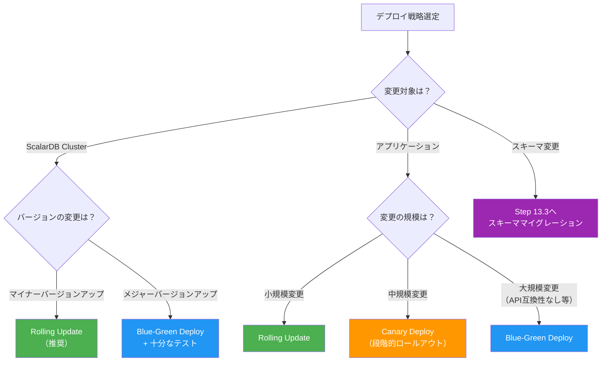
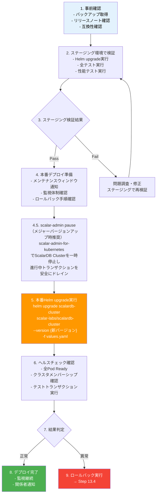
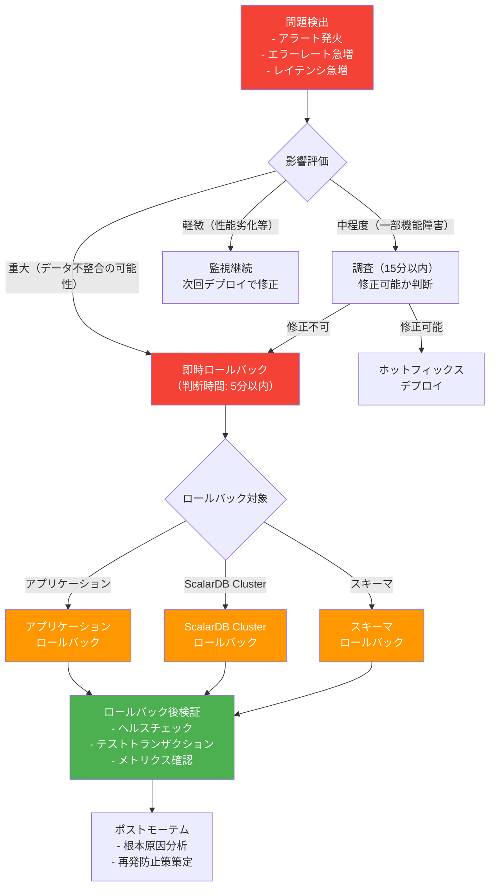
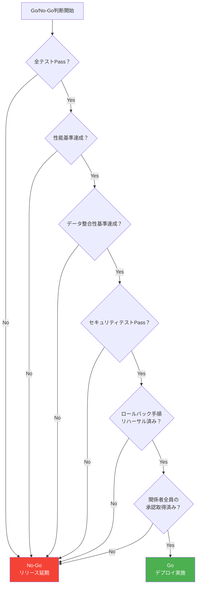

# Phase 4-3: デプロイ・ロールアウト戦略

## 目的

安全なデプロイ・ロールアウト手順を策定する。ScalarDB Cluster固有の考慮事項を踏まえ、ダウンタイムを最小化しつつ、問題発生時に迅速にロールバックできる手順を定義する。

---

## 入力

| 入力物 | 説明 | 提供元 |
|--------|------|--------|
| インフラ設計 | Phase 3-1（`07_infrastructure_design.md`）の成果物。K8sクラスタ構成、Helm Chart設定 | 前フェーズ |
| DR設計 | Phase 3-4（`10_disaster_recovery_design.md`）の成果物。バックアップ・リストア手順 | 前フェーズ |
| テスト戦略 | Phase 4-2（`12_testing_strategy.md`）の成果物。テスト合格基準、性能基準 | 前ステップ |

---

## 参照資料

| 資料 | 参照箇所 | 用途 |
|------|----------|------|
| [`../research/06_infrastructure_prerequisites.md`](../research/06_infrastructure_prerequisites.md) | Section 7 CI/CD | CI/CDパイプライン構成の参考 |
| [`../research/12_disaster_recovery.md`](../research/12_disaster_recovery.md) | 全体 | DR手順、バックアップ・リストア手順の参考 |

---

## ステップ

### Step 13.1: デプロイ戦略の選定

システム特性に応じた最適なデプロイ戦略を選定する。

#### デプロイ戦略の比較

| 戦略 | 概要 | メリット | デメリット | 推奨ケース |
|------|------|---------|----------|-----------|
| Rolling Update | Podを段階的に入れ替え | K8sデフォルト、シンプル | 新旧バージョンが混在する期間あり | ScalarDB Clusterのアップデート（推奨） |
| Blue-Green Deploy | 新環境を構築し一括切り替え | ダウンタイムゼロ、完全な切り替え | リソースコスト2倍 | アプリケーションのメジャーバージョンアップ |
| Canary Deploy | 一部トラフィックを新バージョンへ段階的に振り分け | リスク最小化、段階的検証 | 設定が複雑、長時間の混在 | アプリケーションの段階的ロールアウト |

#### ScalarDB Cluster固有の考慮事項

| 考慮事項 | 説明 | 対応方針 |
|---------|------|---------|
| クラスタメンバーシップ | ScalarDB Clusterはノード間でクラスタを形成。ノードの入れ替え時にメンバーシップの更新が必要 | Rolling Updateで1ノードずつ入れ替え。maxUnavailable=1に設定 |
| ノード可用性 | ScalarDB Clusterはマスターレス構成のため、各ノードが独立してリクエストを処理 | PodDisruptionBudgetで最小稼働Pod数を確保し、ローリングアップデート中もサービス継続。**注意**: PDBはローリングアップデート中のサービス可用性を維持するためのものであり、クォーラムの仕組みではない（ScalarDB Clusterはマスターレス構成でクォーラムメカニズムを持たない） |
| 進行中のトランザクション | デプロイ中にトランザクションが進行中の場合がある | Graceful Shutdownで進行中Txの完了を待機（terminationGracePeriodSeconds設定） |
| Envoy Proxy | クライアントはEnvoy Proxy経由で接続 | Envoy Proxyの更新はScalarDB Cluster更新後に実施 |

#### デプロイ戦略フロー



---

### Step 13.2: ScalarDB Cluster アップグレード手順

ScalarDB Clusterのバージョンアップを安全に実施する手順を定義する。

#### Helm Chart バージョンアップ手順



#### scalar-admin によるPause/Unpause（メジャーバージョンアップ時推奨）

メジャーバージョンアップ時は、`scalar-admin-for-kubernetes` を使用してScalarDB Clusterを一時停止し、進行中のトランザクションを安全にドレインすることを推奨する。

```bash
# 1. ScalarDB Clusterを一時停止（進行中トランザクションのドレインを待機）
docker run --rm ghcr.io/scalar-labs/scalar-admin-for-kubernetes:<TAG> pause \
  --namespace scalardb \
  --release-name scalardb-cluster \
  --max-pause-wait-time 60

# 2. Helm upgradeを実行（上記フローのStep 5）
helm upgrade scalardb-cluster scalar-labs/scalardb-cluster \
  --version {新バージョン} -f values.yaml -n scalardb

# 3. アップグレード完了後、ScalarDB Clusterを再開
docker run --rm ghcr.io/scalar-labs/scalar-admin-for-kubernetes:<TAG> unpause \
  --namespace scalardb \
  --release-name scalardb-cluster
```

> **注意**: マイナーバージョンアップでは、Rolling Updateのみで十分な場合が多い。Pause/Unpauseはメジャーバージョンアップやスキーマ変更を伴うアップグレードなど、進行中トランザクションの安全なドレインが必要な場合に使用する。

#### ローリングアップデート中のトランザクション影響

| フェーズ | 影響 | 対策 |
|---------|------|------|
| Pod終了前（PreStop） | Graceful Shutdownにより新規リクエスト受付停止 | terminationGracePeriodSecondsを十分に確保（デフォルト: 60秒） |
| Pod終了中 | 進行中のトランザクションは完了を試みる | 長時間トランザクションはタイムアウトで失敗する可能性あり |
| 新Pod起動中 | 新バージョンのPodが起動しReadyになるまでトラフィック受付不可 | readinessProbeの設定を適切に行う |
| クラスタ再形成中 | 新Podがクラスタに参加し、メンバーシップが更新される | minReadySecondsで安定確認期間を確保 |

#### ダウンタイムゼロアップデートの条件

| 条件 | 説明 |
|------|------|
| 最小レプリカ数の確保 | ScalarDB Clusterのレプリカ数が3以上で、maxUnavailable=1に設定 |
| Readiness Probe設定 | 新Podが完全に起動しクラスタに参加してからトラフィックを受け付ける |
| PDB（Pod Disruption Budget）設定 | minAvailable設定で最小稼働Pod数を保証。PDBはローリングアップデート中のサービス可用性維持が目的であり、クォーラムではない（ScalarDB Clusterはマスターレスでクォーラムメカニズムを持たない） |
| Envoy Proxy設定 | ヘルスチェックベースのロードバランシングで障害Podへのルーティングを回避 |
| 後方互換性の確保 | 新旧バージョンが混在しても正常に動作すること |

---

### Step 13.3: スキーママイグレーション手順

ScalarDBスキーマの変更を安全に実施する手順を定義する。

#### Schema Loader の実行手順

```bash
# 1. スキーマ定義ファイルの準備（JSON形式）
# schema.json の例:
# {
#   "order_service.orders": {
#     "transaction": true,
#     "partition-key": ["order_id"],
#     "columns": {
#       "order_id": "TEXT",
#       "customer_id": "TEXT",
#       "total_amount": "INT",
#       "status": "TEXT",
#       "new_column": "TEXT"
#     }
#   }
# }

# 2. Schema Loaderの実行
java -jar scalardb-schema-loader-{version}.jar \
  --config database.properties \
  --schema-file schema.json \
  --coordinator
```

#### スキーマ変更のバージョン管理

| 管理方法 | 説明 |
|---------|------|
| スキーマファイルのGit管理 | schema.jsonをGitリポジトリで管理し、変更履歴を追跡 |
| マイグレーション番号 | V001_initial_schema.json、V002_add_column.json のように番号付きで管理 |
| 変更ログ | 各マイグレーションの目的、変更内容、実行日時をCHANGELOGに記録 |
| レビュープロセス | スキーマ変更はPull Requestでレビュー必須 |

#### 後方互換性の確保

| 操作 | 互換性 | 推奨度 | 注意事項 |
|------|--------|--------|---------|
| カラム追加 | 後方互換あり | 推奨 | NULLable（デフォルト値なし）で追加 |
| カラム削除 | 後方互換なし | 非推奨 | 旧バージョンのアプリがカラムを参照する可能性 |
| カラム名変更 | 後方互換なし | 非推奨 | 新カラム追加 → データ移行 → 旧カラム削除の手順で対応 |
| テーブル追加 | 後方互換あり | 推奨 | 新テーブルは新バージョンのアプリのみが使用 |
| テーブル削除 | 後方互換なし | 非推奨 | 全アプリが参照していないことを確認後に削除 |
| パーティションキー変更 | 後方互換なし | 不可 | 新テーブル作成 → データ移行 → 旧テーブル削除 |

**推奨フロー（後方互換性維持）:**

```
1. Expand（拡張）: 新カラム/テーブルを追加
2. Migrate（移行）: 新バージョンのアプリをデプロイし、新カラム/テーブルを使用開始
3. Contract（収縮）: 旧バージョンのアプリが完全に置き換わった後、旧カラム/テーブルを削除
```

---

### Step 13.4: ロールバック手順

問題発生時に迅速にロールバックする手順を定義する。

#### ロールバックフロー



#### アプリケーションのロールバック

```bash
# Helm rollbackによるロールバック
helm rollback {release-name} {revision-number} -n {namespace}

# Kubernetesデプロイメントのロールバック
kubectl rollout undo deployment/{deployment-name} -n {namespace}

# 特定リビジョンへのロールバック
kubectl rollout undo deployment/{deployment-name} --to-revision={revision} -n {namespace}

# ロールバック状態の確認
kubectl rollout status deployment/{deployment-name} -n {namespace}
```

#### ScalarDB Clusterのロールバック

```bash
# 1. 現在のリビジョン確認
helm history scalardb-cluster -n scalardb

# 2. ロールバック実行
helm rollback scalardb-cluster {前バージョンのrevision} -n scalardb

# 3. Pod状態確認
kubectl get pods -n scalardb -w

# 4. クラスタヘルスチェック
# ScalarDB Clusterの全ノードがReadyかつクラスタ参加済みであることを確認
kubectl exec -it $(kubectl get pod -n scalardb -l app.kubernetes.io/name=scalardb-cluster -o jsonpath='{.items[0].metadata.name}') -n scalardb -- grpc_health_probe -addr=localhost:60053
```

**注意事項:**
- ScalarDB Clusterのロールバック時は、進行中のトランザクションの完了を待機する
- ロールバック後、Lazy Recoveryにより未完了トランザクションが自動解決される
- Coordinatorテーブルの整合性は自動的に維持される

#### スキーマロールバック

| 手順 | 内容 | 注意事項 |
|------|------|---------|
| 1. 影響範囲確認 | 変更されたテーブル・カラムの一覧を確認 | |
| 2. アプリケーション停止 | 該当テーブルにアクセスするアプリケーションを停止 | データ不整合防止のため |
| 3. スキーマロールバック実行 | 前バージョンのschema.jsonでSchema Loaderを実行 | カラム削除を含む場合はデータ消失に注意 |
| 4. Coordinatorテーブル確認 | Coordinatorテーブルの状態が正常であることを確認 | スキーマ変更がCoordinatorテーブルに影響する場合は特に注意 |
| 5. アプリケーション起動 | 前バージョンのアプリケーションを起動 | |
| 6. データ整合性確認 | テストトランザクションを実行し、データ整合性を確認 | |

---

### Step 13.5: 本番移行チェックリスト

本番デプロイの前・中・後で確認すべき項目を定義する。

#### Pre-deploy（デプロイ前）

| # | 確認項目 | 確認者 | 確認結果 |
|---|---------|--------|---------|
| 1 | 全テストがPassしているか（ユニット、統合、E2E、性能、セキュリティ） | QAリード | |
| 2 | ステージング環境で検証が完了しているか | テックリード | |
| 3 | バックアップが直近で取得されているか | インフラ担当 | |
| 4 | 監視ダッシュボード・アラートが正常動作しているか | SRE担当 | |
| 5 | ロールバック手順が文書化され、リハーサル済みか | テックリード | |
| 6 | メンテナンスウィンドウがチーム全員に通知されているか | プロジェクトリーダー | |
| 7 | デプロイ手順書がレビュー済みか | テックリード | |
| 8 | スキーマ変更がある場合、後方互換性が確認されているか | データベース担当 | |
| 9 | 外部サービスへの影響が確認されているか | アーキテクト | |
| 10 | 緊急連絡先リストが最新か | プロジェクトリーダー | |

#### Deploy（デプロイ中）

| # | 確認項目 | 担当者 | 確認結果 |
|---|---------|--------|---------|
| 1 | デプロイ開始時刻を記録 | デプロイ担当 | |
| 2 | 段階的ロールアウト（Canary: 10% → 25% → 50% → 100%） | デプロイ担当 | |
| 3 | 各段階でヘルスチェックがPassしているか | SRE担当 | |
| 4 | 各段階でエラーレートが閾値以下か | SRE担当 | |
| 5 | 各段階でレイテンシが閾値以下か | SRE担当 | |
| 6 | ScalarDB Clusterのメンバーシップが正常か | インフラ担当 | |
| 7 | 進行中のトランザクションが正常に完了しているか | テックリード | |
| 8 | ログにERROR/CRITICALが異常増加していないか | SRE担当 | |

#### Post-deploy（デプロイ後）

| # | 確認項目 | 担当者 | 確認結果 |
|---|---------|--------|---------|
| 1 | 全Podが正常にRunningかつReadyか | インフラ担当 | |
| 2 | メトリクスが正常範囲内か（CPU、メモリ、ディスク） | SRE担当 | |
| 3 | エラーレートがデプロイ前と比較して悪化していないか | SRE担当 | |
| 4 | スループット（TPS）がデプロイ前と比較して劣化していないか | SRE担当 | |
| 5 | レイテンシ（P50/P95/P99）がデプロイ前と比較して劣化していないか | SRE担当 | |
| 6 | OCC競合率がデプロイ前と比較して悪化していないか | テックリード | |
| 7 | テストトランザクション（スモークテスト）が成功するか | QAリード | |
| 8 | データ整合性チェックが正常か | データベース担当 | |
| 9 | 外部サービスとの連携が正常か | テックリード | |
| 10 | デプロイ完了をチーム全員に通知 | プロジェクトリーダー | |

---

### Step 13.6: Go/No-Go判断基準

本番デプロイの実施可否を判断するための基準を定義する。

#### 性能基準

| 指標 | Go条件 | No-Go条件 |
|------|--------|----------|
| レイテンシ（P95） | ステージング環境でP95がSLA以内 | P95がSLAの120%以上 |
| スループット | 目標TPSの90%以上を達成 | 目標TPSの80%未満 |
| エラーレート | 0.1%以下 | 1%以上 |
| OCC競合率 | 5%以下 | 10%以上 |

#### データ整合性基準

| 指標 | Go条件 | No-Go条件 |
|------|--------|----------|
| トランザクション成功率 | 99.9%以上 | 99%未満 |
| データ不整合検出 | 不整合ゼロ | 1件以上の不整合検出 |
| Coordinatorテーブル状態 | 全レコードが正常状態 | 未解決のPreparedレコードが残存 |

#### ロールバック判断基準

デプロイ後に以下の条件のいずれかに該当した場合、即時ロールバックを実施する。

| # | ロールバック条件 | 判断者 | 最大許容時間 |
|---|----------------|--------|------------|
| 1 | エラーレートが1%を超過し、5分間改善しない | SRE担当 | 5分 |
| 2 | P95レイテンシがSLAの200%を超過 | SRE担当 | 5分 |
| 3 | データ不整合が1件以上検出 | テックリード | 即時 |
| 4 | ScalarDB Clusterのノードが50%以上ダウン | インフラ担当 | 即時 |
| 5 | トランザクション成功率が95%を下回る | テックリード | 5分 |
| 6 | Coordinatorテーブルに未解決のPreparedレコードが増加し続ける | テックリード | 10分 |

#### Go/No-Go判断フロー



---

## 成果物

| 成果物 | 説明 | テンプレート |
|--------|------|-------------|
| デプロイ手順書 | デプロイ戦略の選定結果、Helm Chart更新手順、スキーママイグレーション手順 | Step 13.1〜13.3の手順 |
| ロールバック手順書 | アプリケーション、ScalarDB Cluster、スキーマのロールバック手順 | Step 13.4のロールバック手順 |
| Go/No-Goチェックリスト | デプロイ前・中・後のチェックリスト、Go/No-Go判断基準 | Step 13.5〜13.6のチェックリスト |

---

## 完了基準チェックリスト

- [ ] デプロイ戦略（Rolling Update / Blue-Green / Canary）が選定され、理由が記録されている
- [ ] ScalarDB Cluster固有の考慮事項（クラスタメンバーシップ、ノード可用性、進行中トランザクション）が考慮されている
- [ ] Helm Chartバージョンアップ手順が文書化されている
- [ ] ローリングアップデート中のトランザクション影響が分析されている
- [ ] ダウンタイムゼロアップデートの条件が定義されている
- [ ] Schema Loaderの実行手順が文書化されている
- [ ] スキーマ変更のバージョン管理方法が定義されている
- [ ] 後方互換性の確保方針（Expand-Migrate-Contractパターン）が定義されている
- [ ] アプリケーション、ScalarDB Cluster、スキーマのロールバック手順が文書化されている
- [ ] Coordinatorテーブルの整合性に関する注意事項が記載されている
- [ ] 本番移行チェックリスト（Pre-deploy / Deploy / Post-deploy）が作成されている
- [ ] Go/No-Go判断基準（性能基準、データ整合性基準、ロールバック判断基準）が定義されている
- [ ] 全手順についてステージング環境でリハーサルが完了している
- [ ] 全手順について関係者（アーキテクト、テックリード、SRE、プロジェクトリーダー）の合意が得られている

---

## ワークフロー完了後のアクション

### Phase 4完了後のフォローアップ

Phase 4（実行フェーズ）の全ステップ完了後、以下のアクションを実施する。

| アクション | 内容 | 担当 |
|-----------|------|------|
| 全成果物のレビュー | Phase 1〜4の全成果物を横断的にレビューし、整合性を確認 | アーキテクト |
| 実装開始承認 | 全ステークホルダーの承認を得て、実装フェーズに移行 | プロジェクトリーダー |
| スプリント計画 | 実装タスク一覧（Step 11成果物）をスプリントバックログに展開 | スクラムマスター |
| リスク管理 | 各フェーズで識別されたリスクの一覧化と対策状況の確認 | プロジェクトリーダー |
| 定期レビュー | 実装進捗に合わせて設計成果物を定期的に見直し・更新 | テックリード |
