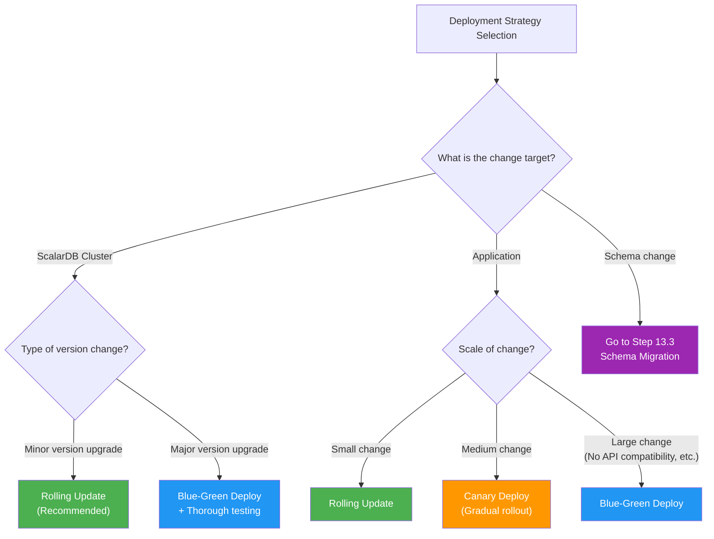
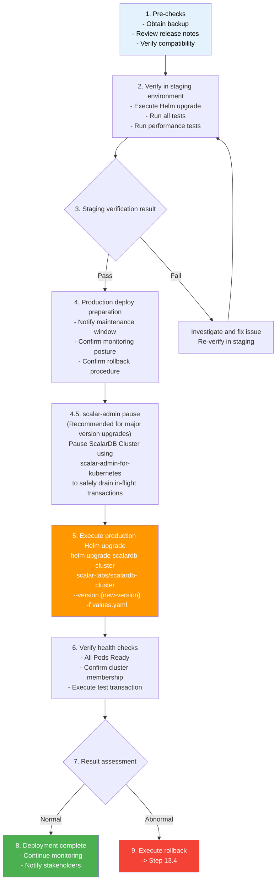
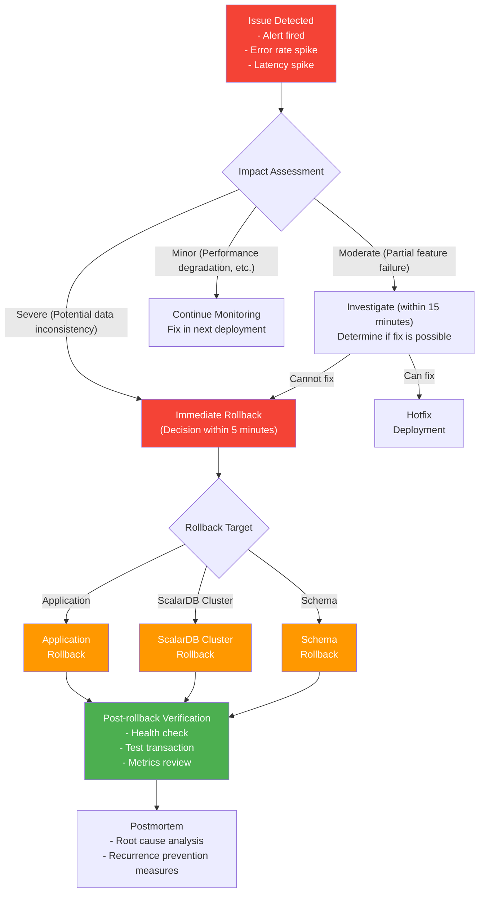
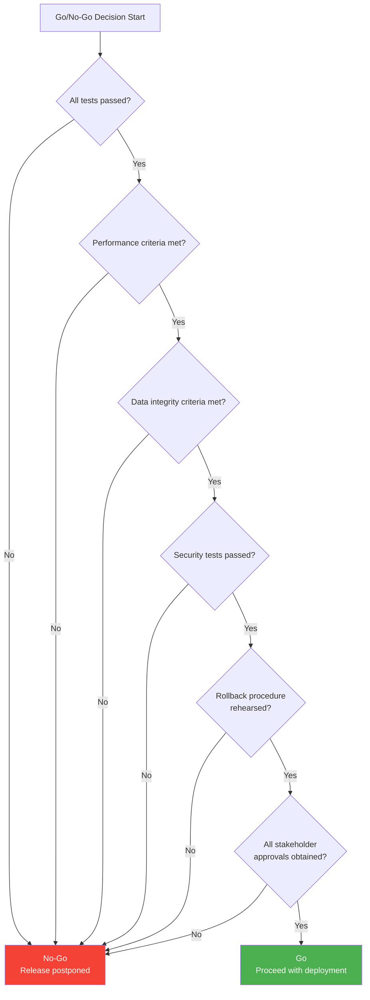

# Phase 4-3: Deployment & Rollout Strategy

## Purpose

Establish safe deployment and rollout procedures. Define procedures that minimize downtime while enabling rapid rollback when issues arise, taking into account ScalarDB Cluster-specific considerations.

---

## Input

| Input | Description | Source |
|-------|-------------|--------|
| Infrastructure Design | Deliverables from Phase 3-1 (`07_infrastructure_design.md`). K8s cluster configuration, Helm Chart settings | Previous phase |
| DR Design | Deliverables from Phase 3-4 (`10_disaster_recovery_design.md`). Backup and restore procedures | Previous phase |
| Testing Strategy | Deliverables from Phase 4-2 (`12_testing_strategy.md`). Test pass criteria, performance criteria | Previous step |

---

## References

| Document | Reference Section | Purpose |
|----------|-------------------|---------|
| [`../research/06_infrastructure_prerequisites.md`](../research/06_infrastructure_prerequisites.md) | Section 7 CI/CD | Reference for CI/CD pipeline configuration |
| [`../research/12_disaster_recovery.md`](../research/12_disaster_recovery.md) | Entire document | Reference for DR procedures, backup and restore procedures |

---

## Steps

### Step 13.1: Deployment Strategy Selection

Select the optimal deployment strategy based on system characteristics.

#### Deployment Strategy Comparison

| Strategy | Overview | Advantages | Disadvantages | Recommended Cases |
|----------|----------|------------|---------------|-------------------|
| Rolling Update | Gradually replace Pods | K8s default, simple | Period where old and new versions coexist | ScalarDB Cluster updates (recommended) |
| Blue-Green Deploy | Build new environment and switch at once | Zero downtime, complete switchover | 2x resource cost | Application major version upgrades |
| Canary Deploy | Gradually route a portion of traffic to the new version | Minimized risk, incremental verification | Complex configuration, prolonged coexistence | Gradual application rollout |

#### ScalarDB Cluster-Specific Considerations

| Consideration | Description | Response Strategy |
|--------------|-------------|-------------------|
| Cluster Membership | ScalarDB Cluster forms a cluster among nodes. Membership update required during node replacement | Rolling Update one node at a time. Set maxUnavailable=1 |
| Node Availability | ScalarDB Cluster uses a masterless architecture, so each node independently processes requests | Ensure minimum running Pod count with PodDisruptionBudget to maintain service continuity during rolling updates. **Note**: PDB is for maintaining service availability during rolling updates, not a quorum mechanism (ScalarDB Cluster is masterless and does not have a quorum mechanism) |
| In-flight Transactions | Transactions may be in progress during deployment | Wait for in-flight Tx completion via Graceful Shutdown (terminationGracePeriodSeconds setting) |
| Envoy Proxy | Clients connect via Envoy Proxy | Update Envoy Proxy after ScalarDB Cluster update |

#### Deployment Strategy Flow



---

### Step 13.2: ScalarDB Cluster Upgrade Procedure

Define procedures for safely performing ScalarDB Cluster version upgrades.

#### Helm Chart Version Upgrade Procedure



#### Pause/Unpause with scalar-admin (Recommended for Major Version Upgrades)

For major version upgrades, it is recommended to use `scalar-admin-for-kubernetes` to pause ScalarDB Cluster and safely drain in-flight transactions.

```bash
# 1. Pause ScalarDB Cluster (wait for in-flight transaction draining)
docker run --rm ghcr.io/scalar-labs/scalar-admin-for-kubernetes:<TAG> pause \
  --namespace scalardb \
  --release-name scalardb-cluster \
  --max-pause-wait-time 60

# 2. Execute Helm upgrade (Step 5 from the flow above)
helm upgrade scalardb-cluster scalar-labs/scalardb-cluster \
  --version {new-version} -f values.yaml -n scalardb

# 3. Unpause ScalarDB Cluster after upgrade is complete
docker run --rm ghcr.io/scalar-labs/scalar-admin-for-kubernetes:<TAG> unpause \
  --namespace scalardb \
  --release-name scalardb-cluster
```

> **Note**: For minor version upgrades, Rolling Update alone is often sufficient. Pause/Unpause should be used for major version upgrades or upgrades that involve schema changes, where safe draining of in-flight transactions is required.

#### Transaction Impact During Rolling Update

| Phase | Impact | Mitigation |
|-------|--------|------------|
| Before Pod termination (PreStop) | Graceful Shutdown stops accepting new requests | Ensure sufficient terminationGracePeriodSeconds (default: 60 seconds) |
| During Pod termination | In-flight transactions attempt to complete | Long-running transactions may fail due to timeout |
| During new Pod startup | New version Pod cannot accept traffic until Ready | Configure readinessProbe appropriately |
| During cluster reformation | New Pod joins the cluster and membership is updated | Use minReadySeconds to ensure a stability confirmation period |

#### Zero-Downtime Update Conditions

| Condition | Description |
|-----------|-------------|
| Minimum replica count ensured | ScalarDB Cluster replicas are 3 or more with maxUnavailable=1 |
| Readiness Probe configured | New Pod accepts traffic only after fully starting and joining the cluster |
| PDB (Pod Disruption Budget) configured | minAvailable setting guarantees minimum running Pod count. PDB is for maintaining service availability during rolling updates, not a quorum mechanism (ScalarDB Cluster is masterless and does not have a quorum mechanism) |
| Envoy Proxy configured | Health check-based load balancing avoids routing to failed Pods |
| Backward compatibility ensured | Old and new versions coexisting must operate normally |

---

### Step 13.3: Schema Migration Procedure

Define procedures for safely performing ScalarDB schema changes.

#### Schema Loader Execution Procedure

```bash
# 1. Prepare schema definition file (JSON format)
# schema.json example:
# {
#   "order_service.orders": {
#     "transaction": true,
#     "partition-key": ["order_id"],
#     "columns": {
#       "order_id": "TEXT",
#       "customer_id": "TEXT",
#       "total_amount": "INT",
#       "status": "TEXT",
#       "new_column": "TEXT"
#     }
#   }
# }

# 2. Execute Schema Loader
java -jar scalardb-schema-loader-{version}.jar \
  --config database.properties \
  --schema-file schema.json \
  --coordinator
```

#### Schema Change Version Management

| Management Method | Description |
|-------------------|-------------|
| Git management of schema files | Manage schema.json in a Git repository and track change history |
| Migration numbering | Manage with numbered files like V001_initial_schema.json, V002_add_column.json |
| Change log | Record purpose, change details, and execution date/time for each migration in a CHANGELOG |
| Review process | Schema changes require review via Pull Request |

#### Ensuring Backward Compatibility

| Operation | Compatibility | Recommendation | Notes |
|-----------|---------------|----------------|-------|
| Add column | Backward compatible | Recommended | Add as NULLable (no default value) |
| Remove column | Not backward compatible | Not recommended | Previous version apps may reference the column |
| Rename column | Not backward compatible | Not recommended | Handle via: add new column -> migrate data -> remove old column |
| Add table | Backward compatible | Recommended | New table is used only by the new version app |
| Remove table | Not backward compatible | Not recommended | Remove only after confirming no apps reference it |
| Change partition key | Not backward compatible | Not allowed | Create new table -> migrate data -> remove old table |

**Recommended Flow (Maintaining Backward Compatibility):**

```
1. Expand: Add new columns/tables
2. Migrate: Deploy new version app and start using new columns/tables
3. Contract: Remove old columns/tables after old version app is fully replaced
```

---

### Step 13.4: Rollback Procedure

Define procedures for rapid rollback when issues arise.

#### Rollback Flow



#### Application Rollback

```bash
# Rollback via Helm rollback
helm rollback {release-name} {revision-number} -n {namespace}

# Kubernetes deployment rollback
kubectl rollout undo deployment/{deployment-name} -n {namespace}

# Rollback to a specific revision
kubectl rollout undo deployment/{deployment-name} --to-revision={revision} -n {namespace}

# Verify rollback status
kubectl rollout status deployment/{deployment-name} -n {namespace}
```

#### ScalarDB Cluster Rollback

```bash
# 1. Check current revision
helm history scalardb-cluster -n scalardb

# 2. Execute rollback
helm rollback scalardb-cluster {previous-version-revision} -n scalardb

# 3. Verify Pod status
kubectl get pods -n scalardb -w

# 4. Cluster health check
# Verify all ScalarDB Cluster nodes are Ready and have joined the cluster
kubectl exec -it $(kubectl get pod -n scalardb -l app.kubernetes.io/name=scalardb-cluster -o jsonpath='{.items[0].metadata.name}') -n scalardb -- grpc_health_probe -addr=localhost:60053
```

**Important Notes:**
- When rolling back ScalarDB Cluster, wait for in-flight transactions to complete
- After rollback, incomplete transactions are automatically resolved via Lazy Recovery
- Coordinator table integrity is maintained automatically

#### Schema Rollback

| Step | Details | Notes |
|------|---------|-------|
| 1. Confirm impact scope | Review the list of changed tables and columns | |
| 2. Stop applications | Stop applications that access the affected tables | To prevent data inconsistency |
| 3. Execute schema rollback | Run Schema Loader with the previous version of schema.json | Be aware of data loss if column removal is involved |
| 4. Verify Coordinator table | Confirm the Coordinator table state is normal | Especially important if schema changes affect the Coordinator table |
| 5. Start applications | Start the previous version of applications | |
| 6. Verify data integrity | Execute test transactions and verify data integrity | |

---

### Step 13.5: Production Migration Checklist

Define items to verify before, during, and after production deployment.

#### Pre-deploy

| # | Verification Item | Verifier | Result |
|---|-------------------|----------|--------|
| 1 | Have all tests passed (unit, integration, E2E, performance, security)? | QA Lead | |
| 2 | Has verification in the staging environment been completed? | Tech Lead | |
| 3 | Has a recent backup been taken? | Infrastructure Engineer | |
| 4 | Are monitoring dashboards and alerts functioning normally? | SRE Engineer | |
| 5 | Has the rollback procedure been documented and rehearsed? | Tech Lead | |
| 6 | Has the maintenance window been communicated to the entire team? | Project Leader | |
| 7 | Has the deployment procedure document been reviewed? | Tech Lead | |
| 8 | If there are schema changes, has backward compatibility been confirmed? | Database Engineer | |
| 9 | Has the impact on external services been confirmed? | Architect | |
| 10 | Is the emergency contact list up to date? | Project Leader | |

#### Deploy

| # | Verification Item | Owner | Result |
|---|-------------------|-------|--------|
| 1 | Record deployment start time | Deploy Engineer | |
| 2 | Gradual rollout (Canary: 10% -> 25% -> 50% -> 100%) | Deploy Engineer | |
| 3 | Are health checks passing at each stage? | SRE Engineer | |
| 4 | Is the error rate below the threshold at each stage? | SRE Engineer | |
| 5 | Is latency below the threshold at each stage? | SRE Engineer | |
| 6 | Is ScalarDB Cluster membership normal? | Infrastructure Engineer | |
| 7 | Are in-flight transactions completing normally? | Tech Lead | |
| 8 | Is there no abnormal increase in ERROR/CRITICAL logs? | SRE Engineer | |

#### Post-deploy

| # | Verification Item | Owner | Result |
|---|-------------------|-------|--------|
| 1 | Are all Pods in Running and Ready state? | Infrastructure Engineer | |
| 2 | Are metrics within normal ranges (CPU, memory, disk)? | SRE Engineer | |
| 3 | Has the error rate not worsened compared to pre-deployment? | SRE Engineer | |
| 4 | Has throughput (TPS) not degraded compared to pre-deployment? | SRE Engineer | |
| 5 | Has latency (P50/P95/P99) not degraded compared to pre-deployment? | SRE Engineer | |
| 6 | Has the OCC conflict rate not worsened compared to pre-deployment? | Tech Lead | |
| 7 | Do test transactions (smoke tests) succeed? | QA Lead | |
| 8 | Is the data integrity check normal? | Database Engineer | |
| 9 | Is integration with external services functioning normally? | Tech Lead | |
| 10 | Notify the entire team of deployment completion | Project Leader | |

---

### Step 13.6: Go/No-Go Decision Criteria

Define criteria for deciding whether to proceed with production deployment.

#### Performance Criteria

| Metric | Go Condition | No-Go Condition |
|--------|-------------|-----------------|
| Latency (P95) | P95 within SLA in staging environment | P95 at 120% or more of SLA |
| Throughput | 90% or more of target TPS achieved | Below 80% of target TPS |
| Error Rate | 0.1% or less | 1% or more |
| OCC Conflict Rate | 5% or less | 10% or more |

#### Data Integrity Criteria

| Metric | Go Condition | No-Go Condition |
|--------|-------------|-----------------|
| Transaction Success Rate | 99.9% or higher | Below 99% |
| Data Inconsistency Detection | Zero inconsistencies | 1 or more inconsistencies detected |
| Coordinator Table State | All records in normal state | Unresolved Prepared records remain |

#### Rollback Decision Criteria

If any of the following conditions are met after deployment, execute an immediate rollback.

| # | Rollback Condition | Decision Maker | Maximum Allowable Time |
|---|-------------------|----------------|----------------------|
| 1 | Error rate exceeds 1% and does not improve for 5 minutes | SRE Engineer | 5 minutes |
| 2 | P95 latency exceeds 200% of SLA | SRE Engineer | 5 minutes |
| 3 | 1 or more data inconsistencies detected | Tech Lead | Immediately |
| 4 | 50% or more ScalarDB Cluster nodes are down | Infrastructure Engineer | Immediately |
| 5 | Transaction success rate drops below 95% | Tech Lead | 5 minutes |
| 6 | Unresolved Prepared records in the Coordinator table continue to increase | Tech Lead | 10 minutes |

#### Go/No-Go Decision Flow



---

## Deliverables

| Deliverable | Description | Template |
|-------------|-------------|----------|
| Deployment Procedure Document | Deployment strategy selection results, Helm Chart update procedure, schema migration procedure | Procedures from Step 13.1-13.3 |
| Rollback Procedure Document | Rollback procedures for application, ScalarDB Cluster, and schema | Rollback procedures from Step 13.4 |
| Go/No-Go Checklist | Pre-deploy, deploy, and post-deploy checklists, Go/No-Go decision criteria | Checklists from Step 13.5-13.6 |

---

## Completion Criteria Checklist

- [ ] Deployment strategy (Rolling Update / Blue-Green / Canary) is selected and the rationale is documented
- [ ] ScalarDB Cluster-specific considerations (cluster membership, node availability, in-flight transactions) are addressed
- [ ] Helm Chart version upgrade procedure is documented
- [ ] Transaction impact during rolling update is analyzed
- [ ] Zero-downtime update conditions are defined
- [ ] Schema Loader execution procedure is documented
- [ ] Schema change version management methods are defined
- [ ] Backward compatibility assurance strategy (Expand-Migrate-Contract pattern) is defined
- [ ] Rollback procedures for application, ScalarDB Cluster, and schema are documented
- [ ] Notes regarding Coordinator table integrity are included
- [ ] Production migration checklists (Pre-deploy / Deploy / Post-deploy) are created
- [ ] Go/No-Go decision criteria (performance criteria, data integrity criteria, rollback decision criteria) are defined
- [ ] All procedures have been rehearsed in the staging environment
- [ ] Consensus on all procedures has been obtained from stakeholders (architect, tech lead, SRE, project leader)

---

## Actions After Workflow Completion

### Follow-up After Phase 4 Completion

After completing all steps of Phase 4 (Execution Phase), perform the following actions.

| Action | Details | Owner |
|--------|---------|-------|
| Review all deliverables | Cross-review all deliverables from Phase 1-4 and verify consistency | Architect |
| Approve implementation start | Obtain approval from all stakeholders and transition to the implementation phase | Project Leader |
| Sprint planning | Expand the implementation task list (Step 11 deliverables) into the sprint backlog | Scrum Master |
| Risk management | Compile a list of risks identified in each phase and verify mitigation status | Project Leader |
| Regular reviews | Periodically review and update design deliverables as implementation progresses | Tech Lead |
